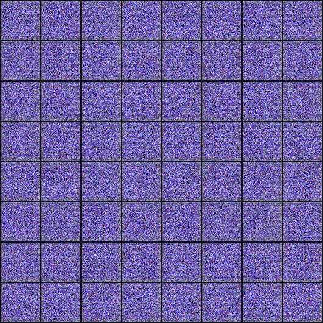
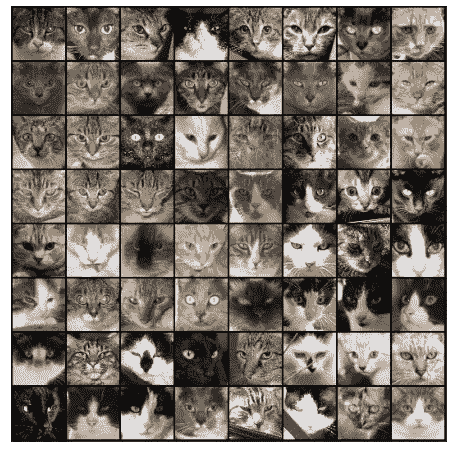
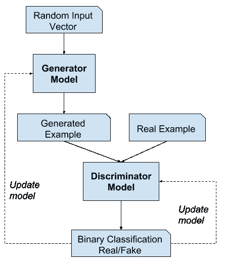
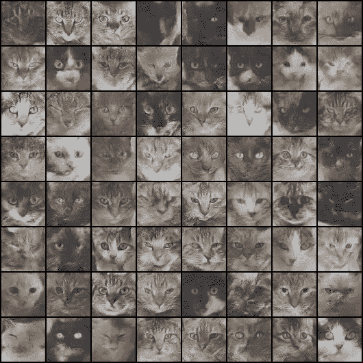

# 使用 PyTorch 开始使用 GANs

> 原文：<https://towardsdatascience.com/getting-started-with-gans-using-pytorch-78e7c22a14a5?source=collection_archive---------5----------------------->

## [机器学习](https://towardsai.net/p/category/machine-learning)

## 我们将看到 GAN 生成新图像的能力，乍一看，这使 GAN 看起来有点“神奇”。

# 介绍

生成对抗网络(GAN)是 Ian Goodfellow 和他的同事在 2014 年构想的一类机器学习框架。两个神经网络(生成器和鉴别器)像在游戏中一样相互竞争。这种技术学习在给定训练集的情况下，使用与训练集相同的统计信息来生成新数据。

生成的图像

在这篇博文中，我们将训练一个 GAN 来生成猫的面部图像。我们将使用由超过 15700 张猫图片组成的[猫脸数据集](https://www.kaggle.com/spandan2/cats-faces-64x64-for-generative-models)。由于生成建模是一种无监督的学习方法，因此图像上没有标签。

来自数据集的真实图像

首先，获取所有需要的库，

由于我们在 Kaggle 上运行这个笔记本，我们可以使用边栏中的“+添加数据”选项，搜索[猫脸数据集](https://www.kaggle.com/spandan2/cats-faces-64x64-for-generative-models)。这将把数据下载到../输入。

将数据集的路径保存在 DATA_DIR 中。

该数据集有一个名为 cats 的文件夹，其中包含超过 15，700 张 JPG 格式的图像。

现在使用 torchvision 中的 ImageFolder 类加载这个数据集。我们还将调整图像的大小并将其裁剪为 64x64 px，并使用 0.5 的平均值和标准偏差对像素值进行标准化。这将确保像素值在范围(-1，1)内，这对于鉴别器训练更方便。此外，我们将创建一个数据加载器，用于将数据加载到批处理中。

# 生成对抗网络

现在让我们建立鉴别器和生成器神经网络，生成器将生成图像，鉴别器将检测给定图像是真是假。他们都将相互竞争，并且都将在工作中做得更好。

照片由 [machinelearningmastery](https://machinelearningmastery.com/what-are-generative-adversarial-networks-gans/) 拍摄

# 发电机

生成器的输入是一个向量或随机数矩阵，用作图像生成的种子。该生成器可以将形状张量(128，1，1)转换成(3×28×28)形状张量图像。

# 鉴别器

鉴别器将图像作为其输入，并试图将其分类为“真实的”或“生成的”。这会将输入作为(3 x 64 x 64)张量，并将其转换为(1，1，1)张量。

下面是保存每个时期后生成的每个图像的功能。

# 培养

下一步是为鉴别器和生成器构建一个训练函数。该函数将用于训练两个神经网络。

这是鉴别器的训练功能。

这是发电机的训练功能。

现在我们将构建一个训练函数来训练鉴别器和生成器。

现在我们准备训练模型，我们取 lr = 0.0002，纪元数= 60。

# 结果

在训练模型 60 个时期后，我们可以看到生成的图像。

生成的图像

正如我们所见，从模型中生成的图像与真实图像相似。

你可以在我的 Jovian 个人资料中找到完整的代码:

[https://jovian.ml/shubham7169007/cat-dcgan](https://jovian.ml/shubham7169007/cat-dcgan)

Github 链接:

[https://github . com/Shu bham 7169/Projects/blob/master/CAT-dcgan . ipynb](https://github.com/shubham7169/Projects/blob/master/CAT-dcgan.ipynb)