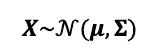
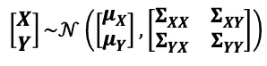
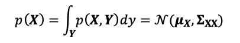
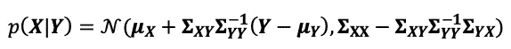
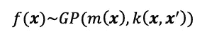
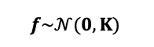
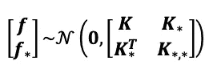
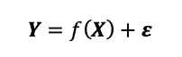
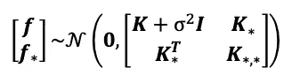
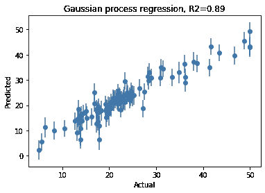

# 高斯过程回归建模入门

> 原文：<https://towardsdatascience.com/getting-started-with-gaussian-process-regression-modeling-47e7982b534d?source=collection_archive---------16----------------------->

## 高斯过程回归理论和使用 scikit-learn GPR 软件包进行回归的快速指南

高斯处理(GP)是一种非常有用的技术，它支持非参数贝叶斯建模方法。它在回归、分类、优化等领域具有广泛的适用性。本文的目标是介绍 GP 的理论方面，并在回归问题中提供一个简单的例子。

**多元高斯分布**

我们首先需要复习多元高斯分布，它是 GP 的基础。多元高斯分布可以完全由其均值向量和协方差矩阵来定义

高斯分布有两个重要的性质，使得后来的 GP 计算成为可能:边缘化和条件化。

*边缘化*

对于联合高斯分布，这可以写成:

我们可以通过边缘化来检索多元分布的子集。例如，我们可以将随机变量 *Y* 边缘化，得到的 X 随机变量表示如下:

注意，边缘化分布也是高斯分布。

*调理*

另一个重要的操作是条件作用，它描述了一个随机变量在另一个随机变量存在的情况下的概率。这种操作使得贝叶斯推理成为可能，正如我们将在后面展示的，在给定观察数据的情况下推导出预测。

通过条件反射，你可以推导出，例如，

像边缘化一样，条件分布也是高斯分布。这允许结果以封闭的形式表达，并且易于处理。

**高斯过程**

我们可以在多元高斯分布和高斯过程之间画出平行线。高斯过程(GP)完全由其均值函数和协方差函数(aka 核)定义，

GP 可以认为是一个无限维的多元高斯。这实际上就是我们所说的 GP 是非参数化的——因为参数的数量是无限的。均值函数 *m(x)* 描述了任何给定数据点 *x* 的均值，而核函数 *k(x，x’)*描述了任何给定的两个数据点 *x1* 和 *x2 之间的关系。*

因此，GP 描述了在可能的函数上的分布。所以当你从一个 GP 采样时，你得到一个单一的函数。相比之下，当您从高斯分布中采样时，您会得到单个数据点。

**高斯过程回归**

我们可以把上述关于边缘化和条件作用以及 GP 的概念集合起来进行回归。在传统的回归模型中，我们推断出一个单一的函数，***Y****= f(****X****)*。在高斯过程回归(GPR)中，我们在*f(****X****)上放置一个高斯过程。*当我们没有任何训练数据，只定义内核时，我们实际上是在定义一个*先验*分布的*f(****X****)。*下面我们就用符号 ***f*** 来表示***f****(****X****)*。通常我们假设平均值为零，所以这意味着，

选择的内核 ***K*** (如周期、线性、径向基函数)描述了函数的一般形状。同样，当您选择一阶或二阶方程时，您会期望不同的函数形状，例如线性函数或抛物线函数。

当我们已经观察到数据(例如训练数据、 ***X*** )和我们想要估计的数据点(例如测试数据、 ***X**** )时，我们再次将高斯先验放置在 *f* (对于*f(****X****)*和

**

*这里的目的是我们想知道什么是 ***f**** 对于某组 *x* 值( ***X**** )给定我们已经观测到的数据( ***X*** 及其对应的 ***f*** )。这是有效的条件作用，换句话说就是要求推导函数值的后验概率，*p*(***f ****|**|*f***， ***X*** ， ***X**** )。这也是我们如何进行预测——根据观察数据和测试数据点计算后验概率。*

**添加噪声**

*上述函数是无噪声的，这意味着我们对观察到的数据点有十足的信心。在现实世界中，情况并非如此，我们预计在我们的观察中会有一些噪声。在传统的回归模型中，这可以建模为:*

**

*其中***ε***~*N*(**0**， *σ* ***I*** )。 ***ε*** 是噪声项，服从高斯分布。在 GPR 中，我们将高斯先验放置到*f(****X****)*上，就像之前一样，所以*f(****X****)~ GP(****0****，****K****)*对于观察到的数据，联合概率与之前非常相似，除了现在在观察到的数据中添加了噪声项，*

**

*同样的，我们可以通过计算 ***f**** 、 **X** 、 ***X**** 的后验条件来进行推断。*

***GPR 使用 scikit-learn***

*有多个软件包可用于高斯过程建模(有些是更通用的贝叶斯建模软件包):GPy、GPflow、GPyTorch、PyStan、PyMC3、tensorflow probability 和 scikit-learn。为了简单起见，我们将在这里展示一个在样本数据集上使用 scikit-learn 包的例子。*

*我们将使用 scikit-learn 中的波士顿数据集示例。首先，我们将加载数据，并对数据进行简单的 80/20 分割，分成训练集和测试集。*

*我们将使用`GaussianProcessRegressor`包并定义一个内核。这里我们将尝试一个带噪声和偏移的径向基函数核。内核的超参数是建议值，这些参数将在拟合过程中进行优化。*

*可以用`model.kernel_`查看试衣模特。我们现在还可以绘制和查看我们的预测与实际，*

**

*请注意，您可以使用其他机器学习模型(如随机森林回归器等)获得类似的性能。然而，GPR 的主要好处是，对于每个给定的测试数据点，预测值自然会有置信区间。所以你不仅知道你的模型性能，而且你知道与每个预测相关的不确定性是什么。*

*这是 GP 和 GPR 的高级概述。我们不会在这里深入内核的细节。但是通过采用不同的内核，您可以将您之前对数据的假设整合到您的模型中。通过 scikit-learn 的简单示例，我们希望提供一些灵感，让您了解 GPR 是如何有用的，并且您可以快速开始将某种形式的贝叶斯建模作为您的机器学习工具箱的一部分！*

*关于 GP 的其他一些有用的资源/帖子*

* [## 高斯过程的可视化探索

### 即使你花了一些时间阅读关于机器学习的书籍，你也很可能从未听说过高斯…

蒸馏. pub](https://distill.pub/2019/visual-exploration-gaussian-processes/)  [## nbviewer 笔记本

### 看看这个 Jupyter 笔记本！

nbviewer.jupyter.org](https://nbviewer.jupyter.org/github/adamian/adamian.github.io/blob/master/talks/Brown2016.ipynb)*