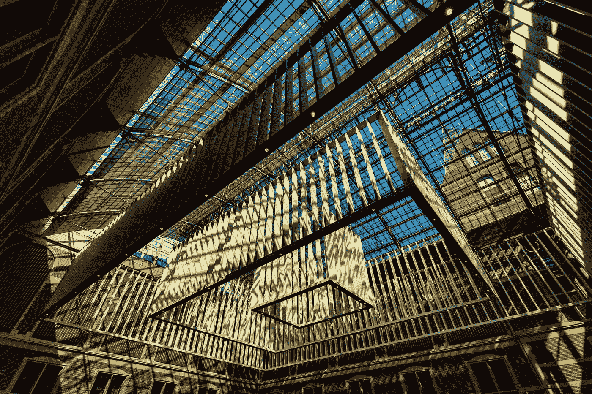
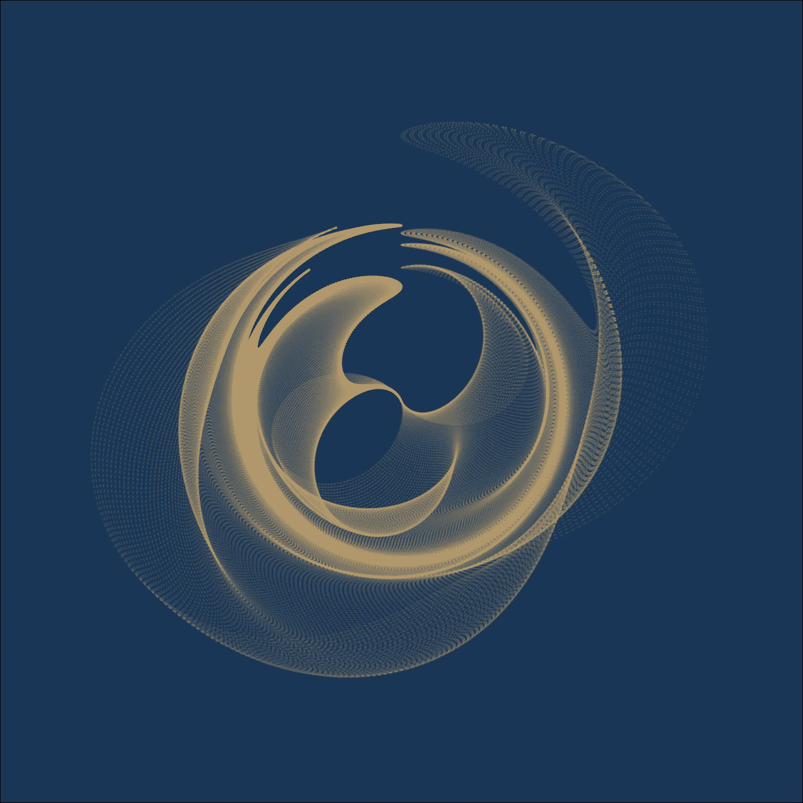
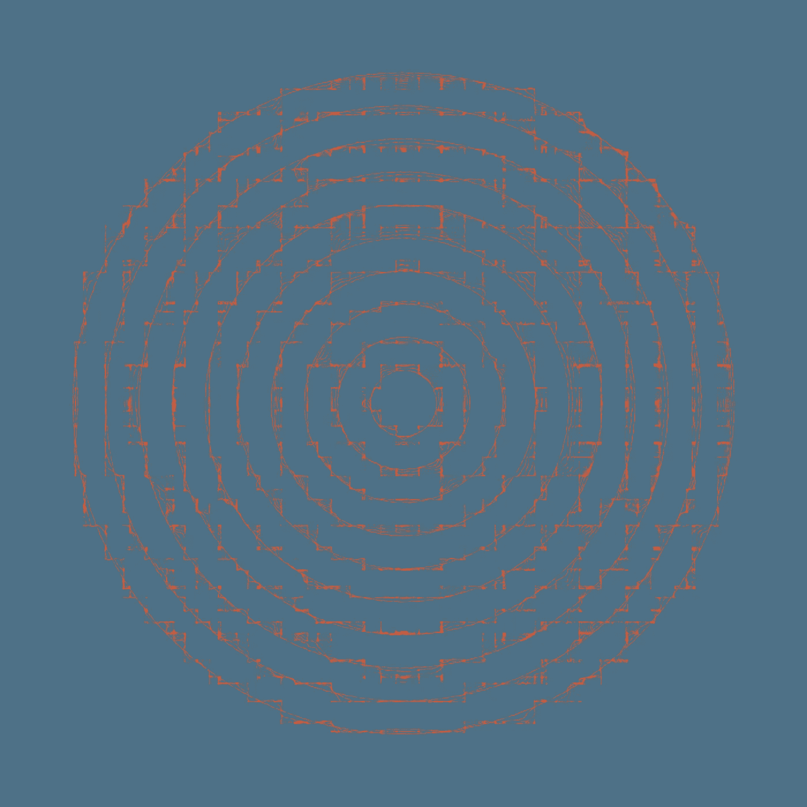
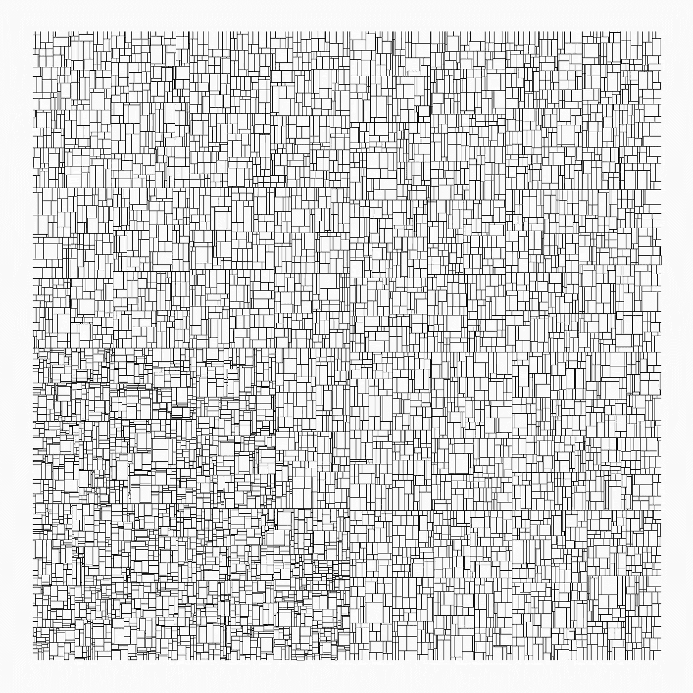
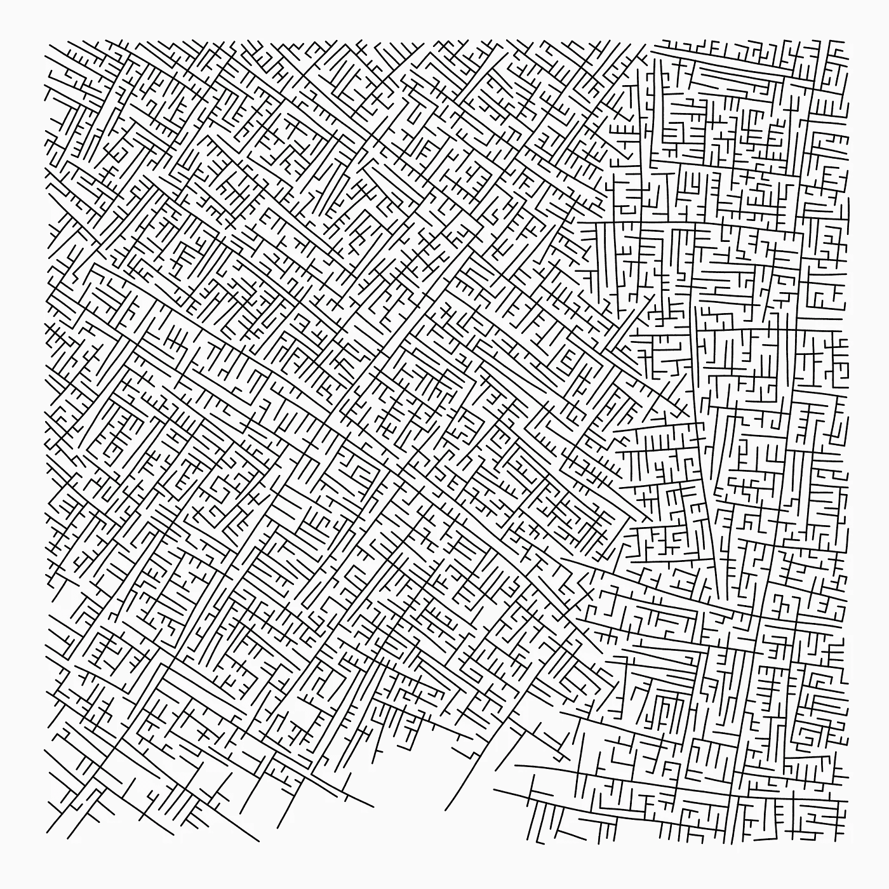

# R 中的生成艺术入门

> 原文：<https://towardsdatascience.com/getting-started-with-generative-art-in-r-3bc50067d34b?source=collection_archive---------9----------------------->

## 数据不仅可以有用，还可以漂亮。这篇文章为那些想探索 r 中的生成艺术的人指出了一些起点。



国立博物馆。照片由[维特·加布雷](https://www.data-must-flow.com/projects/photos/photos.html)拍摄

# 介绍

生成艺术代表了一个独立于人类的系统(如算法)在创作过程中的参与。这种系统是创作过程中的一个关键要素，包括其产出。

不出所料，如果你想深入研究生成艺术，有许多“工具”可以使用。如果你想在 R 中拥有*【实践】*经验，有两个基本方向可以选择。

如果你是一个精通代码的人，你可以直接写你的代码。我敢说这是*“个人”*表达的**方式，因为它允许更多的灵活性，嗯，自由。**

然而，达到这一点需要时间。幸运的是，您可以通过使用一个现有的包来开始试验您的艺术作品。这不仅会让你受益匪浅，而且对于掌握*“交易”*的基础知识也非常有用。

在这篇文章中，我将向您展示一些用于制作生成艺术的*“即用型”*包。此外，我还将利用一些使用通用包或库来达到相同目标的例子。

# 生成艺术

我想展示的第一个包叫做`generativeart`。

它的一个关键特性是它构造输出文件的方式。为了获得输出文件，您必须指定它们的存储位置。此外，它还迭代所提供的不需要种子支持的公式。在这种情况下，每个结果文件都是唯一的。

此外，值得一提的是，`generativeart`包是很好的[文档](https://github.com/cutterkom/generativeart)和易于使用。

```
**library**(generativeart) *# devtools::install_github("cutterkom/generativeart")*
**library**(ambient)
**library**(dplyr)*# set the paths*
IMG_DIR <- "img/"
IMG_SUBDIR <- "everything/"
IMG_SUBDIR2 <- "handpicked/"
IMG_PATH <- **paste0**(IMG_DIR, 
                   IMG_SUBDIR)LOGFILE_DIR <- "logfile/"
LOGFILE <- "logfile.csv"
LOGFILE_PATH <- **paste0**(LOGFILE_DIR, 
                       LOGFILE)*# create the directory structure*
generativeart::**setup_directories**(IMG_DIR, 
                                 IMG_SUBDIR, 
                                 IMG_SUBDIR2, 
                                 LOGFILE_DIR)
*# include a specific formula, for example:*
my_formula <- **list**(
  x = **quote**(**runif**(1, -1, 10) * x_i^2 - **sin**(y_i^2)),
  y = **quote**(**runif**(1, -1, 10) * y_i^3 - **cos**(x_i^2) * y_i^4)
)*# call the main function to create five images with a polar coordinate system*
generativeart::**generate_img**(formula = my_formula, 
                            nr_of_img = 5, *# set the number of iterations*
                            polar = TRUE, 
                            filetype = "png", 
                            color = "#c1a06e", 
                            background_color = "#1a3657")
```



# 茉莉

丹妮尔·纳瓦罗(Danielle Navarro)是《学习统计与 R [学习统计与 R](https://learningstatisticswithr.com/) 手册》的作者，是心理学学生中的知名人士。

除了她在阿德莱德大学的教学和研究活动，她还发布了 jasmines 包，这是一个允许在 r。

这个软件包给你一个机会来玩模拟参数(如`grain`或`interaction`)、形状(如`entity_circle`或`scene_discs`)及其修改(如`style_ribbon`)或颜色(`palette`或`alpha`)。和噪声，链接到[环境](https://github.com/thomasp85/ambient)库:

```
**library**(dplyr) *# or install.packages("dplyr") first*
**library**(jasmines) *# or devtools::install_github("djnavarro/jasmines")*p0 <- **use_seed**(100) %>% *# Set the seed of R‘s random number generator, which is useful for creating simulations or random objects that can be reproduced.*
  **scene_discs**(
    rings = 10, 
    points = 50000, 
    size = 50
  ) %>%
  **mutate**(ind = 1:**n**()) %>%
  **unfold_warp**(
    iterations = 10,
    scale = .5, 
    output = "layer" 
  ) %>%
  **unfold_tempest**(
    iterations = 5,
    scale = .01
  ) %>%
  **style_ribbon**(
    color = "#E0542E",
    colour = "ind",
    alpha = **c**(1,1),
    background = "#4D7186"
  )**ggsave**("p0.png", p0, width = 20, height = 20, units = "in")
```



作者图片

# mathart + ggart

`mathart`包把很多常用的算法包装成函数。一个这样的例子是[最近邻图](https://github.com/marcusvolz/mathart/blob/master/R/k_nearest_neighbour_graph.R)，一个 [k-d 树](https://en.wikipedia.org/wiki/K-d_tree)的可视化，一个多维空间的数据结构化程序:

```
**library**(mathart) *# devtools::install_github("marcusvolz/mathart")*
**library**(ggart) *# devtools::install_github("marcusvolz/ggart")*
**library**(ggforce)
**library**(Rcpp)
**library**(tidyverse)points <- mathart::pointsresult <- **kdtree**(points)
p1 <- **ggplot**() +
  **geom_segment**(**aes**(x, y, xend = xend, yend = yend), result) +
  **coord_equal**() +
  **xlim**(0, 10000) + **ylim**(0, 10000) +
  **theme_blankcanvas**(bg_col = "#fafafa", margin_cm = 0)*# save plot*
**ggsave**("kdtree.png", p1, width = 20, height = 20, units = "in")
```



作者图片

`mathart`是一个有据可查的包。这个事实扩大了实验的范围。也许更重要的是，通过查看*【引擎盖下】*，该软件包提高了对数据模拟的理解。

# 通用软件包

在许多情况下，前面提到的包建立在更常用的包上，如`magritr`(管道操作符甚至在艺术创作中也很方便)`ggplot`、`dplyr`或`purr`。

来自`mathart`包的 **k-d 树**没有什么不同。从马库斯·沃尔茨的例子中我们可以看到，最初的 k-d 树算法可以使用偶数基数 R 进行调整:

```
*# Metropolis: Generative city visualisations**# Packages*
**library**(ggart)
**library**(tidyverse)
**library**(tweenr)
**library**(viridis)*# Make reproducible*
**set.seed**(10001)*# Parameters*
n <- 10000 *# iterations*
r <- 75 *# neighbourhood*
width <- 10000 *# canvas width*
height <- 10000 *# canvas height*
delta <- 2 * pi / 180 *# angle direction noise*
p_branch <- 0.1 *# probability of branching*
initial_pts <- 3 *# number of initial points*
nframes <- 500 *# number of tweenr frames**# Initialise data frames*
points <- **data.frame**(x = **numeric**(n), y = **numeric**(n), dir = **numeric**(n), level = **integer**(n))
edges <-  **data.frame**(x = **numeric**(n), y = **numeric**(n), xend = **numeric**(n), yend = **numeric**(n), level = **integer**(n))**if**(initial_pts > 1) {
  i <- 2
  **while**(i <= initial_pts) {
    points[i, ] <- **c**(**runif**(1, 0, width), **runif**(1, 0, height), **runif**(1, -2*pi, 2*pi), 1)
    i <- i + 1
  }
}t0 <- **Sys.time**()*# Main loop ----*
i <- initial_pts + 1
**while** (i <= n) {
  valid <- FALSE
  **while** (!valid) {
    random_point <- **sample_n**(points[**seq**(1:(i-1)), ], 1) *# Pick a point at random*
    branch <- **ifelse**(**runif**(1, 0, 1) <= p_branch, TRUE, FALSE)
    alpha <- random_point$dir[1] + **runif**(1, -(delta), delta) + (branch * (**ifelse**(**runif**(1, 0, 1) < 0.5, -1, 1) * pi/2))
    v <- **c**(**cos**(alpha), **sin**(alpha)) * r * (1 + 1 / **ifelse**(branch, random_point$level[1]+1, random_point$level[1])) *# Create directional vector*
    xj <- random_point$x[1] + v[1]
    yj <- random_point$y[1] + v[2]
    lvl <- random_point$level[1]
    lvl_new <- **ifelse**(branch, lvl+1, lvl)
    **if**(xj < 0 | xj > width | yj < 0 | yj > height) {
      **next**
    }
    points_dist <- points %>% **mutate**(d = **sqrt**((xj - x)^2 + (yj - y)^2))
    **if** (**min**(points_dist$d) >= 1 * r) {
      points[i, ] <- **c**(xj, yj, alpha, lvl_new)
      edges[i, ] <- **c**(xj, yj, random_point$x[1], random_point$y[1], lvl_new)
      *# Add a building if possible*
      buiding <- 1
      valid <- TRUE
    }
  }
  i <- i + 1
  **print**(i)
}
edges <- edges %>% **filter**(level > 0)sand <- **data.frame**(alpha = **numeric**(0), x = **numeric**(0), y = **numeric**(0))
perp <- **data.frame**(x = **numeric**(0), y = **numeric**(0), xend = **numeric**(0), yend = **numeric**(0))*# Create plot*
p2 <- **ggplot**() +
  **geom_segment**(**aes**(x, y, xend = xend, yend = yend, size = -level), edges, lineend = "round") +
  *#geom_segment(aes(x, y, xend = xend, yend = yend), perp, lineend = "round", alpha = 0.15) +*
  *#geom_point(aes(x, y), points) +*
  *#geom_point(aes(x, y), sand, size = 0.05, alpha = 0.05, colour = "black") +*
  **xlim**(0, 10000) +
  **ylim**(0, 10000) +
  **coord_equal**() +
  **scale_size_continuous**(range = **c**(0.5, 0.5)) +
  *#scale_color_viridis() +*
  **theme_blankcanvas**(bg_col = "#fafafa", margin_cm = 0)*# print plot*
**ggsave**("plot007w.png", p2, width = 20, height = 20, units = "cm", dpi = 300)
```



作者图片

你不需要在这里停下来。花一些时间玩代码可以很容易地通过创建你独特的[海报](https://www.r-bloggers.com/generative-art-let-your-computer-design-you-a-painting/)结束。

# 结束语

生成艺术证明代码可以是美丽的。如果你还是不被说服，那就去看看更多类似[这些](https://www.data-imaginist.com/art)的精心制作的作品。

生成艺术不仅能产生惊人的东西，还能帮助你理解代码本身。有趣的是，获取生成艺术背后的代码可能不像其他开源领域那么容易。一些*的“生成艺术家”得出结论，不分享创作过程中使用的代码:*

> *“我不分享我用来创作作品的代码。这样做的主要原因是，我认为这对任何人都没有好处。对生成艺术感兴趣的人会开始关注我的想法，而不是发展他们自己的想法。知道答案是创造力的杀手。”*
> 
> *托马斯·林·彼得森，[数据想象师](https://www.data-imaginist.com/art)*

*不管我们是否同意，生成艺术让我们面对在编码领域并不常见的想法。*

*那么，你对这件事有什么想法？你有最喜欢的生殖艺术家吗？或者你想分享你的艺术作品？欢迎在 [**推特**](https://www.data-must-flow.com/posts/intro-generative-art-r/) 上讨论这个问题。*

**最初发表于*[*https://www.data-must-flow.com*](https://www.data-must-flow.com/about/about.html)*。**