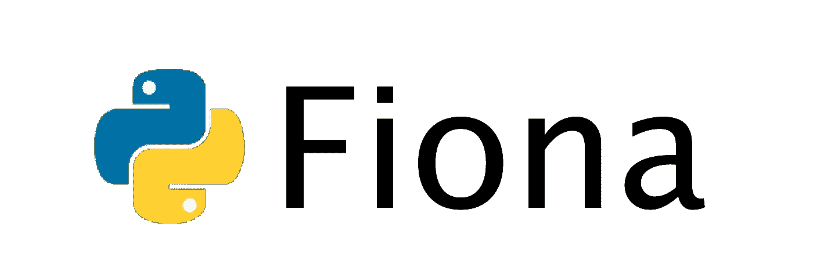
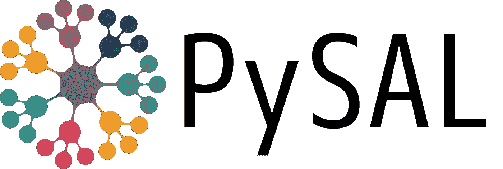
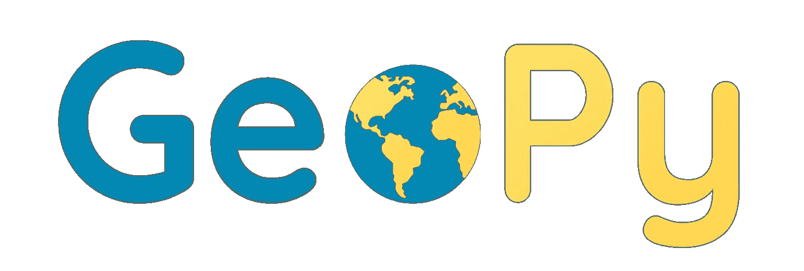

# 入门:地理空间库

> 原文：<https://towardsdatascience.com/getting-started-with-geospatial-libraries-1140859d79a7?source=collection_archive---------52----------------------->

## Python 中最有价值的库精选

照片由 [Ylanite Koppen](https://www.pexels.com/pt-br/@nietjuh) s 在 [P](https://unsplash.com/?utm_source=medium&utm_medium=referral) exels 上拍摄

ython 是一种简单的编程语言，你不需要有大量的软件开发来编写你的第一行代码。另外，如果安装了所需的模块，您在一台机器上编写的 Python 脚本可以在任何其他机器上运行。有大量针对地理空间和地理处理的可用库和软件包，这允许用户花更多的时间开发真正的软件，这将有助于实现他们的目标。

# 什么是地理处理？

在于使用数学和计算处理来获得和分析空间数据。在地理处理中，数据需要进行地理配准，这意味着日期需要作为地址坐标进行实际定位。

当你意识到一个正式的处方集时，例如当你给出你的名字或电话号码时，对于地理处理来说，是不足以开始分析这种数据的。但是当你把你的地址给这个表单时，我们可以分析它，例如，当你想知道有多少用户住在这个州的北部。

# 用于地理空间开发的 Python 库

在本文中，我们将了解一些开源库，这些库提供地理处理和地理空间开发方面的支持和协作。确保你将正确的库用于正确的目的，以及它们中的哪一个适合你的项目。

# 形状美观的

> 笛卡尔平面中几何对象的操作和分析。

作者制作的图像

与 AutoCAD 一样，该库与 PostGIS 通信良好，其主要目的是操作几何图形。想象一下，你可以操纵你的数据来准确地告诉你如何从点“A”到点“B”，甚至发现你的家、城市或州的周长。

Shapely 使用计算几何非常简单地提供了这些和许多其他可能性。

# 菲奥纳

> OGR 为 Python 程序员提供的简洁敏捷的 API。

作者制作的图像

Fiona 被做得很简单，它的主要功能是读/写文件，以及 **Pyshp** 库，除此之外你还可以操作几何属性，所有这些都以非常类似于 python 中使用字典、映射和迭代器的方式完成。

# PyProj

> PROJ 的 Python 接口(制图投影和坐标转换库)。

作者制作的图像

当我们在不同的投影中处理几何图形时，例如 UTM、WGS84 和许多其他投影。例如，PyProj 提供了一种将我们的投影从 UTM 转换到 WGS64 的方法，这样我们的信息将始终在我们指定的投影中，并且将始终正确地放置在地球上。

# 皮萨尔

> 一个空间分析库，侧重于用 Python 编写的地理空间矢量数据。

派萨尔([来源](https://pysal.org/assets/pysal_nav_logo.svg)

**PySAL** 是一个用于空间分析的地理空间计算库。除此之外，它还集合了许多其他库，如 matplotlib、geopandas、rasterio，它变成了一个完整的资源。

# Numpy

> 用 Python 实现科学计算的软件包。

Numpy ( [来源](https://en.wikipedia.org/wiki/NumPy#/media/File:NumPy_logo.svg))

地理处理就是数学。Numpy 是一个非凡的库来处理这个问题，当处理地理空间数据时，你会做许多求和、除法之类的事情，这让你的生活变得更加轻松。在地理处理环境中，Numpy 的关键是支持大型矩阵和数学函数。

# GDAL / OGR

> 光栅和矢量地理空间数据格式的翻译库。

GDAL ( [来源](https://github.com/OSGeo/gdal/issues/2117))

**GDAL** 为我们的几何对象带来了一种标准化的方法。反过来，GDAL 处理栅格数据，OGR 处理矢量数据。GDAL 除了其极高的处理速度(这是由它在 C 中的执行来保证的)之外，它还以处理大多数类型的空间数据格式而闻名。

# 熊猫/地质公园

> 对熊猫对象的地理数据支持。

熊猫([来源](https://pt.wikipedia.org/wiki/Pandas_(software)#/media/Ficheiro:Pandas_logo.svg))

Pandas 是一个数据分析库，它以类似电子表格的方式组织你的数据，以供进一步计算。由于我们的地理空间数据来自广泛的来源和格式，如 CSV，pandas 可以帮助我们轻松处理这些数据。反过来， **GeoPandas** 不是将数据制成表格，而是添加了一个支持地理世界的组件。在幕后，Geopandas 使用 Shapely 和 Fiona。

# Mapnik

> 支持地图可视化并为网络创建地图。

Mapnik ( [来源](https://mapnik.org/pages/media.html)

Mapnik 的创建只有一个目的，那就是创造美丽的地图。除了这种令人难以置信的意识形态，它还为我们提供了几种可能性，以补充我们的地图标记，标签，颜色。

# 地质炼金术

> SQLAlchemy 的空间扩展

GeoAlchmey ( [来源](https://geoalchemy-2.readthedocs.io/en/latest/_static/geoalchemy_small.png))

**GeoAlchemy** 是 SQLAlchemy 的扩展，是为 PostGIS 创建的，在 PostGIS 中需要在关系数据库中存储几何图形。除了支持几何图形，它还执行一些空间操作。

# 地质公园

> 轻松查找 lat/long 库。

地质公园([来源](https://geopy.readthedocs.io/en/stable/))

这个库提供了查找地址、城市的支持，所以你可以很容易地找到你所在城市的经度和纬度。

# 结论

地理空间开发在我们的生活中非常重要，因为在足球比赛结束时，由于地理空间数据和地理处理，我们可以知道球员在比赛中跑了多少英里。每天都有地理处理技术在发展，新的库在创建，新的 GIS 在创建，这是真实存在的。好在这些库可以极大的方便我们的开发，相比 10 年前。在未来，使用地理处理将会非常美妙，而创造这一未来的基础就是这些库。