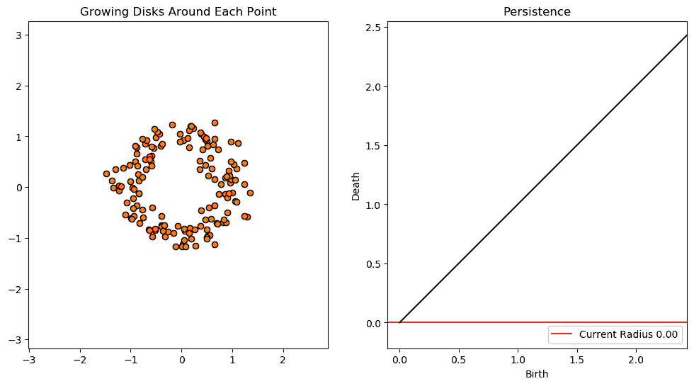
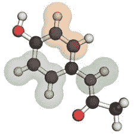
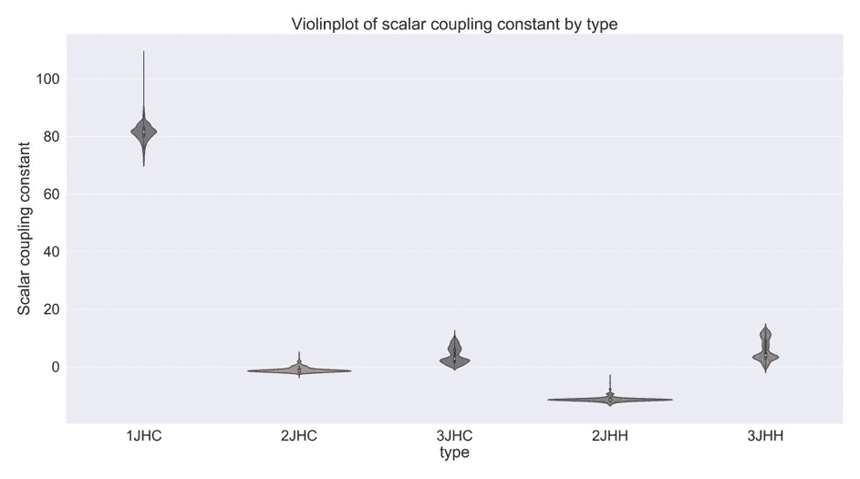
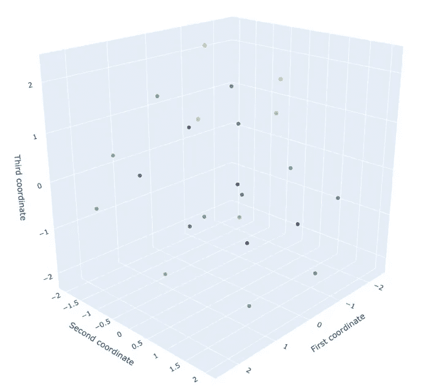
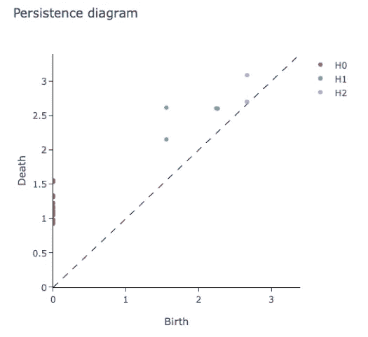
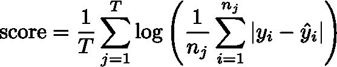

# giotto-tda 入门

> 原文：<https://towardsdatascience.com/getting-started-with-giotto-learn-a-python-library-for-topological-machine-learning-451d88d2c4bc?source=collection_archive---------7----------------------->

## 用于拓扑机器学习的 Python 库

*作者:* [*路易斯·汤斯顿*](https://medium.com/@lewis.c.tunstall) *、科林·卡林、* [*弗朗切斯科·帕尔马*](https://medium.com/@lapalmafrancesco) *和* [*托马斯·博伊斯*](https://medium.com/@t.boys_87095)


# **简介**

在 [L2F](https://l2f.ch/) ，我们围绕 [giotto-tda](https://github.com/giotto-ai/giotto-tda#azure-cov) 和拓扑机器学习最常见的问题之一是“我从哪里开始？”。

在本指南中，我们介绍了基本概念和工作流程的概述，以便您可以开始在您的机器学习管道中使用 giotto-tda。重现分析的代码可从 [GitHub](https://github.com/giotto-ai/molecule_bond_prediction) 获得。

# **什么是拓扑机器学习？**

拓扑机器学习是指一套将代数拓扑中的元素与统计学习相结合的技术。通过关注形状和连接性等数据的全局属性，这些拓扑方法可以捕捉传统机器学习方法可能遗漏的模式。

例如，拓扑机器学习在[药物设计](https://arxiv.org/abs/1804.10647)和[图形分类](https://arxiv.org/abs/1909.13472)中产生了最先进的结果，并在[蛋白质结合](https://arxiv.org/abs/1412.1394)中产生了新颖的见解。

这些技术背后的主要成分被称为*持久同源性*。持续同源度量拓扑不变量的存在，如跨不同长度尺度的连通分量、洞和空隙。这些不变量的“出生”和“死亡”通过*持久性图*进行总结，这是生成新类型特征以提供给下游机器学习任务的最常见和最直观的方式。关于这些概念的精彩概述，请参见加里·科普利克的[文章](/persistent-homology-with-examples-1974d4b9c3d0)或马修·赖特的[视频](https://www.youtube.com/watch?v=2PSqWBIrn90)。



通过用半径递增的圆连接相邻点(左)来产生和消灭一个洞。还显示了相应的持久性图(右图)。信用:[https://bit.ly/2raKb11](https://bit.ly/2raKb11)

总而言之，拓扑机器学习的关键步骤是:

*   使用持久同源性从输入数据中提取拓扑特征。
*   使用监督或无监督的方法，将这些特征与机器学习方法相结合。

giotto-tda 库旨在简化这些步骤，并使拓扑机器学习可用于更广泛的数据科学社区。它基于 [scikit-learn](https://scikit-learn.org/stable/) 的 *fit-transform* 范例，并提供了与流行框架的紧密集成。giotto-tda 入门就像跑步一样简单:

```
pip install giotto-tda
```

# **预测分子性质**

为了展示 giotto-tda 的作用，我们将使用 Kaggle 上 [*预测分子性质*](https://www.kaggle.com/c/champs-scalar-coupling/overview) 竞赛的 CHAMPS 数据集。这里的任务是预测一个分子中两个原子之间的磁相互作用或“标量耦合常数”。因为这些耦合采用连续值，所以学习任务是一个*回归*任务。



对于给定的分子，学习任务是预测每个原子对之间的耦合强度。

## 探索数据

训练数据由分子中的原子对组成，每对由标量耦合的[](https://en.wikipedia.org/wiki/J-coupling)*类型和每个原子的 *(x，y，z)* 坐标表征。为了简化分析，我们将把注意力集中在 100 个最大的分子上，也就是那些原子数量最多的分子。如下图所示，这些分子有五种不同的耦合，其强度因耦合类型而异。*

**

*数据中 100 个最大分子的每种偶联类型的偶联强度。*

## *从数据到持久性图*

*我们的拓扑机器学习管道的第一步是从训练数据构建持久性图。*

*在 giotto-tda 中，有两种主要方法可以实现这一点:*

*   ***将数据表示为一个** [**点云**](https://en.wikipedia.org/wiki/Point_cloud) **:** 将每个观察值视为空间中的一个*点*，以及一个*度量*来计算成对观察值之间的距离。在我们的上下文中，单个分子的点云可以简单地是每个原子相对于所有原子的平均值 *(x̅，y̅，z̅)* 的 *(x，y，z)* 坐标。在下面的代码片段中，`homology_dimensions`指定了要跟踪的拓扑不变量的类型(“0”表示连接的组件，“1”表示孔，“2”表示空隙)，而`euclidean`定义了我们希望在持久同源性计算中应用的度量。*

*   ***将数据表示为一个** [**距离矩阵**](https://en.wikipedia.org/wiki/Distance_matrix) **:** 计算每个观察值之间的成对距离，其中“距离”不一定必须是度量。如果我们把单个分子看作一个图形，两个原子之间的距离可以是连接它们的最短路径的边数。在下面的代码片段中，我们只需要指定我们的度量是`precomputed`，并确保输入是一个距离矩阵。*

*对于每个输入点云或距离矩阵，我们得到一个单一的持久性图。在训练数据中，每个观察值是一个*原子对，*因此，当这些原子对被分组以形成 100 个分子时，我们获得 100 个点云，从而获得 100 个持久性图。*

*持久性图中离对角线死亡=出生线最远的点对应于最持久的拓扑特征。*

****

*单个分子的点云(左)及其相应的持久性图(右)。连接的组件(H0)显示为红色，孔(H1)显示为青色，空白(H2)显示为紫色。*

## *从持久性图到机器学习功能*

*虽然持久性图是数据的有用描述符，但它们不能直接用于机器学习应用。这是因为不同的持久性图可能有不同数量的点，并且像图的加法和乘法这样的基本操作没有很好地定义。*

*为了克服这些限制，已经提出了各种建议，通过非常适合机器学习的嵌入或内核来“矢量化”持久性图。在 giotto-tda 中，我们通过`gtda.diagrams`模块提供对最常见矢量的访问。*

*例如，计算持久性图的“振幅”可以通过选择一个`metric`来实现，如下面的代码片段所示。*

*或者，您可以创建自己的自定义拓扑特征！因为 giotto-tda 中的持久性图是出生-死亡维度三元组的数组，所以用 NumPy 或 Pandas 操作它们是很简单的。例如，下面的代码片段显示了我们如何计算每个`homology_dimension`点的平均寿命。*

*在我们对 CHAMPS 数据集的全面分析中，我们提取了各种各样的拓扑特征——详见随附的[代码](https://github.com/giotto-ai/molecule_bond_prediction)。*

## *训练模特*

*有了拓扑特征，下一步是训练回归变量。在 scikit-learn 约定中，这相当于将所有相关特性和目标变量组合成数组`X`和`y`。对于本指南，我们采用 [this](https://github.com/mv-lab/CHAMPS-Kaggle19) Kaggle 提交中采用的方法，并使用[xgboostrgressor](https://xgboost.readthedocs.io/en/latest/python/python_api.html#module-xgboost.sklearn)进行预测。为了评估特征对性能的影响，我们比较了用 5 重交叉验证训练的模型的结果，包括有和没有拓扑特征。这一步的代码片段是标准的，复制如下。*

## *给预测打分*

*最后一步是对我们模型的预测进行评分。比赛的衡量标准是平均绝对误差的对数的平均值(是的，这有点复杂——就把它想象成多个分数，每个分数对应一种债券类型。对于每种类型，计算平均绝对误差，取这些结果的对数，最后计算所有焊接类型的平均值):*

**

*这里:*

*   **T* 是标量耦合类型的数量(在我们的例子中是五个)*
*   *nⱼ是类型 *j* 的观测值的数量*
*   *yᵢ是观测的标量耦合常数*
*   *ŷᵢ是预测的标量耦合常数*

*由于对数，我们可以得到负值，因此分数为-0.5 比-0.3 好。*

*下图显示了每种耦合类型的得分，并将包含拓扑特征的模型与不包含拓扑特征的模型进行了比较。*

**

*我们可以清楚地看到，拓扑特征帮助分数提高了 5.5%，平均提高了 3.6%。在 Kaggle 比赛中，这些小的改进可以在最终的排行榜上产生很大的差异，并提供了拓扑如何为传统的特征提取方法提供补充信息的良好演示。*

# *展望和下一步措施*

*本指南只是触及了 giotto-tda 的皮毛。除了像我们的回归示例这样的核心机器学习任务之外，该库目前还支持对图形和时间序列数据应用持久同源性。*

*例如，giotto-tda 已经被用来[检测股票市场崩盘](/detecting-stock-market-crashes-with-topological-data-analysis-7d5dd98abe42)，研究甲虫种群的[种群动态](/the-shape-of-population-dynamics-ba70f253919f)，或者[预测一种分子是否抑制艾滋病毒的传播](/the-shape-of-chemical-functions-d1e1568d020)。*

*如果您对如何使用 giotto-tda 有任何疑问，请随时联系我们。*

*如果你想了解更多关于拓扑机器学习的知识，请参考下面的链接。*

> ***2020 年 1 月 23 日更新:**Giotto-learn 库已更名为 giotto-tda！虽然新名称旨在更好地传达该库对拓扑机器学习的关注，但与 scikit-learn 无缝集成的承诺仍将是该项目的一个重要特征。*

# *链接*

*   *[拓扑数据分析简介:数据科学家的基础和实践方面](https://arxiv.org/abs/1710.04019)*
*   *[基于持续同调的机器学习及其应用——综述](https://arxiv.org/abs/1811.00252)*