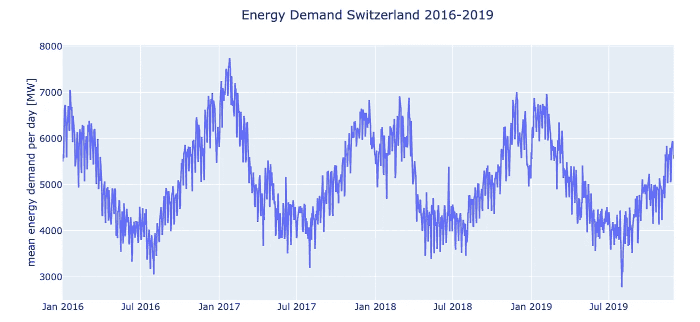
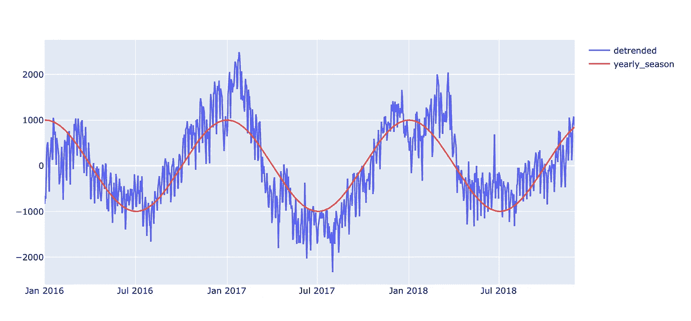
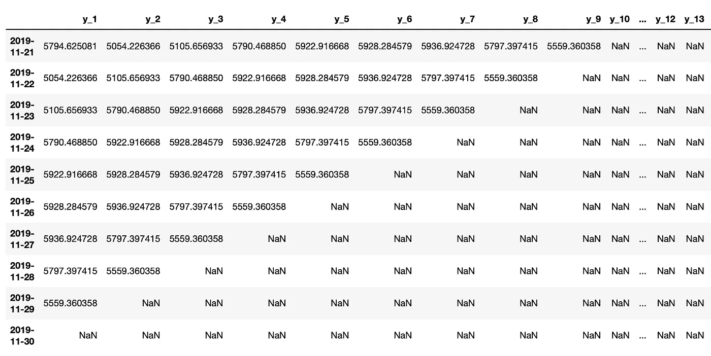
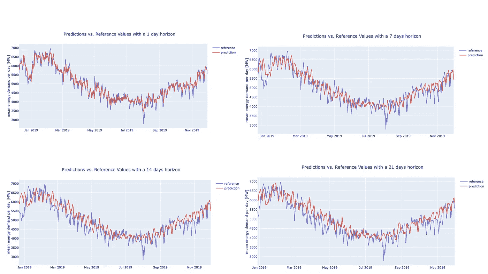
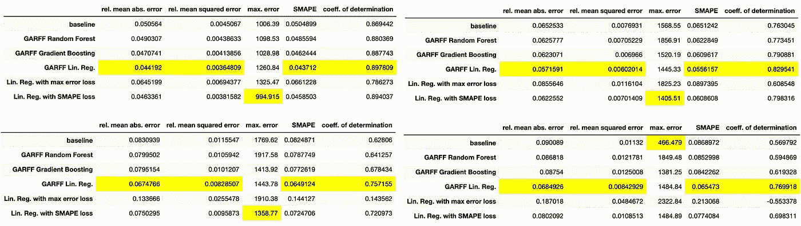

# giotto-time 入门

> 原文：<https://towardsdatascience.com/getting-started-with-giotto-time-d9b2088d60ca?source=collection_archive---------25----------------------->

## 开始使用 giotto-time 进行预测的教程，Giotto-time 是用于时间序列分析中的机器学习建模的 Python 库

> 由弗朗切斯科·帕尔马、科林·卡林和[路易斯·汤斯顿](https://medium.com/@lewis.c.tunstall)撰写

在许多商业和研究领域，生成准确的时间序列预测是必不可少的。在 L2F，我们发现用 Python 和 PyData 堆栈生成这些预测的工具有限。虽然像 *statsmodels* 和脸书的 *Prophet* 这样的流行库对于某些应用程序来说工作得很好，但它需要一个灵活的框架，允许组合数十个，甚至数百个模型并堆叠数千个功能。

为此，我们用 Python 库 *giotto-time* 开源了我们的时间序列工具。该库是为大规模机器学习应用程序设计的，在这些应用程序中，创建自定义模型非常重要。giotto-time 还提供了一个简单的 API 来自动化特性选择、执行因果关系测试和生成新特性。

在这篇博文中，我们展示了 Python 时间序列库 [giotto-time](https://github.com/giotto-ai/giotto-time) 的一些功能。随附的笔记本可在[这里](https://github.com/giotto-ai/time_series_energy_demand)找到。


# 数据和问题

电在当今社会至关重要。然而，它很难储存，而且价格昂贵。随着可再生能源在能源市场中的重要性日益增加，这一点尤其如此，这使得预测能源需求成为能源供应商的重要任务。

为了展示 giotto-time 中可用的功能，我们将重点关注提前 21 天预测瑞士能源需求的问题。

数据是从瑞士能源传输网运营商 Swissgrid 下载的，可以在这里找到。该图显示了 2016 年至 2019 年的日均能源需求。



# **时间序列库 giotto-time**

giotto-time 入门就像跑步一样简单:

```
pip install giotto-time
```

在以下章节中，我们将介绍 giotto-time 的四个最重要的特性，这些特性也被用于能源需求建模:

*   去趋势和季节性
*   因果关系测试
*   特征创建
*   预测

该库旨在充分利用熊猫强大的时间序列和日期功能。特别是，giotto-time 中的中心对象是一个 pandas 数据帧，每个特性的时间戳和列都有一个`DateTimeIndex`。

该库的另一个重要方面是与 scikit-learn 的紧密集成。这使得能够一致地使用流行的机器学习框架的`fit`、`predict`和`transform`范例。

# **1)去趋势化和季节性**

giotto-time 管道的第一步是对时间序列中的潜在趋势和季节性进行建模。giotto-time 中的`Detrender`可以通过选择多项式或指数模型来实现这一点。然后简单地在时间序列上调用`fit_transform`将会移除趋势，如下面的代码片段所示。

如何用 giotto-time 去除趋势

为了对季节性进行编码，例如夏季和冬季或每周的季节性，可以拟合一个具有适当相移的正弦波，如下例所示。



这可以通过以下方式完成:

如何添加周期性季节性特征

# **2)因果关系测试**

评估因果关系是时间序列分析中最有争议的话题之一，通常需要特别的分析。由于要考虑的数据量和外部因素，这通常是不可能的。在 giotto-time 中，我们提供了一种方法来自动化这一过程，同时保持特别方法的统计严密性。

> 相关性并不意味着因果关系。但是，如果在统计上有意义，它可能是预测框架中一个有用的特征

`ShiftedLinearCoefficient`类找到目标时间序列与任何特征时间序列最相关的最佳滞后。一旦发现偏移，就进行统计测试以评估相关性的显著性。最后，通过变换方法，所有的特征时间序列自动向前移动，以使它们与目标时间序列在最佳滞后处对齐。这样，输出就可以用于预测了！

数据科学家首次使用 Giotto

可以使用线性拟合或皮尔逊相关系数。可以进行自举检验或排列检验来评估显著性。在下面的代码示例中，您可以看到这在实践中是如何实现的。最后，我们可以通过简单地使用`transform`方法来移动数据框中的列。

如何进行因果关系检验并转换时间序列

# **3)特征创建**

可以说，该库最重要的功能之一是特征创建步骤。

以下功能可用:

*   移位特征:用于将时间序列移位给定的步数
*   移动平均:对于给定的窗口大小
*   常量特征:所有时间步长的常量值
*   多项式特征:对于给定的次数
*   外生特性:可以添加另一个时间序列
*   日历功能:给定国家的公共假日
*   周期性季节性特征:可用于创建具有给定起始日期和特定周期的正弦波
*   自定义功能:在这里使用您自己的功能

如何创建特征

一旦创建了特征，我们需要分割`X`和`y`数据框。特别是，我们必须定义一个时间范围，该时间范围对应于我们希望预测的时间步数。对于能源需求示例，这是 21 天，导致数据框有 21 列，y 测试值的右下三角形中有`NaN`值。这是因为那里没有已知值。标签创建是使用以下转换器完成的:

如何创建标签

下图显示了一个示例。第一列对应于向前看一个时间步，第二列对应于向前看两个时间步，以此类推。



# **4)预测**

目前，giotto-time 支持两种类型的模型:

*   带/不带前馈的广义自回归模型(分别简称为`GARFF` 或`GAR`
*   具有自定义损失函数的线性回归模型

`GARFF`模型可以选择任何 scikit-learn 兼容的回归器或分类器，并使用它对时间序列进行预测。在这种情况下，前馈意味着除了特征之外，模型还会进行一次预测，并将这些预测添加到数据框中，然后使用这个新的数据框进行下一个时间步长的预测，依此类推。

下面的代码片段显示了如何使用线性回归器作为基础模型来轻松创建这样的模型。

如何使用 GARFF 模型

另一种可能性是使用 giotto-time 自己的线性回归器，它允许优化自定义损失函数。在下面的例子中，使用了最大误差。

如何使用带有自定义损失函数的线性回归

它们都使用了 scikit-learn 中您可能熟悉的`fit` / `predict`方法。

# **结果**

在这篇博文附带的笔记本[中，我们使用这些函数来预测瑞士未来 21 天的日均能源需求。](https://github.com/giotto-ai/time_series_energy_demand)

在下图中，相对于平均绝对误差，最佳模型的结果与参考值一起绘制。我们可以清楚地看到，预测遵循全球趋势以及每周趋势。然而，也有一些异常值。一个例子是 8 月 1 日(蓝色曲线的大幅下降)。这是瑞士国庆日，从本文开头的时间序列图中可以看出，2016 年至 2018 年也出现了类似的下降。由于数据中可用的年份很少，我们在模型中包含的日历功能不能完全捕捉到这种影响。



对于 1、7、14 和 21 天的时间范围，与最佳模型的相对平均绝对误差分别为 4.4%、5.7%、6.7%和 6.8%。

下表概述了经过测试的不同模型以及针对各种指标获得的结果。对于我们在培训中找到的基线模型，设置回顾的理想天数，然后使用这一天的值作为预测。最好的结果用黄色标出。



第 1、7、14、21 天的结果表(从左到右和从上到下)

我们观察到，以线性回归作为基础模型的`GARFF`模型在除最大误差度量之外的所有方面都比其他模型表现得更好。特别是相对平均绝对误差从基线模型中的 9.0%提高到线性回归的`GARFF`模型中的 6.8%。对于其他情况，获得了类似的结果。最大误差高度依赖于异常值的存在。如上所述，8 月 1 日是一个例外，因为与其他日子相比，那里的能量需求非常低。

# **结论**

我们介绍了 Python 时间序列库 giotto-time，并用它来预测瑞士的能源需求。介绍了 giotto-time 的不同功能，如去趋势、因果检验、特征创建，以及不同的模型，如具有前馈的广义自回归模型和具有定制损失函数的线性回归模型。

如果你想了解更多关于 giotto-time 和 giotto-tda 的信息，你可以在 [Twitter](https://twitter.com/giotto_ai) 或 [LinkedIn](https://www.linkedin.com/company/l2f-business-topological-modeling/) 上关注我们，或者在这里加入我们的 Slack 频道[。](https://slack.giotto.ai/)