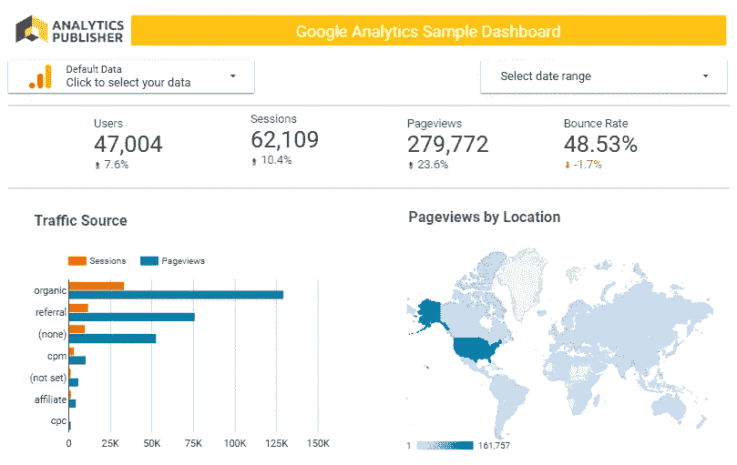
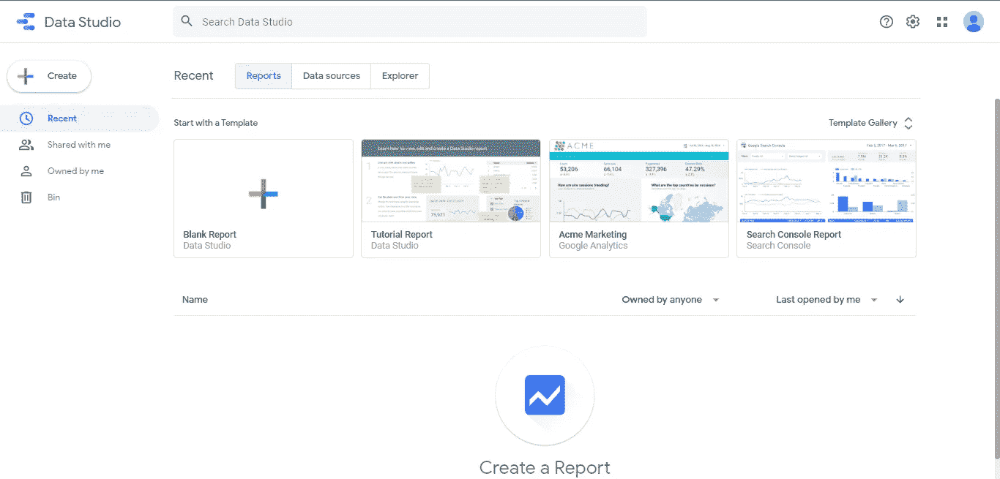
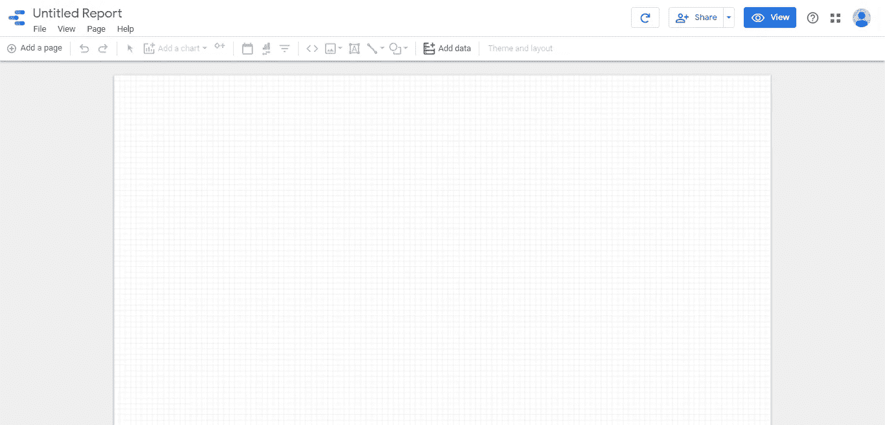
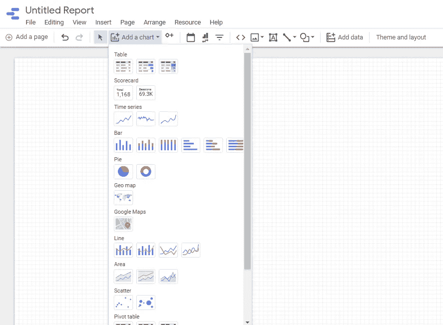
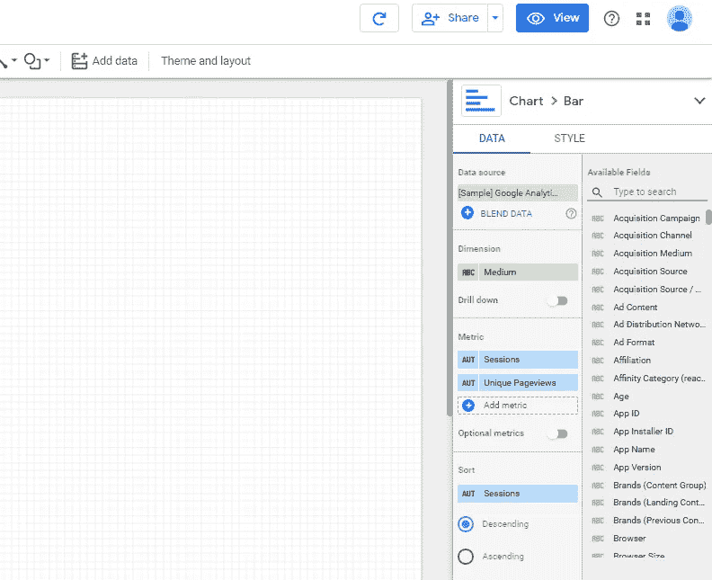
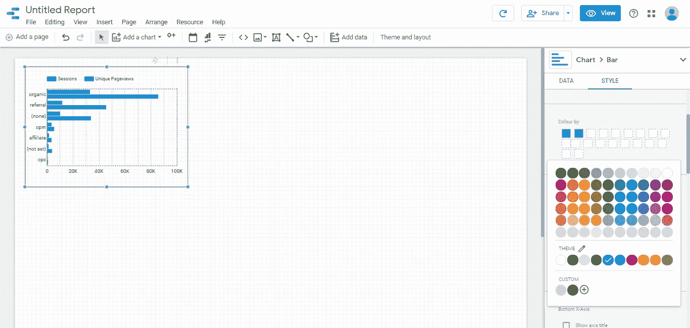
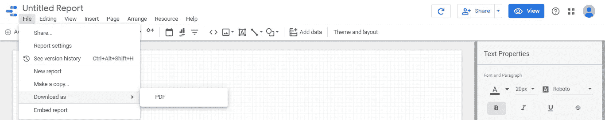

# Google Data Studio 入门

> 原文：<https://towardsdatascience.com/getting-started-with-google-data-studio-7ee5ba96e4e8?source=collection_archive---------11----------------------->

## 最好的数据可视化和报告工具之一是完全免费使用的。Data Studio 基础入门。

图片来自[analyticspublisher.com](https://www.analyticspublisher.com/post/getting-started-with-google-data-studio)

当谈到可视化数据时，有大量的平台可用。但最好的大多是付费的，免费的都不达标。幸运的是，有一个平台可以让你克服这两个问题——Google Data Studio，它是完全免费的，所有人都可以使用。在本文中，我将帮助您开始使用 Data Studio，并探索不同的可用特性。

除了是一个免费使用的工具之外，使用 Data Studio 还有许多其他好处，不仅限于以下这些。

*   这是一个完全基于网络的工具，所以你不必在电脑上安装任何笨重的软件。同样，一切都存储在云上，你可以从任何地方访问它。
*   共享报告也非常简单，使用与从 google drive 共享文档相同的方法。
*   连接到来自 150 多个数据源的数据
*   您甚至可以使用嵌入代码在您的网站上显示报告。

在本文中，我使用示例 Google Analytics 数据创建了一个报告。

**登录数据工作室**

要登录，你需要一个谷歌帐户，一旦你登录，你的主页将有一个 Data Studio 仪表板，看起来像这样。

**创建报告**

选择“空白报告”选项。这是您为报告安排所有视觉和文本的地方。

**连接数据源**

从工具栏中选择“添加数据”选项，并连接到提供的示例 Google Analytics 数据。

**添加一个可视化的**

点按工具栏中的“添加图表”。将出现一个包含所有图表类型的下拉列表。选择所需的图表。

选择图表类型后，右侧窗格将会出现，您将会看到以下内容。您可以简单地从“可用字段”中拖放您想要的维度，您的可视化就准备好了！

**定制您的视觉效果**

通过选择“样式”选项，您可以根据自己的要求定制视觉效果。

**添加文本**

使用工具栏中的“文本框”选项可以很容易地添加文本和标题，同样，您可以根据需要自定义和格式化文本框。

**下载和分享**

一旦您的报告准备就绪，您可以使用显示的“共享”选项来共享它，或者您也可以从“文件”菜单下载 PDF 格式的报告。

在本文中，我非常简要地介绍了 Data Studio 的入门知识。还有许多其他很酷的特性，一旦你熟悉了基础知识，你就可以开始探索这些特性了。