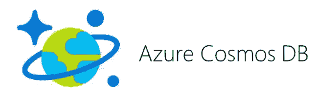
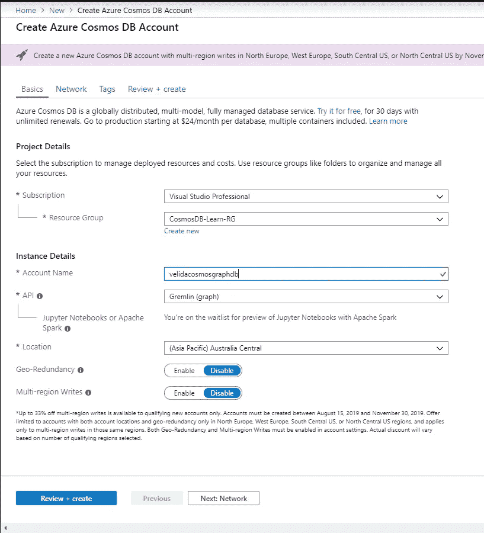
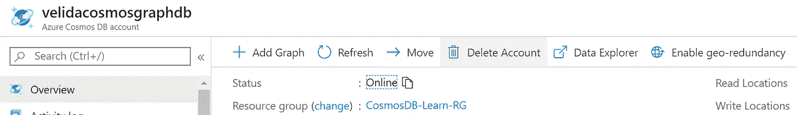
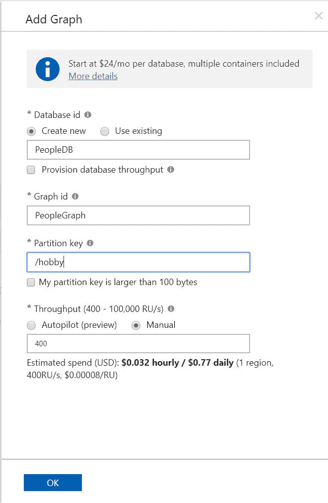
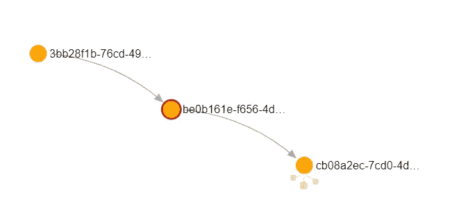
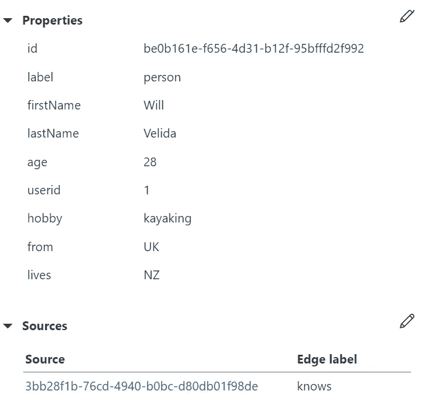
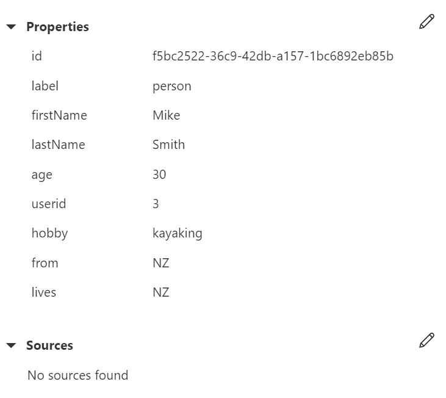
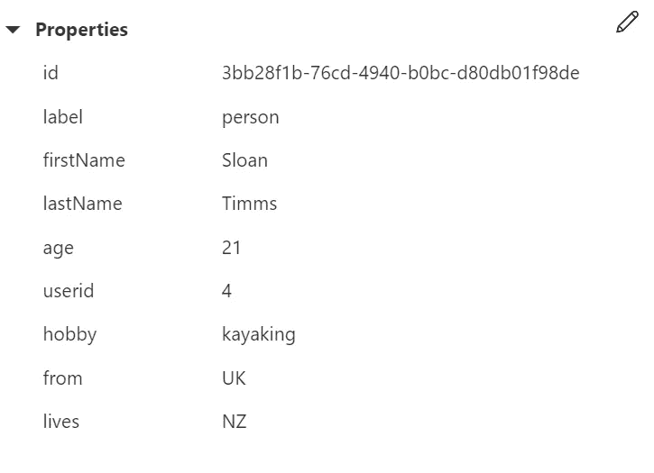

# Azure Cosmos DB 中的图形数据库入门

> 原文：<https://towardsdatascience.com/getting-started-with-graph-databases-in-azure-cosmos-db-cbfbf708cda5?source=collection_archive---------17----------------------->

## 野外的数据是高度关联的。我们可以开始连接这些部分，在 Azure Cosmos DB 中构建图形数据库。



在 Azure Cosmos DB 中，我们可以使用 Gremlin API 产品构建图形数据库。像数据世界中的许多新兴趋势一样，您可能会听到人们谈论图形数据库，并转动眼睛想“我们开始吧”。

但是有很多情况我们可以用图形格式来建模。你可能遇到的最明显的例子是社交网络。我认识迈克，他认识珍玛，我们都喜欢徒步旅行。珍玛去了新西兰的拉格伦徒步旅行，我住在新西兰，等等。等等。(我们将一点点构建这个例子的基础！).

以传统的关系方式对这些关系建模可能很有挑战性，所以使用图形数据模型会很好，但是什么是图形数据库，我们能使用 Azure Cosmos DB 构建一个图形数据库吗？

本文的目的只是介绍什么是基本的图形数据库，然后向您展示如何使用 Azure Cosmos DB 中的 Gremlin API 构建图形数据库。

**那么什么是图数据库？**

图是由顶点和边组成的结构，这些顶点和边可以有许多属性。

**顶点或节点**代表物体。在我们的图数据库中，我们可以通过识别用例中的实体来确定图中的节点。记住这一点，我们的节点可以表示如下实体:

*   一个顾客
*   一名雇员
*   一种产品
*   订单

**边**是顶点或边之间的关系。例如，一个人可能认识另一个人，或者那个人可能去过一个地方。

**属性**描述关于顶点和边的信息。例如，顶点中的属性可能包括关于人的信息，如他们的姓名、年龄或头发颜色。在 edges 中，这可能包括关于这两个人如何认识彼此的信息。

这个数据模型也可以被称为属性图模型，这是 Azure Cosmos DB 所支持的

我们通常将图形数据库实现为 NoSQL 存储，因为我们需要无模式数据存储所提供的灵活性。这也可以为我们提供一个数据模型，我们可以快速地改变它，对使用它的应用程序产生最小的影响。

即使数据库中的数据在增长，图形数据库也能为我们提供高性能水平。即使我们的关系变得越来越复杂，我们仍然可以从数据库中获得高水平的性能。

在关系数据库中，一旦我们的关系变得更加复杂，我们的查询性能就会下降。

正如我前面提到的，我们可以向图形数据库添加更多的关系和数据，而不会对我们的功能产生巨大影响。

然而，如果我们的应用程序中需要处理大量的事务，那么我们的图形数据库就会受到影响。

好的，我可以用图形数据库做什么？

有几个我们可以部署图形数据库的用例。由于我目前在一家银行工作，我已经了解了如何部署图形数据库来进行欺诈分析。

构建推荐引擎和社交网络也是我们可以使用图形数据库的好时机。在这些情况下，我们可以使用图表来推断基于用户进行的或之前进行的交互和活动的关系。

我们可以使用图形数据库的另一个很酷的例子是用于主数据管理。我们可以使用图表来查看我们组织内的数据是如何连接的，什么类型的用户查询它，等等。

**为什么要用 Cosmos DB 建立图形数据库？**

我们可以在自己的电脑上运行图形数据库。没有理由不下载 Apache Tinkerpop，在 Gremlin 控制台上运行一些命令，就可以拥有自己的图形数据库。

但是，生产中的图形数据库是一个庞大的系统。生产中的大型图形数据库会有数十亿的顶点和边，所以我们在自己的计算机上运行这些是不切实际的。

这就是 Cosmos DB 可以帮助我们的地方。由于 Gremlin API 的提供，我们可以在 Azure Cosmos DB 中构建图形数据库。这为我们在云中提供了一个完全托管的图形数据库，它可以在存储和吞吐量方面弹性增长。

**在 Cosmos DB 中创建图形数据库**

让我们继续使用 Cosmos DB 构建一个图形数据库。转到 Azure 门户并单击创建新资源。在数据库下，单击 Azure Cosmos DB。

现在我们必须配置它。我们给它一个名字，把它放在一个资源组和一个离我们很近的位置。这里最重要的事情是确保选择 **Gremlin (graph)** 选项作为 API



等待几分钟，我们将准备好我们的带有 Gremlin API 的 Cosmos DB 帐户。让我们创建第一个图形数据库，并向其中添加一个图形，这样我们就可以在其中执行一些查询。

当您的帐户设置完成后，您将进入概述页面。单击“添加图形”来设置您的第一个图形数据库。



在本教程中，我将创建一个基本图表，我已经创建了一个名为 PeopleDB 的数据库，向其中添加了一个名为 PeopleGraph 的图表，并提供了一个分区键调用 hobby，其中包含了我们的爱好值。我将把最大 RU 值保持在 400，因为在本教程中我们不会做任何大的操作。单击“确定”进行设置。



**在 Cosmos 中运行一些查询**

现在我们已经建立了我们的图表，让我们建立我前面提到的人员场景。为此，我们将在图表中添加一些代表人物的顶点。他们都有自己的名字、姓氏、年龄、爱好、来自哪里和住在哪里的属性。

我们可以通过运行以下查询来添加这些顶点:

```
// Add Will
g.addV('person').property('firstName', 'Will').property('lastName', 'Velida').property('age', 28).property('userid', 1).property('hobby', 'kayaking').property('from', 'UK').property('lives', 'NZ')// Add Gemma
g.addV('person').property('firstName', 'Gemma').property('lastName', 'Wright').property('age', 30).property('userid', 2).property('hobby', 'hiking').property('from', 'NZ').property('lives', 'NZ')// Add Mike
g.addV('person').property('firstName', 'Mike').property('lastName', 'Smith').property('age', 30).property('userid', 3).property('hobby', 'kayaking').property('from', 'NZ').property('lives', 'NZ')// Add Sloan
g.addV('person').property('firstName', 'Sloan').property('lastName', 'Timms').property('age', 21).property('userid', 4).property('hobby', 'kayaking').property('from', 'UK').property('lives', 'NZ')
```

现在我们可以添加一些边来表示 People 应用程序中顶点之间的关系。

```
// Will Knows Gemma
g.V().hasLabel('person').has('firstName', 'Will').addE('knows').to(g.V().hasLabel('person').has('firstName', 'Gemma'))// Sloan Knows Will
g.V().hasLabel('person').has('firstName', 'Sloan').addE('knows').to(g.V().hasLabel('person').has('firstName', 'Will'))// Mike Knows Gemma
g.V().hasLabel('person').has('firstName', 'Will').addE('knows').to(g.V().hasLabel('person').has('firstName', 'Gemma'))
```

现在我们已经添加了所有内容，我们可以运行一些简单的查询。让我们运行一个查询，返回图形数据库中所有爱好皮划艇的人。

```
// Select everyone who kayaks as a hobby
g.V().hasLabel('person').has('hobby', 'kayaking')
```

我们看到返回的结果如下图所示。我们的查询返回了三个人，我们可以单击每个节点来查看他们的属性。



威尔结



迈克结节



斯隆氏结

**总之**

这是一个非常基本的例子，只是向您介绍图形数据库以及如何使用 Azure Cosmos DB 构建它们。在以后的博文中，我将更深入地探讨如何运行 Gremlin 查询，并将它们与 SQL 查询进行比较。

如有疑问，欢迎在下方随意评论！