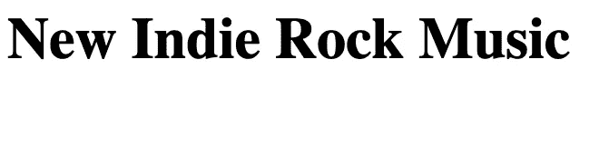
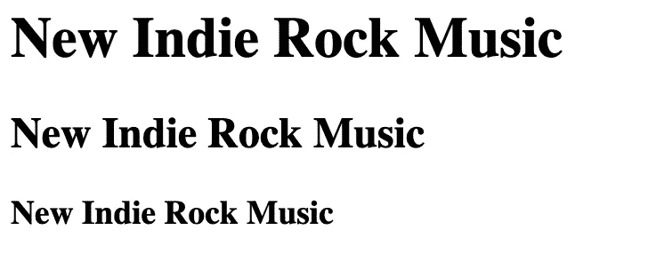
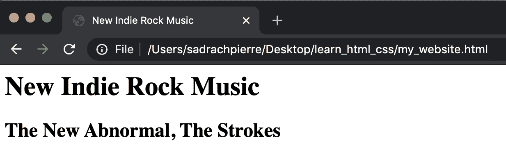
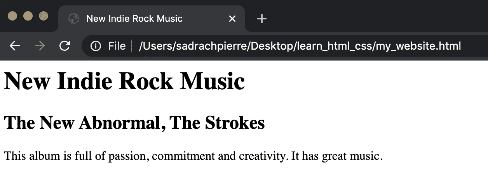
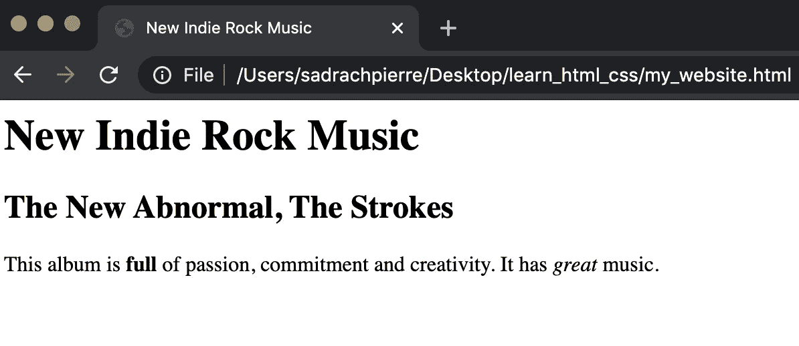
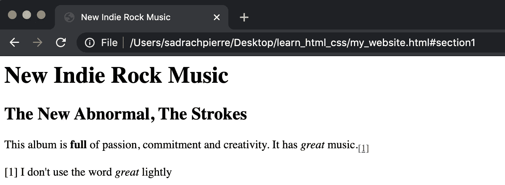
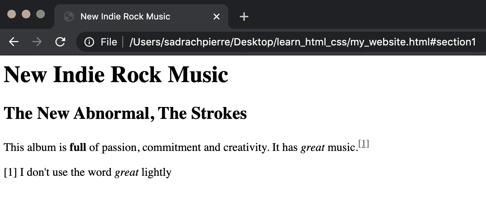
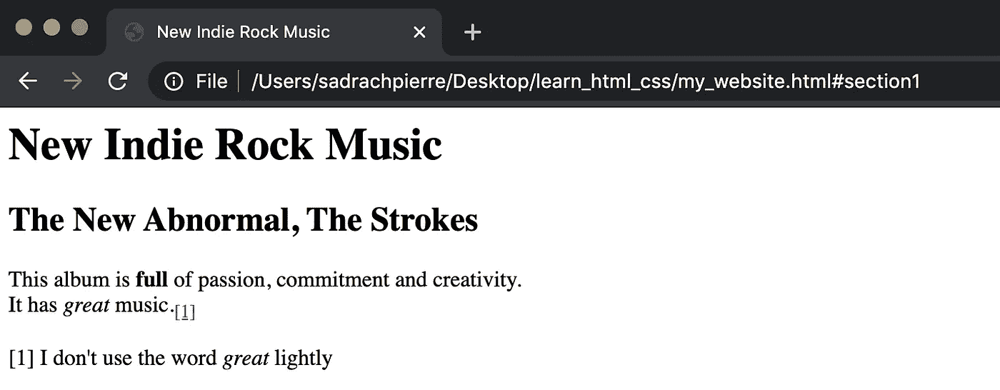
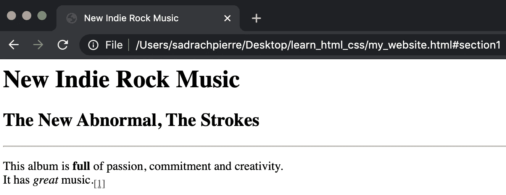
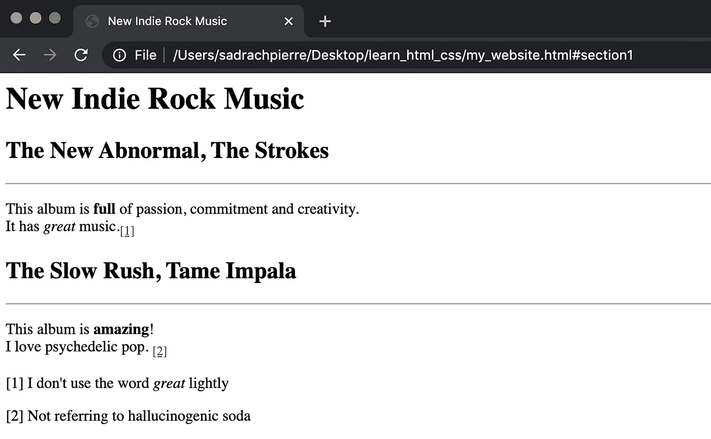

# HTML 入门

> 原文：<https://towardsdatascience.com/getting-started-with-html-98866c3e5c9e?source=collection_archive---------52----------------------->

## HTML 简介


[来源](https://www.pexels.com/photo/computer-desk-hand-laptop-374631/)

在网上冲浪时，你看到的大多数网站都是渲染 HTML 和 CSS 代码的结果。HTML 代表超文本标记语言，用于描述网页的结构。在这篇文章中，我们将讨论如何开始使用 HTML 创建一个基本的网页。

我们开始吧！

在 HTML 中，使用标签(也称为元素)来指定结构和语义。结构化标记的元素包括标题、段落、粗体、斜体、换行、下标和上标元素。让我们从讨论 header 标签开始。

## **标题**

在终端中，使用文本编辑器创建一个。“html”文件。我正在使用 VI 文本编辑器:

```
vi my_website.html
```

接下来，让我们在文件中创建一些标题。要创建一个标题，你需要使用一个开始标签

# ，后面跟着你想放在标题中的文本和一个结束标签

。让我们为我们的网站创建一个标题，这将是一个新的独立摇滚专辑发布的博客:

```
<html>
    <h1>New Indie Rock Music</h1>
</html>
```

接下来保存并关闭文件。现在，在浏览器中，打开您刚刚保存的文件。您应该会看到带有指定标题的页面:



另一件要注意的事情是，通过在标记中指定头编号，可以包含许多头。这导致标题尺寸减小:

```
<html>
   <h1>New Indie Rock Music</h1>
   <h2>New Indie Rock Music</h2>
   <h3>New Indie Rock Music</h3>
</html>
```



现在，让我们删除标题标签

## 和

### 并添加标题标签，它将显示在浏览器的选项卡中。让我们在主体中添加两个 header 标记:

```
<html>
    <header>
            <title>New Indie Rock Music</title>
    </header>
    <body>
            <h1>New Indie Rock Music</h1>
            <h2>The New Abnormal, The Strokes</p>
    <body>
</html>
```



在第二个标题下面，我们可以添加段落标签

，给出我们对专辑的看法:

```
<html>
    <header>
            <title>New Indie Rock Music</title>
    </header>
    <body>
            <h1>New Indie Rock Music</h1>
            <h2>The New Abnormal, The Strokes</h2>    
                <p>This album is full of passion, commitment and   creativity. It has great music.</p>                                            
    <body>
</html>
```



我们也可以使用粗体和斜体标签来强调部分文本。让我们使用 **full** 将段落中的单词“full”设为粗体，使用 *great* 将单词“great”设为斜体:

```
<html>
    <header>
            <title>New Indie Rock Music</title>
    </header>
    <body>
            <h1>New Indie Rock Music</h1>
            <h2>The New Abnormal, The Strokes</h2>    
                <p>This album is <b>full</b> of passion, commitment and   creativity. It has <i>great</i> music.<</p>                                            
    <body>
</html>
```



我们也可以加上下标和上标。假设，我们想给我们的博客文章添加一个脚注。为了给我们的第一个脚注添加一个下标，我们使用^([【1】](”#section1"))。

```
<html>
    <header>
            <title>New Indie Rock Music</title>
    </header>
    <body>
            <h1>New Indie Rock Music</h1>
            <h2>The New Abnormal, The Strokes</h2>    
                <p>This album is <b>full</b> of passion, commitment and   creativity. It has <i>great</i> music.<sub><a href="#section1">[1]</a></sub></p>                                            
    <body>
    <p>[1] I don't use the word <i>great</i> lightly </p>
</html>
```



我们也可以用一个上标，，作为我们的注脚:

```
<html>
    <header>
            <title>New Indie Rock Music</title>
    </header>
    <body>
            <h1>New Indie Rock Music</h1>
            <h2>The New Abnormal, The Strokes</h2>    
                <p>This album is <b>full</b> of passion, commitment and   creativity. It has <i>great</i> music.<sup><a href="#section1">[1]</a></sup></p>                                            
    <body>
    <p>[1] I don't use the word <i>great</i> lightly </p>
</html>
```



此外，您可以使用换行符和水平线来分隔文本的各个部分。我们使用
来换行。让我们在段落中的两个句子之间添加一个换行符:

```
<html>
    <header>
            <title>New Indie Rock Music</title>
    </header>
    <body>
            <h1>New Indie Rock Music</h1>
            <h2>The New Abnormal, The Strokes</h2>    
                <p>This album is <b>full</b> of passion, commitment and   creativity. <br /> It has <i>great</i> music.<sub><a href="#section1">[1]</a></sub></p>                                           
    <body>
    <p>[1] I don't use the word <i>great</i> lightly </p>
</html>
```



接下来，让我们添加一条水平线，使用

* * *

来分隔段落和标题:

```
<html>
    <header>
            <title>New Indie Rock Music</title>
    </header>
    <body>
            <h1>New Indie Rock Music</h1>
            <h2>The New Abnormal, The Strokes</h2>    
                <hr />                
                <p>This album is <b>full</b> of passion, commitment and   creativity. <br /> It has <i>great</i> music.<sub><a href="#section1">[1]</a></sub></p>                                            
    <body>
    <p>[1] I don't use the word <i>great</i> lightly </p>
</html>
```



最后，让我们在我们的网站上添加另一个帖子。这将是驯服黑斑羚的*慢冲:*

```
<html>
    <header>
            <title>New Indie Rock Music</title>
    </header>
    <body>
            <h1>New Indie Rock Music</h1>
            <h2>The New Abnormal, The Strokes</h2>    
                <hr />                
                <p>This album is <b>full</b> of passion, commitment and   creativity. <br /> It has <i>great</i> music.<sub><a href="#section1">[1]</a></sub></p>    
            <h2>The Slow Rush, Tame Impala</h2>    
                <hr />                
                <p>This album is <b>amazing</b>! <br />I love psychedelic pop. <sub><a href="#section2">[2]</a></sub></p>                                        
    <body>
    <p>[1] I don't use the word <i>great</i> lightly </p>    
    <p>[2] Not referring to hallucinogenic soda</p>
</html>
```



我就说到这里，但是您可以自己尝试一下。我鼓励你研究其他标签，比如引用参考文献、添加列表和添加地址。

# 结论

总之，在这篇文章中，我们讨论了如何开始使用 HTML 构建一个基本的网站。我们讨论了如何指定结构和语义标记，包括页眉、标题、正文和段落标记。我们还讨论了如何斜体字体，字体加粗，添加脚注，添加换行符和添加水平规则。我希望你觉得这篇文章有用/有趣。这篇文章的代码可以在 GitHub 上找到。感谢您的阅读！