# AWS 物联网分析入门

> 原文：<https://towardsdatascience.com/getting-started-with-iot-analytics-on-aws-5f2093bcf704?source=collection_archive---------11----------------------->

## 借助 AWS 物联网分析，近乎实时地分析来自物联网设备的环境传感器数据

帖子的音频版本

# 介绍

AWS 将 [AWS IoT](https://aws.amazon.com/iot/) 定义为一组托管服务，使*的互联网连接设备能够连接到 AWS 云，并让云中的应用程序与互联网连接设备进行交互* AWS 物联网服务涵盖三个类别:设备软件、连接和控制以及分析。在本帖中，我们将重点关注 [AWS 物联网分析](https://aws.amazon.com/iot-analytics/)，这是四种服务之一，属于 AWS 物联网分析类别的一部分。据 AWS 介绍，AWS 物联网分析是一种完全托管的物联网分析服务，专为物联网设计，可收集、预处理、丰富、存储和分析大规模的物联网设备数据。

当然，AWS 物联网分析并不是在 AWS 上分析[物联网](https://en.wikipedia.org/wiki/Internet_of_things)(物联网)或[工业物联网](https://en.wikipedia.org/wiki/Industrial_internet_of_things) (IIoT)数据的唯一方法。常见的是数据分析师团队使用更通用的 AWS 数据分析堆栈，由[亚马逊 S3](https://aws.amazon.com/s3/) 、[亚马逊 Kinesis](https://aws.amazon.com/kinesis/) 、 [AWS Glue](https://aws.amazon.com/glue) 和[亚马逊雅典娜](https://aws.amazon.com/athena/?whats-new-cards.sort-by=item.additionalFields.postDateTime&whats-new-cards.sort-order=desc)或[亚马逊红移](https://aws.amazon.com/redshift)和[红移光谱](https://docs.aws.amazon.com/redshift/latest/dg/c-getting-started-using-spectrum.html)组成，用于分析物联网数据。那么，为什么选择 [AWS 物联网分析](https://aws.amazon.com/iot-analytics/)而不是更传统的 AWS 数据分析堆栈呢？据 AWS 称，物联网分析旨在管理 Pb 级的物联网和物联网数据的复杂性。根据 AWS 的说法，物联网数据经常有明显的缺口、损坏的消息和错误的读数，必须在进行分析之前清除这些数据。此外，物联网数据必须经常得到丰富和转换才能有意义。物联网分析可以过滤、转换和丰富物联网数据，然后将其存储在时序数据存储中进行分析。

在接下来的帖子中，我们将探索如何使用 AWS 物联网分析来分析来自一系列物联网设备的近实时环境传感器数据。为了跟随帖子的演示，有一个选项可以使用样本数据来模拟物联网设备(参见本文的“*模拟物联网设备消息*”部分)。

# 物联网设备

在本帖中，我们将使用从一系列定制的环境传感器阵列中生成的物联网数据来探索物联网分析。每个基于试验板的传感器阵列都连接到一台 [Raspberry Pi](https://www.raspberrypi.org/) 单板计算机(SBC)，这是一台流行的、低成本的、信用卡大小的 Linux 计算机。物联网设备被特意放置在温度、湿度和其他环境条件不同的物理位置。

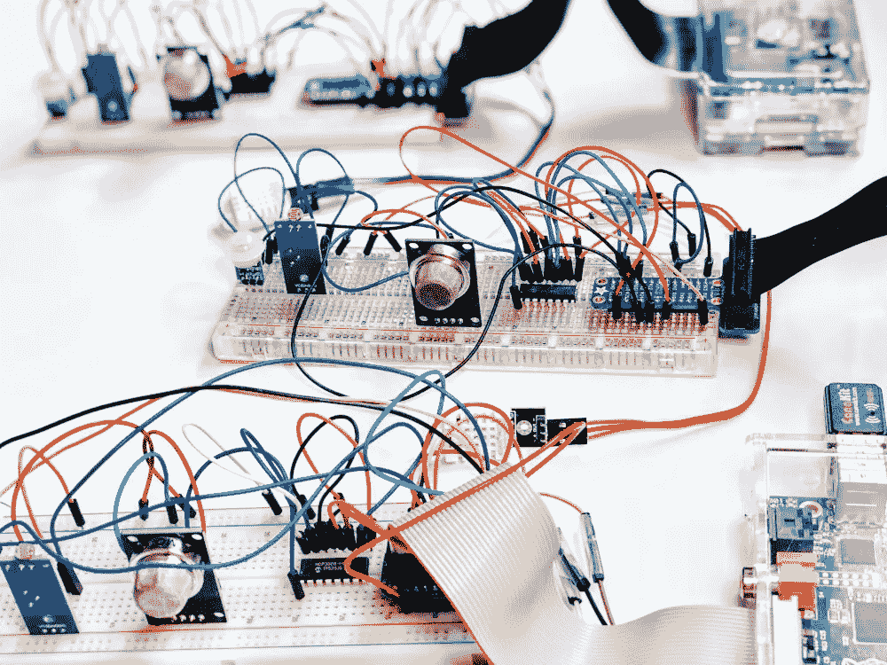

演示中使用的带传感器阵列的 Raspberry Pi 设备

每个设备包括以下传感器:

1.  MQ135 空气质量传感器有害气体检测传感器:CO、LPG、烟雾( [*链接*](https://www.amazon.com/gp/product/B079P6Z2TJ) )
    (需要一个 MCP 3008–8 通道 10 位 ADC w/ SPI 接口( [*链接*](https://www.amazon.com/dp/B01HGCSGXM) ))
2.  DHT22/AM2302 数字式温湿度传感器( [*链接*](https://www.amazon.com/gp/product/B07XBVR532) )
3.  Onyehn IR 热释电红外 PIR 运动传感器( [*链接*](https://www.amazon.com/gp/product/B07NPKMH58/) )
4.  光强检测光敏传感器([环节](https://www.amazon.com/gp/product/B07PJBVDG7))

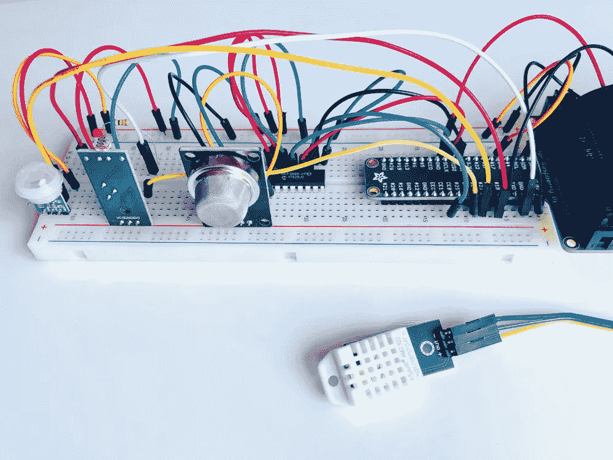

演示中使用的基于试验板的环境传感器阵列的详细视图

# AWS 物联网设备 SDK

每个 Raspberry Pi 设备运行一个定制的 Python 脚本， [sensor_collector_v2.py](https://github.com/garystafford/aws-data-analytics-demo/blob/master/device_scripts/sensor_collector_v2.py) 。该脚本使用 [AWS 物联网设备 SDK for Python v2](https://docs.aws.amazon.com/iot/latest/developerguide/iot-sdks.html#iot-python-sdk) 与 AWS 通信。该脚本定期从四个传感器收集总共七个不同的读数。传感器读数包括温度、湿度、一氧化碳(CO)、液化石油气(LPG)、烟雾、光线和运动。

该脚本使用 ISO 标准[消息队列遥测传输](https://en.wikipedia.org/wiki/MQTT) (MQTT)网络协议，将传感器读数以及设备 ID 和时间戳作为一条消息安全地发布给 AWS。下面是一个 MQTT 消息负载的例子，由收集器脚本发布。

如下图所示，在物联网设备上使用`tcpdump`，脚本生成的 MQTT 消息有效负载平均约为 275 字节。完整的 MQTT 消息平均大约 300 字节。

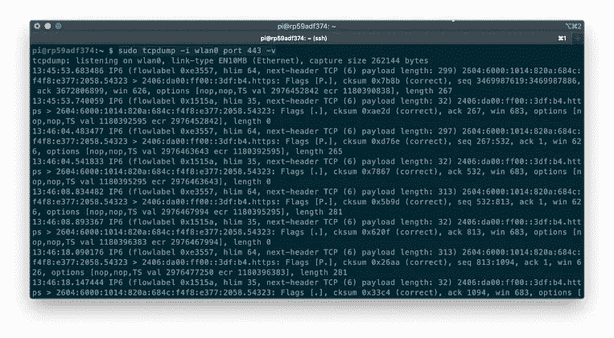

# AWS 物联网核心

每个树莓 Pi 都注册了 [AWS 物联网核心](https://aws.amazon.com/iot-core/)。物联网核心允许用户快速安全地将设备连接到 AWS。据 AWS 称，物联网核心可以可靠地扩展到数十亿台设备和数万亿条消息。注册的设备在 AWS 物联网核心中被称为*的东西*。一个*事物*是一个特定设备或逻辑实体的表示。关于一个事物的信息作为 JSON 数据存储在[注册表](https://docs.aws.amazon.com/iot/latest/developerguide/iot-thing-management.html)中。

物联网核心提供了一个[设备网关](https://aws.amazon.com/iot-core/features)，管理所有活动设备连接。该网关目前支持 MQTT、WebSockets 和 HTTP 1.1 协议。在消息网关的背后是一个高吞吐量的 pub/sub [消息代理](https://aws.amazon.com/iot-core/features)，它以低延迟安全地向所有物联网设备和应用传输消息。下面，我们看到一个典型的 AWS 物联网核心架构。

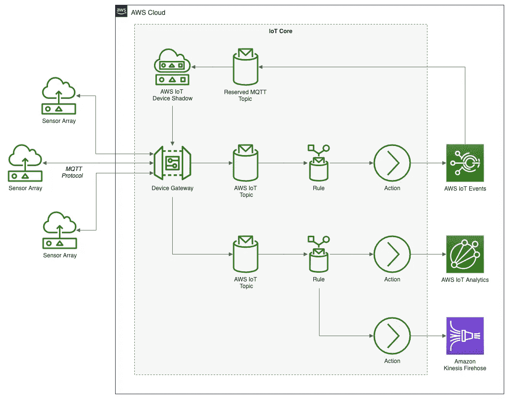

三个 Raspberry Pi 设备每天以五秒的消息频率向 AWS 物联网核心发布大约 50，000 条物联网消息。

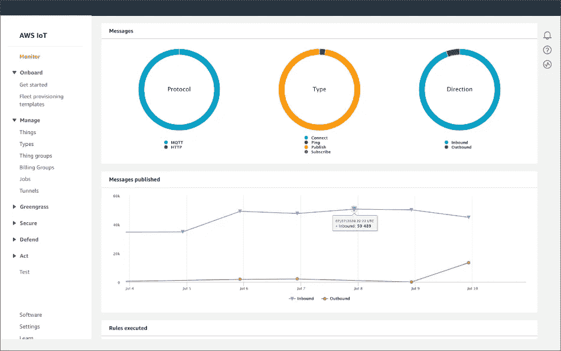

## AWS 物联网安全性

AWS 物联网核心提供相互认证和加密，确保 AWS 和设备之间交换的所有数据在默认情况下[安全](https://docs.aws.amazon.com/iot/latest/developerguide/iot-security.html)。在演示中，使用端口 443 上带有 [X.509](https://en.wikipedia.org/wiki/X.509) 数字证书的[传输层安全性](https://en.wikipedia.org/wiki/Transport_Layer_Security) (TLS) 1.2 安全地发送所有数据。设备访问 AWS 上任何资源的授权由单独的 [AWS 物联网核心政策](https://docs.aws.amazon.com/iot/latest/developerguide/iot-policies.html)控制，类似于 AWS IAM 政策。下面，我们看到一个分配给注册设备的 X.509 证书的示例。

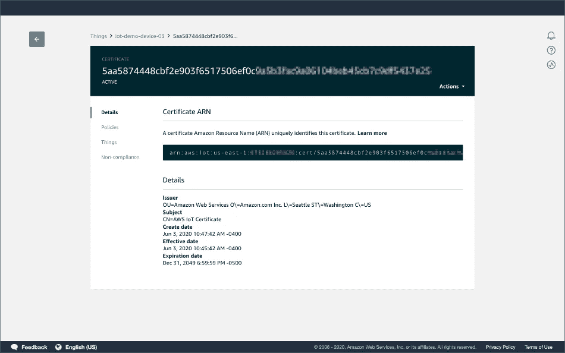

## AWS 物联网核心规则

一旦从物联网设备(一个*东西*)接收到 MQTT 消息，我们使用 [AWS 物联网规则](https://docs.aws.amazon.com/iot/latest/developerguide/iot-rules.html)将消息数据发送到 [AWS 物联网分析通道](https://docs.aws.amazon.com/iotanalytics/latest/APIReference/API_Channel.html)。规则使您的设备能够与 AWS 服务进行交互。规则是用标准结构化查询语言(SQL)编写的。分析规则，并基于 MQTT 主题流执行[动作](https://docs.aws.amazon.com/iot/latest/developerguide/iot-rule-actions.html)。下面，除了 [AWS 物联网事件](https://docs.aws.amazon.com/iotevents/latest/developerguide/what-is-iotevents.html)和亚马逊 Kinesis 数据消防软管之外，我们还看到了一个将我们的消息转发给物联网分析的示例规则。

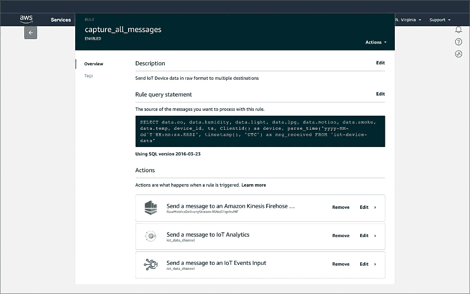

# 模拟物联网设备消息

构建和配置多个基于 Raspberry Pi 的传感器阵列，并向 AWS 物联网核心注册这些设备，仅仅是这篇文章就需要大量的工作。因此，我已经在 [GitHub](https://github.com/garystafford/aws-data-analytics-demo) 上提供了模拟三个物联网设备所需的一切。使用以下命令 git 克隆项目的本地副本。

## 自动气象站云形成

使用 CloudFormation 模板 [iot-analytics.yaml](https://github.com/garystafford/aws-data-analytics-demo/blob/master/cloudformation/iot-analytics.yaml) 创建包含(17)种资源的物联网分析堆栈，包括以下内容。

*   (3) AWS 物联网
*   (1) AWS 物联网核心话题规则
*   (1) AWS 物联网分析渠道、管道、数据存储和数据集
*   (1)AWSλ和λ许可
*   ①亚马逊 S3 桶
*   (1)亚马逊 SageMaker 笔记本实例
*   (5) AWS IAM 角色

继续之前，请注意 CloudFormation 模板中使用的 AWS 资源所涉及的成本。要构建 AWS CloudFormation 堆栈，请运行以下 AWS CLI 命令。

下面，我们看到了物联网分析演示 CloudFormation 堆栈的成功部署。

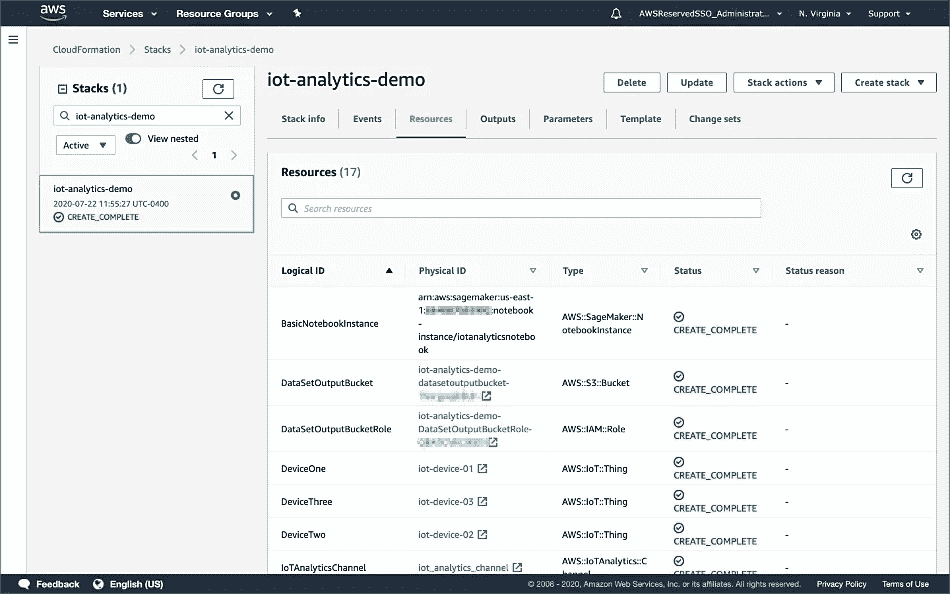

## 发布示例消息

一旦成功创建了 CloudFormation 堆栈，使用包含的 Python 脚本， [send_sample_messages.py](https://github.com/garystafford/aws-iot-analytics-demo/blob/master/sample_data/send_sample_messages.py) ，将[示例物联网数据](https://github.com/garystafford/aws-data-analytics-demo/tree/master/sample_data)从本地机器发送到 AWS 物联网主题。该脚本将使用您的 AWS 身份和凭据，而不是向物联网核心注册的实际物联网设备。物联网数据将被物联网主题规则拦截，并使用主题规则操作重定向到物联网分析通道。

首先，我们将通过发送一些测试消息来确保物联网堆栈在 AWS 上正确运行。转到 AWS 物联网核心测试选项卡。订阅`iot-device-data`话题。

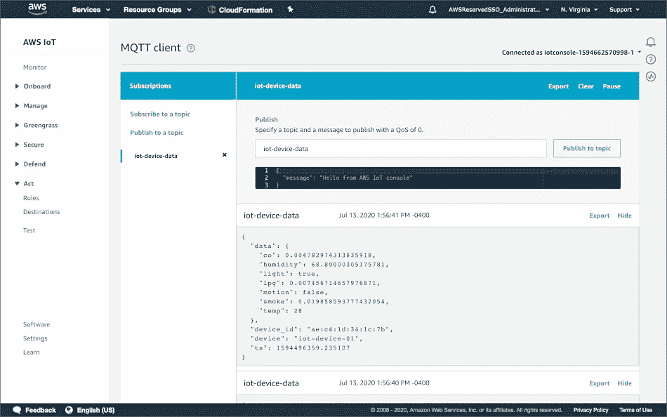

然后，使用较小的数据文件 [raw_data_small.json](https://github.com/garystafford/aws-data-analytics-demo/blob/master/sample_data/raw_data_small.json) 运行以下命令。

如果成功，您应该会在 Test 选项卡中看到这五条消息，如上所示。该脚本的输出示例如下所示。

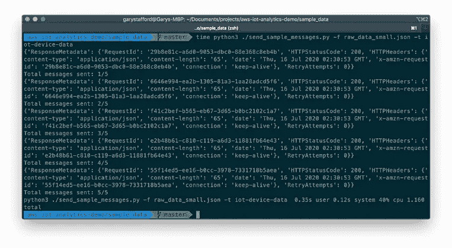

然后，使用更大的数据文件 [raw_data_large.json](https://github.com/garystafford/aws-data-analytics-demo/blob/master/sample_data/raw_data_large.json) 运行第二个命令，该文件包含 9995 条消息(相当于几个小时的数据)。该命令大约需要 12 分钟才能完成。

一旦第二个命令成功完成，您的物联网分析通道应该包含 10，000 条唯一消息。有一个可选的超大数据文件，包含大约 50，000 条物联网消息(24 小时的物联网消息)。

# AWS 物联网分析

AWS 物联网分析由五个主要组件组成:通道、管道、数据存储、数据集和笔记本。这些组件使您能够收集、准备、存储、分析和可视化您的物联网数据。

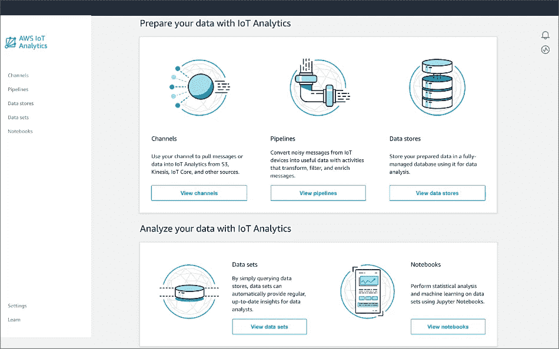

下面，我们看到一个典型的 AWS 物联网分析架构。物联网消息来自 AWS 物联网核心，这是一个规则操作。[亚马逊 QuickSight](https://aws.amazon.com/quicksight) 提供商业智能、可视化。[亚马逊 QuickSight ML Insights](https://aws.amazon.com/quicksight/features-ml) 增加了异常检测和预测功能。

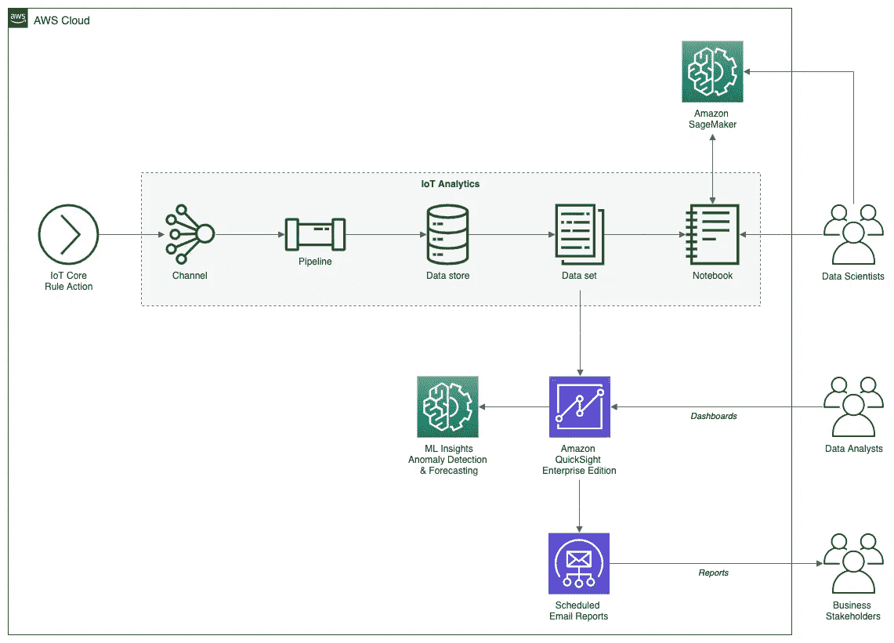

典型的 AWS 物联网分析架构

## 物联网分析渠道

AWS 物联网分析通道将来自亚马逊 S3、亚马逊 Kinesis 或亚马逊物联网核心等其他 AWS 来源的消息或数据纳入物联网分析。渠道为物联网分析管道存储数据。渠道和数据存储都支持将数据存储在您自己的亚马逊 S3 存储桶或物联网分析服务管理的 S3 存储桶中。在演示中，我们使用服务管理的 S3 存储桶。

创建频道时，您还可以决定保留数据的时间。在演示中，我们将数据保留期设置为 14 天。通常，您只需在需要分析的时间段内将数据保留在通道中。对于物联网消息数据的长期存储，我建议使用 AWS 物联网核心规则向亚马逊 S3 发送原始物联网数据的副本，使用诸如[亚马逊 Kinesis Data Firehose](https://aws.amazon.com/kinesis/data-firehose/) 之类的服务。

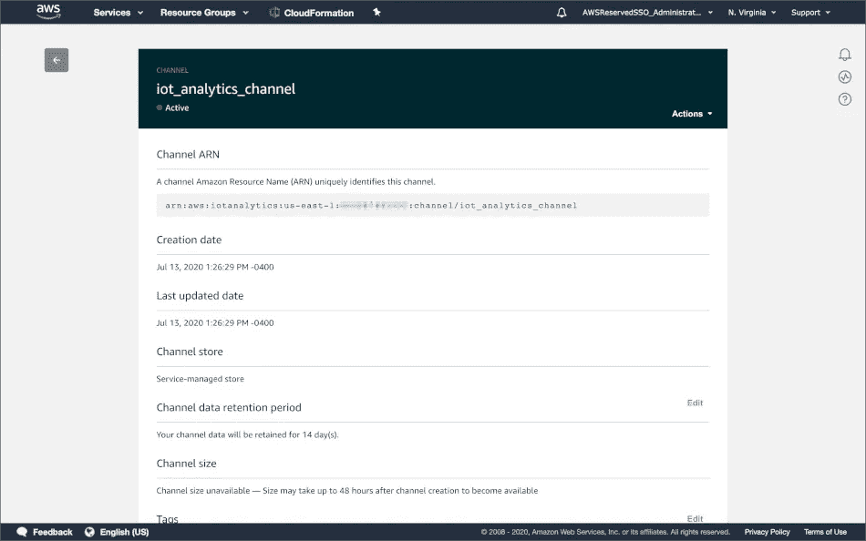

## 物联网分析渠道

AWS 物联网分析管道使用来自一个或多个渠道的消息。管道在将消息存储到物联网分析数据存储之前，对其进行转换、过滤和丰富。管道由一系列活动组成。从逻辑上讲，您必须指定一个`[Channel](https://docs.aws.amazon.com/AWSCloudFormation/latest/UserGuide/aws-properties-iotanalytics-pipeline-activity.html#cfn-iotanalytics-pipeline-activity-datastore)` ( *源*)和一个`[Datastore](https://docs.aws.amazon.com/AWSCloudFormation/latest/UserGuide/aws-properties-iotanalytics-pipeline-activity.html#cfn-iotanalytics-pipeline-activity-datastore)` ( *目的地*)活动。或者，您可以在`pipelineActivities`数组中选择多达 23 个附加活动。

在我们的演示管道`iot_analytics_pipeline`中，我们指定了五个额外的活动，包括`[DeviceRegistryEnrich](https://docs.aws.amazon.com/AWSCloudFormation/latest/UserGuide/aws-properties-iotanalytics-pipeline-activity.html#cfn-iotanalytics-pipeline-activity-deviceregistryenrich)`、`[Filter](https://docs.aws.amazon.com/AWSCloudFormation/latest/UserGuide/aws-properties-iotanalytics-pipeline-activity.html#cfn-iotanalytics-pipeline-activity-filter)`、`[Math](https://docs.aws.amazon.com/AWSCloudFormation/latest/UserGuide/aws-properties-iotanalytics-pipeline-activity.html#cfn-iotanalytics-pipeline-activity-math)`、`[Lambda](https://docs.aws.amazon.com/AWSCloudFormation/latest/UserGuide/aws-properties-iotanalytics-pipeline-activity.html#cfn-iotanalytics-pipeline-activity-lambda)`和`[SelectAttributes](https://docs.aws.amazon.com/AWSCloudFormation/latest/UserGuide/aws-properties-iotanalytics-pipeline-activity.html#cfn-iotanalytics-pipeline-activity-selectattributes)`。还有两个额外的活动类型我们没有选择，`[RemoveAttributes](https://docs.aws.amazon.com/AWSCloudFormation/latest/UserGuide/aws-properties-iotanalytics-pipeline-activity.html#cfn-iotanalytics-pipeline-activity-removeattributes)`和`[AddAttributes](https://docs.aws.amazon.com/AWSCloudFormation/latest/UserGuide/aws-properties-iotanalytics-pipeline-activity.html#cfn-iotanalytics-pipeline-activity-addattributes)`。

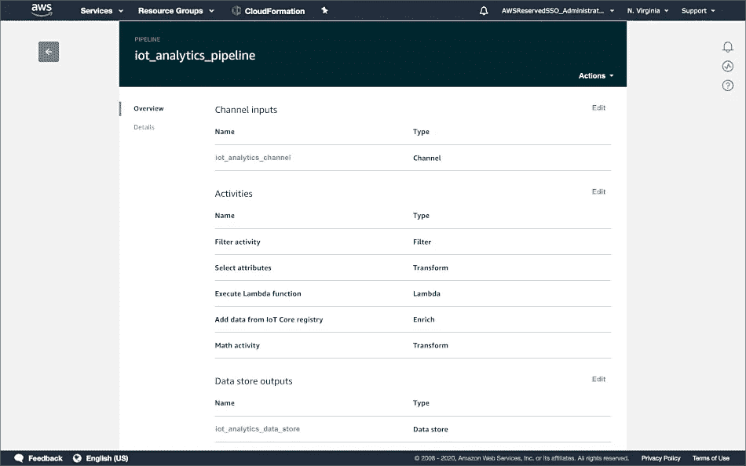

由 CloudFormation 创建的演示管道从来自演示通道`iot_analytics_channel`的消息开始，如下所示。

演示的管道通过一系列管道活动转换消息，然后将结果消息存储在演示的数据存储中`iot_analytics_data_store`。生成的消息如下所示。

在我们的演示中，对消息的转换包括删除`device_id`属性并将`temp`属性值转换为 Fahrenheit。此外，`[Lambda](https://docs.aws.amazon.com/AWSCloudFormation/latest/UserGuide/aws-properties-iotanalytics-pipeline-activity.html#cfn-iotanalytics-pipeline-activity-lambda)`活动将`temp`、`humidity`、`co`、`lpg`和`smoke`属性值向下舍入到精度的 2 到 4 位小数。

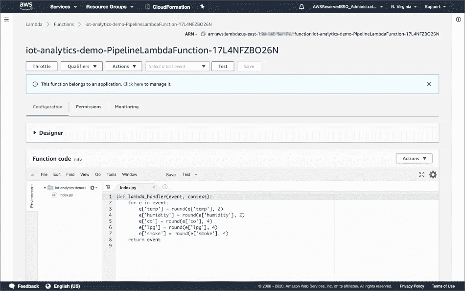

演示的管道还用`metadata`属性丰富了消息，包含来自物联网设备的 AWS 物联网核心[注册表](https://docs.aws.amazon.com/iot/latest/developerguide/iot-thing-management.html)的元数据。元数据包括关于生成消息的设备的附加信息，包括我们输入的自定义属性，例如位置(经度和纬度)和设备的安装日期。

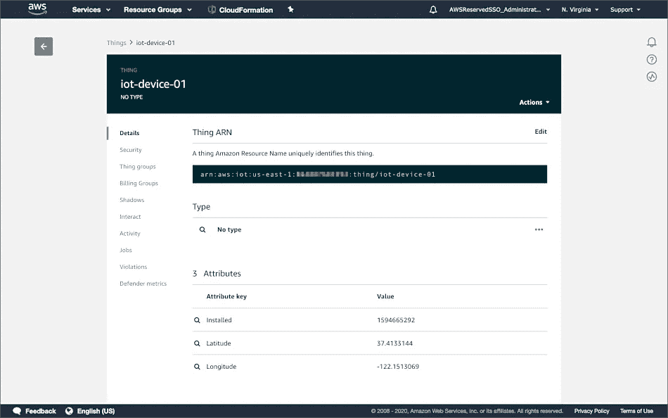

管道的一个重要特性是重新处理消息的能力。如果对管道进行更改(这通常发生在数据准备阶段),可以重新处理关联通道中的任何或所有消息，并覆盖数据集中的消息。

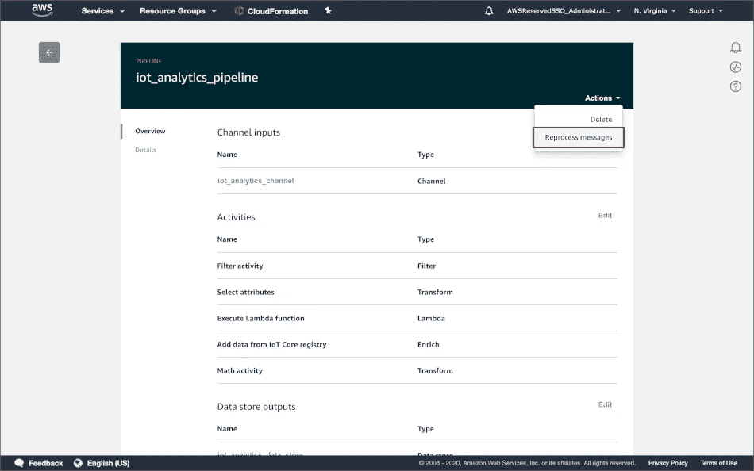

## 物联网分析数据存储

AWS 物联网分析数据存储将 AWS 物联网分析管道中准备好的数据存储在一个完全托管的数据库中。渠道和数据存储都支持将数据存储在您自己的亚马逊 S3 存储桶或物联网分析管理的 S3 存储桶中。在演示中，我们使用服务管理的 S3 存储桶在我们的数据存储中存储消息。

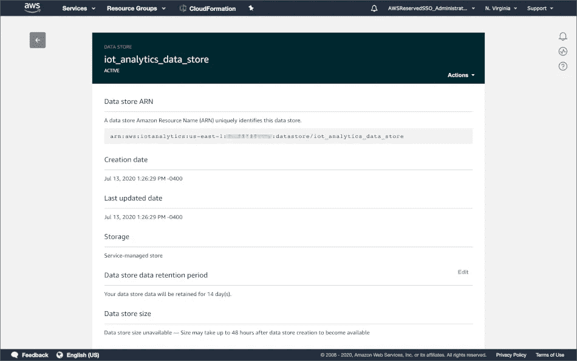

## 物联网分析数据集

AWS 物联网分析数据集通过使用标准 SQL 查询数据存储，自动为数据分析师提供定期的最新见解。定期更新是通过使用 cron 表达式提供的。在演示中，我们使用 15 分钟的间隔。

下面，我们在数据集的结果预览窗格中看到示例消息。这是我们发送来检查堆栈的五条测试消息。请注意用于获取消息的 SQL 查询，它查询数据存储。您会记得，数据存储包含来自管道的转换后的消息。

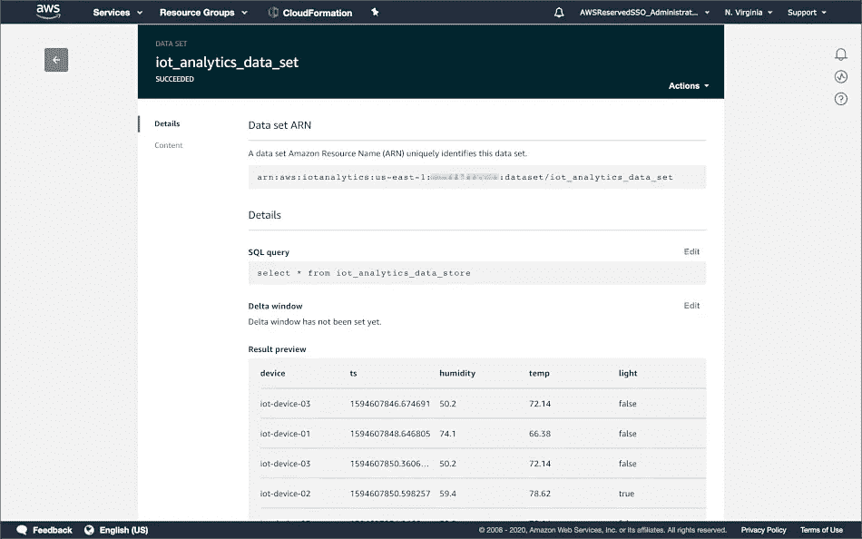

物联网分析数据集还支持将内容结果(物联网分析数据的物化视图)发送到亚马逊 S3 桶。

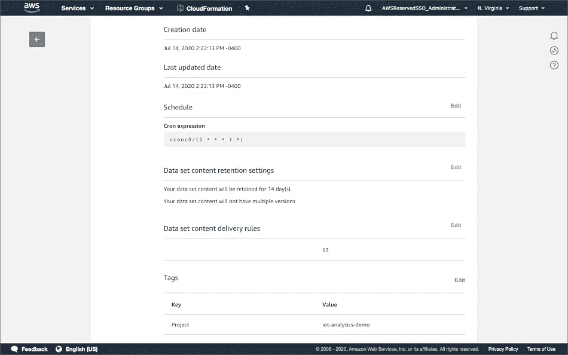

CloudFormation 堆栈包含一个加密的亚马逊 S3 桶。每当 cron 表达式运行计划更新时，此存储桶都会收到来自物联网分析数据集的消息副本。

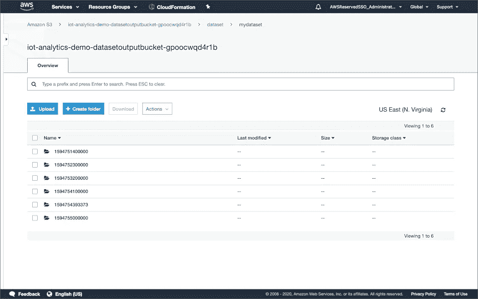

## 物联网分析笔记本

AWS 物联网分析笔记本允许用户使用 [Jupyter 笔记本](https://jupyter.org/)对物联网分析数据集进行统计分析和机器学习。物联网分析笔记本服务包括一组笔记本模板，其中包含 AWS 创作的机器学习模型和可视化。笔记本实例可以链接到 GitHub 或其他源代码库。使用物联网分析笔记本创建的笔记本也可以通过[亚马逊 SageMaker](https://aws.amazon.com/sagemaker/) 直接访问。对于这个演示，笔记本实例与项目的 [GitHub 存储库](https://github.com/garystafford/aws-iot-analytics-demo)相关联。

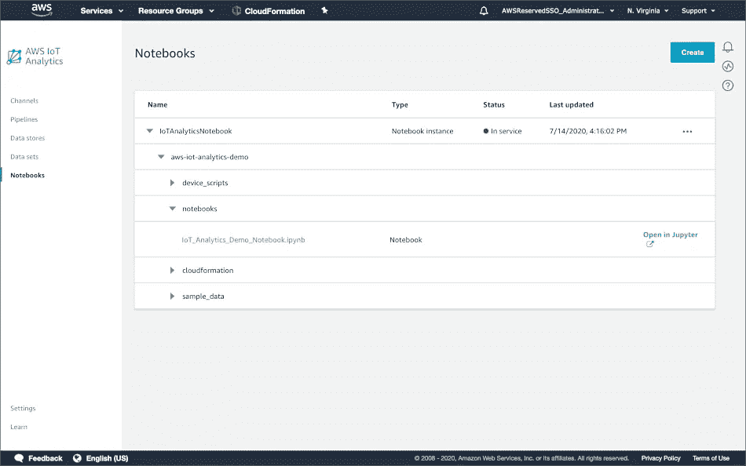

该存储库包含一个基于`conda_python3`内核的示例 Jupyter 笔记本，[IoT _ Analytics _ Demo _ Notebook . ipynb](https://github.com/garystafford/aws-iot-analytics-demo/tree/master/notebooks)。这个预装环境包括默认的 [Anaconda](https://www.anaconda.com/) 安装和 Python 3。该笔记本使用 pandas、matplotlib 和 plotly 来操作和可视化我们之前发布并存储在数据集中的示例物联网消息。

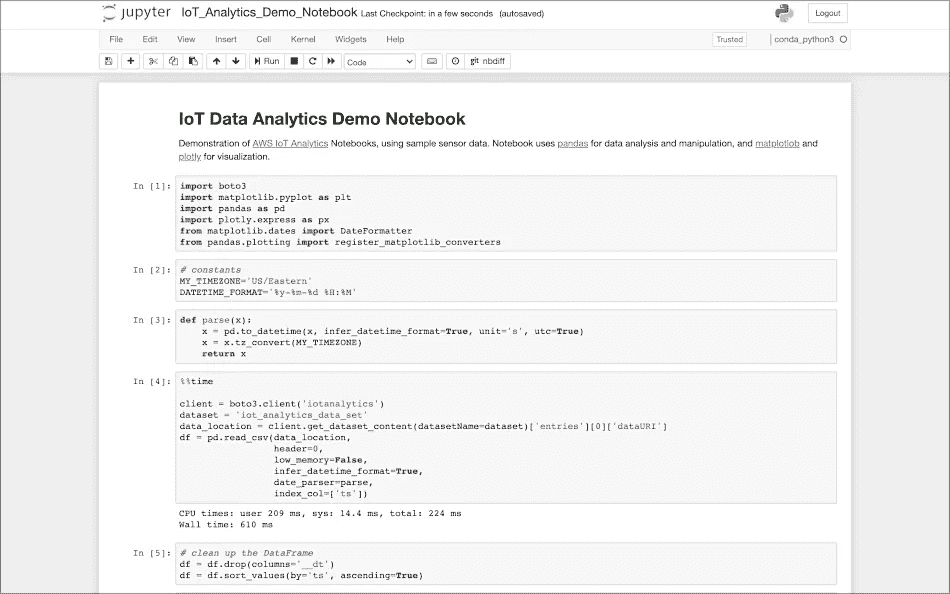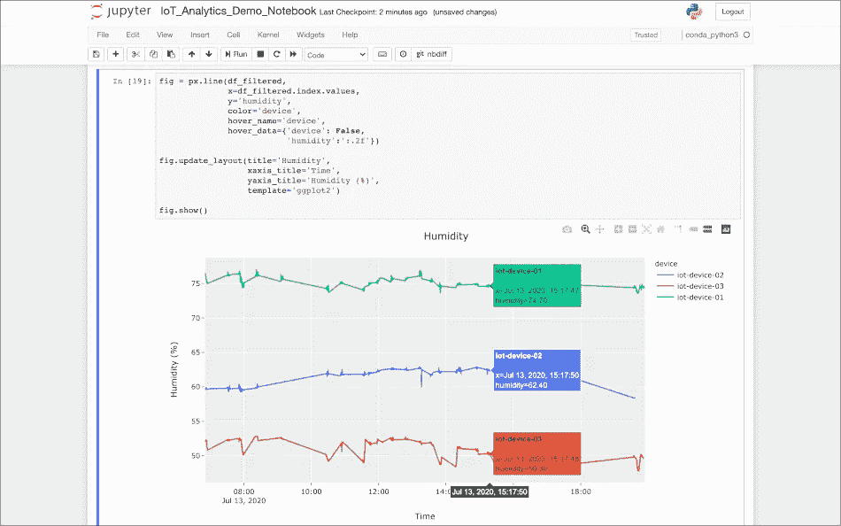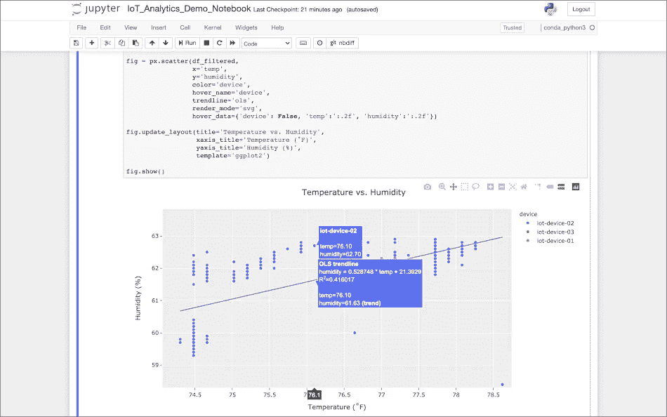

笔记本可以修改，修改的内容推回到 GitHub。您可以轻松地复制我的 GitHub 存储库并修改 CloudFormation 模板，以包含您自己的 GitHub 存储库 URL。

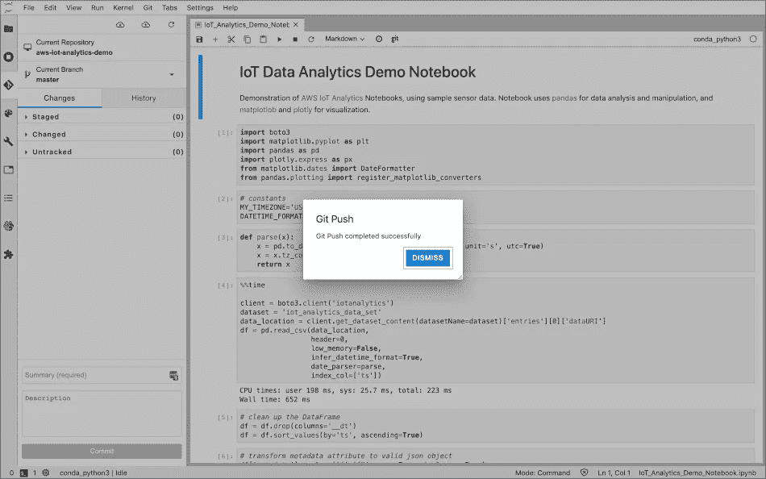

# 亚马逊 QuickSight

[亚马逊 QuickSight](https://aws.amazon.com/quicksight) 提供商业智能(BI)和可视化。[亚马逊 QuickSight ML Insights](https://aws.amazon.com/quicksight/features-ml) 增加了异常检测和预测功能。我们可以使用 Amazon QuickSight 来可视化存储在物联网分析数据集中的物联网消息数据。

亚马逊 QuickSight 有标准版和企业版。AWS 提供了每个版本详细的[产品对比](https://aws.amazon.com/quicksight/pricing/?nc=sn&loc=4)。在这篇文章中，我展示了企业版，它包括额外的[功能](https://aws.amazon.com/quicksight/features)，如 ML Insights，每小时刷新 [SPICE](https://docs.aws.amazon.com/quicksight/latest/user/welcome.html#spice) (超快，并行，内存中，计算引擎)，以及主题定制。如果您选择跟随演示的这一部分，请注意 Amazon QuickSight 的成本。Amazon QuickSight 通过演示的 CloudFormation 模板启用或配置。

## QuickSight 数据集

Amazon QuickSight 有各种各样的数据源选项来创建 Amazon QuickSight 数据集，包括下面显示的那些。不要混淆亚马逊 QuickSight 数据集和物联网分析数据集。这是两种不同但相似的结构。

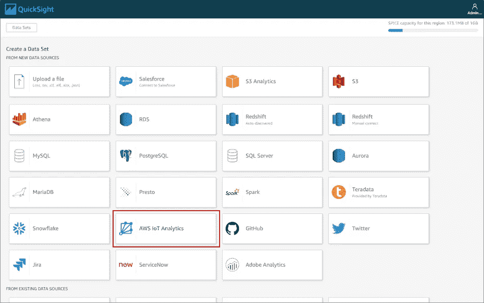

为了进行演示，我们将创建一个 Amazon QuickSight 数据集，该数据集将使用我们的物联网分析数据集作为数据源。

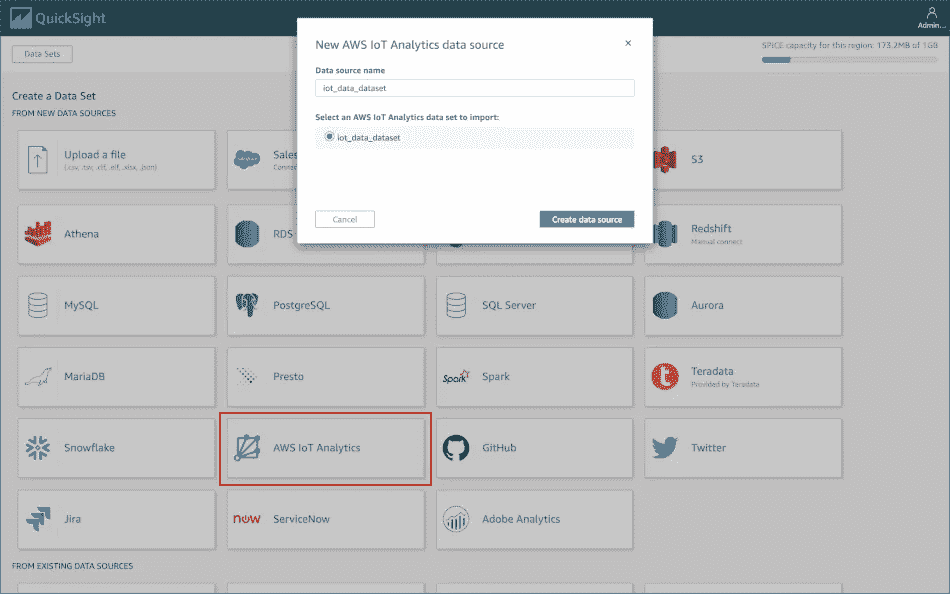

Amazon QuickSight 让您能够修改 QuickSight 数据集。为了进行演示，我添加了两个额外的字段，将真和假的布尔值`light`和`motion`转换为二进制值 0 或 1。我还取消选择了 QuickSight 分析不需要的两个字段。

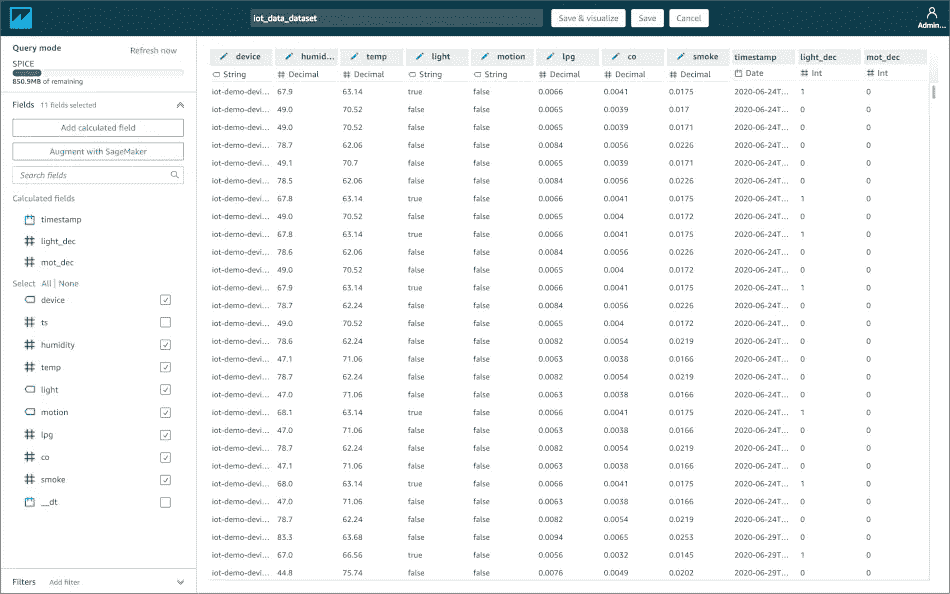

QuickSight 提供了多种功能，使我们能够对字段值执行动态计算。下面，我们看到一个新的计算字段，`light_dec`，包含原始光场的布尔值转换为二进制值。我使用一个`if...else`公式根据另一个字段中的值来改变字段的值。

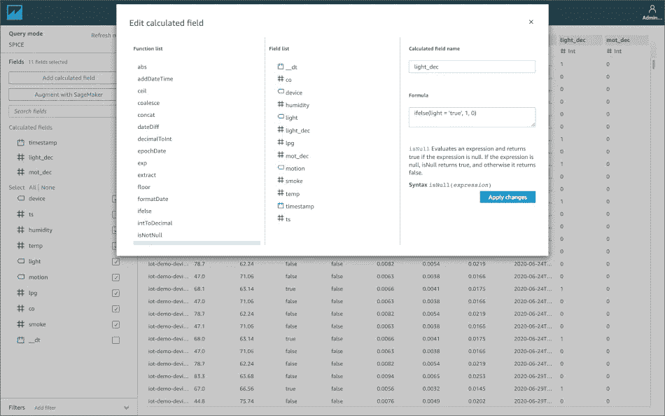

## 快速视力分析

使用以物联网分析数据集为数据源构建的 QuickSight 数据集，我们创建了 QuickSight 分析。QuickSight 分析用户界面如下所示。分析主要是视觉效果(视觉类型)的集合。QuickSight 提供了许多[视觉类型](https://docs.aws.amazon.com/quicksight/latest/user/working-with-visual-types.html)。每个图像都与一个数据集相关联。可以过滤 QuickSight 分析或每个单独视觉的数据。为了演示，我创建了一个 QuickSight 分析，包括几个典型的 QuickSight 视觉效果。

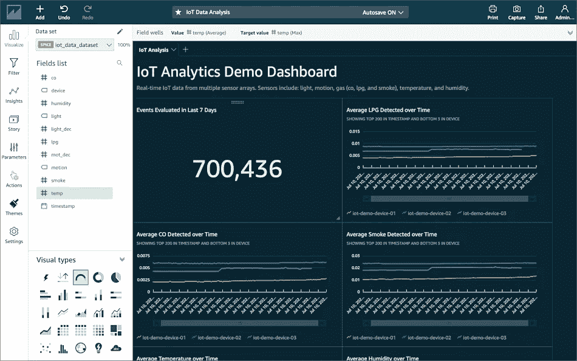

## QuickSight 仪表板

要共享 QuickSight 分析，我们可以创建一个 QuickSight 仪表板。下面，我们将上面显示的 QuickSight 分析的几个视图作为仪表板。仪表板的查看者不能编辑视觉效果，尽管他们可以对视觉效果中的数据应用[过滤](https://docs.aws.amazon.com/quicksight/latest/user/filtering-visual-data.html)和交互式[下钻](https://docs.aws.amazon.com/quicksight/latest/user/adding-drill-downs.html)。

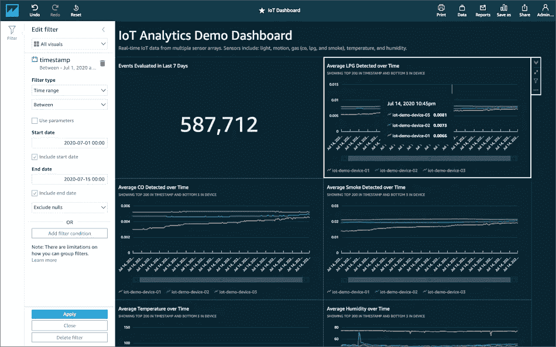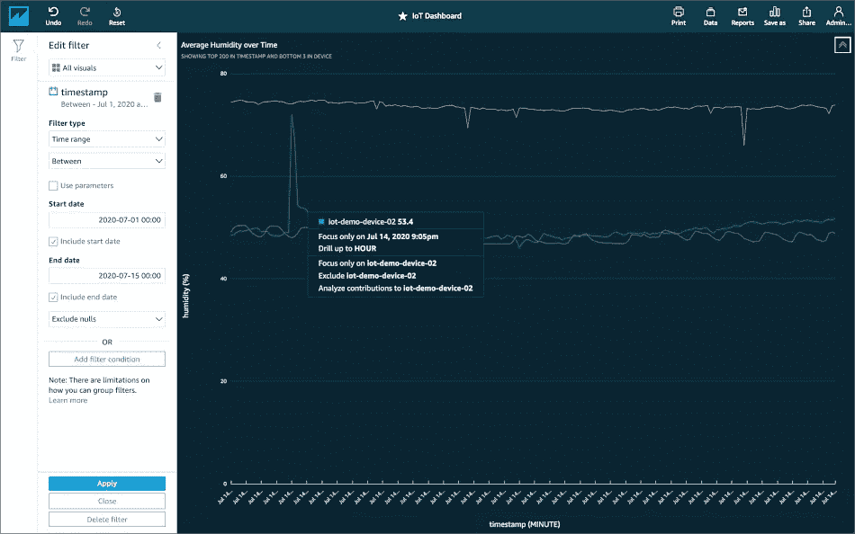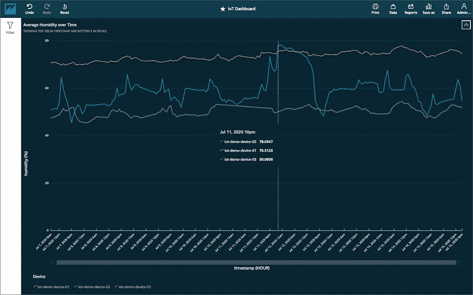

## 地理空间数据

亚马逊 QuickSight 理解[地理空间数据](https://docs.aws.amazon.com/quicksight/latest/user/geospatial-data-prep.html)。如果您还记得，在物联网分析管道中，我们丰富了来自设备注册表的元数据中的消息。元数据属性包含设备的经度和纬度。Quicksight 会将这些字段识别为地理字段。在我们的 QuickSight 分析中，我们可以使用[地理空间图表](https://docs.aws.amazon.com/quicksight/latest/user/geospatial-charts.html)(地图)视觉类型来可视化地理空间数据。

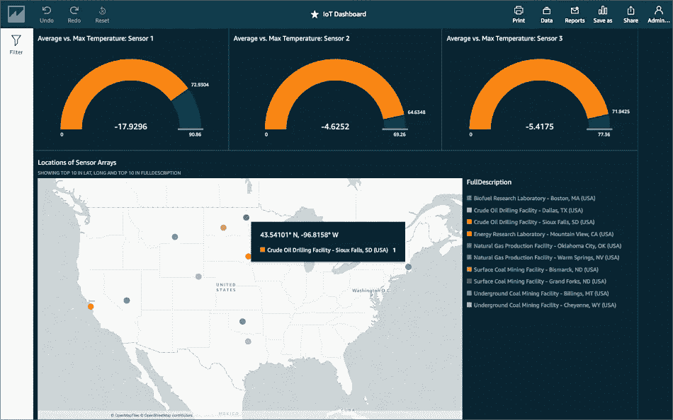

## QuickSight 移动应用程序

亚马逊 QuickSight 提供免费的 iOS 和 Android 版本的[亚马逊 QuickSight 移动应用](https://docs.aws.amazon.com/quicksight/latest/user/using-quicksight-mobile.html)。移动应用程序使注册的 QuickSight 最终用户能够使用他们的移动设备安全地连接到 QuickSight 仪表板。下面，我们看到同一个仪表盘的两个视图，显示在 iOS 版本的[亚马逊 QuickSight 移动应用](https://docs.aws.amazon.com/quicksight/latest/user/using-quicksight-mobile.html)中。

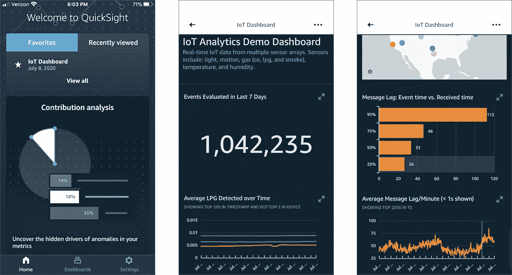

Amazon QuickSight 移动应用程序的仪表板视图

# 亚马逊 QuickSight ML 洞察

据[亚马逊](https://aws.amazon.com/quicksight/features-ml/)称，ML Insights 利用 AWS 的机器学习(ML)和自然语言能力，从数据中获得更深入的见解。QuickSight 的 ML-powered 异常检测持续分析数据，以发现聚合内部的异常和变化，让您能够在业务发生变化时采取行动。QuickSight 的 ML-powered 预测可用于准确预测您的业务指标，并通过简单的点击操作执行交互式假设分析。QuickSight 的内置算法使任何人都可以轻松地使用从您的数据模式中学习的 ML，为您提供基于历史趋势的准确预测。

下面，我们在演示的 QuickSight 分析中看到了 ML Insights 选项卡。单独检测到的异常可以添加到 QuickSight 分析中，类似于可视化，并且[配置](https://docs.aws.amazon.com/quicksight/latest/user/anomaly-detection-using.html)来调整检测参数[。](https://docs.aws.amazon.com/quicksight/latest/user/anomaly-detection-using.html)

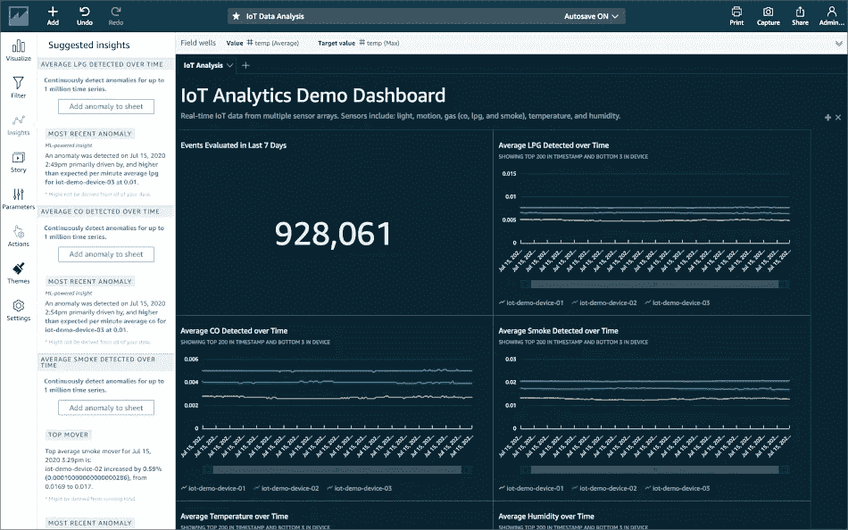

下面，我们看到一个所有设备湿度异常的例子，基于它们的异常分数，或高或低，最小差值为百分之五。

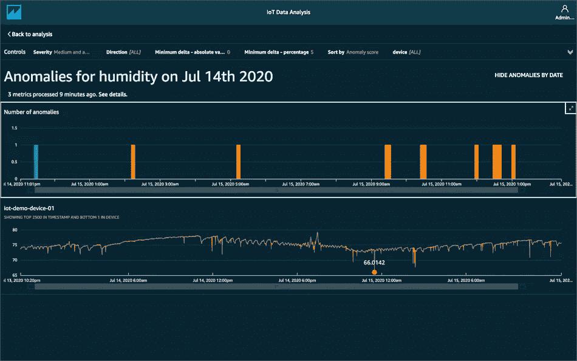

# 清理

SageMaker 笔记本实例按小时收费。完成演示后，不要忘记删除您的 CloudFormation 堆栈。注意亚马逊 S3 桶不会被删除；您必须手动执行此操作。

# 结论

在这篇文章中，我们展示了如何使用 AWS 物联网分析来近乎实时地分析和可视化来自多个物联网设备的流消息。结合其他 [AWS 物联网](https://aws.amazon.com/iot/)分析服务，如 [AWS 物联网 SiteWise](https://aws.amazon.com/iot-sitewise/) 、 [AWS 物联网事件](https://aws.amazon.com/iot-events/)和 [AWS 物联网事物图](https://aws.amazon.com/iot-things-graph/)，您可以创建一个强大的、功能齐全的物联网分析平台，能够处理数百万个工业、商业和住宅物联网设备，生成数 Pb 的数据。

本博客代表我自己的观点，不代表我的雇主亚马逊网络服务公司的观点。