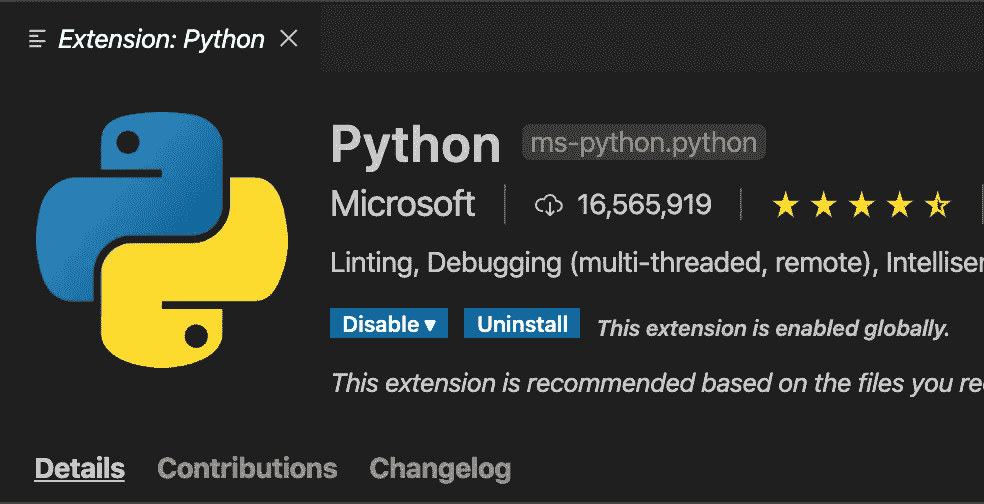
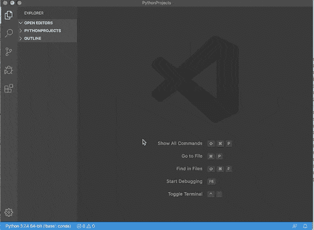
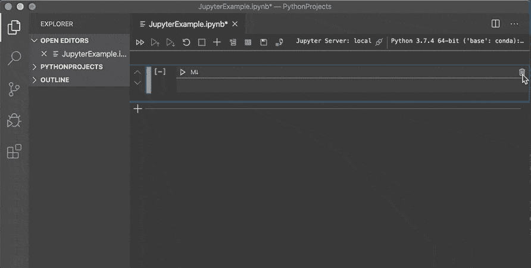
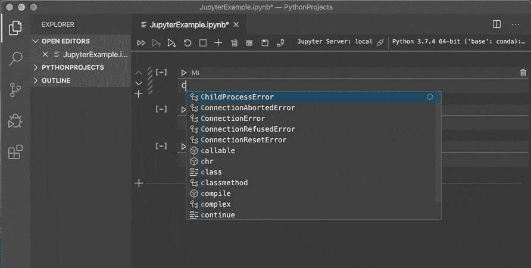
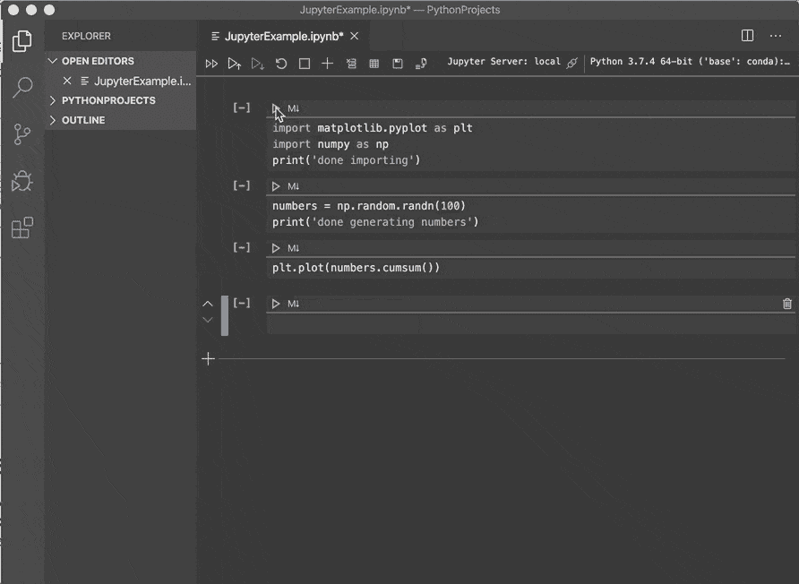
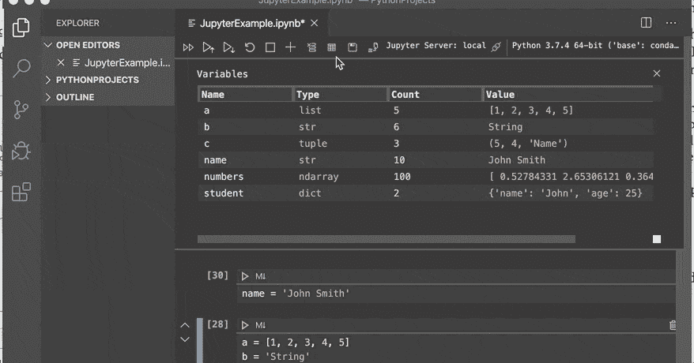
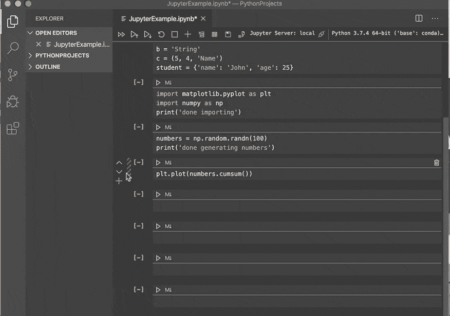

# 在 Visual Studio 代码中开始使用 Jupyter 笔记本

> 原文：<https://towardsdatascience.com/getting-started-with-jupyter-notebooks-in-visual-studio-code-5dcccb3f739b?source=collection_archive---------3----------------------->

VS 代码 Python 扩展

## VS 代码现在通过它的 Python 插件提供了对 Jupyter 笔记本的本地支持。这里有一个简单的例子来概述它的主要功能。

尽管许多程序员选择使用 IDE(即集成开发环境)，并通过坚持使用它来真正了解它，但其他一些程序员，包括我自己，喜欢探索不同的 IDE 选项。这不仅仅是因为我有兴趣了解每种流行的 IDE 都提供了哪些很酷而且可能是独一无二的特性，而且我还与使用各种 IDE 的同事一起参与了多个项目，为了便于交流，当我们召开项目会议时，我想说他们的“语言”。

说到 Python 开发，我更喜欢 Jupyter 笔记本和 Visual Studio (VS)代码。

Jupyter 笔记本已经发展成为一种流行的 IDE 选择。随着除 IPython 之外的其他内核的出现，Jupyter Notebook 除了 Python 之外，还可以支持 Java、R、Julia 和其他流行的编程语言。笔记本是集成了降价文本和可执行源代码的画布，支持协作、可扩展和可复制的团队项目。

VS Code 是另一个开源 IDE，在使用各种编程语言(如 JavaScript、C#和 Python)的开发人员中很受欢迎，并且随着更多相关的 VS Code 插件的开发，支持的语言还在增加。但是，创建和编辑 Jupyter 笔记本的本地支持不可用。

事情变了！随着 2019 年 VS Code Python 插件的最新发布，VS Code 已经提供了 Jupyter 笔记本的原生支持，可以让我在不运行 Jupyter 笔记本的情况下在笔记本上工作。在本文中，我将向您展示在 VS 代码中使用 Jupyter 笔记本的基础知识。

# 环境设置

你需要在你的电脑上安装 Jupyter 软件包。您可以通过运行`pip install notebook`来使用 Python 包安装程序(即 pip ),或者通过运行`conda install -c conda-forge notebook`来使用 conda 包管理器。当然，您的计算机也应该已经安装了 Python 3 和 VS 代码。如果没有，Python 安装可以参考[这里](https://www.python.org/downloads/)，VS 代码安装可以参考[那里](https://code.visualstudio.com/download)。

打开 VS 代码，转到扩展部分。如果您使用 Mac，可以使用⇧⌘X(即 Shift + Cmd + X)快捷键；如果您使用 Windows 切换到扩展部分，可以使用 Ctrl + Shift + X 快捷键。在文本框中搜索“Python”，应该可以看到相关扩展的列表。点击名为“Python”的一个——这是微软开发的一个扩展。如果需要，安装扩展并重新启动 VS 代码。

完成最后几个准备步骤后，您的 VS 代码就可以使用 Jupyter 笔记本了。

# 创建 Jupyter 笔记本

要创建一个新的笔记本，只需进入查看->命令调板(Mac 中的⇧⌘P)。一旦弹出调色板，搜索“Jupyter”并选择“Python:创建空白的新 Jupyter 笔记本”选项，这将为您创建一个新的笔记本。出于本教程的目的，我创建了一个名为 JupyterExample.ipynb 的笔记本，如下所示。

创建新的 Jupyter 笔记本

# 常见用法

## 插入和删除单元格

要插入单元格，请单击工具栏中的*加*符号或单元格左侧的符号。要删除单元格，点击单元格右侧的*删除*标志(即垃圾桶符号)。

插入和删除单元格

## 切换单元格内容类型和状态

要切换内容类型，请单击单元格中的代码/降价区域。要切换状态，点击文本输入框使其处于*编辑*模式。点击单元格左侧的竖条，切换到*命令*模式。通过点击另一个单元格，先前选择的单元格将变为*未选中*。单元格的状态由单元格左侧的竖线表示。

切换单元格内容类型和状态

## 命令状态下的快捷键

当单元格处于命令状态(如左侧的蓝色实线所示)时，可以使用以下快捷方式。

命令状态下的快捷键

## 运行代码单元格

要运行代码单元格，只需单击代码/降价区域中的*三角形*符号。要运行笔记本中的所有代码单元，只需点击顶部工具栏中的*双箭头*。

运行代码单元格

虽然上图中没有显示，但是工具栏中带有向上箭头的*三角形*是运行当前单元格上方的代码单元格，而带有向下箭头的*三角形*是运行当前单元格下方的代码单元格。

## 变量查看器

要查看已声明变量的列表，只需单击工具栏中的变量，这将带来一个显示所有已定义变量的表格。如果您声明了一个新的，它将自动包含在表中。

变量查看器

## 绘图查看器

对于生成的图，我们可以单击图输出角上的图图标，如下所示。

绘图查看器

在绘图查看器中，您会在顶部看到一个工具栏，它具有一些常用功能，如放大和缩小以及保存绘图。

# 外卖食品

本文回顾了在 VS 代码中使用 Jupyter 笔记本所需的基本操作。如果您使用 VS 代码来满足其他开发需求，尝试在 VS 代码中使用 Jupyter Notebook 会很方便，这样您就可以坚持使用一个 IDE。特别是对代码自动完成的支持，可以让你的开发更快。