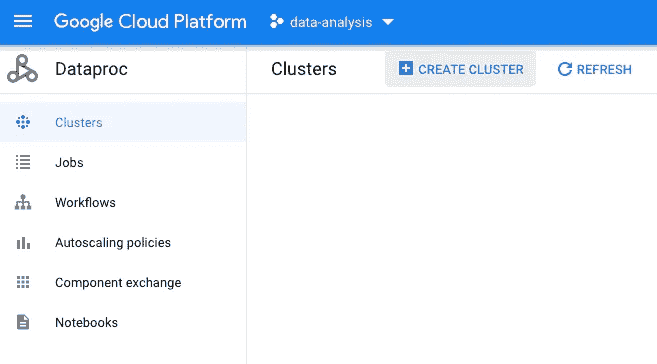
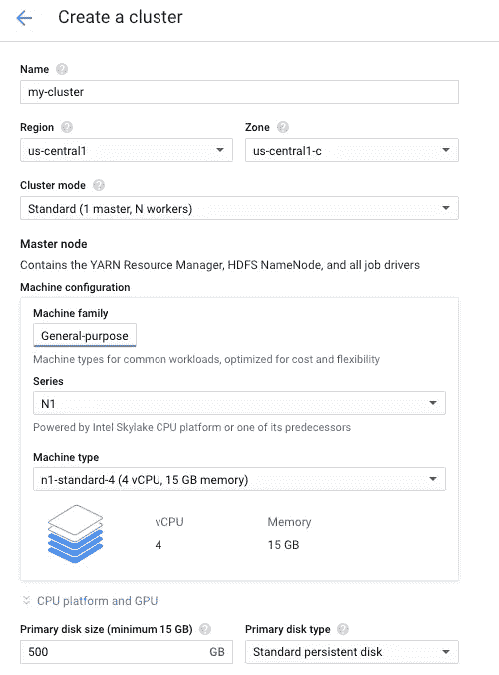
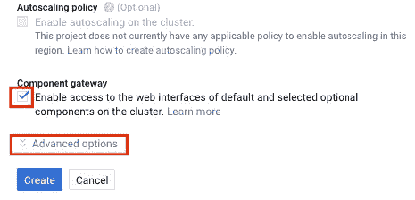
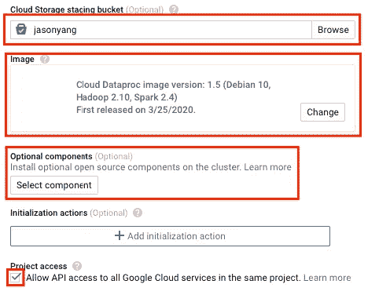
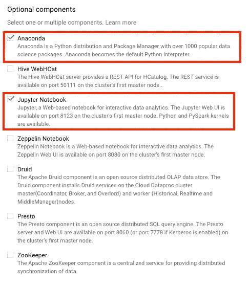
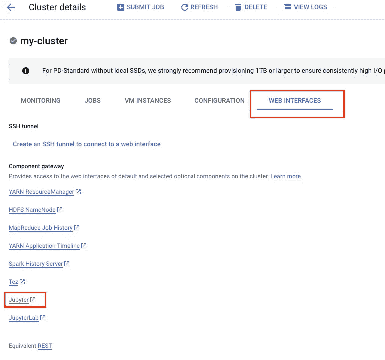
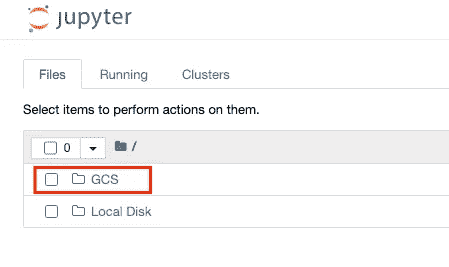
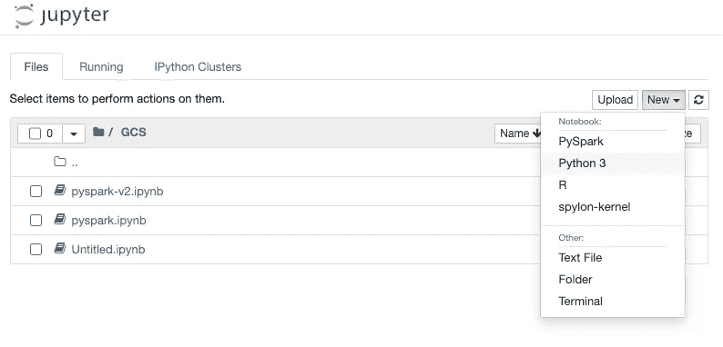
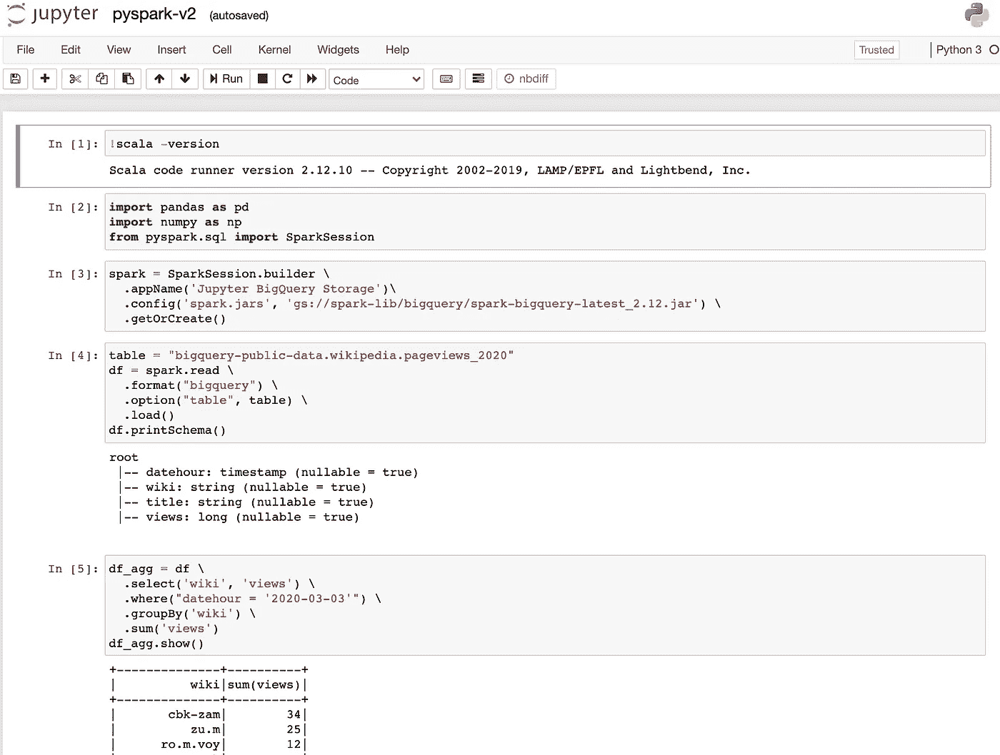

# 2020 年云上的 Jupyter + Spark 入门

> 原文：<https://towardsdatascience.com/getting-started-with-jupyter-spark-on-the-cloud-in-2020-7f584fba0f3c?source=collection_archive---------43----------------------->

## 轻松组装由大数据集群支持的笔记本电脑


迪伦·诺尔特在 [Unsplash](https://unsplash.com/s/photos/winning?utm_source=unsplash&utm_medium=referral&utm_content=creditCopyText) 上的照片

2020 年是利用 Jupyter 和 Spark 集群深入研究大数据的大好时机。所有三大云提供商(Amazon Web Services、Microsoft Azure 和 Google Cloud)都配置了托管服务来运行集群，并预装了 Jupyter 和 Spark。随着大数据的爆炸式增长和低准入门槛(成本和工作量)，了解如何使用机器集群解决大数据问题正成为当今数据科学就业市场的一项必备技能。

在本文中，我将向您展示如何在 Google Cloud Dataproc 上使用 Jupyter 构建 Spark 集群。我们将回顾:

1.  在 Dataproc 上配置 Spark 集群设置
2.  为 Jupyter 和 Anaconda 配置集群
3.  访问 Jupyter 笔记本

# 在 Dataproc 上配置 Spark 集群设置

Dataproc 是 Google Cloud 的托管服务，用于运行 Apache Spark 和 Apache Hadoop 集群。我们将使用 Dataproc 来创建和管理我们的 Spark 集群。在您的 Google 云平台用户控制台中，导航到 Dataproc 并点击“创建集群”。



您将进入“创建集群”页面，其中包含您的机器集群的设置。在本教程中，我们将对主节点和工作节点使用默认的机器类型 n1-standard-4。如果您想节省一些钱，我建议降级到 n1-standard-2，而不是 n1-standard-1，因为 1 vCPU 机器需要更长的时间来启动。



# 为 Jupyter 和 Anaconda 配置集群

这就是令人兴奋的地方。几年前，你必须编写一个自定义脚本来安装 Jupyter 和 Anaconda。今天，你可以通过点击几个按钮得到同样的结果。选中“组件网关”下的“启用对 web 界面的访问”并展开“高级选项”。



虽然是可选的，但是设置一个云存储分段存储桶。使用云存储桶可以将您的笔记本电脑保存在云中，并在您下次启动笔记本电脑时可用。

将机器的镜像设置为 1.5 (Debian 10、Hadoop 2.10、Spark 2.4)。根据我的经验，1.3 image 基于 Python 2，不能访问 Python 3 中开发的新工具。

这里最重要的部分是可选组件下的“选择组件”。下图显示了可用的选项。

最后，选中项目访问下的“允许 API 访问所有 Google 云服务”。这将允许您的集群访问其他 Google 云服务，如 BigQuery。



在可选组件中，我们看到了各种可用的组件。默认安装了 Spark(未列出)，我们将选中 Anaconda 和 Jupyter 笔记本，然后单击“Select”保存我们的选择。



回到“cluster settings”菜单，在启动集群之前，我们还有最后一个项目要设置。选中“计划删除”下的“按固定时间计划删除”。此选项确保您的群集在一段设定的时间后自行终止。Dataproc 根据集群保持运行的时间来计费。预设删除时间可以确保当我们忘记手动终止集群时，不会收到任何意外的账单。对于本教程，我们将删除时间设置为 2 小时。


# 访问 Jupyter 笔记本

就是这样！创建集群大约需要 3 到 10 分钟。一旦群集名称旁边的旋转图标变成绿点复选标记，请单击“web interfaces”选项卡和“Component gateway”下的“Jupyter”。如果 Jupyter 不可用，请确保您已按照上一节中的说明“启用对 web 界面的访问”并选择了可选组件。正如我们所看到的，我们在集群创建过程中选择的任何可选组件都将出现在 web interfaces 选项卡中。



迎接我们的是我们熟悉的 Jupyter 笔记本用户界面。点击“GCS”文件夹访问谷歌云存储桶。我们在该文件夹中上传或创建的任何文件都可以在我们之前在集群创建过程中设置的云桶中使用。



我们的笔记本电脑有 4 种不同的内核。他们都可以进入我们的星火星团。我喜欢使用“Python 3”笔记本，因为它可以访问与 Anaconda 和 PySpark 一起安装的所有数据科学包。



还有维奥拉。你现在有一个运行在 Spark 集群上的 Jupyter 笔记本了！我们可以用下面的代码检查笔记本，以确保所有内容都正确加载。



```
!scala -version import pandas as pd
import numpy as np
from pyspark.sql import SparkSessionspark = SparkSession.builder \
  .appName('Jupyter BigQuery Storage')\
  .config('spark.jars', 'gs://spark-lib/bigquery/spark-bigquery-latest_2.12.jar') \
  .getOrCreate()table = "bigquery-public-data.wikipedia.pageviews_2020"
df = spark.read \
  .format("bigquery") \
  .option("table", table) \
  .load()
df.printSchema()df_agg = df \
  .select('wiki', 'views') \
  .where("datehour = '2020-03-03'") \
  .groupBy('wiki') \
  .sum('views')
df_agg.show()
```

一旦你完成了你的分析，确保删除你的集群，以避免额外的费用！运行本教程中的集群 2 小时大约需要 1 美元。您可以使用[Google Cloud Pricing Calculator](https://cloud.google.com/products/calculator)并选择 Dataproc 服务来估算您的集群的成本。

# 结束语

随着大数据的兴起，对于数据科学家来说，学习如何在云上使用 Jupyter + Spark 非常重要。这样，我们可以水平扩展我们的计算资源，而不仅仅是垂直扩展。在本教程中，我们在 Google Cloud Dataproc 上构建了一个加载了 Jupyter 和 Anaconda 的 Spark 集群。现在，让我们开始处理大数据吧！

不知道去哪里找大数据练习？查看我以前的一篇文章，关于谷歌公共数据集上可用的万亿字节数据集:[用谷歌公共数据集升级](/level-up-with-googles-public-datasets-5ffce0893ea0)。

[](/level-up-with-googles-public-datasets-5ffce0893ea0) [## 用谷歌的公共数据集升级

### 将 Jupyter 笔记本电脑连接到万亿字节的数据

towardsdatascience.com](/level-up-with-googles-public-datasets-5ffce0893ea0)