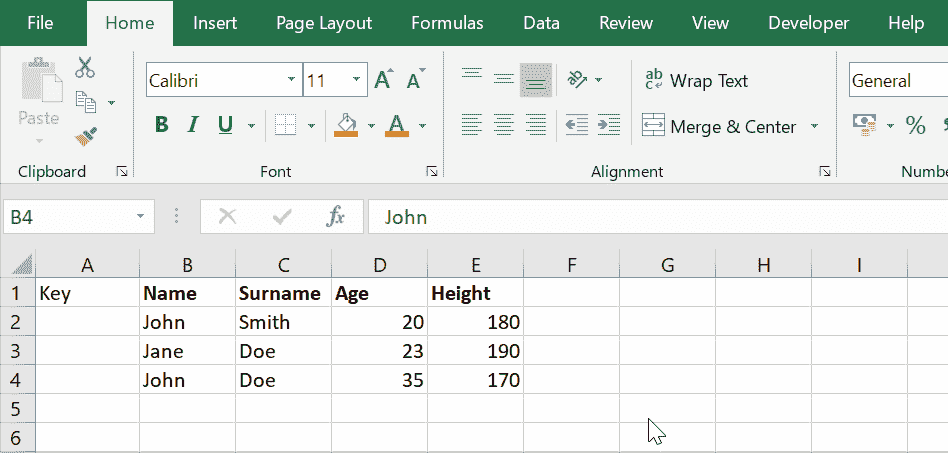
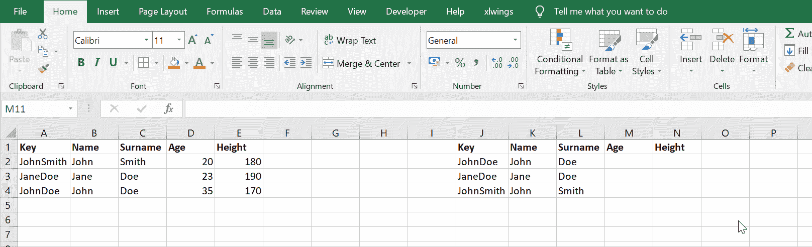
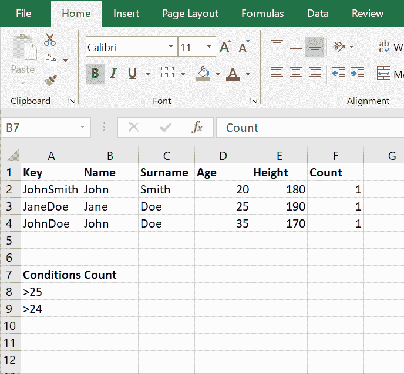
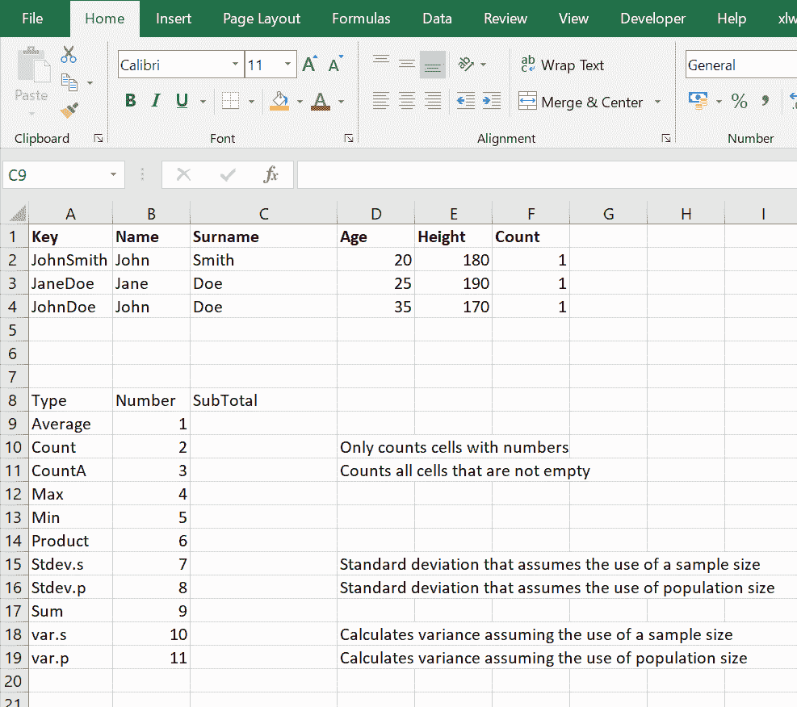
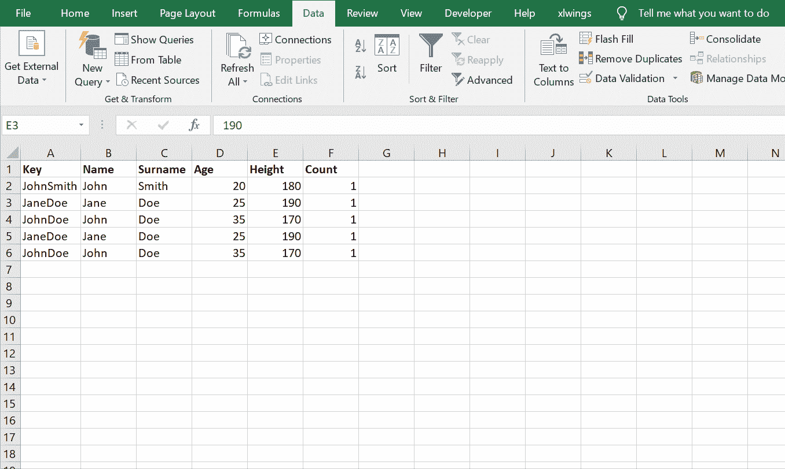
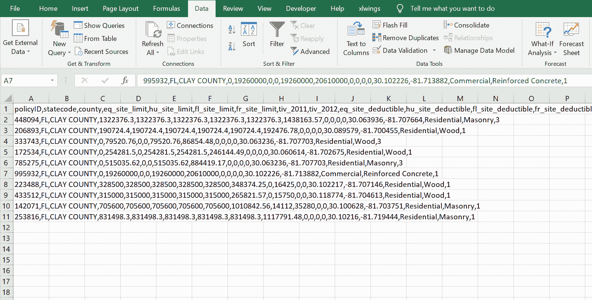
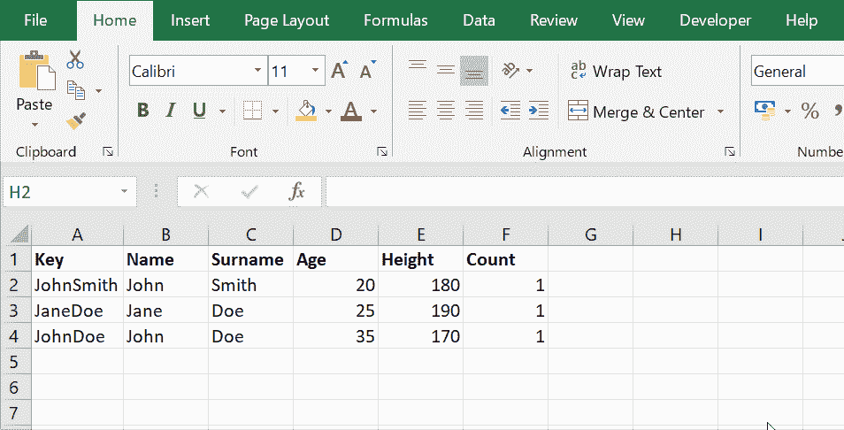
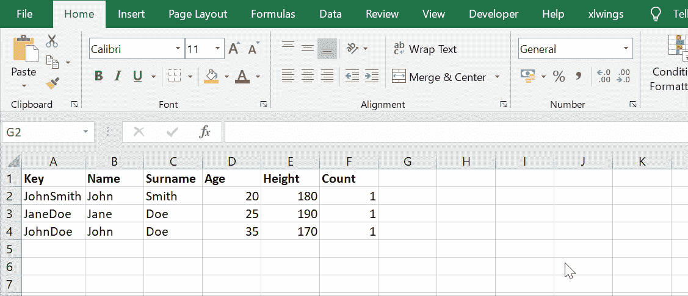
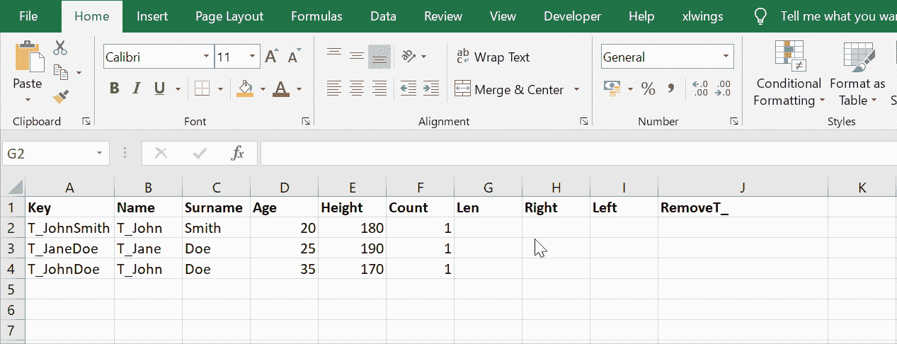

# 开始使用 Microsoft Excel

> 原文：<https://towardsdatascience.com/getting-started-with-microsoft-excel-df3f049151ef?source=collection_archive---------49----------------------->

## 帮助您开始 Excel 之旅的 10 大命令

贾里德·布拉舍在 [Unsplash](https://unsplash.com?utm_source=medium&utm_medium=referral) 上拍摄的照片

对于门外汉来说，学习微软 Excel 的一些*【高级基础】*功能会对他们的生活产生巨大的影响。它可以帮助节省无数小时的手动工作，甚至可以自动化 It 的某些方面。根据行业和办公室的构成，它甚至可以帮助你成为办公室的电脑专家！

Excel 很强大，它做不到的事情很少。在投资银行工作，我每天都要使用 Excel，我很惊讶 Excel 的新毕业生对此知之甚少。我也不是在谈论 VBA；我说的是古老的内置公式。不过，不用担心，因为很快就能赶上。

在这篇博文中，我们将讨论我希望每个人都知道的关于 Excel 的 10 件事！

# 如何使用 Excel 公式

您需要知道的第一件事是，Excel 希望所有公式都以等号开头。单击任意空白单元格并键入“=”，您会注意到一些内置函数已经可以使用了。

当你读完这篇博客的时候，你会觉得把它们都尝试出来很舒服！

# 用“&”将单元格连接在一起

我们今天要学的第一件事是“&”符号。它用于将细胞连接在一起。你问我们为什么要这么做？我发现最常见的用法是创建唯一的数据键。如果一个数据集的主键中有多个字段，您可能希望用一个属性来表示它，以使数据集之间的连接和查找更容易。

让我们在实践中看看:

作者图片

# 使用 VLOOKUP 查找数据

迟早，当您需要根据一组数据中的一个值从另一组数据中检索信息时，这种需求肯定会出现。例如，假设您拥有所有相关信息，您希望能够根据姓名返回一个人的身高。

最简单的方法是使用 VLOOKUP。我们首先需要选择我们希望在查找中使用的值，然后是我们感兴趣的范围(记住查找将发生在第一列)，然后是我们希望返回数据的列，然后是我们希望精确匹配还是近似匹配。

这里有一个例子，你可以清楚地看到发生了什么:

作者图片

你可能已经注意到 VLOOKUP 只支持垂直查找。如果你想进行横向查找，你可以使用 HLOOKUP。

# 条件求和:SUMIF

另一个内置函数可能比您想象的更有用，它允许您有条件地对值求和。也就是说，根据某些标准，我们可以指定是否要将这些值包含在总数中。

这通过一个例子最容易理解:

作者图片

# 带小计的算术序列

SUBTOTAL 是一个漂亮的小函数，它使您能够对许多字段执行算术运算。Average、count、max、min、sum、stdev 等都是 SUBTOTAL 可以支持的函数。

这个函数的另一个秘密之处是它只考虑可见的值。换句话说，当您筛选结果集时(ctrl + shift + L，and filter)，分类汇总将只考虑在定义的范围内可见的值。

作者图片

# 删除重复项

虽然这不是一个内置的函数，但却是一个非常有用的功能。有时您只是想知道哪里有重复的数据，或者您只是想删除它们。这样做的过程不仅简单，而且非常实用。它的 UI 控件使您能够快速轻松地定义组合键。

您可以通过按 alt、A、m 快速调用此功能，或者如果您想使用鼠标，您可以通过典型的 Excel 控件调用此功能。

作者图片

# 文字分列

顾名思义，该功能使您能够将文本分成几列。当您使用逗号分隔文件(CSV)或其他分隔符时，这可能会很有用。

但是，根据您正在处理的数据类型，您可以使用该控件来发挥创造力。当我在 Excel 中复制粘贴一些内容，并且数字表示为文本时，我经常发现自己在使用这个控件(您可以直观地看出，因为单元格中的值是左对齐的)。这将产生任何查找等问题。因此，快速使用这个带有伪分隔符的控件会重新格式化所有内容(快捷键:alt，a，e)。

作者图片

# 数据透视表

如果有一件事你带走并记住了，那就是这件事。毫无疑问，数据透视表可能是您可以了解的关于 Excel 的最重要和最有用的东西。它使您能够以各种方式对数据进行切片和切块，以便您可以对您的数据进行总结并获得深刻的见解。

您可以选择如何根据列、行、要包含的数据以及要在聚合中执行的操作来显示数据。下面的例子肯定会帮助你更好地理解(快捷键:alt，n，v)数据透视表，但是我鼓励你深入研究并亲自尝试。没有比亲自尝试更好的学习方法了。

作者图片

# 学习在 Excel 中应用 If-Then-Else 语句

在分析数据时，有时你需要检查某些条件是否成立。为此，我们可以使用内置的“if”函数。该函数接受三个输入。条件，条件为真时的结果，条件为假时的结果。

根据语句的复杂程度，可以将多个 if 语句组合在一起。让我们进一步探讨这两种可能性。

简单的例子:

作者图片

或者具有更复杂的逻辑:

作者图片

# 用于数据分析的字符串操作，包括左、右、左

最后，我们要学习的最后一个 Excel 函数(实际上是最后三个)与尝试操作有关。Len 返回一个字符串的字符数，当它与 left 和 right 结合使用时最有用。

左和右接收两个输入。一个字符串和要返回的字符数，从左或右开始计数。然而，有时你只是想排除一个尾随或开始的字符集，这就是 len 出现的地方。

作者图片

# 结论

有了这些知识，您现在就具备了继续扩展和积累 Excel 知识所需的一切。我强烈推荐这是一项值得的自我投资。无论招聘广告是否要求，它都是大多数工作中必备的技能。

我希望这能对你有所帮助，并激励你继续学习！