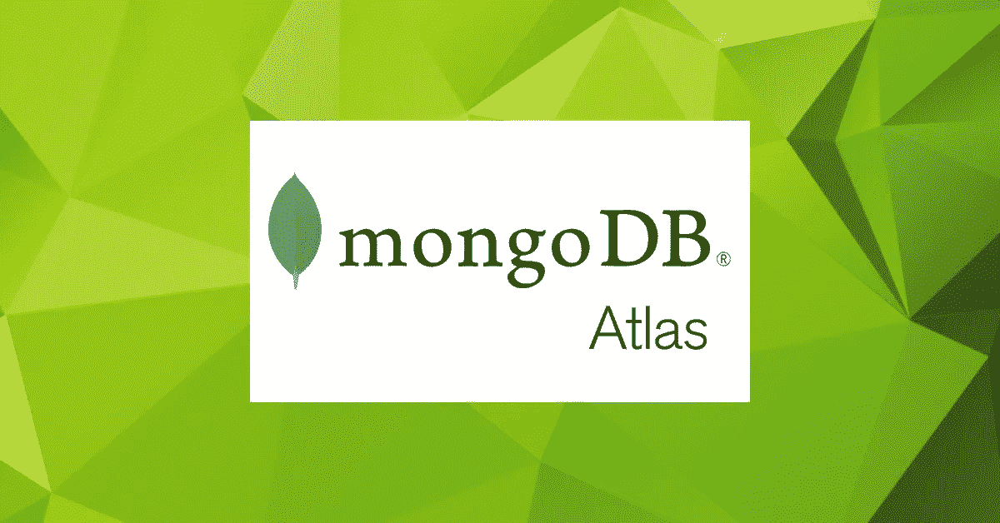
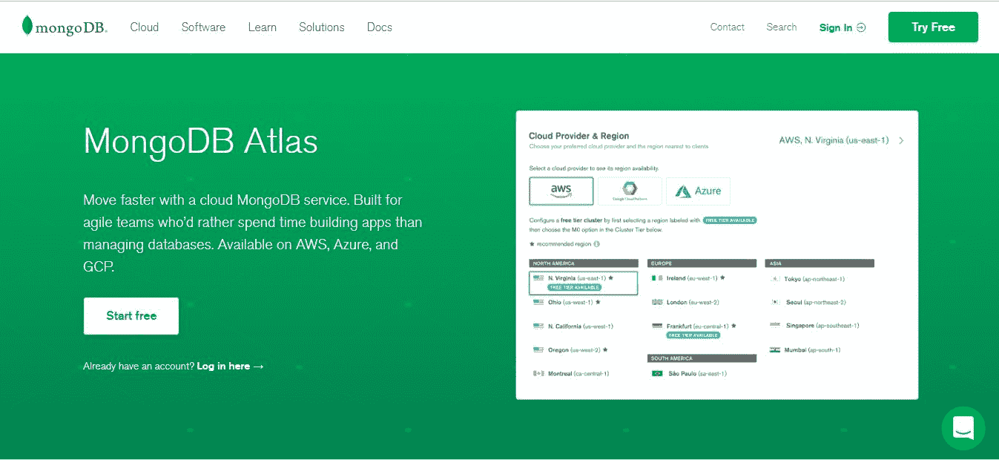
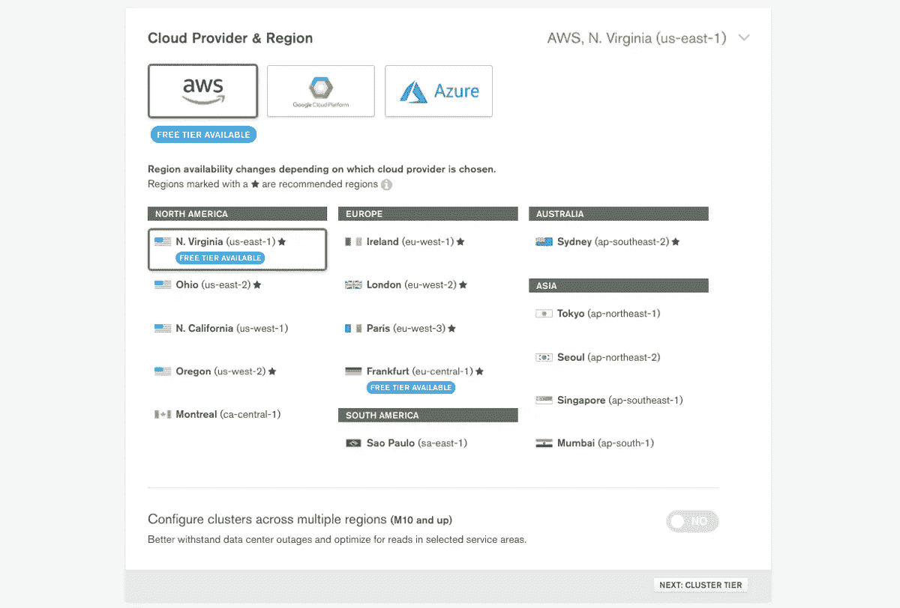
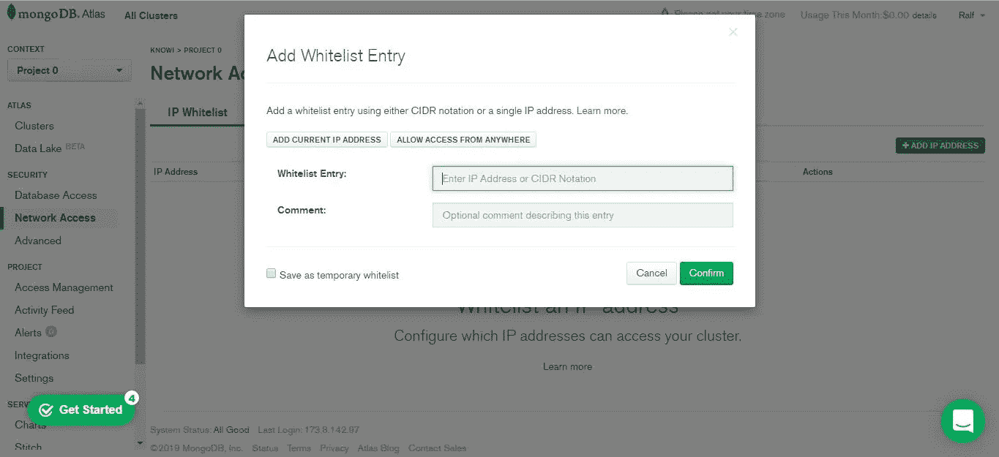
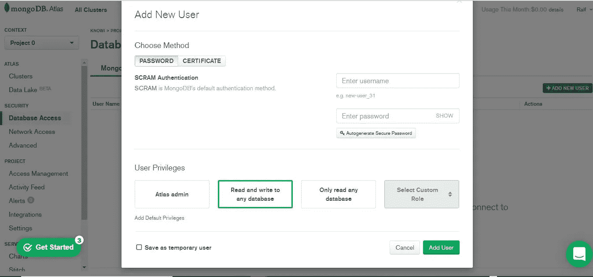
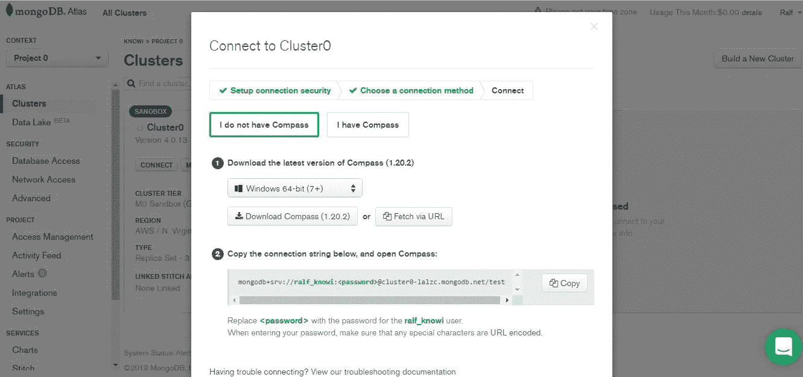
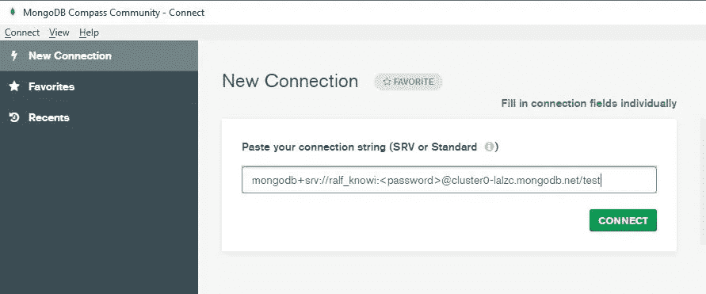
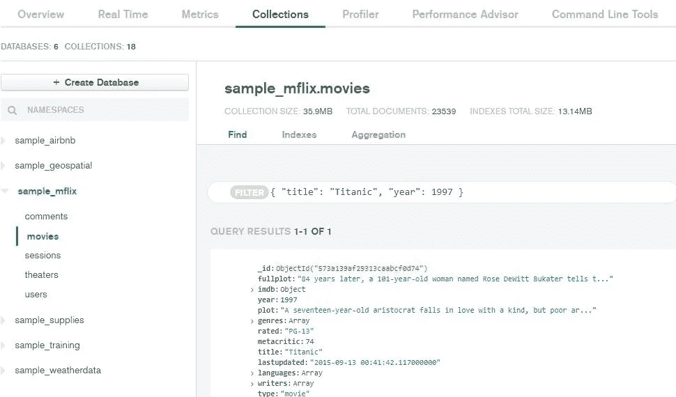

# MongoDB Atlas 入门:概述和教程

> 原文：<https://towardsdatascience.com/getting-started-with-mongodb-atlas-overview-and-tutorial-7a1d58222521?source=collection_archive---------22----------------------->

# 介绍

## 数据库即服务

近年来，数据库行业经历了许多变化，导致越来越多的人转向数据库即服务(DBaas)模式，而不是本地基础架构。数据库是大多数业务应用的核心，基于云的 DBaaS 服务为用户提供了一个灵活、可扩展的按需平台，无需设置昂贵的物理硬件、安装软件或配置性能。此外，公司正在分析的数据也在发生变化。用户和开发人员现在寻找适应性更强的数据库，以允许他们访问和处理非结构化数据。随之而来的是对按使用付费模式的内存和 NoSQL 数据库的更大需求。

MongoDB，开源数据库背后的公司，试图用 Atlas 来满足这一需求，这是它自己的 DBaaS 产品，为用户提供托管数据库服务。该服务提供按需付费的价格，并允许用户在他们选择的云服务提供商(AWS、Azure 和 GCP)上部署。Atlas 对 MongoDB 来说是成功的，截至 2019 年，它占其总收入的 35%，拥有超过 12，000 名客户。

在这篇文章中，我们将提供一个关于 [MongoDB Atlas](https://www.mongodb.com/cloud/atlas) 的概述，给出一个关于开始使用该平台的教程，并从首次用户的角度分享我们的一般要点。

# MongoDB 地图集

## 概观

MongoDB Atlas 是一个基于云的开源 NoSQL 数据库，它使用带有动态模式的 JSON 文档，作为表数据库的替代方案。Atlas 提供了 MongoDB 的所有功能，同时自动执行数据库管理任务，如数据库配置、基础设施供应、补丁、扩展事件、备份等，让开发人员能够专注于对他们最重要的事情。

MongoDB Atlas 还提供了灵活性和可伸缩性的双重好处。动态模式允许用户在不修改数据的情况下更改其模式，提供了灵活性。而其“自动分片”功能允许用户在一系列实例中进行纵向或横向扩展，应用程序不会停机。

## 定价

自由层

MongoDB 提供了一个[免费层](https://www.mongodb.com/cloud/atlas?jmp=partners_knowi)，用户可以用来学习、构建原型和早期部署。这个名为 M0 沙盒的免费版本被限制在 512MB 的存储空间，共享 vCPU 和 RAM，100 个最大连接数，以及一个 M0 集群的限制。

付费层级

Atlas [针对单区域集群的付费计划](https://www.mongodb.com/cloud/atlas/pricing)起价为 0.08 美元/小时，预计费用为 56.94 美元/月。

对于专用集群，MongoDB Atlas 根据您的使用量按小时计费。该速率取决于许多因素，最重要的是您使用的服务器的大小和数量。例如，根据 MongoDB，一个 m40 的 AWS 3 节点副本集使用附带的 80GB 标准块存储全天候运行一个月，成本约为 947 美元。

# MongoDB Atlas 入门

MongoDB Atlas 使入门变得容易，注册免费层只需几秒钟。整个过程使用动态 web 界面，引导您完成各种部署选项。它简单、直观，不需要专业知识。下面，我们将详细介绍使用 MongoDB Atlas 开始运行的步骤。

## 创建 Atlas 帐户

首先，你需要在 [MongoDB Atlas 登陆页面](https://www.mongodb.com/cloud/atlas?jmp=partners_knowi)上注册一个账户。注册表只需要你提供基本信息，如姓名，电子邮件，公司和为您创建一个密码。不需要信用卡信息。注册后，Atlas 会自动创建一个默认的组织和项目，您可以在其中部署您的第一个集群。

MongoDB Atlas 登录页面(来源——mongodb.com)

## 部署自由层集群

登录后，系统会提示您选择云提供商和地区来构建您的第一个集群。Atlas 与三大主要云提供商 Amazon AWS、Google Cloud 和 Microsoft Azure 合作。根据您的选择，您可以选择首选数据中心的位置。免费层和区域被标记为免费沙盒版本，创建一个新的集群只需要几分钟。

选择 MongoDB Atlas 集群和云提供商(来源——mongodb.com)

## 将您的连接 IP 地址列入白名单

然后会提示您设置您的互联网协议(IP)并将您的 IP 地址列入白名单。这一点很重要，因为它确保只有您可以从您的 IP 地址访问云中的集群。您还可以选择允许从任何地方访问，尽管这意味着任何人都可以通过网络访问您的集群。如果您的密码和其他凭据泄露，这将是一个潜在的安全风险。

MongoDB Atlas 白名单 IP 地址提示(来源——mongodb.com)

## 为集群创建一个 MongoDB 用户

接下来，您需要创建一个 MongoDB 用户来访问您的集群。只需输入新的用户名和密码。然后，您可以选择用户权限，包括管理员权限、读/写权限或只读权限。

创建一个 MongoDB Atlas 用户提示(来源——mongodb.com)

## 连接到您的群集

现在，您已经创建了一个用户，是时候连接到您的集群了。系统会提示您选择一种连接方法，要么使用您自己的应用程序 MongoShell 连接，要么使用 MongoDB 的 GUI MongoDB Compass 连接。在本例中，我们将使用 MongoDB Compass 进行连接。

连接到 MongoDB Atlas 集群提示(来源-mongodb.com)

下载并打开 MongoDB Compass 后，系统会提示您从剪贴板粘贴一个连接字符串，然后连接到集群。

将连接字符串粘贴到 MongoDB Atlas 集群(来源—mongodb.com)

## 在集群中插入和查看数据

现在，您已经连接到集群，可以使用数据资源管理器在集群上插入示例数据并与之交互。

Data Explorer 允许您在集群中查看、创建和删除数据库、集合和索引。此外，您可以插入、编辑和删除文档，以及创建和运行聚合管道来处理数据。请注意，Data Explorer 是 Atlas 中的一个特性，它允许您访问和管理集群中的数据，这与 MongoDB Compass 不同，后者是一个用于与 MongoDB 数据库交互的独立 GUI。

首先，您需要将样本数据集加载到集群中。加载后，您可以通过单击 Collections 按钮(或使用 Mongo Shell)在数据浏览器中访问它。数据导入大约需要 5 分钟，操作完成后，您将在集群中看到五个数据库:

*   样本 _airbnb
*   样本 _ 地理空间
*   sample_mflix
*   样本 _ 培训
*   样本 _ 天气数据

使用数据浏览器查看和修改您的 MongoDB Atlas 集群中的数据(来源—mongodb.com)

就这样，我们完成了注册 Atlas 帐户的整个过程，部署并连接到您的第一个 Atlas 集群，用样本数据填充您的集群，并使用 Atlas Data Explorer 与数据进行交互。如你所见，开始使用 Atlas 非常简单明了。

# 摘要

我们发现 MongoDB Atlas 易于使用和适应。注册帐户、部署第一个集群以及连接到集群的过程是无缝的，这在很大程度上要归功于其直观的界面。特别是，我们喜欢 Atlas 包含样本数据，我们可以将这些数据加载到集群中，然后利用 Data Explorer GUI 与数据进行交互。对于更高级的数据分析和可视化，您可以选择使用标准 BI 工具，如 [Tableau](https://www.tableau.com/) 或本地解决方案，如 MongoDB Charts 和 [Knowi](https://www.knowi.com/) 。

总的来说，它简单的用户界面，以及它的一系列功能，包括自动分片的可扩展性，用于操作任务的内置自动化机制，以及即使对于最苛刻的工作负载也能提供高吞吐量和低延迟的出色性能，难怪有经验的开发人员和新用户都喜欢 MongoDB Atlas。

# 外卖食品

*   基于云的 DBaaS 具有灵活性、可扩展性和按需性，无需昂贵的物理设置
*   MongoDB Atlas 是 MongoDB 自己的基于云、开源、基于 NoSQL 的完全托管 DBaaS 产品
*   Atlas 自动执行数据库管理任务，如配置、基础设施供应、补丁、扩展事件、备份等
*   Atlas 提供了动态模式的灵活性，而自动分片特性使得跨实例扩展变得容易
*   一个直观的界面使开始使用 Atlas 变得容易。部署和连接第一个集群只需几分钟
*   数据资源管理器是一项非常有用的功能，它允许您以可视化方式与集群中的数据进行交互
*   其简单的用户界面、任务自动化、灵活性、内置复制和按需定价使 MongoDB Atlas 成为开发人员的最爱