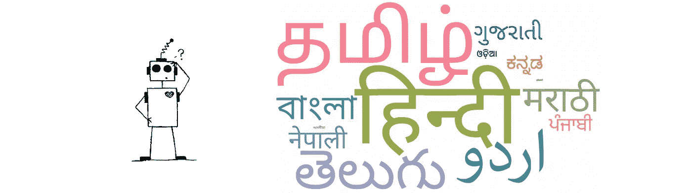
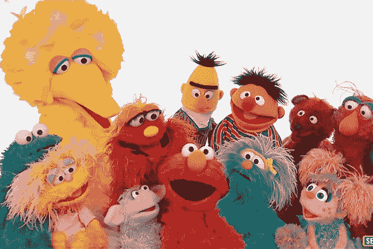
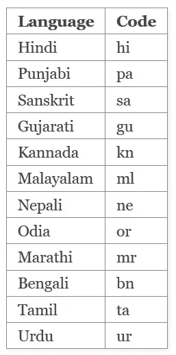
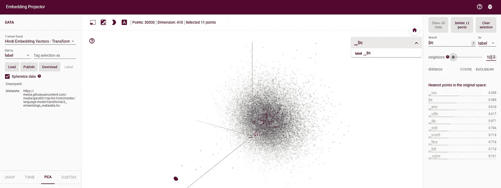

# 印度语 NLP 入门

> 原文：<https://towardsdatascience.com/getting-started-with-nlp-for-indic-languages-a701ed62b6f8?source=collection_archive---------16----------------------->



想超越英语，用自然语言处理(NLP)的真正力量为世界第二人口大国服务？每个人都知道印度是一个非常多元化的国家，是多种语言的家园，但是你知道印度说 780 种语言吗？说到 NLP，是时候超越英语了。这篇文章是写给那些对 NLP 有所了解，并想开始将它用于印度语言的人的。

## **语言模型**

在进入主题之前，我们将浏览一下 NLP 中的一些基本概念和最近的成就。自然语言处理帮助计算机理解人类语言。文本分类、信息抽取、语义分析、问题回答、文本摘要、机器翻译和对话代理是 NLP 的一些应用。

为了让计算机理解人类语言，我们最初需要用数字形式表示单词。然后，机器学习模型可以利用数字表示的单词来完成任何 NLP 任务。传统上，像 **One Hot Encoding** ， **TF-IDF 表示法**这样的方法被用来将文本描述为数字。但是传统的方法由于不能捕捉词义而导致稀疏表示。

然后，神经单词嵌入通过解决传统方法中的问题来拯救。 **Word2Vec** 和 **GloVe** 是两种最常用的单词嵌入。这些方法提出了密集表示法，意思相似的单词会有相似的表示法。这种方法的一个显著缺点是**单词被认为只有一个意思**。但是我们知道，一个词可以有多种含义，这取决于它的使用环境。



语言模型——艾的布偶帝国[3]

NLP 通过现代语言模型家族(AI 的木偶帝国)实现了重大飞跃。单词嵌入不再独立于上下文。根据使用的上下文，同一个单词可以有多个数字表示。**伯特**、**埃尔莫**、**乌尔姆菲特**、 **GPT-2** 是目前比较流行的一些语言模型。最新一代这么好，也有人认为很危险[3]。这些语言模型撰写的新闻甚至被读者评为与《纽约时报》一样可信。

要了解更多关于语言模型的知识，我强烈推荐阅读[2]。

## 印度语的单词嵌入

现在，我们将通过获取印度语的单词嵌入来深入探讨这个主题。用数字表示单词在任何 NLP 任务中都有作用。我们将使用**印度语自然语言工具包(iNLTK)** 库。iNLTK 是一个构建在 PyTorch 之上的开源深度学习库，旨在为应用程序开发人员可能需要的印度语的各种 NLP 任务提供开箱即用的支持。ULMFiT 语言模型用于构建 iNLTK [6]。iNLTK 于 2019 年 5 月在 GitHub 上成为趋势，并在 PyPi 上获得了 23，000+的下载量[5]。

我们在这里使用 iNLTK 是因为它简单并且支持许多印度语言。iNLTK 目前支持以下 **12 种印度语**。请按照此[链接](https://inltk.readthedocs.io/en/latest/api_docs.html)安装 iNLTK。



iNLTK 支持的语言[5]

使用 iNLTK，我们可以快速获得用印度语编写的句子的嵌入向量。下面是一个例子，展示了我们如何获得用印地语写的句子的嵌入向量。给定的句子将被分解成记号，每个记号将用一个(400×1)向量来表示。令牌可以是一个单词，也可以是一个子单词。因为记号可以是子词，所以我们也可以为罕见的词得到一个有意义的向量表示。

```
# Example 1 - Get Embedding Vectorsfrom inltk.inltk import setup
from inltk.inltk import tokenize
from inltk.inltk import get_embedding_vectors'''
Note: You need to run setup('<code-of-language>') when you use a language for the FIRST TIME ONLY.
This will download all the necessary models required to do inference for that language.
'''
setup('hi')example_sent = "बहुत समय से मिले नहीं"# Tokenize the sentence
example_sent_tokens = tokenize(example_sent,'hi')# Get the embedding vector for each token
example_sent_vectors = get_embedding_vectors(example_sent, 'hi')print("Tokens:", example_sent_tokens)
print("Number of vectors:", len(example_sent_vectors))
print("Shape of each vector:", len(example_sent_vectors[0]))
```

> 输出:
> 
> 代币:['▁बहुत'，'▁समय'，'▁से'，'▁मिले'，'▁नहीं ']
> 向量个数:5
> 每个向量的形状:400

既然我们有了单词 embeddings，许多人可能会想知道这些数字表示有多好？相似的令牌有相似的描述吗？我们可以使用为每种语言提供的[可视化](https://inltk.readthedocs.io/en/latest/api_docs.html#trained-models)来获得所有这些问题的答案。例如，如下图所示，所有与'प्रेम'(爱情)相关的象征物都与爱情、亲情、婚礼等密切相关。



更接近'प्रेम'的标志(爱情)

## 印度语的多个 NLP 任务

正如我前面所说，用数字表示的自然语言可以被机器学习模型用来完成许多 NLP 任务。除此之外，我们可以立即使用 iNLTK 完成大量的 NLP 任务。例如，我们可以使用 iNLTK 来预测接下来的 n 个单词，获得相似的句子，获得句子编码，识别语言，等等。

在下面的例子中，我们将使用 iNLTK 来预测接下来的 n 个单词，并得到相似的句子。对于类似于泰米尔语的*“自从我们相遇以来已经过了很长时间”*的输入，我们得到对下一个‘n’个单词的预测为*“并且，由于这个”*。相似句子任务的结果也令人印象深刻。

```
# Example 2 - Predict Next 'n' Words, Get Similar Sentencesfrom inltk.inltk import setup
from inltk.inltk import predict_next_words
from inltk.inltk import get_similar_sentences'''
Note: You need to run setup('<code-of-language>') when you use a language for the FIRST TIME ONLY.
This will download all the necessary models required to do inference for that language.
'''
setup('ta')example_sent = "உங்களைப் பார்த்து நிறைய நாட்கள் ஆகிவிட்டது"# Predict next 'n' tokens
n = 5
pred_sent = predict_next_words(example_sent, n, 'ta')# Get 'n' similar sentence
n = 2
simi_sent = get_similar_sentences(example_sent, n, 'ta')print("Predicted Words:", pred_sent)
print("Similar Sentences:", simi_sent)
```

> 输出:
> 
> 预测词:உங்களைப்பார்த்துநிறையநாட்கள்ஆகிவிட்டது.மேலும்，இதற்கு காரணமாக
> 类似句子:['உங்களைத்பார்த்துநாட்கள்ஆகிவிட்டது'，'உங்களைப்பார்த்துஏராளமானநாட்கள்ஆகிவிட்டது']

就像我说的，在开始的时候，是时候超越英语，用 NLP 的真正力量为大家服务了。最近的许多研究都集中在多语言自然语言处理上。iNLTK 就是这样一个专注于印度语的库。现在，您可以通过添加对新语言的支持、改进现有模型和添加新功能来为 iNLTK 做出贡献。除了 iNLTK，我还会推荐多语模型[7]，Indic NLP [8]。别忘了你刚刚遇到的一切都只是冰山一角。在结束这篇文章之前，我想补充几句话来表达 iNLTK 的创造者的愿景。

> 我一直希望有类似的东西存在，这将使 NLP 更容易理解，并使其对非英语母语者的好处民主化。iNLTK 是有机增长的，现在，由于它被广泛认可，我认为还有很多事情要做。我对 iNLTK 的愿景是，它应该成为任何使用低资源语言的人的首选库。— Gaurav Arora，iNLTK 的创造者。

## **参考文献**

[1][http://blogs . Reuters . com/India/2013/09/07/India-speaks-780-languages-220-lost-in-last-50-earth-survey/](http://blogs.reuters.com/india/2013/09/07/india-speaks-780-languages-220-lost-in-last-50-years-survey/)
【2】[https://towards data science . com/from-word-embeddings-to-pre-trained-language-models-a-new-age-in-NLP-part-1-7 ed 0 c 7 F3 DFC 5](/from-word-embeddings-to-pretrained-language-models-a-new-age-in-nlp-part-1-7ed0c7f3dfc5)
【3