# OpenCV 入门

> 原文：<https://towardsdatascience.com/getting-started-with-opencv-249e86bd4293?source=collection_archive---------14----------------------->

## 使用 Python 实现计算机视觉的第一步

不久前，我为一个大学项目训练了一个物体检测模型，但老实说，除了需要许多红牛和漫漫长夜观看我的模型训练之外，我不太记得它了。

我最近对这些话题重新产生了一些兴趣，我决定重新开始，重新学习，但这次我做笔记，分享我的学习成果。

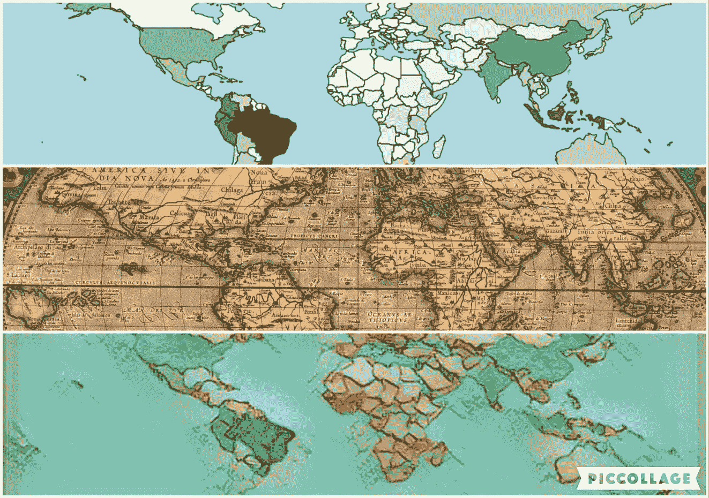

与[reiinakano.com/arbitrary-image-stylization-tfjs](https://reiinakano.com/arbitrary-image-stylization-tfjs/)一起建造

*——我想知道是否有一天我们能够使用样式转移将样式从一个数据复制到另一个数据，而不损害其完整性。*

## OpenCV

OpenCV 是一个开源库，最初由英特尔开发，它充满了支持计算机视觉和机器学习的便捷方法和功能。

在本文中，我将尝试学习如何阅读图像，在 Jupyter 笔记本中显示图像，以及如何检查和更改它的一些属性。

```
import cv2
import numpy as np
import matplotlib.pyplot as plt
```

让我们从。imread 加载图片，然后我们可以使用。imshow 在新窗口中显示它。

```
image = cv2.imread('img.jpg')
cv2.imshow('Some title', image)cv2.waitKey(0)
cv2.destroyAllWindows()
```

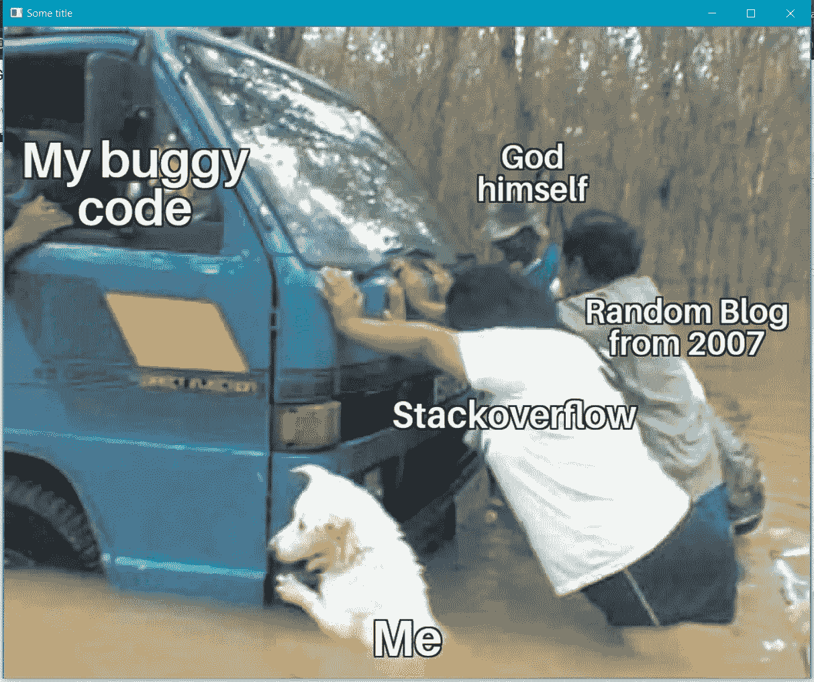

[图片来自/u/niketagl](https://www.reddit.com/r/ProgrammerHumor/comments/gy66sa/it_aint_much_but_its_honest_work/?utm_source=share&utm_medium=web2x)

方法。等等还有。销毁所有窗口对于运行代码而不崩溃是必不可少的。第一个命令将告诉 Jupyter 继续运行该程序块，直到某个键被按下，第二个命令将在最后关闭窗口。

我们也可以尝试用 Matplotlib 显示图像。imshow 这样，它将显示在内联，而不是在一个新的窗口中。

```
image = cv2.imread('img.jpg')
plt.imshow(image)
```

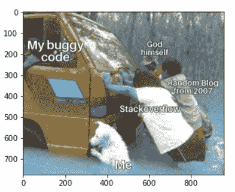

Matplotlib 显示 BGR 图像

呃，好吧。这看起来很奇怪。颜色全乱了。

OpenCV 以 Numpy 数组的形式加载图像，这些数组有三维的红色、绿色和蓝色。维度通常被称为通道，它们保存从 0 到 255 的值，代表每个像素的颜色强度。

```
>>> print(type(image))
>>> print(image.shape)<class 'numpy.ndarray'>
(776, 960, 3)
```

这意味着它是 RGB，对吗？不尽然。这是 BGR，这是同样的事情，但在不同的顺序。

Matplotlib 使用 RGB，这就是为什么我们的图片看起来很奇怪。这不是问题，因为 OpenCV 有一些非常方便的方法来转换颜色。

```
image = cv2.imread('img.jpg')
image = cv2.cvtColor(image, cv2.COLOR_BGR2RGB)plt.imshow(image)
```

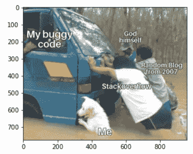

显示 RGB 图像的 Matplotlib。

太酷了，我们用 OpenCV 读取并显示了我们的图像，并且看了一眼如何用 Matplolib 将 GBR 颜色转换成 RGB 来显示它们。

OpenCV 可以处理其他颜色格式，比如 HSV、CMYK 等等。

## 颜色；色彩；色调

因为我们会重复很多次，所以让我们创建一个用 Matplotlib 绘图的方法。我们可以设置绘图的大小，并删除轴，使它更好。

```
def show(img):
    fig, ax = plt.subplots(1, figsize=(12,8))
    ax.axis('off')   
    plt.imshow(img, cmap='Greys')
```

注意，我还在。im 显示为“灰色”；当我们绘制 RGB 图像时，该参数将被忽略，但当我们稍后绘制数组的各个维度时，该参数将会很有帮助。现在，让我们试试我们的方法。

```
image = cv2.imread('img2.jpeg')
image = cv2.cvtColor(image, cv2.COLOR_BGR2RGB)show(image)
```

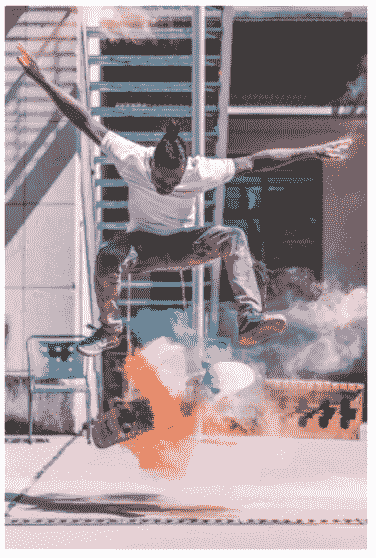

[pix bay 的图片](https://www.pexels.com/photo/action-adult-balance-balancing-415176/)

好了，现在让我们试着把它转换成灰度，然后再转换成 RGB。

```
image = cv2.imread('img2.jpeg')gray = cv2.cvtColor(image, cv2.COLOR_BGR2GRAY)
image = cv2.cvtColor(gray, cv2.COLOR_GRAY2RGB)show(image)
```

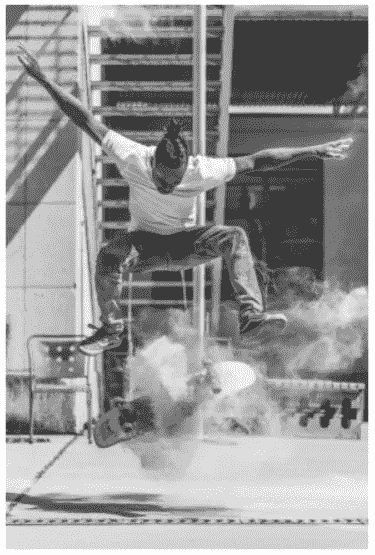

灰度等级

我们可以利用。分割得到单独的颜色数组，然后用. merge 将图片重新组合在一起。这对于修改、检查和过滤我们数组的一个维度是很实用的。

例如，我们可以将数组乘以零来移除它；

```
img = cv2.imread('img2.jpeg')B, G, R = cv2.split(img) 
img = cv2.merge([B*0, G, R*0])img = cv2.cvtColor(img, cv2.COLOR_BGR2RGB)
show(img)
```

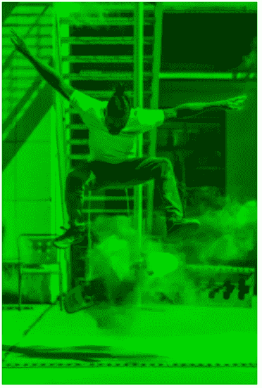

只有绿色。

我们可以增加或减少颜色的强度，或者用相同的形状建立一个新的 Numpy 数组来替换它，或者你能想到的任何事情。

```
img = cv2.merge([np.ones_like(B)*255, G, R])img = cv2.cvtColor(img, cv2.COLOR_BGR2RGB)
show(img)
```

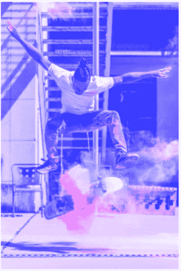

忧郁增加。

分割和合并的相同概念可以应用于其他格式，例如 HSV 和 HSL。

```
img = cv2.imread('img2.jpeg')
img = cv2.cvtColor(img, cv2.COLOR_BGR2HSV)H, S, V = cv2.split(img)

img = cv2.merge([np.ones_like(H)*30, S+10, V-20])img = cv2.cvtColor(img, cv2.COLOR_HSV2RGB)
show(img)
```


黄色色调，较高的饱和度，较低的值。

**HSV** :色相，饱和度，和值。

这种格式对于过滤颜色很方便，因为它与色调一起工作——这意味着，我们可以使用角度范围，而不是必须找出红色、绿色和蓝色之间的组合范围。

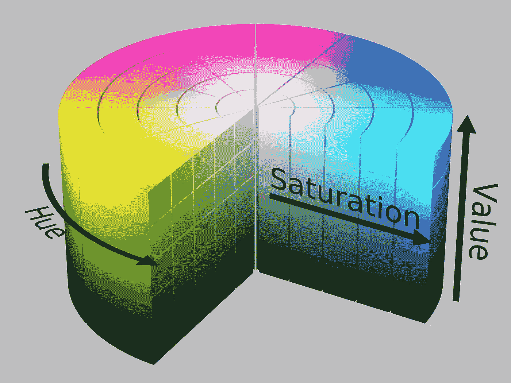

[维基百科](https://upload.wikimedia.org/wikipedia/commons/3/33/HSV_color_solid_cylinder_saturation_gray.png)

我们可以用 Numpy 定义 HSV 的上下边界。应用该方法。过滤这些值，并创建一个掩码。然后我们可以在饱和度下应用这个蒙版。bitwise_and，这将使边界之外的所有内容变为零。

换句话说:我们可以过滤掉一些颜色，把剩下的都变成灰度。

```
# read img and convert to HSV
img = cv2.imread('img2.jpeg')
img = cv2.cvtColor(img, cv2.COLOR_BGR2HSV)# split dimensions
H, S, V = cv2.split(img)# upper and lower boundaries
lower = np.array([80, 0, 0]) 
upper = np.array([120, 255, 255])# build mask
mask = cv2.inRange(img, lower, upper)# apply mask to saturation
S = cv2.bitwise_and(S, S, mask=mask)# assemble image
img = cv2.merge([H, S, V])# convert to RGB and display
img = cv2.cvtColor(img, cv2.COLOR_HSV2RGB)
show(img)
```

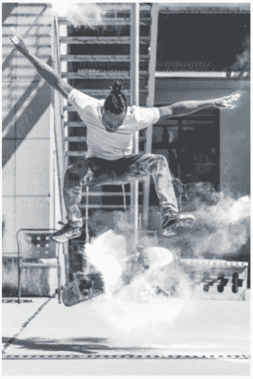

布鲁斯。

分割图像还可以让我们更容易地检查其组成。

我们可以从 RGB 绘制颜色，从 HSV 绘制饱和度，或者我们想要的任何其他通道。

```
img = cv2.imread('img2.jpeg')
B, G, R = cv2.split(img) 
show(B)img = cv2.cvtColor(img, cv2.COLOR_BGR2HSV)
H, S, V = cv2.split(img)
show(S)
```

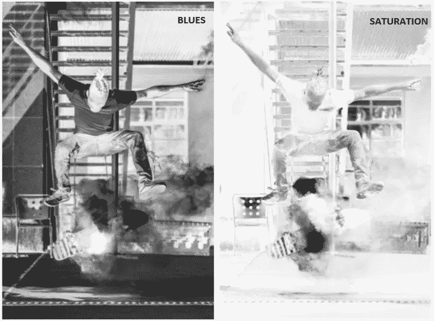

使用“灰色”色图，数值从白色(低)到黑色(高)。

我们可以通过查看第一张地图来判断蓝色的强度在地面上比在建筑物中更高，我们可以通过饱和度图看到滑板周围的值比图像的其他部分更高。

今天我就讲到这里。我们研究了如何加载和显示图片，如何将数组转换为不同的颜色格式，以及如何访问、修改和过滤维度。

在下一篇文章中，我将尝试探索变换以及如何移动、调整大小、裁剪和旋转图像。

感谢阅读我的文章。我希望你喜欢它。

**资源:**
[OpenCV 阅读图片](https://opencv-python-tutroals.readthedocs.io/en/latest/py_tutorials/py_gui/py_image_display/py_image_display.html)；
[OpenCV 颜色转换](https://docs.opencv.org/3.4/de/d25/imgproc_color_conversions.html)；
[Matplotlib 显示图像](https://matplotlib.org/api/_as_gen/matplotlib.pyplot.imshow.html)；
[OpenCV 对数组的操作](https://docs.opencv.org/2.4/modules/core/doc/operations_on_arrays.html)；
[OpenCV 基本操作](https://opencv-python-tutroals.readthedocs.io/en/latest/py_tutorials/py_core/py_basic_ops/py_basic_ops.html)；