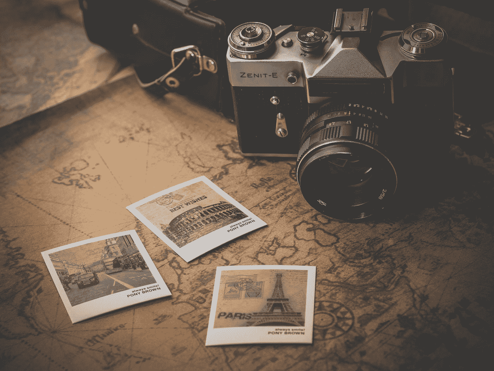
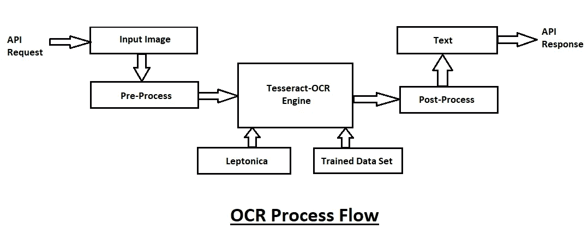
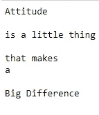
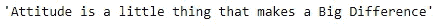

# 使用 Python 开始光学字符识别

> 原文：<https://towardsdatascience.com/getting-started-with-optical-character-recognition-using-python-e4a9851ddfab?source=collection_archive---------13----------------------->

## [语言模型设计](https://towardsdatascience.com/tagged/language-model-designing)

## 对光学字符识别从无到有的直观理解和简要介绍

由[阿恩尔·哈萨诺维奇](https://unsplash.com/@arnelhasanovic?utm_source=medium&utm_medium=referral)在 [Unsplash](https://unsplash.com?utm_source=medium&utm_medium=referral) 上拍摄的照片

光学字符识别是通过使用电子或机械设备将二维文本数据转换成机器编码文本的一种形式。二维文本数据可以从各种来源获得，例如 PDF 文件之类的扫描文档、具有以下格式的文本数据的图像。png 或者。jpeg、路标(如交通标志)或任何其他带有任何形式文本数据的图像。光学字符识别有广泛的有趣应用。

我第一次接触到光学字符识别是在我上学的时候，我们的多项选择题(MCQ 的)答案脚本会被这些设备分析。可以从这些答案脚本中提取数据，并根据答案关键字标记答案。嗯，尽管大多数人过去总是抱怨他们得到的结果不是他们想要的。这可能是由于设备的故障/功能不全，或者学生可能有轻微的误导。然而，随着现代技术的发展，光学字符识别被用于各种应用中，并且这些应用更加先进。这些设备的精确度已经大大提高了。

在本文中，我们将介绍光学字符识别的基础知识。然后，我们将继续安装 pytesseract 模块，我们将使用它来执行光学字符识别。最初，在我刚入门的时候，安装对我来说是相当烦人和麻烦的。所以，我会尽量简化安装过程的步骤。然后我们将使用 python 理解 pytesseract 模块中的各种函数。最后，我们将以一段代码来结束本文，这段代码涵盖了光学字符识别以及 google 文本到语音转换模块的使用。

> **注意:**最终代码将是使用文本到语音和字符识别的组合代码。这是语言模型设计系列的第二部分。如果你没有关于 gTTS 模块的线索，我强烈建议观众查看下面的链接。在本系列的下一部分，我们将尝试将语音翻译和光学字符识别与深度学习相结合。要按你的喜好顺序观看这个系列，你可以点击链接[这里](https://towardsdatascience.com/tagged/language-model-designing)。

 [## 如何使用 Python 开始使用 Google 文本到语音转换

### 从零开始的文本到语音转换简介

towardsdatascience.com](/how-to-get-started-with-google-text-to-speech-using-python-485e43d1d544) 

照片由[达留什·桑科夫斯基](https://unsplash.com/@dariuszsankowski?utm_source=medium&utm_medium=referral)在 [Unsplash](https://unsplash.com?utm_source=medium&utm_medium=referral) 拍摄

## 光学字符识别究竟是如何工作的？

图片由作者根据[媒介](https://medium.com/@balaajip/optical-character-recognition-99aba2dad314)创作

光学字符识别过程流程如上图所示。发送 API 请求以执行 OCR 操作。输入图像被相应地读取和预处理。文本被格式化并从图像中提取出来。使用经过训练的数据集，计算发送到 OCR 引擎的图像。OCR 引擎会尝试分析图像中的字符，并找到合适的解决方案。一旦引擎完成分析，它将发送数据进行另一步预处理和格式化，以排除任何不必要的项目。一旦这个过程完成，我们将最终获得所需的文本数据。在此之后，可以使用来自图像的转换后的文本数据向用户返回一个 API 响应。

## 安装:

安装可能有点棘手。但是，我会尽量简化安装步骤，以便您可以尽快开始。第一步很简单，只需使用 pip 命令安装 pytesseract 模块。在命令提示符终端/虚拟环境中键入以下命令—

我们已经成功安装了 pytesseractt 模块，但是当您试图立即运行代码时，您将收到一条错误消息，指出您的系统中没有安装 tesserac 模块。要完成此步骤，请访问此[站点](https://github.com/UB-Mannheim/tesseract/wiki)。这是 windows 宇宙魔方的官方网站。宇宙魔方 3.05、宇宙魔方 4 和开发版 5.00 Alpha 的 Windows 安装程序可从 UB Mannheim 的[宇宙魔方获得。这些包括培训工具。32 位和 64 位安装程序都可用。](https://github.com/UB-Mannheim/tesseract/wiki)

选择您喜欢的安装方式，并相应地进行安装。您可以将 pytesseract 模块添加到您的路径中，或者直接使用它。我希望这能解决安装过程中的大部分问题。如果您有任何其他疑问，请随时告诉我。

## 了解 pytesseract 模块:

Python-tesseract 是 Google 的 Tesseract-OCR 引擎的包装器。它作为 tesseract 的独立调用脚本也很有用，因为它可以读取 Pillow 和 Leptonica 图像库支持的所有图像类型，包括 jpeg、png、gif、bmp、tiff 等。此外，如果用作脚本，Python-tesseract 将打印识别的文本，而不是将其写入文件。

为了更直观地理解这一点，让我们看看下面的简单代码块—

我们导入 pytesseract 模块并指定路径。然后，我们使用 cv2 模块读取图像。最后，我们提取这些图像并返回文本数据。 **image_to_string** 返回对 image to string 运行的 Tesseract OCR 的结果。有关 tesseract OCR 及其 image_to_string 等功能的更多信息，请访问[此处](https://tesseract-ocr.github.io/)。

## 代码:

这一部分将包含结合文本到语音和光学字符识别的最终代码片段。我们将使用最近安装的 pytesseract 模块以及 gTTS 和 PIL 等模块。 **PIL** 代表 python 图像库，将用于加载我们的图像。open-cv 模块 ***cv2*** 也可用于读取图像。让我们分三部分来看看整个代码是如何工作的。

**1。读取图像—**

在这个代码块中，我们导入所需的库，并指定 Tesseract 位置的路径。然后，我们将继续用 cv2 模块读取图像。你也可以使用 PIL 图书馆。该命令将是“Image.open()”。在此步骤之后，我们将使用 OCR 库将图像转换为文本数据，并打印所需的输出。

**2。格式化数据—**

在下一个代码块中，我们将文本数据格式化为一行。我们基本上是在已经获得的文本数据上执行预处理，然后将其传递到 gTTS 模块用于语音翻译过程。

**3。转换成语音—**

最后，我们将导入 Google text-to-speech 模块，并将文本数据转换成音频消息的形式。这对于聆听 PDF 格式的文本数据以及图像的有声音频非常有用。如果您对 gTTS 模块有任何困惑，那么可以参考我以前的一篇文章来更好地理解这个概念。

 [## 如何使用 Python 开始使用 Google 文本到语音转换

### 从零开始的文本到语音转换简介

towardsdatascience.com](/how-to-get-started-with-google-text-to-speech-using-python-485e43d1d544) 

照片由[爱丽丝·多诺万·劳斯](https://unsplash.com/@alicekat?utm_source=medium&utm_medium=referral)在 [Unsplash](https://unsplash.com?utm_source=medium&utm_medium=referral) 上拍摄

## 结论:

我们已经讲述了光学字符识别的一些概念，直观地了解了 OCR 处理流程是如何工作的。我希望开始使用 python 学习 OCR 技术的安装过程得到了简化，并且所有人都能达到预期的效果。我们理解了 pytesserac 模块的一些功能，并最终编写了一个代码，将 gTTS 和 pytesserac 模块结合起来。

在本主题语言模型设计的下一部分，我们将研究如何使用深度学习技术以及 OCR 和 TTS(文本到语音)来开发一个很酷的项目。

我强烈推荐你们所有人查阅下面的参考资料，以便更好地掌握和学习这些概念。如果您有任何疑问，请告诉我，祝您有美好的一天！

## 参考资料:

1.  光学字符识别综合指南—[https://moov.ai/en/blog/optical-character-recognition-ocr/](https://moov.ai/en/blog/optical-character-recognition-ocr/)
2.  使用 Tesseract、OpenCV 和 Python 进行 OCR 的综合指南—[https://nanonets.com/blog/ocr-with-tesseract/](https://nanonets.com/blog/ocr-with-tesseract/)
3.  使用 Google 的 Tesseract 和 OpenCV 构建您自己的光学字符识别(OCR)系统—[https://www . analyticsvidhya . com/blog/2020/05/build-your-own-OCR-Google-tessera CT-OpenCV/](https://www.analyticsvidhya.com/blog/2020/05/build-your-own-ocr-google-tesseract-opencv/)
4.  免费打造自己的 OCR(光学字符识别)——[https://medium . com/@ Bala ajip/Optical-Character-Recognition-99 ABA 2 dad 314](https://medium.com/@balaajip/optical-character-recognition-99aba2dad314)
5.  光学字符识别—[https://en.wikipedia.org/wiki/Optical_character_recognition](https://en.wikipedia.org/wiki/Optical_character_recognition)