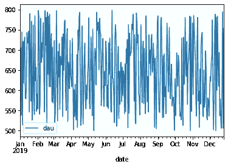

# 熊猫时序功能入门

> 原文：<https://towardsdatascience.com/getting-started-with-pandas-time-series-functionality-c10b6ee733a4?source=collection_archive---------22----------------------->


## 提高数据分析速度的 3 种技巧

Pandas 具有分析时间序列数据的特殊功能，包括自动日期解析、高级过滤功能和几个特定于日期的绘图功能。

我发现自己几乎每天都在使用这些功能，但我花了很长时间才发现它们:Pandas datetime 的许多功能并不明显，而且我在开始时并没有使用这些功能。

但是使用这些功能很容易，而且无论何时处理时间序列数据，都有助于提高分析速度。

为了帮助你开始，这里有 3 个我最常用的时间序列特征。

## 1.自动解析时间序列数据

Pandas 可以自动将数据集中的列解析成时间序列数据，而不需要您指定任何正则表达式模式。

假设您正在分析一个数据集，其中前五行如下所示。

带有日期时间字段的示例表

您可以看到列`date`看起来像一个时间序列，我们将该列中的值转换为 Pandas datetime 类型是有意义的。

要指示 Pandas 转换这些值，在加载数据时使用`parse_dates`参数。

> 注意:`parse_dates`参数在所有熊猫数据加载函数中都可用，包括`read_csv`。

```
>>> import pandas as pd
>>> df = pd.read_csv('[http://bit.ly/30iosS6](http://bit.ly/30iosS6)', parse_dates=['date'])
>>> df.info()
<class 'pandas.core.frame.DataFrame'>
RangeIndex: 360 entries, 0 to 359
Data columns (total 2 columns):
 #   Column  Non-Null Count  Dtype
---  ------  --------------  -----
 0   dau     360 non-null    int64
 1   date    360 non-null    datetime64[ns]
dtypes: datetime64[ns](1), int64(1)
memory usage: 5.8 KB
```

注意列`date`的`Dtype`是如何变为`datetime64[ns]`的。您现在可以在`date`列上使用 Pandas 的所有特殊 datetime 方法。

```
>>> df.date.dt.day_name()
0      Tuesday
1    Wednesday
2     Thursday
3       Friday
4     Saturday
...
```

## 2.过滤时间戳索引

当数据帧的索引是一个`datetime`类型时，Pandas 提供了方便的过滤方法。

```
>>> df.set_index('date', inplace=True)
>>> df.index
DatetimeIndex(['2019-01-01', ... ,'2019-12-26'])
```

例如，您可以通过向 DataFrame 的`loc`访问器传递一个字符串来选择一个特定的日期。

```
>>> df.loc['2019-02-01']
dau    554
Name: 2019-02-01 00:00:00, dtype: int64
```

你也可以使用字符串来选择数据范围，即分割数据帧。

```
>>> df.loc['2019-02-01':'2019-03-01']
            dau
date
2019-02-01  554
2019-02-02  798
...
2019-02-28  569
2019-03-01  599
```

注意，索引是最后一个值的*和*。我们使用`2019-03-01`作为我们选择的范围的结尾，所以标签为`2019–03–01`的行包含在结果数据帧中。

您甚至可以传入部分字符串来选择特定范围的数据。

```
>>> df.loc['2019-03']
            dau
date
2019-03-01  599
2019-03-02  724
...
2019-03-30  724
2019-03-31  638
```

## 3.快速绘制时间序列数据

最后但同样重要的是，您可以使用 Pandas `plot`函数轻松绘制时间序列数据。

```
>>> df.plot()
```



自动生成的日期时间图

注意 Pandas 是如何使用 X 轴的数据帧索引的。

当然，这个图表不是很有帮助。让我们使用一个聚合视图来产生更具可读性的东西。

为此，我们可以使用 DataFrame 的`resample`方法按月聚合 timeseries 索引。然后，我们将计算每个月的`mean`,并创建结果的条形图。

```
>>> df.resample('M').mean().plot.bar()
```


时序索引的汇总视图

关于如何在 Pandas 中快速生成图表的更多细节，你可以阅读我的文章“[用 Pandas](/the-best-pandas-plotting-features-c9789e04a5a0) 快速绘图”。

[](/the-best-pandas-plotting-features-c9789e04a5a0) [## 用熊猫快速绘图

### 使用这些简单的内置函数快速可视化您的数据

towardsdatascience.com](/the-best-pandas-plotting-features-c9789e04a5a0) 

感谢阅读！我经常在 Medium 上写关于数据科学和编程技巧的文章，所以请关注我以获得更多类似本文的文章。