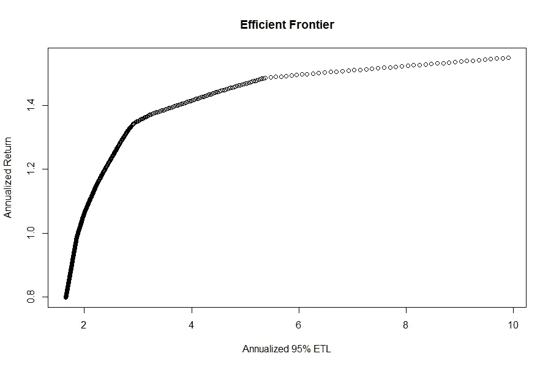

# R 并行编程入门

> 原文：<https://towardsdatascience.com/getting-started-with-parallel-programming-in-r-d5f801d43745?source=collection_archive---------10----------------------->

## 在多个 CPU 内核之间分配工作


图片来自 [Pixabay](https://pixabay.com/photos/highway-night-photograph-lights-393492/)

# 我为什么要看这篇文章？

尽管 R 中有许多关于并行计算的好资料，但很少有人以这样一种任何人都可以入门的基本方式解释这些概念。由于 R 的高级本质和强大的开源开发者社区，并行化基本和更复杂的任务非常简单。如果您熟悉`apply`系列函数(在数组或列表的索引上应用函数的函数)，只需增加三行代码就可以完成并行化！在本文中，我们将从“应用”功能的并行版本开始，扩展到更灵活的方法，最后通过一个来自财务优化的真实示例。

# 并行运行`"apply"` 功能

我们开始吧。假设我们有一个包含四个大向量的列表。对于四个大向量中的每一个，我们都要计算平均值。下面，使用传统的`lapply`方法计算平均值:

```
# Generate data
data <- 1:1e9
data_list <- list("1" = data,
                  "2" = data,
                  "3" = data,
                  "4" = data)# Single core
time_benchmark <- system.time(
  lapply(data_list, mean)
)
```

这个计算用了 18.33 秒。用 18 秒来计算四个简单的平均值？我们没有时间了。事实证明，我们不需要这么做。上面执行的四个计算是完全独立的。即它们不相互依赖。第 1 项的含义绝不取决于第 2 项的含义。默认情况下，R 中的大多数功能都运行在一个处理核心上。随着当今大多数系统采用多核处理器，通过简单地将任务划分到多个内核上来减少运行时间的潜力是非常显著的。图书馆`parallel`帮助我们实现这一目标。下面，使用来自`parallel`库的`lapply` ( `parLapply`)的多核等价物来实现相同的计算:

```
library(parallel)# Detect the number of available cores and create cluster
cl <- parallel::makeCluster(detectCores())# Run parallel computation
time_parallel <- system.time(
  parallel::parLapply(cl,
                      data_list,
                      mean)
)# Close cluster
parallel::stopCluster(cl)
```

这个计算用了 4.99 秒。通过添加三行代码，计算时间几乎减少了 75%！这就是现代多核 CPU 的好处。我使用四核 CPU，在四个核而不是一个核上运行四个计算，速度提高了四倍(嗯，由于计算机科学的原因，我没有足够的智慧来解释这一点)。这是您开始使用 r 中的并行计算所需要的全部内容。如果您只需要 apply 函数，那就自己动手吧。否则，请继续阅读，我们将用一种提供更多灵活性的方法进行更深入的研究。

# 并行运行循环迭代

比起一个`apply` 函数，你更喜欢并行一个传统的循环吗？那么`foreach`库就是你的解决方案。`foreach`函数的工作方式很像传统的循环，但是除了索引之外，它还需要关于如何构建输出以及在多核循环中应该可以访问哪些库的信息。因为我们的均值计算是使用基 R 函数执行的，所以不需要将任何包传递给`foreach`。同样，平均值的计算是这样实现的:

```
library(doParallel)
library(parallel)
library(foreach)# Detect the number of available cores and create cluster
cl <- parallel::makeCluster(detectCores())# Activate cluster for foreach library
doParallel::registerDoParallel(cl)time_foreach <- system.time({
  r <- foreach::foreach(i = 1:length(data_list),
                        .combine = rbind) %dopar% {
    mean(data_list[[i]])
  }
})
time_foreach[3]# Stop cluster to free up resources
parallel::stopCluster(cl)
```

在 5.03 秒时，计算时间与`parLapply`实现的时间没有显著不同。这里重要的是使用了同名库中的`foreach`函数。它具有与 for 循环类似的功能，但同时在多个内核上执行迭代。这意味着迭代之间不存在依赖性。这里有两个输入被传递给函数；与常规循环一样的索引，以及如何组合输出。`rbind`将输出绑定为行。`foreach`提供了很大的灵活性，因为你可以完成几乎与传统循环相同的任务——假设每次迭代的结果之间不存在依赖关系。

# 并行运行投资组合优化

现在让我们尝试一个更现实的问题。可能很少有人有一个四个向量的列表，并想计算每个向量的平均值。在这一节中，我想说明你刚刚学到的东西在均值计算之外是有用的。具体来说，在我自己的计算金融领域。在计算金融中，经常需要通过运行 10、100 或 1000 次相当大的优化算法来模拟性能。通过适当的简化，这个问题很容易并行处理。

投资组合优化是在给定最大容许风险量的情况下，寻找具有最大预期回报的投资组合的艺术，反之亦然。预期回报通常以平均历史回报给出，风险以历史回报的标准差(或类似的度量)给出。这是一门有缺陷的艺术，因为它假设未来和过去一样。一位智者(苏伦·克尔凯郭尔)曾经说过，生活只能向后理解，但必须向前生活。不幸的是，在量化金融领域也是如此。

投资组合优化不能告诉你应该承担多大的风险。如果你还年轻，正在为退休储蓄，你可能应该承担相当大的风险，因为你不打算很快取出这笔钱，从长期来看，风险投资会获得更好的回报。如果你正在攒钱准备明年买房，那么降低风险是明智之举。高风险和低风险的投资组合都有一个共同点，那就是它们应该是最优的权衡。你希望在一定的风险下获得尽可能多的回报。所有这些最优投资组合都可以在一个名为“有效边界”的图表中可视化，这是我们将在第三部分也是最后一部分构建的。

首先，为了并行化和财务优化，有必要加载库:

```
# Load parallelisation libraries
library(doParallel)
library(foreach)
library(parallel)# Load finance and optimization libraries
library(PerformanceAnalytics)
library(PortfolioAnalytics)
require(ROI)
require(ROI.plugin.glpk)
require(ROI.plugin.quadprog)
require(quadprog)
```

您已经熟悉了前三个库。剩下的五个是金融数学和优化的专用库:

*   `PerformanceAnalytics` —用于计算绩效和风险指标的函数库
*   `PortfolioAnalytics` —用于构建和分析金融投资组合的函数库
*   `ROI`、`ROI.plugin.glpk`、`ROI.plugin.quadprog`、`quadprog` —用于优化的库

从`PerformanceAnalytics`库中，可以加载包含 13 种工具的财务回报的样本数据集:

```
# Load sample return data from the PerformanceAnalytics library
lookback <- 120 # lookback in months
returns <- tail(PerformanceAnalytics::edhec, lookback)
```

我们选择使用过去十年的回报数据来进行投资组合优化，从而假设不久的将来会像过去十年一样。对于投资组合，我们希望只进行长期投资(投资正金额)，完全投资(投资整个预算)投资组合，以最小化风险。最小化的风险度量是 ETL(预期尾部损失/风险条件价值/执行短缺)——一种具有理想财务属性的风险度量。如果你不熟悉这个指标，就假设它相当于收益的标准差。如果投资组合的价值波动很大，风险就大。以下代码创建要优化的投资组合对象:

```
# Create portfolio object
names_funds <- colnames(returns)
port.obj <- PortfolioAnalytics::portfolio.spec(assets = names_funds)
port.obj <- PortfolioAnalytics::add.constraint(portfolio = port.obj,
                                               type = "full_weight")
port.obj <- PortfolioAnalytics::add.constraint(portfolio = port.obj,
                                               type="long_only")
port.obj <- add.objective(portfolio=port.obj,
                          type='risk',
                          name='ETL',
                          arguments=list(p=0.95))
```

现在，为了计算有效边界，有必要知道从给定的工具领域构建的投资组合可以实现的最大预期回报和最小风险:

```
# Define maximum achievable return
ER_assets <- colMeans(returns)
ER_assets_max <- max(ER_assets)# Calculation of return of minimum risk portfolio
weights_ES_min <- PortfolioAnalytics::optimize.portfolio(
  R = returns,
  portfolio = port.obj,
  optimize_method = "ROI",
  trace = FALSE)$weights
ER_ES_min <- sum(weights_ES_min * ER_assets)# Vector of return targets
n_portfolios <- 500
return_targets <- seq(ER_ES_min,
                      ER_assets_max,
                      length.out = n_portfolios)
```

最大预期收益很容易找到，它就是回望期内平均收益最大的投资组合。由于分散效应，最小化风险的投资组合稍微复杂一些。我们通过求解优化问题找到投资组合，而无需指定回报目标，并计算该投资组合的预期回报。最后，定义最小值和最大值之间的 500 个等间距返回目标的向量。

对于这种多核优化，将再次使用`foreach`。然而，计算稍微复杂一些，因此将多核循环中的内容定义为函数是有益的。这使得指定输出等的格式变得简单。该函数定义如下:

```
# Write optimization function that returns exactly what we need.
optimise <- function(port.obj,
                     return_target) {
  port.obj <- PortfolioAnalytics::add.constraint(
    portfolio = port.obj,
    type="return",
    return_target = return_target)
  out <- PortfolioAnalytics::optimize.portfolio(
    R = returns,
    portfolio = port.obj,
    optimize_method = "ROI",
    trace = FALSE)
  return(c(out$weights, out$objective_measures$ETL))
}
```

优化功能将目标回报约束添加到我们的投资组合中，确定最佳投资组合，并以向量形式回报工具权重和风险。这是在`foreach`循环中实现的，与之前一样:

```
# Activate cluster for foreach library and pass libraries
cl <- parallel::makeCluster(detectCores())
doParallel::registerDoParallel(cl)time_foreach <- system.time({
  data_frontier_par <- foreach::foreach(
    i = 1:n_portfolios,
    .combine = rbind,
    .packages = c("PortfolioAnalytics")) %dopar% {
      optimise(port.obj, return_targets[i])
    }
})parallel::stopCluster(cl)
```

`foreach`函数将循环的索引作为输入，如何组合输出和循环中引用的库。定义这三个输入后，只需插入优化函数，500 次优化运行在 1.91 秒内完成。`foreach`的一个有用特性是，通过将`%dopar%`改为`%do%`，它可以被修改为在单核上运行。如果你有一个咄咄逼人的老板，需要一个借口去喝咖啡(或者如果你想对单核的计算时间进行基准测试)，这是一个很好的功能。在单核上，500 次优化运行在 5.05 秒内完成——这一次，并行化并没有使我们的运行时间减少 75%。这是因为将库加载到所有四个核心上需要时间。由此产生的有效边界看起来如下:



每单位风险的最佳回报可能是 3% ETL 左右，但选择哪个投资组合取决于你。沿着边界的所有投资组合都给出了其风险量的最优回报，因此可以被理性的投资者选择。

# 结论

我希望这篇文章能让你并行运行 R 脚本，从而帮助你加快速度！随着 CPU 性能向更多内核而不是更高频率发展，不利用并行化将是一种浪费。在 R 中，只需在正确的位置添加几行代码，您的计算速度就可以提高数倍。

# 评论

本文中的代码运行在 Windows 系统上。对于 Linux 或 Mac，考虑用`mclapply`替换`parLapply`。可能需要更多的修改。

# 参考

*   [portfolio analytics 简介](https://cran.r-project.org/web/packages/PortfolioAnalytics/vignettes/portfolio_vignette.pdf)
*   [R 中并行计算的快速介绍](https://nceas.github.io/oss-lessons/parallel-computing-in-r/parallel-computing-in-r.html)