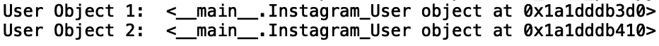
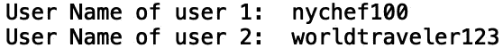
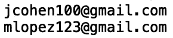

# Python 类入门

> 原文：<https://towardsdatascience.com/getting-started-with-python-classes-27bf358b2451?source=collection_archive---------34----------------------->

## Python 中的面向对象编程


照片由[克里斯蒂娜·莫里洛](https://www.pexels.com/@divinetechygirl)在[的像素](https://www.pexels.com/photo/woman-sitting-while-operating-macbook-pro-1181676/)上拍摄

在计算机编程中，类是组织数据和函数的一种方便的方式，这样它们以后就易于重用和扩展。在这篇文章中，我们将介绍如何用 python 构建一个基础类。具体来说，我们将讨论实现表示 instagram 用户的类的示例。

我们开始吧！

首先，让我们定义一个代表 Instagram 用户的简单类。最初我们不会包含任何数据(属性)或函数(方法):

```
class Instagram_User:
    pass
```

在面向对象编程中需要理解的两个重要概念是类和类实例。Instagram 平台的用户可以被视为“Instagram_User”类的一个实例。这里的区别是‘Instagram _ User’类作为创建 insta gram 用户的蓝图，而‘insta gram _ User’类的一个实例可能指的是一个特定的用户。为此，我们可以定义两个 Instagram 用户实例，insta_user_1 和 insta_user_2:

```
insta_user_1 = Instagram_User()
insta_user_2 = Instagram_User()
```

这些用户中的每一个都将是他们自己的 Instagram_User 类的唯一实例。我们可以打印这两个对象:

```
print("User Object 1: ", insta_user_1)
print("User Object 2: ", insta_user_2)
```



这里我们可以看到每个对象都有一个唯一的内存地址。接下来，我们可以为每个实例创建变量。让我们定义保存每个用户的用户名的实例变量:

```
insta_user_1.user_name = 'nychef100'
insta_user_2.user_name = 'worldtraveler123'
```

我们还可以定义每个用户的名称:

```
insta_user_1.name = 'Jake Cohen'
insta_user_2.name = 'Maria Lopez'
```

电子邮件地址:

```
insta_user_1.email = 'jcohen100@gmail.com'
insta_user_2.email = 'mlopez123@gmail.com'
```

最后，让我们定义一个实例变量，告诉我们每个用户是否有私人帐户:

```
insta_user_1.private = True
insta_user_2.private = False
```

现在，每个实例都有对每个用户唯一的属性值。让我们打印用户名:

```
print(insta_user_1.user_name)
print(insta_user_2.user_name)
```



理想情况下，我们希望为每个用户自动设置所有这些信息，而不是手动设置这些值。为了获得类的全部好处，我们应该定义一个方法，允许我们用手动定义的值初始化每个用户实例。初始化方法基本上是一个构造函数，将被称为“__init__ ”:

```
class Instagram_User:
    def __init__(self, user_name, name, email, private):
        self.user_name = user_name
        self.name = name
        self.email = email
        self.private = private
```

这里,“self”参数是实例，它允许我们在实例中共享属性信息。例如，当我们写下:

```
insta_user_1 = Instagram_User('nychef100', 'Jake Cohen', 'jcohen100@gmail.com', True)
insta_user_2 = Instagram_User('worldtraveler123', 'Maria Lopez', 'mlopez123@gmail.com', False)
```

每种情况下的“self”参数分别是 insta_user_1 和 insta_user_2 对象。如果我们打印电子邮件，我们会看到:

```
print(insta_user_1.email)
print(insta_user_2.email)
```



这允许我们用比手工定义属性少得多的代码来定义属性。现在假设我们想要对每个用户的属性执行一些操作。例如，我们可以定义一个方法来告诉我们一个用户是否有一个私人帐户。在我们的方法中，如果' self.private '为真，我们打印“用户有一个私人帐户”，否则，我们打印“用户有一个公共帐户”:

```
def isPrivate(self):
        if self.private:
            print("{} has a Private Account".format(self.name))
        else:
            print("{} has a Public Account".format(self.name))
```

完整的脚本应该如下所示:

```
class Instagram_User:
    def __init__(self, user_name, name, email, private):
        self.user_name = user_name
        self.name = name
        self.email = email
        self.private = private
    def isPrivate(self):
        if self.private:
            print("{} has a Private Account".format(self.name))
        else:
            print("{} has a Public Account".format(self.name))
```

让我们使用 insta_user_1 实例调用该方法:

```
insta_user_1.isPrivate()
```


在 insta_user_2 上:

```
insta_user_2.isPrivate()
```


如您所见，由于“self”参数被传递给了“__init__”和“isPrivate”，因此在初始化时，“isPrivate”方法可以完全访问相应实例的属性。

我将在这里停下来，但是您可以随意摆弄代码。例如，您可以尝试定义 Instagram_User 类的几个额外的用户实例。在那里，您可以练习提取实例属性并使用类方法“isPrivate”。一旦你觉得舒服了，我鼓励你定义额外的类方法。一个有趣的方法是显示用户指标，比如关注者数量、用户关注的人数和帖子数量。

## 结论

总之，在这篇文章中，我们讨论了用 python 定义类的基础。我们展示了如何定义类的实例、初始化实例、访问实例属性以及用方法操作属性。这篇文章的代码可以在 GitHub 上找到。感谢您的阅读！