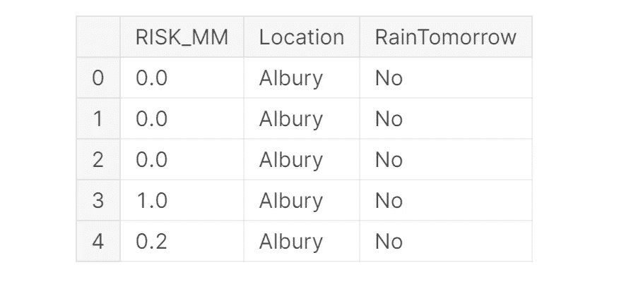
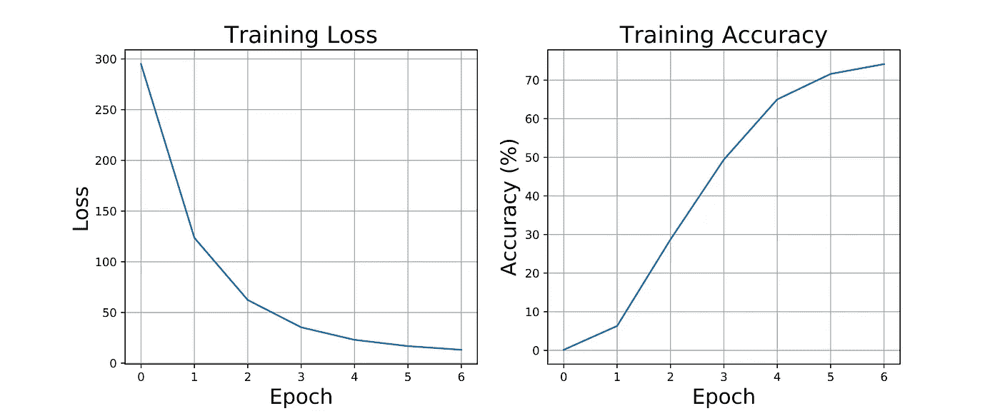

# PyTorch 入门

> 原文：<https://towardsdatascience.com/getting-started-with-pytorch-9bae16926744?source=collection_archive---------38----------------------->

## 关于如何使用 PyTorch 进行数据分析和推断的实践演练。


伊霍尔·马里茨基在 [Unsplash](https://unsplash.com?utm_source=medium&utm_medium=referral) 上拍摄的照片

# 介绍

PyTorch 是目前发展最快的深度学习 Python 框架之一。事实上，这个库最初主要由研究人员使用，以创建新的模型，但由于最近的进步，它也引起了许多公司的兴趣。对该框架感兴趣的一些原因是:

*   GPU 优化的张量计算(类似矩阵的数据结构)使用非常类似 Numpy 的接口，以便于采用。
*   使用[自动微分](https://pytorch.org/tutorials/beginner/blitz/autograd_tutorial.html#sphx-glr-beginner-blitz-autograd-tutorial-py)的神经网络训练(跟踪发生在张量上的所有操作并自动计算梯度)。
*   动态计算图(使用 PyTorch，不需要像在 Tensorflow 中那样为了运行模型而首先定义整个计算图)。

PyTorch 可以按照[文档说明](https://pytorch.org/get-started/locally/)免费安装在任何操作系统上。组成该库的一些主要元素是:

*   ***自动签名*** 模块:用于记录在张量上执行的操作，并反向执行这些操作以计算梯度(该属性对于加速神经网络操作和允许 PyTorch 遵循[命令式编程](https://en.wikipedia.org/wiki/Imperative_programming)范例非常有用)。
*   ***Optim*** 模块:用于方便地导入和应用各种神经网络训练的优化算法，如 Adam、随机梯度下降等..
*   ***nn*** 模块:提供一组函数，可以帮助我们快速逐层设计任何类型的神经网络。

# 示范

在本文中，我将带您通过一个实际的例子来开始使用 PyTorch。本文中使用的所有代码(以及更多！)可以在我的 [GitHub](https://github.com/pierpaolo28/Kaggle-Challenges/blob/master/rain-prediction.ipynb) 和 [Kaggle](https://www.kaggle.com/pierpaolo28/rain-prediction) 账户上使用。对于这个例子，我们将使用澳大利亚[Kaggle Rain](https://www.kaggle.com/jsphyg/weather-dataset-rattle-package)数据集来预测明天是否会下雨。

## 导入库

首先，我们需要导入所有必需的库。

## 数据预处理

对于这个例子，我们将重点使用 ***RISK_MM*** 和 ***Location*** 指标作为我们的模型特征(图 1)。将数据划分为训练集和测试集后，我们可以将 Numpy 数组转换为 PyTorch 张量，并创建一个训练和测试数据加载器，以便将数据输入到我们的神经网络中。



图 1:简化的数据帧

## 系统模型化

此时，使用 PyTorch ***nn*** 模块，我们就可以设计我们的人工神经网络(ANN)了。在 PyTorch 中，神经网络可以定义为由两个主要函数构成的类: ***__inti__()*** 和 ***forward()*** 。

在 ***__inti__()*** 函数中，我们可以设置我们的网络层，而在***【forward()***函数中，我们决定如何将我们网络的不同元素堆叠在一起。这样，只需在***【forward()***函数中添加打印语句，就可以相对容易地进行调试和试验，以便在任何时间点检查网络的任何部分。

此外，PyTorch 还提供了一个[顺序接口](https://pytorch.org/docs/stable/nn.html#sequential)，可以使用该接口以类似于使用 Keras Tensorflow API 构建模型的方式来创建模型。

在这个简单的网络中，我们将 50 个特征作为输入，因为我们之前使用 Pandas **get_dummies()** 功能将输入分类变量转换为虚拟/指示变量。因此，我们的网络将由 50 个输入神经元、20 个神经元的隐藏层和单个神经元的输出层组成。隐藏层的大小当然可以变化，并且可以很容易地添加更多的隐藏层，但是考虑到可用的数据量有限，这可能会导致过度拟合我们的数据的风险。将连续图层堆叠在一起时，我们只需确保一个图层的输出要素数量等于连续图层的输入要素数量。

一旦实例化了我们的模型，我们就可以打印出网络架构。

```
ANN(
  (fc1): Linear(in_features=50, out_features=20, bias=True)
  (fc2): Linear(in_features=20, out_features=1, bias=True)
)
```

## 神经网络训练

我们现在终于准备好训练我们的模型了。在下面的代码片段中，我们首先将二元交叉熵定义为我们的损失函数，将 Adam 定义为模型参数的优化器。最后，我们创建一个 7 次迭代的训练循环，并存储一些关键的度量参数，如每次迭代的总损失和模型精度。

```
Epoch: 0, Loss: 294.88, Accuracy: 0.13% 
Epoch: 1, Loss: 123.58, Accuracy: 6.31% 
Epoch: 2, Loss: 62.27, Accuracy: 28.72% 
Epoch: 3, Loss: 35.33, Accuracy: 49.40% 
Epoch: 4, Loss: 22.99, Accuracy: 64.99% 
Epoch: 5, Loss: 16.80, Accuracy: 71.59% 
Epoch: 6, Loss: 13.16, Accuracy: 74.13%
```

正如图 2 所总结的，我们的模型成功地实现了良好的准确性，而没有过度拟合原始数据的风险(训练损失和准确性都即将达到平稳状态)。还可以通过实现训练/验证分割来训练我们的模型并调整其参数来进一步验证这一点(如本 [GitHub](https://github.com/pierpaolo28/Kaggle-Challenges/blob/master/rain-prediction.ipynb) 笔记本所示)。



图 2:培训报告

## 估价

最后，我们现在可以创建第二个循环来针对一些全新的数据测试我们的模型(为了确保我们的模型不再是训练模型，而是仅用于推理，请注意 ***model.eval()*** 语句)。

```
Test Accuracy: 74.66 %
```

从打印输出可以看出，我们的模型测试精度与我们的最终训练精度非常匹配(74.66 %对 74.13%)。

# 结论

如果您有兴趣了解 PyTorch 的更多潜力，PyTorch Lighting[和 Livelossplot](https://pytorch-lightning.readthedocs.io/en/latest/) 是两个很棒的软件包，可以帮助您开发、调试和评估您的 py torch 模型。

*希望您喜欢这篇文章，感谢您的阅读！*

# 联系人

如果你想了解我最新的文章和项目[，请通过媒体](https://medium.com/@pierpaoloippolito28?source=post_page---------------------------)关注我，并订阅我的[邮件列表](http://eepurl.com/gwO-Dr?source=post_page---------------------------)。以下是我的一些联系人详细信息:

*   [领英](https://uk.linkedin.com/in/pier-paolo-ippolito-202917146?source=post_page---------------------------)
*   [个人博客](https://pierpaolo28.github.io/blog/?source=post_page---------------------------)
*   [个人网站](https://pierpaolo28.github.io/?source=post_page---------------------------)
*   [中等轮廓](https://towardsdatascience.com/@pierpaoloippolito28?source=post_page---------------------------)
*   [GitHub](https://github.com/pierpaolo28?source=post_page---------------------------)
*   [卡格尔](https://www.kaggle.com/pierpaolo28?source=post_page---------------------------)