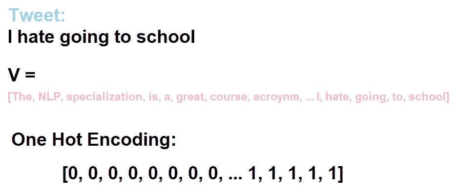

# 情感分析入门

> 原文：<https://towardsdatascience.com/getting-started-with-sentiment-analysis-731531ec880d?source=collection_archive---------29----------------------->

## [自然语言处理笔记](https://towardsdatascience.com/tagged/nlpnotes)

## 自然语言处理专业课程 1 第 1 周笔记

在我的前两个帖子之后，我认为我们有必要开始一条新的道路。我们将一起浏览自然语言处理中的基本概念，作为新手的起步，并提醒长期从业者决定阅读的时间——从情感分析开始。

> **注**:这个系列的帖子将由我从 Coursera 上的[自然语言处理专业中摘掉的笔记创建，我添加了额外的东西，因为我认为它很有用。](https://www.coursera.org/specializations/natural-language-processing)

**前两个帖子:**

 [## 品牌在数据科学中的重要性

### 最近，一个特别的话题在我和朋友的讨论中反复出现。品牌的重要性！我…

towardsdatascience.com](/the-importance-of-branding-in-data-science-467b2d2b1e7f)  [## 从长远来看，专业化的“数据科学家”将会胜出

### 成为专家会比成为多面手让你走得更远

towardsdatascience.com](/the-specialized-data-scientist-will-win-in-the-long-run-22c47342aa00) 

在我们笔记中给出的例子中，我们打算用逻辑回归模型来拟合我们的特征。我不会深入研究逻辑回归的内部工作原理，但是如果你非常感兴趣，你可以从头开始阅读“ [*算法:逻辑回归*](/algorithms-from-scratch-logistic-regression-7bacdfd9738e) ”。

 [## 从零开始的算法:逻辑回归

### 与普遍的看法相反，我在此声明，逻辑回归不是一个分类算法(就其本身而言)…

towardsdatascience.com](/algorithms-from-scratch-logistic-regression-7bacdfd9738e) 

## 情感分析

情感分析的目标是使用自然语言处理和机器学习来解释和分类主观数据。

随着世界变得更加数字化，情绪分析在今天的商业中是一项非常重要的技能，自新冠肺炎以来更是如此。许多企业采用情感分析来检测社会数据，更好地了解他们的品牌声誉，了解他们在数字世界中的客户。

例如，一个企业(或任何人)可能会决定使用情感分析来自动确定关于他们公司(或任何东西)的推文的极性，以便更好地了解他们品牌的声誉；这个任务可以定义为一个监督学习问题，我们将输入特征输入到一个预测模型中，然后得到一个输出。

**图 1** :情感分析问题

为了让我们执行情感分析，我们必须首先将我们的文本表示为特征(我们在图 1 中表示为 X)，因为计算机不理解文本，在我们可以使用它来分类文本之前。

那么，**我们如何提取特征呢？**很棒的问题。方法有很多。然而，在我们提取我们的特征并建立逻辑回归模型来分类我们数据的情感之前，我们必须讨论文本预处理。

## 文本预处理

互联网上的文本通常被定义为非结构化数据——非结构化数据是没有预定义的数据模型或者没有以预定义的方式组织的信息(来源:[维基百科](https://en.wikipedia.org/wiki/Unstructured_data))。因此，文本预处理就是将我们的文本组织成预定义的方式或预定义的数据模型。

有各种各样的技术可以用来预处理我们的文本，但是在这篇文章中，我们将主要关注其中的几种；

**小写**

这可能是最简单的文本预处理形式，我们可以确保所有的文本都是小写的。这种技术适用于许多文本挖掘和自然语言处理任务，当数据集很小时，这种技术非常有用。

**图 2** :小写示例

值得注意的是，尽管小写通常是一种标准做法，但在某些情况下，保持大写是很重要的。

**词干**

当我们“词干”一个词形变化——*在语言形态学中，词形变化是一个构词的过程，在这个过程中，一个词被修饰以表达不同的语法范畴，如时态、格、语态、体、人称、数、性别、语气、动物性、确定性(来源:* [*维基百科*](https://en.wikipedia.org/wiki/Inflection) *)。例如，who 变成了 who 的*——我们把它简化为词根形式。

有许多不同的词干提取算法，但是最常见和最有效的英语词干提取算法是 Porters 算法。

**图 3** :用 PorterStemmer 在 Python 中进行词干分析

词干通常对处理稀疏性和/或标准化词汇很有用。

**词汇化**

词汇化通常是指使用词汇和单词的形态学分析来正确地做事情，通常旨在仅删除屈折词尾，并返回单词的基本形式或字典形式，这被称为词汇(来源:[Stanford NLP Group](https://nlp.stanford.edu/IR-book/html/htmledition/stemming-and-lemmatization-1.html))。

简单地说，词汇化旨在消除词尾变化，并以适当的方式将单词映射到其词根。

**图 4** :使用 WordNetLemmatizer 的词汇化示例

> **注意**:不要犯交替使用词干化和词汇化的错误——词汇化会对单词进行词法分析。

**停用词**

停用词是语言中的常用词。这些词通常被认为是对文本没有任何意义的词(它们不重要)，因此我们要把它们去掉。

**图 5**:NLTK 中的停用词列表

删除停用词并不总是有效的策略。在某些情况下，移除停用词往往是有用的，例如主题提取，但在各种分类任务中，我们可以通过保留停用词来获得有用的见解。

**正常化**

在文本可能有很多噪音的环境中，例如 twitter 和文本消息，规范化文本往往是一个重要但被忽视的步骤——我所说的噪音环境是指非正式很常见的地方。当我们规格化文本时，我们将文本转换成标准形式(即 nvm 变成 nevermind)。

**图 6:** 文本的规范化(**来源**:[Kavita Ganesan](https://medium.com/u/cd869a6dee38?source=post_page-----731531ec880d--------------------------------)—[关于 NLP 和机器学习的文本预处理你需要知道的一切](/all-you-need-to-know-about-text-preprocessing-for-nlp-and-machine-learning-bc1c5765ff67)

文本规范化与词干化和词条化一样，没有标准的方法。这完全取决于手头的任务，因为我们不会像标准化讲课笔记那样标准化我们的短信(考虑到我们以非标准的方式记笔记)。

**噪声去除**

噪音会严重干扰我们的文本分析。例如，tweets 通常包含各种各样的特殊字符，当我们做进一步的预处理步骤时，这些字符可能会损害我们的结果。

**图 7** :去噪前的词干处理与去噪后的词干处理—原始图片来自[卡维塔·加内桑](https://medium.com/u/cd869a6dee38?source=post_page-----731531ec880d--------------------------------) — [关于自然语言处理和机器学习的文本预处理，你需要知道的一切](/all-you-need-to-know-about-text-preprocessing-for-nlp-and-machine-learning-bc1c5765ff67)

有各种形式的噪音要从我们的文本中去除；

*   特殊字符
*   数字
*   超文本标记语言
*   特定领域关键词(例如，RT 表示 Twitter 上的转发)
*   其他(还有很多)

我们移除哪些是领域特定的，哪些被确定为我们手头任务的“噪声”。

> **注**:关于文本预处理的更多内容，我强烈推荐你阅读 **Kavita Ganesan** 的《 [*关于自然语言处理和机器学习的文本预处理*](/all-you-need-to-know-about-text-preprocessing-for-nlp-and-machine-learning-bc1c5765ff67) 》。

## 特征提取

在将文本传递给逻辑回归模型之前，我们必须首先将文本表示为一个向量。我们有许多方法将文本表示为向量，但是对于我们的任务(情感分析)，我们将看两个向量表示；

*   一个热编码
*   正负频率

**一键编码**

为了做到这一点，我们必须创造一个词汇。这可以通过从我们的数据中的每一条推文中创建一个独特的单词列表来实现。

**图 8** :创建词汇表我们检查每条推文的每个单词，并向词汇表 V 添加单词，前提是该单词不在我们的词汇表中。

为了提取特征，我们提取一条推文，并将其标记为“1 ”,以表明我们词汇表中的单词出现在推文中，如果我们词汇表中的单词没有出现在推文中，则标记为“0 ”,参见**图 9。**

**图 9** :获取一条推文，并显示该推文在被应用一热编码后的特征向量。

由于我们的 tweet 的向量长度为 V(我们数据集中所有唯一的单词)，并且对于我们选择显示的特定 tweet，它们只有 5 个值为 1 的特征(“我讨厌去上学”)，但有许多 0(长度为 V-5)，我们有所谓的稀疏向量表示，简单地说就是我们有大量的零，因此我们占用了不需要的空间来存储零。

如果我们在我们的稀疏表示上训练我们的逻辑回归模型，我们的模型将不得不学习 n + 1(对于偏差)个参数，其中 n 等于我们的词汇的大小 V。随着 V 变得越来越大，我们将面临两个主要问题；

*   训练模型需要很长时间
*   推理时间长

**正&负频率**

克服稀疏表示问题的一种技术是将向量转换为正负频率计数。更具体地说，给定一个单词，我们想要跟踪该单词在正面类中出现的次数，给定另一个单词，跟踪该单词在负面类中出现的次数。有了这些计数，我们可以提取特征，并将它们用作 Logisitc 回归模型的输入特征。

为了执行正负频率技术，我们必须首先创建一个频率字典——频率字典只是给定目标标签的单词计数的映射。例如，我们有自己的词汇，我们计算一个词在正面推文中出现的次数，我们对负面推文也这样做。

**图 10** :单词词典

为了将这转化为一个特征，我们简单地对推文中的每个词取正频率之和，然后取负频率之和——见**图 11** 。

**图 11** :对于每条推文，输入特征将是【偏差，正词频，负词频】。

因此，我们有一个直观的例子，我们将以 tweet“我很难过，我不高”为例(因此**Xm**=“*我很难过，我不高*”)。在**图 5** 中，我们可以看到单词在整个数据集中出现的频率，分为正类和负类，因此我们所要做的就是获取我们的 tweet，并计算每个单词出现的次数——参见**图 12** 。

**图 12** :提取推文“我很难过，我不高”的特征

因此，我们的逻辑回归模型的输入特征将是[1(偏差)，4 (PostiveWordCount)，10 (NegativeWordCount)]。

## 包裹

通过这篇文章，你现在知道了各种预处理方法和两种提取特征的方法，我们可以将这些特征传递给一个逻辑回归模型。实践今天所学内容的一个好方法是在真实数据上尝试。

让我们继续 LinkedIn 上的对话:

 [## Kurtis Pykes -人工智能作家-走向数据科学| LinkedIn

### 在世界上最大的职业社区 LinkedIn 上查看 Kurtis Pykes 的个人资料。Kurtis 有一个工作列在他们的…

www.linkedin.com](https://www.linkedin.com/in/kurtispykes/)