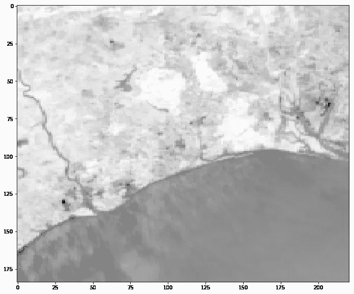

# Python 中的捕捉工具箱入门

> 原文：<https://towardsdatascience.com/getting-started-with-snap-toolbox-in-python-89e33594fa04?source=collection_archive---------11----------------------->

## SentiNel 应用程序，通常称为 SNAP，是一个适应性很强的开源软件，用于对地球观测卫星数据进行科学探索。


美国地质勘探局在 [Unsplash](https://unsplash.com/photos/35Z2ylLRCO8) 上拍摄的照片

SNAP 由欧洲航天局(ESA)开发，是一个支持哨兵任务的通用软件平台。它由几个模块组成，可以修改并重新用于地球观测卫星数据的图像处理、建模和可视化。SNAP 不仅可用作哨兵任务(哨兵 1、哨兵 2 和哨兵 3)的研究支持工具，还可用作有效处理大量卫星数据的功能出口，包括来自 Landsat、MODIS 和 RapidEye 等其他任务的各种不同格式的数据。SNAP 的项目页面和各个工具箱可以在 http://step.esa.int[找到。](http://step.esa.int/)

在本文中，我想一步一步地介绍配置 python 安装以使用 **SNAP-Python** 或“ *snappy* ”接口的过程。这样做将允许您通过使用 python 脚本自动执行图像处理任务来高效地分析大量卫星数据。

本文将涵盖以下主题:

1.  在 Windows 上下载并安装最新的 SNAP 版本(7.0 版)，
2.  在快照安装过程期间和之后配置 snappy，
3.  建立一个虚拟环境，
4.  为 snappy 和配置最佳设置
5.  使用 snappy 可视化卫星数据

## **下载快照工具箱**

捕捉由几个工具箱组成。您可以单独安装每个工具箱，也可以安装一体化版本。在本教程中，我们将安装后者。

快照工具箱可以从下面的链接下载:[https://step.esa.int/main/download/snap-download/](https://step.esa.int/main/download/snap-download/)

## **创建虚拟环境**

在你应该在你的系统上安装 SNAP 软件之前，我建议你使用 ***pip*** 或者 ***conda*** 创建一个虚拟环境。对于本教程，我们将使用 conda。要运行这个命令，您需要在系统上安装 Anaconda 或 Miniconda。

通过在系统的 python 配置命令行工具上执行以下命令，使用 python 2.7 版创建一个名为“snap”的新虚拟环境。

```
conda create -n snap python=2.7
```

我们使用 python 2.7 版本的原因是因为 SNAP 软件仅支持 python 2.7、3.3 和 3.4 版本。

注意:如果你使用 pip 来创建一个新的环境，你必须安装 venv 包。点击了解更多关于如何使用 venv [创建虚拟环境的信息。](https://docs.python.org/3/library/venv.html)

## **卡扣安装**

接下来，我们可以使用下载的可执行文件开始安装快照软件。


您可以将 python 安装配置为在快照安装期间使用 snappy，方法是选中复选框并提供 python 目录的路径(如下所示)。然而，在本教程中，我们将**而不是**检查复选框并在 SNAP 安装完成后配置 snappy。


安装过程的其余部分非常简单。第一次启动 SNAP 时，它会进行一些更新。完成后，您就可以开始使用快照软件了。

## **配置爽快的**

snap 安装完成后，我们希望获得虚拟环境“SNAP”所在的目录位置。从这里开始，我们需要以下两条路径:

1.  虚拟环境的 Python 可执行路径
2.  虚拟环境目录中名为“Lib”的文件夹

打开作为 SNAP 软件一部分安装的 SNAP 命令行工具，并运行以下命令:

```
snappy-conf {path_to_snap_env}\python.exe {path_to_snap_env}\Lib\
```


**更改可用 RAM 的数量**

在我们开始使用 snappy 创建 python 脚本之前，我们需要做一些改变，以确保 snappy 操作符以最高的最优性运行。如果您计划进行一些图像渲染和批处理操作，默认设置会非常慢。如果您想使用 snappy 来自动化繁重的处理任务并处理多个文件，这一点很重要。

转到{ virtual _ env " snap " directory } > Lib > snappy。

打开名为“ *snappy.ini”的 snappy 配置文件。*

编辑名为" j *ava_max_mem"* 的参数值，并将其设置为相当于系统 RAM 70–80%的值。

```
java_max_mem: 26G
```

在同一个目录中，有一个名为“ *jpyconfig.py”的文件。C* 更改参数" *jvm_maxmem"* 如下 *:*

```
jvm_maxmem = '26G'
```

**改变磁贴缓存内存**

接下来，导航到安装快照软件的位置。默认情况下，它设置为 C:\Program Files\snap。在其中，您会找到名为 *etc* 的文件夹，其中包含名为*“SNAP . properties”*的快照属性文件。编辑文件并更改名为*snap . jai . tile cachesize .*的参数，将其设置为等于 *java_max_mem* 值的 70–80%的值。您输入的数字应该以兆字节为单位。您可能需要启用管理员权限来保存对此文件的更改。

```
snap.jai.tileCacheSize = 21504
```

注:此处显示的值适用于 32GB 内存的系统。更改时必须考虑到系统的 RAM。

## **开始使用 Snappy**

因此，对于最后一部分，我们想探索 snappy 是如何工作的，并可视化一些样本数据。在我们开始使用 snappy 之前，我们需要一些数据，在本教程中，我们将使用 snappy 安装预加载的测试数据。

```
# Import Librariesimport os
import numpy as np
import matplotlib.pyplot as plt
import snappy
from snappy import ProductIO# Set Path to Input Satellite Data# miniconda users
path = r'C:\Users\{User}\miniconda3\envs\snap\Lib\snappy\testdata'# anaconda users
path = r'C:\Users\{User}\anaconda3\envs\snap\Lib\snappy\testdata'filename = 'MER_FRS_L1B_SUBSET.dim'# Read File
df = ProductIO.readProduct(os.path.join(path, filename))# Get the list of Band Names
list(df.getBandNames())# Using "radiance_3" band as an example
band = df.getBand('radiance_3') # Assign Band to a variable
w = df.getSceneRasterWidth() # Get Band Width
h = df.getSceneRasterHeight() # Get Band Height# Create an empty array
band_data = np.zeros(w * h, np.float32)# Populate array with pixel value
band.readPixels(0, 0, w, h, band_data) # Reshape
band_data.shape = h, w# Plot the band  
plt.figure(figsize=(18,10))
plt.imshow(band_data, cmap = plt.cm.binary)
plt.show()
```



“radiance_3”波段图

我还制作了一个视频，展示了我在这篇文章中列出的所有内容。因此，如果对如何在 Python 中安装和配置 SNAP Toolbox 有任何困惑，请务必查看。

## **附加资源**

1.  Github 页面:【https://github.com/senbox-org 
2.  为 Python 配置 SNAP:[https://senbox . atlassian . net/wiki/spaces/SNAP/pages/50855941/Configure+Python+to+use+the+SNAP-Python+snappy+interface](https://senbox.atlassian.net/wiki/spaces/SNAP/pages/50855941/Configure+Python+to+use+the+SNAP-Python+snappy+interface)
3.  写这篇文章时有用的论坛讨论

[](https://forum.step.esa.int/t/snappy-where-to-start/1463/7) [## 爽快:从哪里开始？

### 下午好，我是一名新的欧空局学员，我想实施 S2-tbx/sen2cor 的一些过程到一个…

forum.step.esa.int](https://forum.step.esa.int/t/snappy-where-to-start/1463/7) [](https://forum.step.esa.int/t/run-processes-of-snap-toolbox-using-python-script/3021/3) [## 使用 python 脚本运行捕捉工具箱的进程

### 你好，我是 SNAP 工具箱的新用户。我已经在我的 windows 机器上安装了 SNAP 4.0。我目前正在使用快照桌面…

forum.step.esa.int](https://forum.step.esa.int/t/run-processes-of-snap-toolbox-using-python-script/3021/3)