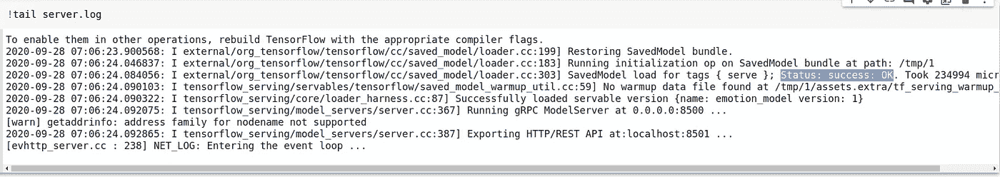
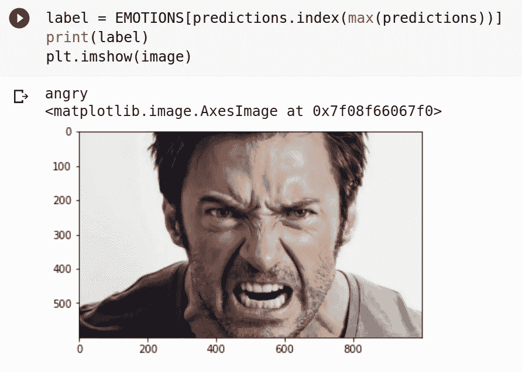

# TensorFlow 服务入门

> 原文：<https://towardsdatascience.com/getting-started-with-tensorflow-serving-b03c130bdb5c?source=collection_archive---------25----------------------->

## *将深度学习模型部署到生产中的简单高效的方法*

由[伊恩·巴塔格利亚](https://unsplash.com/@ianjbattaglia?utm_source=unsplash&utm_medium=referral&utm_content=creditCopyText)在 [Unsplash](https://unsplash.com/s/photos/server?utm_source=unsplash&utm_medium=referral&utm_content=creditCopyText) 上拍摄

TensorFlow 服务是 TensorFlow Extended(TFX)的一部分，它使将您的机器学习模型部署到服务器比以往任何时候都更加舒适。在 Google 发布 TensorFlow 服务之前，您的模型必须使用 Docker 部署到生产中。使用 Docker 来部署您的模型是乏味的、耗时的，并且容易出现许多错误。TensorFlow Serving 为我们提供了一个 API，可以使用 HTTP 请求调用该 API 在服务器上运行推理。在这篇博客中，我们将提供一个情感识别模型，并通过它了解 TensorFlow 服务的基础。

> PS:我不会在这个博客中解释关于训练情绪识别模型的事情。我只会说为模特服务。你可以在这里找到训练情绪识别模型[的要领。您可以在这里](https://gist.github.com/CleanPegasus/a822445bf7c48b1d601e59495e5ee304)找到本地运行模型的存储库[。](https://github.com/CleanPegasus/Emotion-Recognition)

**为什么要为模特服务？**

一旦您训练了您的模型，它必须被部署到生产中以便可以使用。可以使用各种方法来部署模型，比如使用 TFlite 在手机上本地部署，使用 TFjs 在网站上部署，创建 docker 容器在云上部署模型，等等。TensorFlow 服务优于其他方法，原因如下。

1.  使用 TensorFlow Serving 比使用 Docker 更容易部署您的模型，它可以节省您的时间并防止不必要的错误。
2.  与 TFlite 或 TFjs 相比，更容易管理模型的不同版本。
3.  当模型被更新时，所有的客户端将使用相同版本的模型，因此结果将是一致的。
4.  由于模型将在服务器上运行，您可以使用强大的计算资源，如 GPU 或 TPUs 来更快地运行推理。
5.  由于该模型由一个 API 提供服务，因此它可以由 TensorFlow 不支持的不同编程语言使用。

**安装张量流服务**

TensorFlow 服务可以使用 Docker、apt package installer for Linux 或 pip package manager 进行安装。在这篇博客中，我们将重点介绍如何使用 apt 和 pip 来安装 TensorFlow 服务。

在您的生产环境的终端中运行下面给出的代码，以安装 TensorFlow 服务。您可以使用 apt 软件包安装程序或 pip 软件包管理器。

安装 TensorFlow 服务

**建立和服务您的模型。**

一旦您训练、测试和验证了您的模型，就该为您的模型服务了。

> 步骤 1:指定模型的版本号，并使用 tf.keras.models.save_model()函数或 model.save()函数将模型保存到 tmp 目录中。

保存模型

> 步骤 2:模型将通过 bash 命令提供服务。为了让 bash 命令访问模型目录，需要将模型目录添加到环境中。

向环境中添加模型目录

> 第 3 步:既然模型已经保存，就可以开始服务了。运行下面给出的 bash 命令来服务模型。

为模型服务

> 第 4 步:既然已经为您的模型提供了服务，那么您可以使用 tail 命令来检查 server.log 文件。如果您在日志中发现“状态:成功:正常”行，则您的模型已被成功服务。

检查状态:成功:正常日志

**使用 HTTP 请求在模型上运行推理**

一旦您的模型被提供，就可以通过您定义的端口访问它。你的模型可以在任何地方使用；像 GCE、AWS lambda、AWS EC2、Google Colab、您本地计算机等云计算引擎。请注意，当您将模型部署到生产环境中时，在 Colab 或您的本地计算机上提供它没有多大意义。为了简单起见，我将在 Google Colab 上部署该模型。

您可以使用 HTTP 请求在服务模型上运行推理。发出 HTTP 请求后，服务器会将数据传递给模型，获取响应并将其发送回客户端。API 端点的输入是一个 JSON，其中嵌入了预处理过的图像。您可以使用**请求**库向 API 发出 HTTP 请求。

在调用 API 之前，必须对输入图像进行预处理。

图像预处理

图像经过预处理后，将图像嵌入到 JSON 中。这个 JSON 对象将是发送到 API 端点的数据。JSON 数据将有两项，“签名名”和“实例”“实例”项将包含列表形式的图像数据。

指定 API 请求的头，告诉端点 JSON 文件正在作为输入传递。使用 POST 方法从 API 端点请求，并将 URL、JSON 数据和头作为参数。API 将返回图像的预测。

来自服务模型的预测

这是模型的输出样本。

输出

**结论**

TensorFlow 服务使深度学习模型部署到生产中变得前所未有的简单。通过在模型中使用预处理图像的 lambda 层，可以避免对输入图像进行预处理。这使得调用 API 更加容易。