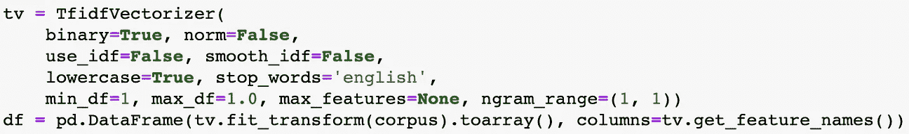
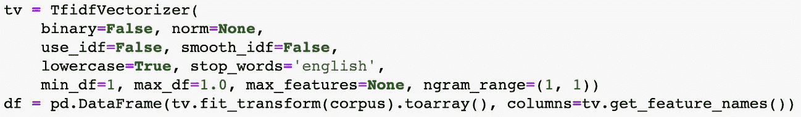
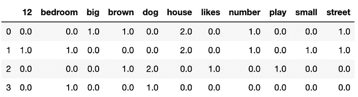
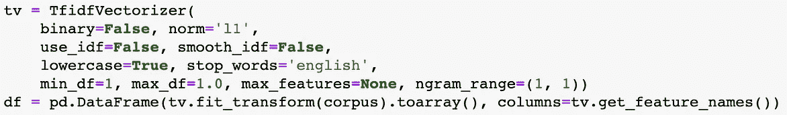
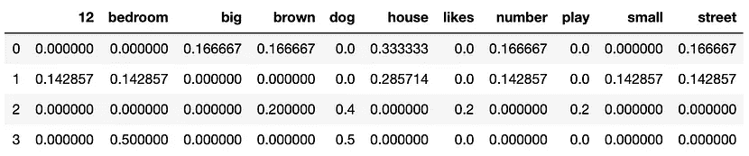
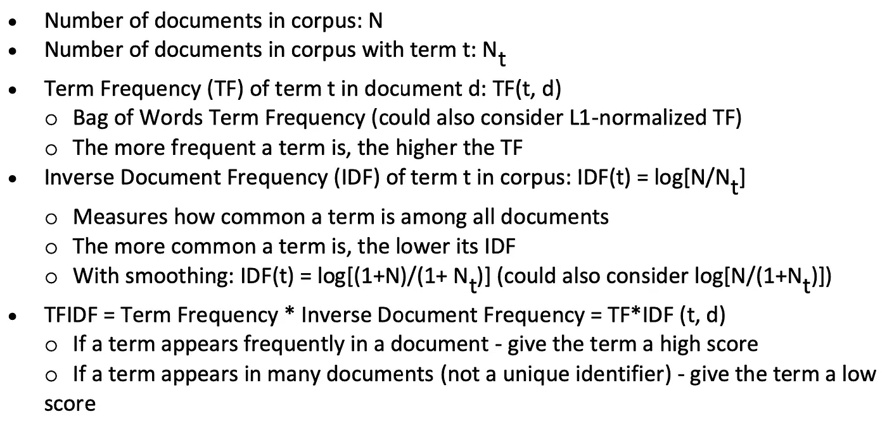
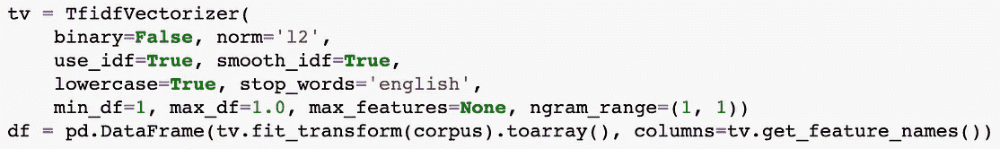
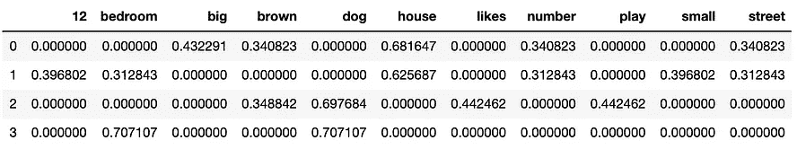
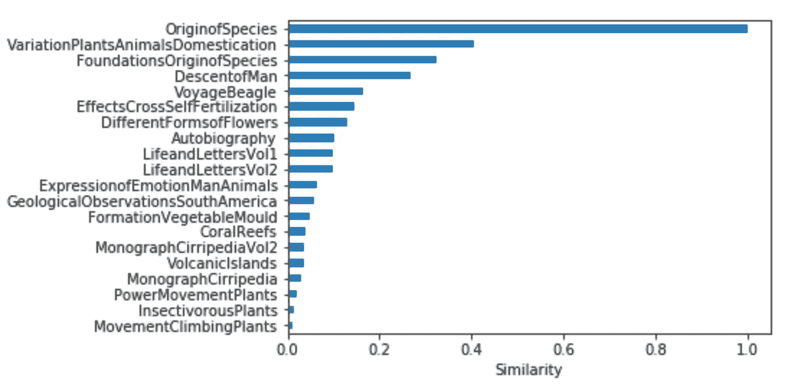
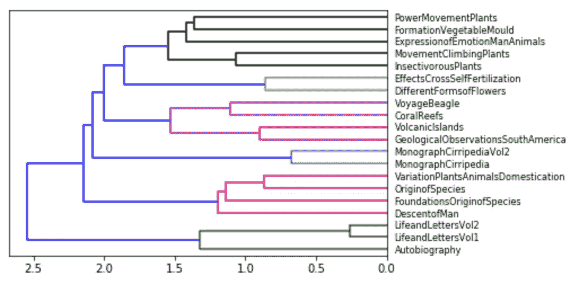

# 文本矢量化入门

> 原文：<https://towardsdatascience.com/getting-started-with-text-vectorization-2f2efbec6685?source=collection_archive---------2----------------------->

## 了解自然语言处理(NLP)-Python 中的文本矢量化

```
Feel free to follow me on Medium :)
```

最近，我在 DataCamp 上完成了“[查尔斯·达尔文的书籍推荐](https://learn.datacamp.com/projects/607)”案例研究。在这个项目中，我们将学习如何实现文本预处理和文本矢量化，如何使用自然语言处理(NLP)构建图书推荐系统，以及检测查尔斯·达尔文的书籍彼此之间的相关程度。


# 文本矢量化

***文本矢量化*** 是将文本转换成数值表示的过程。以下是一些实现文本矢量化的常用方法:

*   二进制术语频率
*   单词袋(BoW)术语频率
*   (L1)标准化术语频率
*   (L2)标准化的 TF-IDF
*   Word2Vec

在这一节中，我们将使用下面的语料库来介绍文本矢量化中的 5 种流行方法。

```
corpus = ["This is a brown house. This house is big. The street number is 1.",
          "This is a small house. This house has 1 bedroom. The street number is 12.",
          "This dog is brown. This dog likes to play.",
          "The dog is in the bedroom."]
```

## 二进制术语频率

二进制术语频率捕获文档中术语的存在(1)或不存在(0)。对于这一部分，在 TfidfVectorizer 下，我们将二进制参数设置为 true，以便它可以只显示存在(1)或不存在(0)以及范数参数等于 false。



## 单词袋(BoW)术语频率

单词袋(BoW)术语频率捕获文档中术语的频率。在 TfidfVectorizer 下，我们将二进制参数设置为 false，以便它可以显示项的实际频率，而范数参数等于 none。



## (L1)标准化术语频率

(L1)规范化术语频率获取文档中规范化的 BoW 术语频率。在 TfidfVectorizer 下，我们将二进制参数设置为等于 false，这样它就可以显示项的实际频率，范数参数等于 ***l1*** 。



## (L2)标准化的 TF-IDF

(L2)规范化 TFIDF(术语频率-文档频率倒数)捕获文档中的规范化 TFIDF。以下是计算 TFIDF 的公式。



TFIDF 的公式

在 TfidfVectorizer 下，我们将 binary 参数设置为等于 false，这样它就可以显示项的实际频率，norm 参数等于 ***l2*** 。



## Word2Vec

Word2Vec 提供了单词的嵌入式表示。Word2Vec 从语料库中所有单词的一种表示开始，并在非常大的数据语料库上训练 NN(具有 1 个隐藏层)。以下是通常用于训练神经网络的两种方法:

*   **连续单词包(CBOW)** —基于*上下文单词窗口*预测中心/目标单词的矢量表示
*   **Skip-Gram (SG)** —基于*中心/目标词*预测上下文词窗口的向量表示

一旦我们有了每个单词的嵌入向量并将其用于 NLP:

*   计算单词向量之间的**余弦相似度**，使用单词向量的加权平均值创建更高阶的表示，并提供给分类任务

Python 的 ***spacy*** 包提供了预先训练好的模型，我们可以用它来看看 w2v 是如何工作的。

```
import spacy
nlp = spacy.load("en_core_web_md", disable=['parser', 'ner'])# Get w2v representation of the word 'breakfast'
print (nlp('breakfast').vector.size)
nlp('breakfast').vector[:10]# Find cosine similarity between w2v representations of breakfast and universe
nlp('breakfast').similarity(nlp('universe'))   # **0.044292555**doc1 = nlp("I like oranges that are sweet.")
doc2 = nlp("I like apples that are sour.")
doc1.similarity(doc2)     # **0.962154245**
```

# 案例研究:查尔斯·达尔文的书籍推荐

## 数据

查尔斯·达尔文是世界上最著名的科学家。他还写了许多其他主题广泛的书籍，包括地质学、植物或他的个人生活。在这个项目中，我们将开发一个**基于内容的图书推荐系统**，它将根据所讨论主题的相似程度来确定哪些图书彼此接近。我们先来看看后面要用的书。

```
import glob  # **glob** is a general term used to define techniques to match specified patterns according to rules related to Unix shell.folder = "datasets/"
files = glob.glob(folder + "*.txt")
files.sort()
```

## 文本预处理

作为第一步，我们需要加载每本书的内容，并检查**正则表达式**，通过删除所有非字母数字字符来简化这个过程。我们称这样的文本集合为语料库。

```
import re, ostxts = []
titles = []for n in files:
    f = open(n, encoding='utf-8-sig')
    data = re.sub('**[\W_]+**', ' ', f.read()) 
    txts.append(data)
    titles.append(os.path.basename(n).replace('.txt', ''))
[len(t) for t in txts]
```

然后，为了一致性，我们将参考达尔文最著名的关于物种起源的书*来检查其他书的结果。*

```
*for i in range(len(titles)):
    if titles[i] == 'OriginofSpecies':
        ori = i
print(ori)      **# Index = 15***
```

*下一步，我们通过做**标记化**将语料库转换成一种格式。*

```
*stoplist = set('for a of the and to in to be which some is at that we i who whom show via may my our might as well'.split())txts_lower_case = [i.lower() for i in txts]
txts_split = [i.split() for i in txts]texts = [[word for word in txt if word not in stoplist] for txt in txts_split]
texts[15][0:20]*
```

*对于文本预处理的下一部分，我们使用一个**词干化**过程，该过程将一个单词的变形形式组合在一起，这样它们就可以作为一个单独的项目进行分析:*词干*。为了使过程更快，我们将直接从 pickle 文件中加载最终结果，并回顾用于生成它的方法。*

```
*import pickletexts_stem = pickle.load(open('datasets/texts_stem.p', 'rb'))
texts_stem[15][0:20]*
```

## *文本矢量化*

***词袋模型(BoW)***

*首先，我们需要创建一个包含查尔斯·达尔文著作语料库中所有单词的宇宙，我们称之为字典。然后，使用词干标记和字典，我们将创建词袋模型(BoW ),将我们的书表示为它们包含的与它们各自的出现次数相关联的所有唯一标记的列表。*

```
*from gensim import corporadictionary = corpora.Dictionary(texts_stem)
bows = [dictionary.doc2bow(text) for text in texts_stem]
print(bows[15][:5])*
```

*为了更好地理解这个模型，我们将把它转换成一个数据框架，并显示出“*物种起源*”这本书最常见的 10 个词干。*

```
*df_bow_origin = pd.DataFrame()df_bow_origin['index'] = [i[0] for i in bows[15] if i]
df_bow_origin['occurrences'] = [i[1] for i in bows[15] if i]
df_bow_origin['token'] = [dictionary[index] for index in df_bow_origin['index']]
df_bow_origin.occurrences.sort_values(ascending=False).head(10)*
```

***TF-IDF 型号***

*接下来，我们将使用一个 **TF-IDF 模型**根据每个单词在文本中的出现频率来定义它的重要性。因此，一个单词的高 TF-IDF 分数将指示该单词特定于该文本。*

```
*from gensim.models import TfidfModelmodel = TfidfModel(bows)
model[bows[15]]*
```

*同样，为了更好地理解这个模型，我们将把它转换成一个数据框架，并显示“*物种起源*”这本书的 10 个最具体的单词。*

```
*df_tfidf = pd.DataFrame()df_tfidf['id'] = [i[0] for i in model[bows[15]]]
df_tfidf['score'] = [i[1] for i in model[bows[15]]]
df_tfidf['token'] = [dictionary[index] for index in df_tfidf['id']]
df_tfidf.score.sort_values(ascending=False).head(10)*
```

## *建议*

*现在我们有了一个 TF-IDF 模型来衡量它们与每本书的具体程度，我们可以衡量书籍之间的相关程度。因此，我们将使用**余弦相似度**，并将结果可视化为距离矩阵。*

```
*from gensim import similaritiessims = similarities.MatrixSimilarity(model[bows])
sim_df = pd.DataFrame(list(sims))
sim_df.columns = titles 
sim_df.index = titles
sim_df*
```

## ***结论***

*我们现在有了一个矩阵，其中包含了查尔斯·达尔文的任何两本书之间的所有相似性度量！我们可以使用 barh()来显示一个横条图，其中的书籍与《物种起源》中的*最为相似。**

```
*%matplotlib inline
import matplotlib.pyplot as pltv = sim_df['OriginofSpecies']
v_sorted = v.sort_values()
v_sorted.plot.barh()
plt.xlabel('Similarity')*
```

**

*然而，我们想更好地了解大局，看看达尔文的书通常是如何相互关联的。为此，我们将把整个相似性矩阵表示为一个树状图，这是显示此类数据的标准工具。*

```
*from scipy.cluster import hierarchyZ = hierarchy.linkage(sim_df, 'ward')
chart = hierarchy.dendrogram(Z, leaf_font_size=8, labels=sim_df.index, orientation="left")*
```

**

*最后，基于我们之前创建的图表，我们可以得出结论:在物种起源上，“*被驯化的动植物的变异*与“*最相关。*”*

*创建这篇文章的源代码可以在我的 [Github](https://github.com/shirley0823/Book-Recommendations-from-Charles-Darwin) 中找到。*

# *关于我*

*非常感谢您阅读我的文章！大家好，我是雪莉，目前在亚利桑那州立大学攻读商业分析硕士学位。如果您有任何问题，请随时联系我！*

```
*Email me at ***kchen122@asu.edu***and feel free to connect me on [**LinkedIn**](https://www.linkedin.com/in/kuanyinchen-shirley/)!*
```