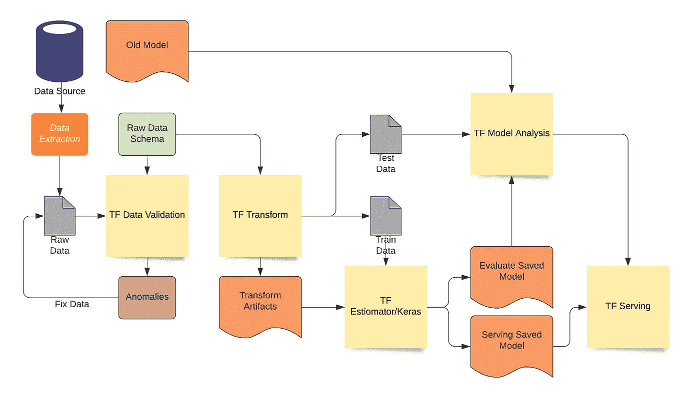
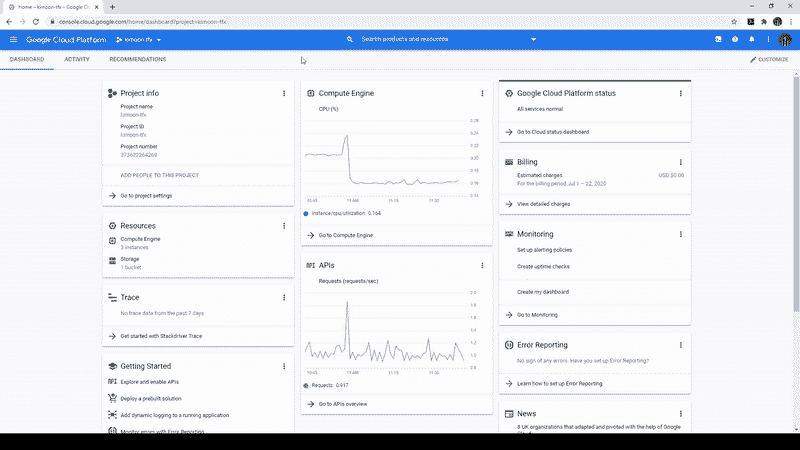
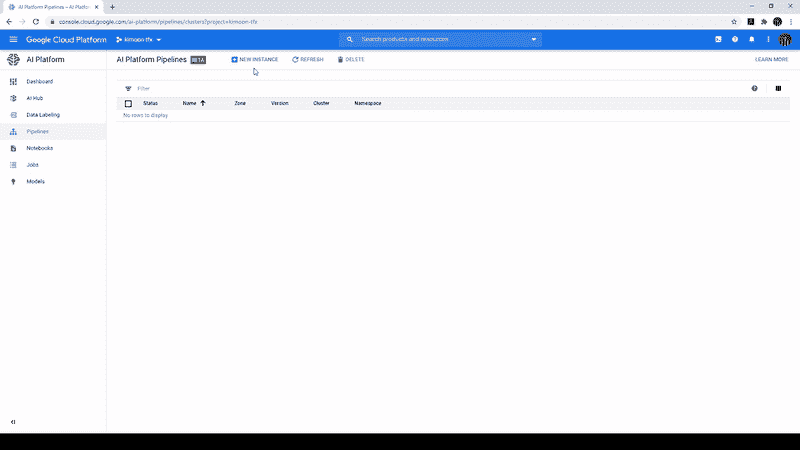
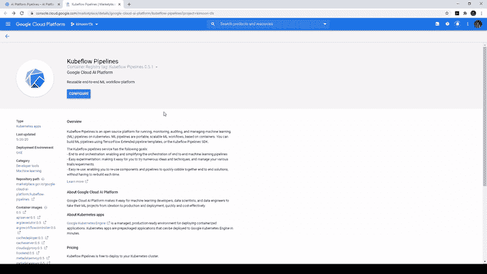
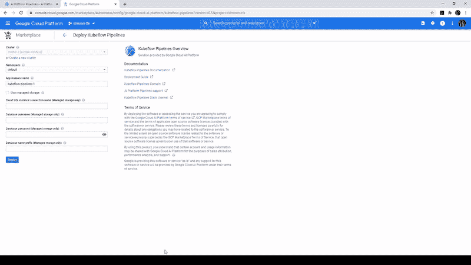
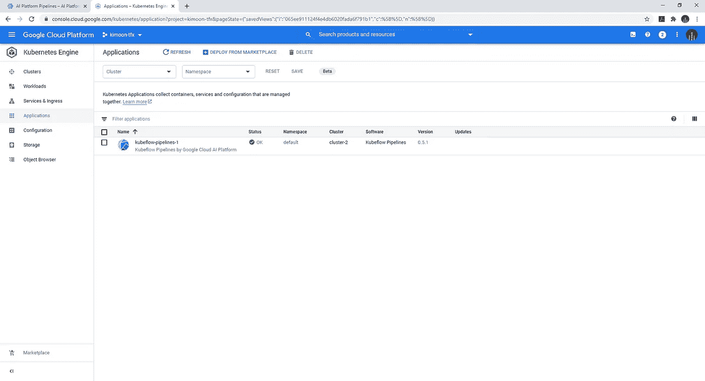
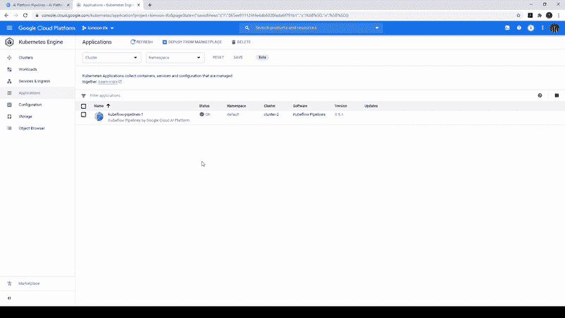
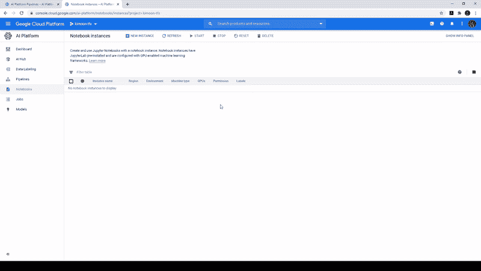
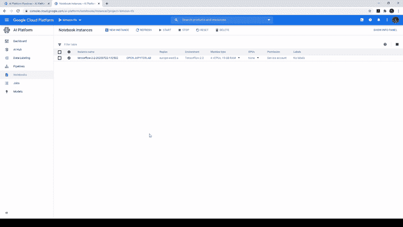
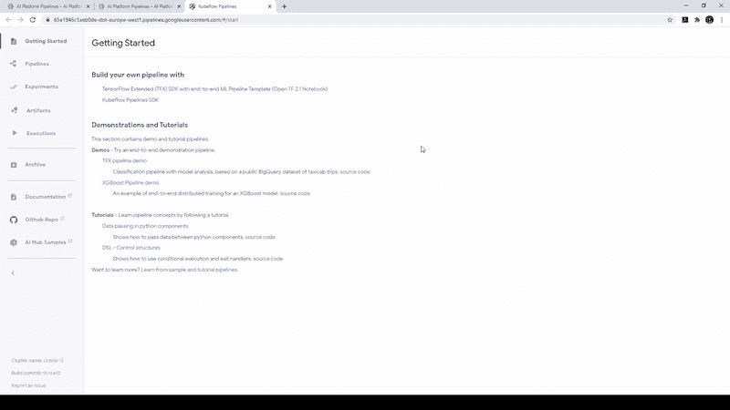

# 谷歌云人工智能平台 TFX 入门—第 1 部分

> 原文：<https://towardsdatascience.com/getting-started-with-tfx-on-google-cloud-ai-platform-part-1-9935cc2f7454?source=collection_archive---------59----------------------->

创建机器学习(ML)模型通常是世界各地许多数据科学家和工程师的核心关注点。然而，他们经常忘记计划一旦模型建成，他们将如何生产。这通常不是他们的错(大多数情况下)，因为大多数情况下，不同的部门负责不同的生产领域，例如，数据科学家团队负责创建模型，开发人员团队负责打包模型以供使用。这通常会导致:

*   模型没有定期更新，因为反馈循环通常是手动的，即收集的数据交给数据科学家团队来评估和更新模型。更新的模型然后被交给开发团队。我见过这样的过程，至少需要几个星期！
*   维护模型的运营成本增加，因为有多个团队负责模型的生命周期。

因此，Google/TensorFlow 的团队意识到，以上是围绕客户想要生产他们的模型的一个共同主题，所以他们创建了 TensorFlow Extended (TFX)。

TFX 是一个平台，它允许用户为他们的 TensorFlow 代码创建端到端的生产规模的 ML 管道。它包括建模、培训、验证、服务推理和管理在线部署。机器学习管道可以使用任何编排工具来构建，如 Apache Airflow、Apache Beam 或 Kubeflow。必须注意的是，本文中的流水线是对 ML 工作流的描述，它们以图表的形式组合，可用于编排和自动化机器学习系统。出于本文的目的，我们将通过 TFX 使用 Kubeflow 管道。

TFX 使用的主要库是:

*   **TF 数据验证** —用于异常检测
*   **TF 变换** —用于数据预处理和特征工程
*   **TF 估计器和 Keras** —建立和训练机器学习模型
*   **TF 模型分析** —模型评估与分析
*   **TF 服务** —将模型作为 REST APIs 服务

下图显示了在端到端模型中使用的各种 TFX 库，我们将在下一系列文章中详细介绍它们。然而，在这篇文章中，我们将在谷歌云平台上建立一个基础，以了解 TFX 和库伯流的行动。

图片改编自[1]

# 1.在新的 Kubernetes 集群上建立 AI 平台管道。

我们将假设你们有一个项目与本教程启用计费。

放心吧！本教程保持在免费层的限制，但是，如果你耗尽了免费层的限制，你可能会被收费。如果您想遵循本教程，建议您创建一个新项目。

1.  在导航窗格中，找到人工智能菜单下的“AI 平台”，点击**管道**，如下图所示。

2.点击“**新实例**，创建一个新集群，如下图所示。您将被引导至 Kubeflow Pipelines 概览页面。

3.在 Kubeflow Pipeline 概览页面上，点击“**配置**”。

注意:在启用 Kubernetes 引擎 API 时，您可能需要等待几分钟。

*   在“部署 Kubeflow 管道”页面上，选择离您最近的区域。离我最近的区域是“欧洲-西方 2-a”。
*   选中标记为“允许访问以下云 API”的框。
*   然后点击**创建集群**。这需要在进入下一步之前完成。

4.创建集群后，您可以选择名称空间和实例名称。我将保留我的默认设置。

您应该可以成功地看到您的 Kubernetes 集群中启动了 Kubeflow 管道，如下所示。

现在我们要设置一个云 AI 平台笔记本实例。

# 2.设置云人工智能笔记本实例。

1.  回到主导航菜单，在人工智能菜单下找到“AI 平台”，点击**笔记本**，如下图所示。

2.继续点击“**新实例**，选择“ **Tensorflow 2.2 - >不带 GPU**”。

*   注意:您可以通过单击新笔记本实例表单底部的定制来更改机器。

现在我们可以做的是从我们的人工智能渠道推出一款笔记本电脑。

# 3.启动入门笔记本

1.  我们现在可以点击“管道”按钮，它应该会把我们带到人工智能平台管道页面。然后，我们可以点击“Open Pipelines Dashboard”进入“入门页面”。

2.在“入门页面”上，单击“打开 TF 2.2 笔记本”链接，并选择您已创建的笔记本实例。

您现在可以访问与 Kubeflow 链接的 Jupyter 实验室笔记本，将会打开一个模板笔记本。

在我的下一个系列中，我将使用简单的数据，通过简单的步骤，使用 TFX 管道生产您的模型。对于那些等不及的人，你可以通过谷歌的“**使用模板创建一个 TFX 管道**”笔记本，它是默认打开的。

玩得开心！

[1] TFX 管道—[https://cloud . Google . com/solutions/machine-learning/architecture-for-m lops-using-tfx-kube flow-pipelines-and-cloud-build](https://cloud.google.com/solutions/machine-learning/architecture-for-mlops-using-tfx-kubeflow-pipelines-and-cloud-build)