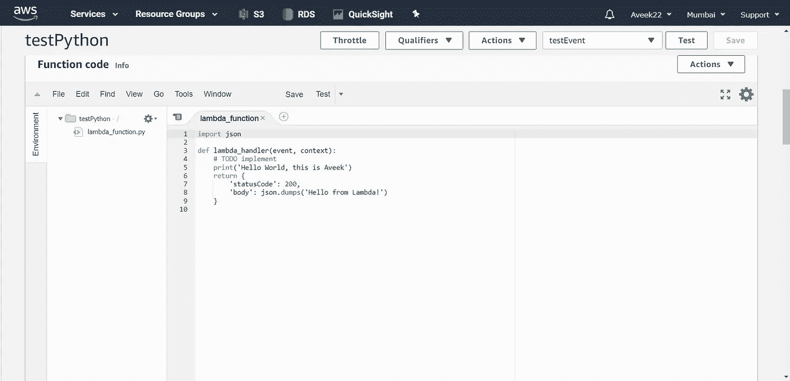
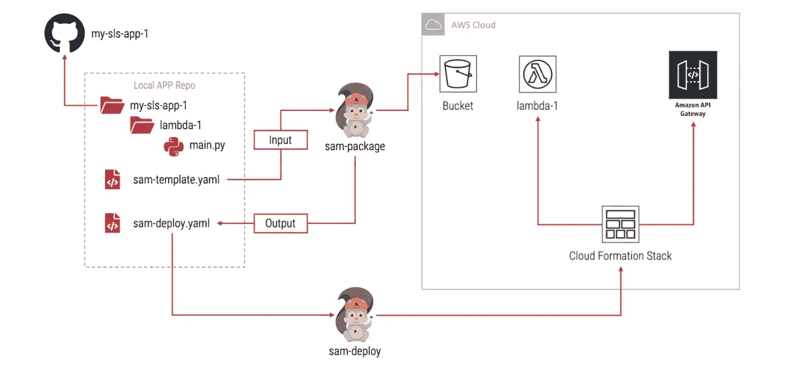
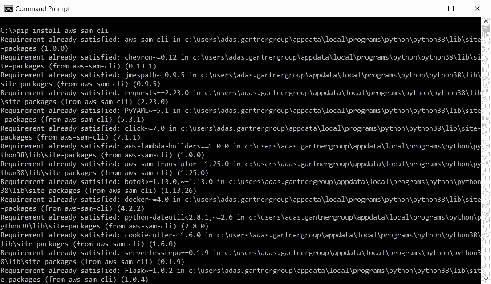

# AWS SAM CLI 入门

> 原文：<https://towardsdatascience.com/getting-started-with-the-aws-sam-cli-f68062674c20?source=collection_archive---------50----------------------->

## 了解如何使用 AWS SAM CLI 在本地调试 lambda 函数

图片来自 [Unsplash](https://unsplash.com/photos/EaB4Ml7C7fE)

在本文中，我们将学习 AWS SAM CLI 的概念。SAM，缩写为**无服务器** **应用** **模型**是亚马逊网络服务提供的一个框架，可以用来在本地机器上构建应用，并直接将这些应用部署到 AWS Lambdas。

# 初始背景

以前，在引入 AWS SAM CLI 之前，开发人员使用在线编辑器直接在 AWS Lambda 上编写、测试和部署代码。这是通过使用 AWS 管理控制台创建 Lambda 函数来完成的。当创建函数时，您可以使用 AWS Lambda 提供的在线代码编辑器在其中添加代码。

*图 1 —在内嵌代码编辑器(AWS Lambda)中编写代码*

虽然，这似乎是一种不用部署就可以编写和测试代码的非常方便的方式，如果您有非常简单的函数，其中不包含太多复杂的逻辑，或者您是单独处理它，这种方式也很好。然而，将你的代码放在在线代码编辑器中的想法对我来说听起来很吓人。在这个过程中，您不能完全控制您的代码。如果万一有人不小心删除了您的函数，那么您必须从头开始重新编写代码，这是我们作为开发人员应该避免的事情。

相反，在这个基础设施即代码的时代，大多数事情都可以通过编写代码来实现，我们应该考虑一个更健壮的想法，代码可以进行版本控制并易于管理。市场上有很多工具可以用来编写和开发您的功能，一旦准备好进行部署，您就可以使用 AWS Lambda 提供的本机流程将其部署到在线服务。

# 了解 AWS 中的无服务器功能和应用

AWS 中的无服务器函数或 Lambda 函数是一段代码，可以用任何支持的语言编写，如 C #、Python、NodeJS、Ruby 等。该代码可以部署在 AWS 上，并基于触发事件执行。AWS 中有许多受支持的事件，如 API Gateway，可用于触发 Lambda 函数。除此之外，还有其他事件，如 S3 事件、SNS 话题、SQS 排队等。所有这些事件都可以用来触发 Lambda 函数的执行。

另一方面，无服务器应用程序是为实现特定目标而工作的类似服务的组合。这样的应用程序可能包含一个或多个 Lambda 函数，并结合其他 AWS 服务，如 DynamoDB 表或 SNS 主题。

# 什么是 AWS SAM —无服务器应用程序模型

SAM 是由 Amazon 开发的开源框架，它帮助我们定义无服务器资源，如 Lambda 函数、API 网关以及其他一些资源。SAM 使用 CLI(称为 SAM CLI)提供对 API 的访问。在这个实用程序的帮助下，您可以轻松地定义您的资源，并将这些资源部署到 AWS 中的任何环境，而不需要做太多的手工工作。SAM 基于先前建立的云形成模板。如果您已经有了一些使用云形成堆栈部署无服务器资源的经验，那么使用 AWS SAM CLI 对您来说会非常容易。

现在我们对 AWS SAM 有了一些了解，让我们继续尝试查看底层工作流。

图 2-SAM 工作流程(来源: [YouTube](https://www.youtube.com/watch?v=bih5b3C1nqc&t=191s)

如果你看到上图，你可以看到有两个主要部分——一个是“本地应用程序回购”,第二个是“AWS 云”。在本地 repo 中，有一个根目录“ *my-sls-app-1* ，类似于一个无服务器的应用。在该应用程序中，有另一个目录“ *lambda-1* ”，这是 lambda 函数的目录。在 lambda 函数目录下，有我的“ *main.py* ”文件，我可以在其中编写 lambda 函数的代码。这里需要注意的重要一点是，在根应用程序目录下，可以定义多个 lambda 函数和其他 AWS 资源。然而，为了简单起见，我想把它限制为一个 lambda 函数。

您可以看到的下一项是“ *sam-template.yaml* ”，这是 sam 框架将用来部署应用程序的模板。我将在本系列的后面解释它。这个模板有点类似于云的形成模板，其中有一些小的修改。如果你熟悉云的形成模板，那么你可以很容易地使用它。一旦开发了代码，就可以运行“ **sam-package** ”命令，该命令将使用该模板作为 sam 框架的输入，然后将其转换为云形成模板，并以“ *sam-deploy.yaml* ”的名称存储。除了生成部署模板之外，SAM 框架还创建 lambda 函数的 zip 文件，并将其上传到 S3 的预定义 bucket 中。此上传文件的 URL 将出现在部署模板中以供参考。

一旦部署模板准备好了，现在就可以将资源部署到 AWS 云中了。为此，您需要运行" **sam-deploy** "命令，该命令将 deploy 模板作为输入，并基于 AWS Lambda 函数、API 网关等资源创建云形成堆栈。在 SAM 模板文件中指定的。该部署不仅可以用于部署 Lambda 函数，还可以用于部署其他服务，如 API 网关、SNS 主题、SQS 队列、Dynamo DB 表等。这都是关于创建和部署您的无服务器应用程序。

# 使用 AWS SAM 的好处

AWS SAM 能够与其他 AWS 服务集成，因此为我们提供了许多可以利用的优势。

*   **单一部署配置** —通过使用 AWS SAM，您可以在属于同一堆栈的单一位置轻松管理所有必要的资源
*   **AWS 云形成的扩展** —由于 SAM 是作为现有云形成的扩展而构建的，因此您可以获得相同部署能力的可靠性。有了这个，你还可以使用萨姆·YAML 模板中云形成的所有可用资源
*   **本地调试和测试** —在 AWS SAM CLI 的帮助下，您现在可以在本地执行和测试您的无服务器应用程序。CLI 通过挂载 docker 映像并运行代码，在本地提供类似 Lambda 的执行环境。这有助于您轻松地单步调试代码，并找出在 lambda 环境中直接从控制台运行代码时可能检测不到的问题

# 安装 SAM CLI

到目前为止，我们已经合理地了解了 AWS SAM。现在让我们继续学习如何在我们的本地机器上安装相同的组件。假设您的机器上已经安装了 python，您可以通过运行以下命令来安装 CLI。

*pip 安装 aws-sam-cli*

*图 3 —使用 PIP 安装 SAM*

我已经在我的机器上安装了相同的程序，所以我得到消息“已经满足*要求*”。但是，如果您是第一次安装它，它将根据需要下载 SAM 包和所有必需的依赖项。

# 结论

在本文中，我们已经了解了 AWS 无服务器应用程序模型(SAM)是什么，以及如何使用它来开发无服务器应用程序。此外，我们还了解了它的工作流程以及如何打包和部署无服务器应用程序。在我即将发表的文章中，我将演示在本地调试和测试无服务器应用程序，以及如何使用 SAM CLI 打包和部署该应用程序。

*原载于 2020 年 8 月 17 日*[*【https://www.sqlshack.com】*](https://www.sqlshack.com/getting-started-with-the-aws-sam-cli/)*。*