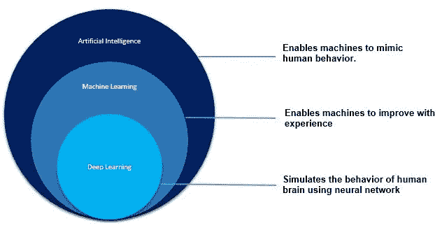
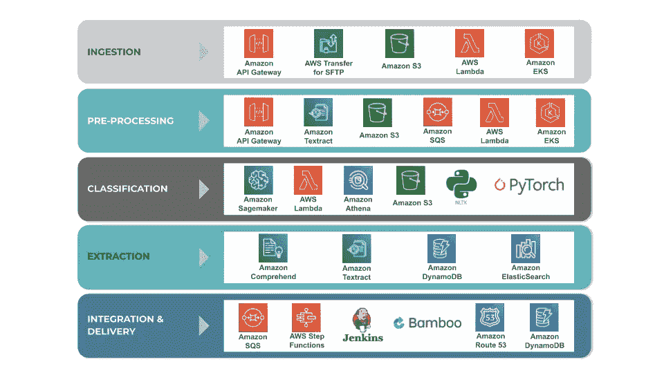
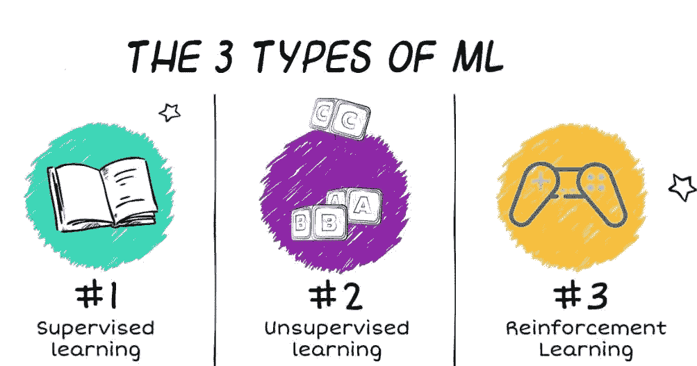
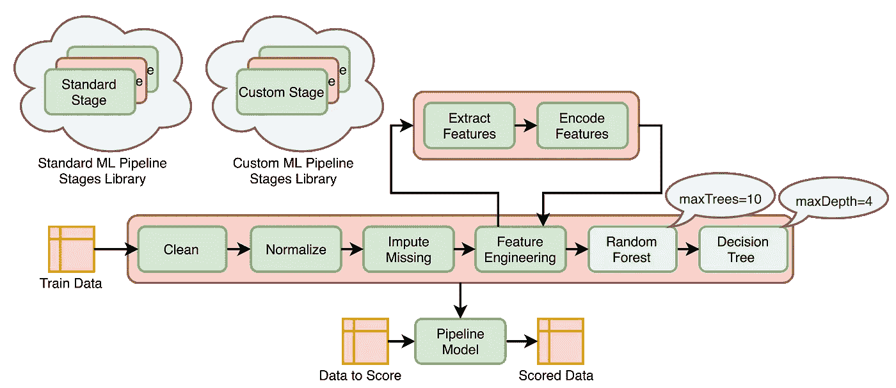
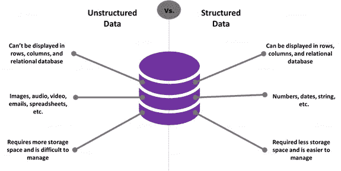
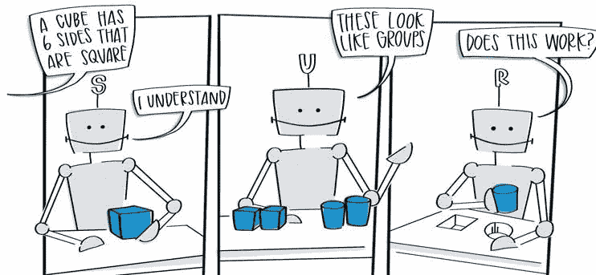

# 揭开机器学习的面纱

> 原文：<https://towardsdatascience.com/getting-started-with-the-basics-of-machine-learning-35954a94e961?source=collection_archive---------44----------------------->

来自 [Dribbble](https://dribbble.com/shots/14752125/attachments/6455376?mode=media) 的 Hurca 图片

## 当机器在学习的时候，人类被钩住了

机器学习是目前业界最热门的术语之一。全球科技巨头，如谷歌、亚马逊脸书等，都试图在他们的产品中利用机器学习的力量。尽管有抱负的数据科学家的机会呈指数增长，但仍有一大群人不清楚机器学习是什么。

这就是我来这里帮助你的原因。这篇文章将是名为**机器学习秘诀**的系列文章的第一篇，其中我们将研究机器学习的各个方面，首先是理论，然后是数学，最后是实践。

在这篇文章中，我将试图给你一个直觉，不仅关于什么是机器学习，而且它的不同类型，最近的发展，以及开始机器学习的最佳资源。

# 什么是机器学习？

机器学习是人工智能(AI)的一种应用，它为计算机或任何机器提供了从经验中学习和改进的能力，而无需显式编程。机器学习背后的目标是让机器在没有明确编程的情况下自己做事情。

图片由 [Gerd Altmann](https://pixabay.com/users/geralt-9301/?utm_source=link-attribution&utm_medium=referral&utm_campaign=image&utm_content=2769210) 从 [Pixabay](https://pixabay.com/?utm_source=link-attribution&utm_medium=referral&utm_campaign=image&utm_content=2769210) 拍摄

让机器做事情背后的原因是它们在不疲惫的情况下提供高精度的结果。人类执行的任务的质量可能会有所不同，有时也会令人疲惫不堪，但机器可以高精度地完成高频率的重复任务，而不会感到疲劳或厌倦。

自从互联网出现以来，数据生成量一直在显著增加。每当我们在网站或应用程序上采取任何行动时，我们都在生成数据。随着云计算的发展，存储数据的成本也大大降低，为 ML 及相关领域的进一步发展铺平了道路。

# 人工智能 vs 机器学习 vs 深度学习

该领域的初学者面临的最大困惑之一是人工智能(AI)、机器学习(ML)和深度学习(DL)之间的区别。

人工智能是一种使机器能够模仿人类行为的技术。人工智能的最终目标是制造能够执行人类任务并做出自己聪明决定的智能机器。

**机器学习**是人工智能的一个子部分，它使用统计方法，使机器能够在没有明确编程的情况下根据经验进行改进。

图片由[作者](http://ashwinraj-in.medium.com)

**深度学习**是 ML 的一个子部分，它利用神经网络(类似于人类的神经元)来模拟类似人脑的行为。当数据集包含大量的观察值或数据点时，深度学习就会发挥作用。

另一个通常与机器学习混淆的重要术语是数据科学。**数据科学**是对我们为各种洞察生成的数据进行分析，这些洞察有可能服务于多种商业目的。

## **机器学习中使用的工具**和**编程语言**

有几种工具和语言可用于执行机器学习。工具的具体选择可能会有所不同，所使用的工具取决于作业的需要和规模。

图片来自 [Quantiphi](https://www.google.com/url?sa=i&url=https%3A%2F%2Fwww.quantiphi.com%2Fcognitive-document-processing%2Fdocument-processing-technology-stack%2F&psig=AOvVaw1GCnwU6SEX9uwtyl0oeBmG&ust=1605021873454000&source=images&cd=vfe&ved=0CAMQjB1qFwoTCMiw9Mbi9ewCFQAAAAAdAAAAABAO)

Python 和 R 是机器学习编程语言的首选。数据通常存储在 **CSV 格式的**文件中，尽管也可以使用 excel 表格。除此之外，统计学的基础知识对于理解机器学习算法是必要的。

# 分类 ML 算法

有各种机器学习算法可以用在各种不同的情况下。通常有三种不同类型的机器学习算法，即**监督学习**、**非监督学习、**和**强化学习**。

图片由[作者](http://ashwinraj-in.medium.com)

**有监督的机器学习:**有监督的机器学习问题是我们要基于一组例子进行预测的问题。

*   **回归问题:**结果为离散值的问题属于回归范畴。举个例子——房子的价格是一个回归问题。
*   **分类问题:**当我们要把结果分成不同的类别时。例如，癌症是恶性还是良性是一个分类问题。结果可以分为两类——恶性或良性。同样，客户是否会拖欠贷款也是一个分类问题，投资金融的公司对此非常感兴趣。

**无监督机器学习:**无监督机器学习问题是指我们的数据没有一组定义好的类别，而是我们在寻找机器学习算法来帮助我们组织数据的问题。

图片由[Bores biletsky](https://medium.com/@borys.biletskyy?source=post_page-----c664befe1c2d--------------------------------)

无监督机器学习问题的例子可以是基因组学。在基因组学中，我们提供了一种具有数千个不同基因的算法，然后该算法将这些基因聚类成相关基因的组。这可能是与寿命、头发颜色等相关的基因。结果通常通过**聚类**或**分割**获得。

无监督学习的各种算法包括 **k 均值聚类、层次聚类、**和**神经网络**。

最近另一种类型的机器学习研究正在获得火花，这就是**强化学习**。它通常被视为真正人工智能的希望。强化学习(RL)是机器学习的一个领域，涉及软件代理应该如何在环境中采取行动，以最大化累积回报的概念。

# **用于训练机器学习模型的数据**

用于训练 ML 模型的数据量取决于我们试图解决的问题。有各种在线存储库，您可以在其中找到用于训练和构建机器学习模型的数据集。

为你的模型获取数据的一些最受欢迎的网站是 **Kaggle** 、 **UCI 机器学习库、**和**谷歌数据集搜索**。

图片来自 [Intellipaat](https://www.google.com/url?sa=i&url=https%3A%2F%2Fintellipaat.com%2Fblog%2Ftutorial%2Fmachine-learning-tutorial%2Fdatasets-in-machine-learning%2F&psig=AOvVaw1HwOSZQJfTwkiRKKBtJc-q&ust=1605021036212000&source=images&cd=vfe&ved=0CAMQjB1qFwoTCPjSmczf9ewCFQAAAAAdAAAAABBr)

如今有大量的数据可用。从网站和智能手机上的日志到健康设备，我们处于不断创建数据的过程中。

数据可以大致分为两种类型:

1.  **结构化数据:**结构化数据通常是指以表格形式存储在组织中的数据库中的数据。
2.  **非结构化数据:**非结构化数据包括所有获取的数据，但不是以表格的形式存储在企业中。

机器学习模型可以处理结构化和非结构化数据。然而，在实际构建机器学习模型之前，我们需要首先将非结构化数据转换为结构化数据。

# 构建机器学习模型的步骤

建立机器学习模型的第一步是**数据收集**。数据收集是指在既定系统中收集和测量目标变量信息的过程。

然后是为我们的模型清理和操作数据。**数据探索和清理**帮助我们去除异常值和缺失值，并将数据转换成所需的格式。

图片来自 [Ceralytics](https://www.google.com/url?sa=i&url=https%3A%2F%2Fwww.ceralytics.com%2F3-types-of-machine-learning%2F&psig=AOvVaw3ryoLSV4Kcs8CAGDMDWk2a&ust=1605021586600000&source=images&cd=vfe&ved=0CAMQjB1qFwoTCIDKtcLh9ewCFQAAAAAdAAAAABAO)

一旦我们的数据准备好了，我们**在训练数据上训练模型**，然后在测试数据上测试它。我们的最后一步是改进我们的模型，以获得更好的准确性。

这只是一个简短的介绍，让您直观地了解构建和部署机器学习模型所涉及的步骤。我们将在接下来的文章中详细讨论这些步骤。

# 机器学习的最佳资源

实践机器学习的一些最佳资源是:

1.  由 Coursera 提供的吴恩达**机器学习**和
2.  ****机器学习纳米学位**由 Udacity 提供**
3.  **谷歌的机器学习速成班**
4.  **Coursera 提供的机器学习专业**

**正如多次提到的，机器学习是一个非常活跃的研究领域。从吴恩达到彼得·诺维格，顶级专家和研究人员的贡献怎么说都不为过。**

**你在正确的时间选择了正确的职业。快乐学习！**