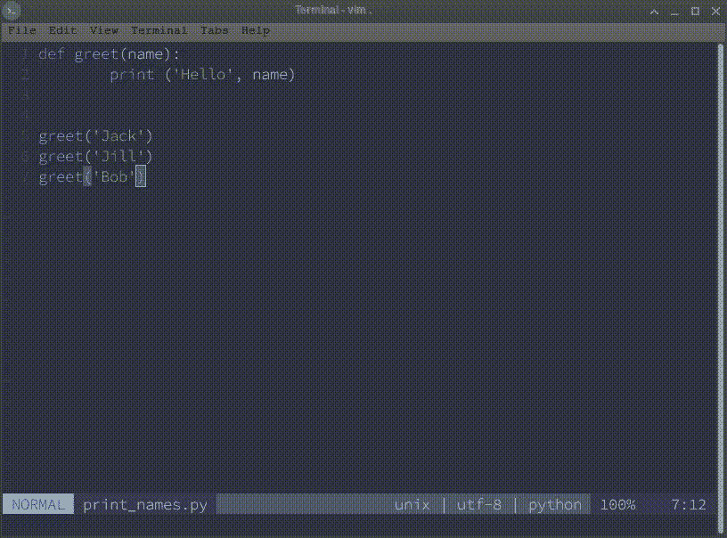
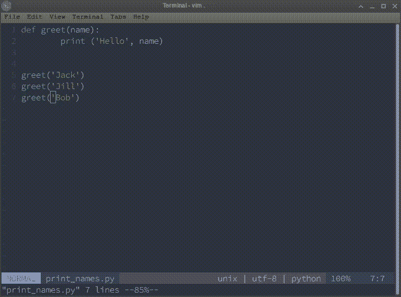
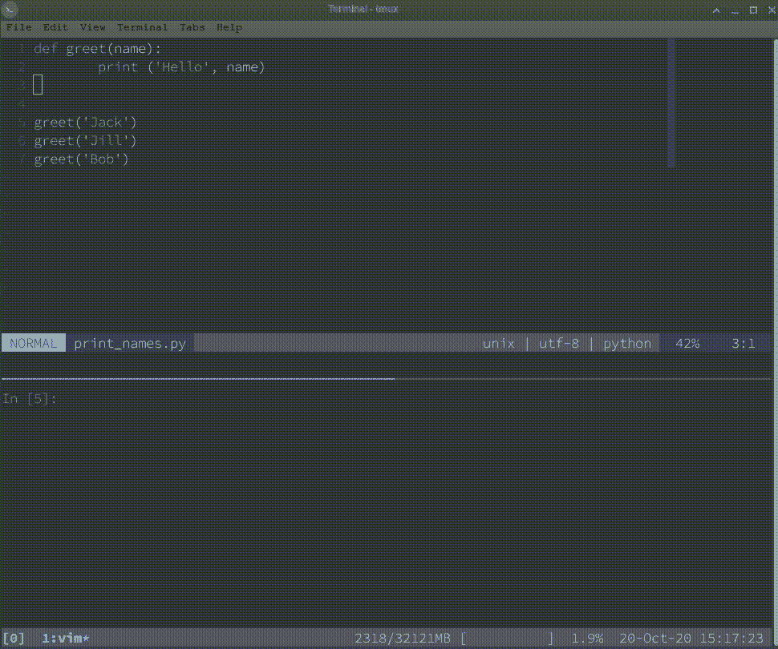
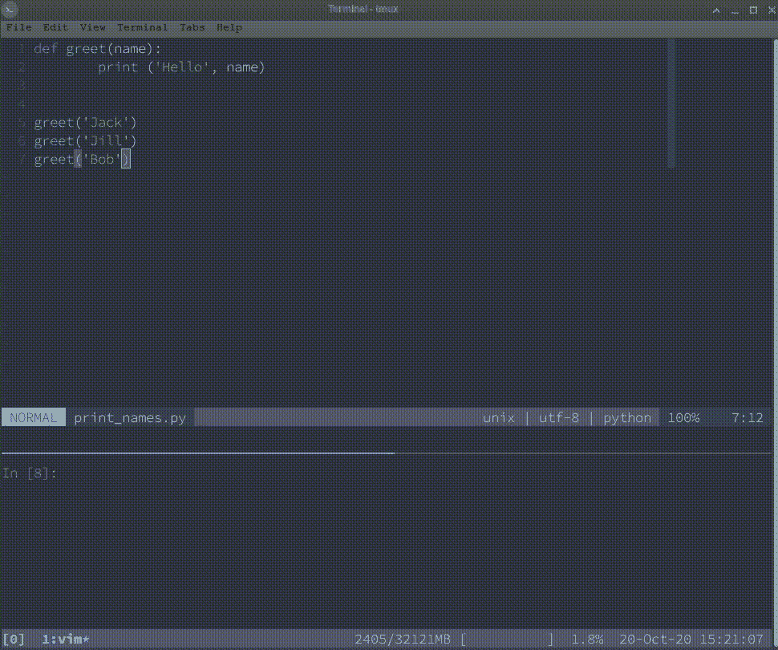
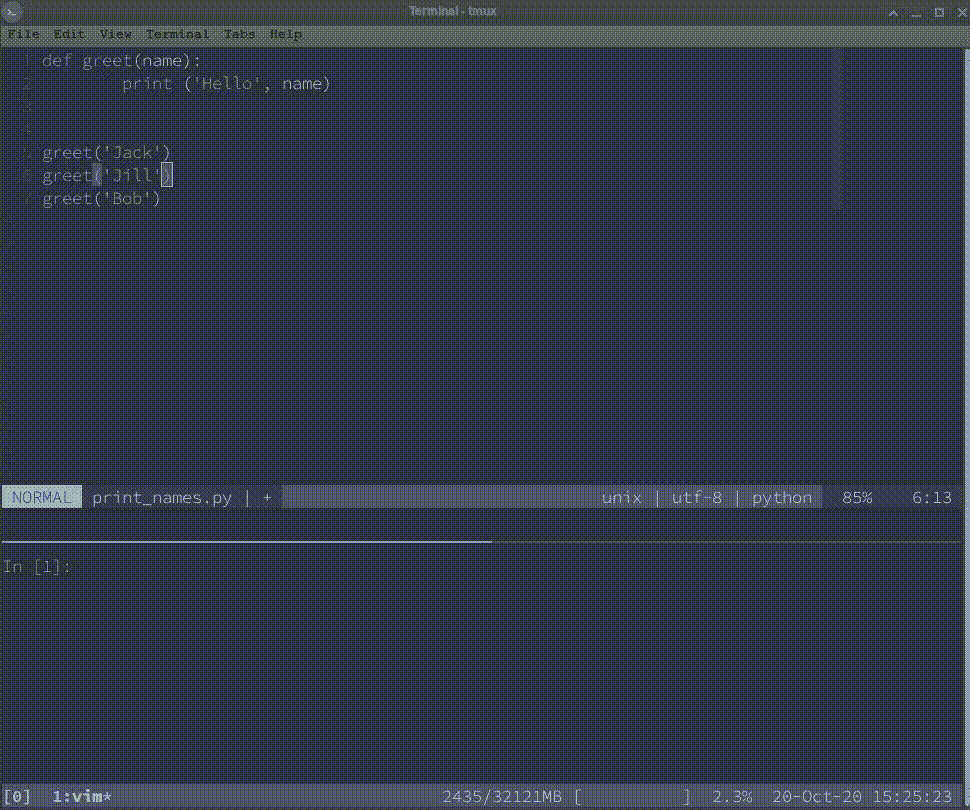

# Python 的 Vim 和 Tmux 入门

> 原文：<https://towardsdatascience.com/getting-started-with-vim-and-tmux-for-python-707ec5ff747f?source=collection_archive---------8----------------------->

## 如何从 Vim 中的 IDE 获得您想要的特性


尼奥诺韦在 [Unsplash](https://unsplash.com/@nihongraphy) 拍摄的照片

如果你用多种语言编写代码，你可能会发现为每种语言维护一个 IDE 是一件令人厌倦的事情。经过一些试验后，我发现 Vim 和 Tmux 的组合是我的理想解决方案。主要好处是:

一个支持任何语言的环境

高效的纯键盘文件编辑

易于在任何新环境中安装

然而，作为一个文本编辑器而不是 IDE，这个解决方案缺少一些现成的重要特性。幸运的是，Vim 和 Tmux 都是高度可配置的。

本文展示了如何配置 Vim 和 Tmux 来支持 Python 开发的一系列关键特性。虽然 Tmux 起着重要的作用，但是大多数配置都与 Vim 有关。

## 先决条件:

这个工作流被设计成在像 Linux 或 MacOS 这样的 Unix 系统上运行。首先，创建一个*。在 *home/* 目录下的 vimrc* 文件以及一个空文件夹*。vim/。*安装 Vim、Tmux 和(可选)IPython。通过*对 Vim 及其配置有所了解。假设 vimrc* 文件。如果你不知道如何安装 Vim 插件，看看这篇文章。

# 哪些功能是真正必要的？

下面是一个观点鲜明的特性列表，这些特性使得在 Vim 中开发 Python 更加明智:

1.一个多语言环境

2.容易到达终端

3.流畅的目录浏览

4.将代码行发送到 Python 控制台

5.在终端中运行 Python 文件

6.交互调试

# 1.一个多语言环境

可以为每种文件类型单独配置 Vim。例如，可以将 Vim 配置为在打开 Python 文件时使用四个空格，而在打开 R 文件时使用两个空格。要启用特定于文件的设置，将以下行放入*。vimrc* 文件:

`filetype plugin indent on`

`indent`部分支持文件特定的缩进。

创建目录*。vim/after/ftplugin* 。在 *ftplugin* 中的文件以语言命名(例如 python，json，r，sh ),并且有。vim 扩展。下面是 JSON、Python、R 和 Bash 的一个例子:

```
.vim/
└── after
    └── ftplugin
        ├── json.vim
        ├── python.vim
        ├── r.vim
        └── sh.vim
```

这个想法就是把任何*。将只适用于特定语言的 vimrc* 配置放入 *ftplugin* 中的相应文件中。从这个意义上来说， *ftplugin* 中的文件可以被视为“特定于语言的*”。vimrc* 文件。这些文件来源于*之后。vimrc* 并覆盖任何常规设置*。*

例如，Python 特定的缩进应该放在 *python.vim* 文件中:

```
setlocal tabstop=4
setlocal shiftwidth=4
setlocal softtabstop=4
setlocal expandtab
```

注意`setlocal`的使用，以便这些设置仅覆盖来自*的一般设置。vimrc* 文件**仅用于当前缓冲区**。

本文接下来的章节遵循惯例，将特定语言的设置放在 *ftplugin* 中，将通用 Vim 设置放在*中。vimrc* 。

## 参考资料:

[保持你的 vimrc 干净](https://vim.fandom.com/wiki/Keep_your_vimrc_file_clean)

# 2.容易到达终端



作者图片

只有当 Vim 在终端内部运行时，此功能才有效。在这种情况下，可以通过运行 Ex 命令来挂起 Vim:

```
:stop<CR>
```

这会将 Vim 移到后台，并将屏幕切换回调用 Vim 的终端。在终端中运行`fg`将 Vim 移回前台。

在 Vim 和全屏终端之间切换非常方便，值得在*中创建一个映射。vimrc* :

```
nnoremap <leader>t :stop<CR>
```

## 参考资料:

[终端 Vim 与 GUI](https://stackoverflow.com/questions/2149456/reasons-for-using-command-line-vim-versus-gui-vim)

# 3.流畅的目录浏览



作者图片

ide 通常提供一个文件浏览器，作为[项目的抽屉](http://vimcasts.org/blog/2013/01/oil-and-vinegar-split-windows-and-project-drawer/)。这种方法不能很好地与 Vim 的窗口风格工作流相结合。毕竟，Vim 如何知道您希望在哪个窗口中打开您从项目抽屉中选择的文件？

Vim 已经自带了一个名为 **netrw** 的内置插件。为了理解这个插件，把 Vim 窗口想象成翻转的卡片:一边是你的文件，另一边是 netrw 文件浏览器。

在*中为文件浏览映射两个键绑定很有用。vimrc* 。第一个在当前文件的目录下打开 netrw。第二个键绑定在当前工作目录打开 netrw。

```
nmap <leader>f :Explore<CR>
nmap <leader><s-f> :edit.<CR>
```

尽管 Netrw 有一些恼人的默认设置。建议将这两个额外的 netrw 设置放在*中。vimrc* 。第一种设置允许以右分割方式打开文件。第二个设置禁止 netrw 保存。文件中的 netrwhist 文件。vim 文件夹。

```
let g:netrw_altv = 1
let g:netrw_dirhistmax = 0
```

最后，一个名为**vim-醋**的最小插件使 netrw 更加明智，并提供了几个有用的快捷方式:

*   在任一缓冲区中按下`-`键，跳到目录列表，并找到您刚来的文件。
*   在一个文件上按下`.`,在`:`命令行的末尾预先填充它。还有`!`，砰的一声启动生产线。
*   按`y.`键，拖动光标下文件的绝对路径。

## 参考资料:

*   你不需要 NERDTREE 或者(可能)netrw
*   [油和醋——分窗和项目抽屉](http://vimcasts.org/blog/2013/01/oil-and-vinegar-split-windows-and-project-drawer/)
*   [维姆醋](https://github.com/tpope/vim-vinegar)

# 4.将代码行发送到 Python 控制台



作者图片

Tmux 允许将屏幕水平分割成两个终端窗口:上面一个用于 Vim(可能有多个垂直分割窗口),下面一个包含一个 IPython 控制台。如果您不喜欢 IPython，上面的过程在常规的 Python 控制台上也能很好地工作。

接下来，插件 **vim-slime** 用于将选定的代码从 vim 发送到 IPython 控制台。下面对*中的配置进行说明。vimrc* 文件支持这种行为:

```
let g:slime_target = "tmux"
let g:slime_default_config = {"socket_name": get(split($TMUX, ","), 0), "target_pane": ":.1"}
```

按下`C-c, C-c`(按住 Ctrl 并双击 C)将光标下的段落发送到 IPython 控制台。(第一次 vim-slime 会提示目标窗格。按两次 Enter 键。)

上面的过程与语言无关:同样的过程允许将 R 代码行发送到 R 控制台，或者将 Bash 脚本中的行发送到终端。

## 参考资料:

*   [vim-slime](https://github.com/jpalardy/vim-slime)
*   [Tmux 之道](https://leanpub.com/the-tao-of-tmux/read)

# 5.在终端中运行 Python 文件



作者图片

在终端中有运行当前脚本的快捷方式很方便。通常，这是通过调用解释器后跟文件名来实现的:

```
python filename.py
```

在 *python.vim* 中定义的以下映射运行两个连续的 Ex 命令:

```
nmap <buffer> <leader>r <Esc>:w<CR>:!clear;python %<CR>
```

它是这样做的:

1.  第一个 Ex-command `:w<CR>`保存文件。
2.  第二个 Ex-command 以`:!`开始，表示它是针对终端的，用`:clear`清除终端，最后调用当前文件的解释器`python %<CR>`，其路径由`%`给出。

注意，这种映射是特定于语言的。运行 bash 脚本的类似映射可以定义如下:

```
nnoremap <buffer> <leader>r <Esc>:w<CR>:!clear;sh %<CR>
```

## 参考资料:

[在 Vim 中运行 Python 代码](https://stackoverflow.com/questions/18948491/running-python-code-in-vim)

# 6.交互调试



作者图片

调试是 ide 真正大放异彩的领域。尽管如此，通过安装 Python **ipdb** 可以在 Vim 中获得令人满意的调试体验。

模块 ipdb 类似于 **pdb** ，但是是为 IPython 设计的。它不必安装，因为它附带了 IPython。它允许用`set_trace()`定义一个断点，该断点将在该点暂停程序，并丢弃启动调试器，在调试器中可以使用 IPython 检查程序的状态。

*python.vim* 中的以下 Vim 映射在当前行下方放置了一个断点:

```
nmap <buffer> <leader>b oimport ipdb;ipdb.set_trace(context=5)<ESC>
```

上下文参数指定调试器显示的行数。

如果 IPython 是`embed`的话，这是一个很好的特性，它会在调试期间启动一个单独的 IPython 会话。在此会话中所做的更改不会影响原始调试会话中的对象。

```
ipdb> from IPython import embed
ipdb> embed()
```

对调试器命令的进一步讨论超出了本文的范围。它们在下面引用的文档中有很好的记录。

## 参考资料:

[pdb 文件](https://docs.python.org/2/library/pdb.html#debugger-commands)

# 结论

本文中的配置将帮助您开始使用 Vim 和 Tmux 进行 Python 开发。其他有用的特性，如林挺、代码完成和跳转到定义，都没有涉及到。看看我的[个人 Vim 配置](https://github.com/gontcharovd/vim)中更完整的例子。