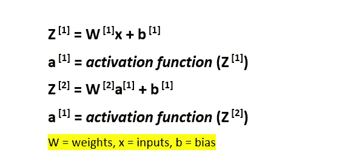
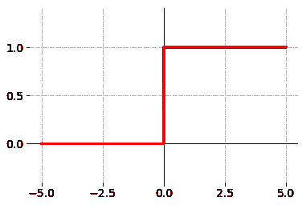
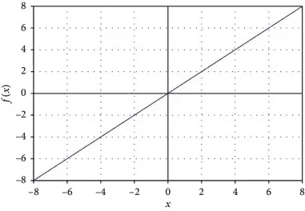
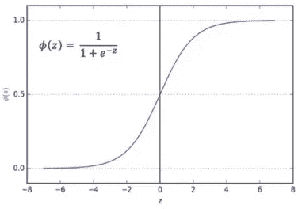
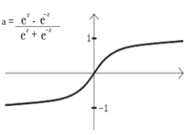
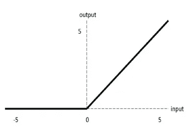
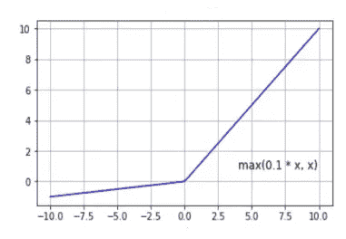

# 了解神经网络中的激活函数。

> 原文：<https://towardsdatascience.com/getting-to-know-activation-functions-in-neural-networks-125405b67428?source=collection_archive---------28----------------------->

## 什么是神经网络中的激活函数，为什么你应该知道它们？

马里乌斯·马萨拉尔在 [Unsplash](/s/photos/machine-learning?utm_source=unsplash&utm_medium=referral&utm_content=creditCopyText) 上的照片

如果你有实现神经网络的经验，你可能会遇到术语“激活函数”。这个名字有印象吗？没有吗？‘*relu，softmax 或者 sigmoid* 怎么样？好吧，这些是在今天的上下文中最广泛使用的激活函数中的一些。当我开始研究神经网络的时候，我不知道激活函数到底是干什么的。但是有一点，在没有激活函数的可靠知识的情况下，我不能继续实现我的神经网络。我做了一些调查，以下是我的发现…

# **什么是激活功能？**

简单来说，激活函数就是决定神经网络输出的数学方程。它们基本上决定去激活或激活神经元以获得期望的输出，因此得名*激活功能。现在，让我们进入数学…*

图 1

在神经网络中，作为数值的*输入数据点(x)* 被馈入神经元。每一个神经元都有一个*权重(w)* ，该权重将与输入相乘，并输出一个特定值，该值将再次馈入下一层的神经元。如图 1 所示，激活函数作为这个过程之间的数学门发挥作用，并决定某个神经元的输出是开还是关。

激活功能可以分为三个主要类别；二元阶跃函数、线性激活函数和非线性激活函数。然而，非线性激活函数由几种类型的函数组成。让我们深入了解一下…

## **1。二元阶跃函数**

[二进制步进激活功能](https://www.google.com/url?sa=i&url=https%3A%2F%2Fgithub.com%2Fsiebenrock%2Factivation-functions&psig=AOvVaw0fwQkgSppB9xSYO1Xzoca_&ust=1593106446820000&source=images&cd=vfe&ved=0CA0QjhxqFwoTCMCKvZ7-muoCFQAAAAAdAAAAABAD)

二元阶跃函数是一种基于阈值的激活函数，即在某一阈值神经元被激活后，低于该阈值的神经元被去激活。在上图中，阈值为零。顾名思义，这个激活函数可以用在二进制分类中，但是它不能用在需要处理多个类的情况下。

## **2。线性激活功能**

[线性激活功能](https://www.google.com/url?sa=i&url=https%3A%2F%2Fwww.researchgate.net%2Ffigure%2FLinear-activation-function-It-is-one-of-the-simplest-activation-functions-and-it-is_fig4_339172446&psig=AOvVaw3ZM7UzEWQJJcI-mnpcasPa&ust=1593106661995000&source=images&cd=vfe&ved=0CAIQjRxqFwoTCICqy_7-muoCFQAAAAAdAAAAABAD)

在这里，我们的函数(输出)与神经元的加权和成正比。线性激活函数可以处理多个类，不像二元阶跃函数。然而，它也有自己的缺点。利用线性激活函数，反向传播中的变化将是恒定的，这对学习是不利的。线性激活函数的另一个巨大缺点是，无论神经网络有多深(神经网络由多少层组成)，最后一层总是第一层的函数。这限制了神经网络处理复杂问题的能力。

## **3。非线性激活功能**

深度学习实践者今天处理高维度的数据，例如图像、音频、视频等。由于上述缺点，在我们使用神经网络的复杂应用中使用线性激活函数是不实际的。因此，目前广泛使用的是非线性函数。我们将看看一些流行的非线性激活函数。

*   **乙状结肠功能。**

[乙状结肠功能](https://www.google.com/url?sa=i&url=https%3A%2F%2Ftowardsdatascience.com%2Factivation-functions-neural-networks-1cbd9f8d91d6&psig=AOvVaw2dbIrne70Gdj7SIsf7hy4k&ust=1593106715779000&source=images&cd=vfe&ved=0CAIQjRxqFwoTCNi8g5r_muoCFQAAAAAdAAAAABAD)

Sigmoid 函数(也称为逻辑函数)采用概率方法，输出范围在 0-1 之间。它使每个神经元的输出正常化。然而，Sigmoid 函数对非常高或非常低的输入的预测几乎没有变化，最终导致神经网络拒绝进一步学习，这个问题被称为*消失梯度*。

*   **双曲正切函数**

[双曲正切函数](https://www.google.com/url?sa=i&url=https%3A%2F%2Fwww.experfy.com%2Fblog%2Factivation-functions-within-neural-networks&psig=AOvVaw0oafvmXlWzHu--_dgZsLnt&ust=1593106784565000&source=images&cd=vfe&ved=0CAIQjRxqFwoTCPD7srr_muoCFQAAAAAdAAAAABAD)

双曲正切函数(也称为双曲正切函数)几乎与 sigmoid 函数相似，但略胜一筹，因为它的输出范围在-1 和 1 之间，允许负输出。然而，tanh 也带来了与 sigmoid 函数一样的*消失梯度*问题。

*   **ReLU(整流线性单元)功能**

[ReLU 功能](https://www.google.com/url?sa=i&url=https%3A%2F%2Fwww.researchgate.net%2Ffigure%2FReLU-activation-function_fig7_333411007&psig=AOvVaw2bYvNT_ETe7HeKcBVxc4KZ&ust=1593106824506000&source=images&cd=vfe&ved=0CAIQjRxqFwoTCJiguMr_muoCFQAAAAAdAAAAABAD)

在该函数中，正输入的输出范围可以从 0 到无穷大，但是当输入为零或负值时，该函数输出零，这阻碍了反向传播。这个问题被称为*垂死的 ReLU 问题。*

*   **泄漏的 ReLU**

[漏 ReLU 功能](https://www.google.com/url?sa=i&url=https%3A%2F%2Fwww.researchgate.net%2Ffigure%2FPlot-of-the-LeakyReLU-function_fig9_325226633&psig=AOvVaw1FoLq_xHtinFOTR0aUVlaF&ust=1593106847773000&source=images&cd=vfe&ved=0CAIQjRxqFwoTCMCg1db_muoCFQAAAAAdAAAAABAD)

泄漏的 ReLU 防止了死亡的 ReLU 问题，并允许反向传播。Leaky ReLU 的一个缺陷是斜率是预先确定的，而不是让神经网络来计算。

还有相当多的其他非线性激活函数，如 softmax、参数 ReLU 等。这在本文中没有讨论。现在百万美元的问题来了！哪个激活功能最好？嗯，我的答案是*这取决于* …这取决于你应用神经网络解决的问题。例如，如果您将神经网络应用于分类问题，sigmoid 将会很好地工作，但对于其他一些问题，它可能不会很好地工作，这就是为什么了解激活函数的利弊很重要，以便您可以选择最适合您正在处理的项目的激活函数。

## **如何在代码中包含激活函数？**

也许几年前实现所有这些函数背后的数学可能非常困难，但现在随着 TensorFlow 和 PyTorch 等开源库的进步，这变得更加容易了！让我们看一个代码片段，其中使用 TensorFlow 将激活函数包含在代码中。

张量流中的激活函数

看起来很简单，对吗？由于 TensorFlow 更容易，因此实际理解这些激活函数非常重要，因为您的神经网络的学习过程高度依赖于它。

感谢您的阅读，希望这篇文章对您有所帮助。

## 资源

*   [7 类神经网络激活函数:如何选择？](https://missinglink.ai/guides/neural-network-concepts/7-types-neural-network-activation-functions-right/)
*   [深度学习的基础——激活函数以及何时使用它们？](https://www.analyticsvidhya.com/blog/2020/01/fundamentals-deep-learning-activation-functions-when-to-use-them/)