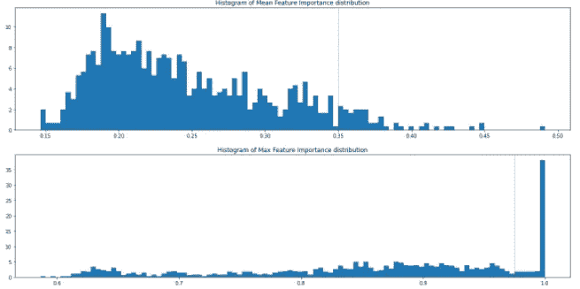
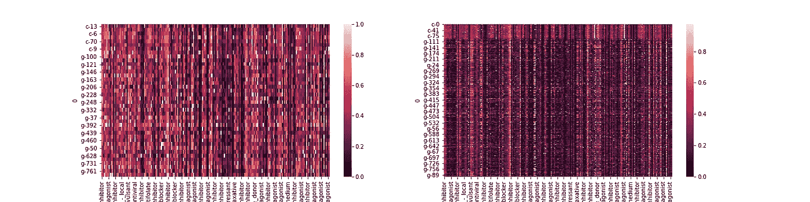

# 通过急流在几秒钟内了解您的功能

> 原文：<https://towardsdatascience.com/getting-to-know-your-features-in-seconds-with-rapids-c9b44c568ebd?source=collection_archive---------36----------------------->

## 在 GPU 上端到端运行数据预处理管道

泰勒·拉斯托维奇在 [Unsplash](https://unsplash.com?utm_source=medium&utm_medium=referral) 上的照片

这篇博文旨在展示我最近在正在进行的[Kaggle 竞赛中发表的](https://www.kaggle.com/c/lish-moa)[特征选择笔记本](https://www.kaggle.com/louise2001/rapids-feature-importance-is-all-you-need)。

当面对数据科学问题时，探索性数据分析，尤其是了解特性的重要性，是至关重要的一步。然而，如果您的数据库很大，有许多相互联系，使得分析在计算时间上很昂贵，那么这一步可能经常会很难。

GPU 在提高计算时间方面非常棒…如果你能使用它们的话！事实上，由于强大的框架(Tensorflow 或 Pytorch 是最著名的)使数百万开发者能够释放出他们不可思议的能力，它们的用途通常是用于训练神经网络。

然而，如果你要用 pandas 或 scikit-learn 完成一些脏的预处理，如果你的数据很大，那会非常繁重，因为这些包没有任何参数来帮助你在 GPU 上运行它们。综上所述，在这个阶段，你无法充分利用你的 GPU。

[*RAPIDS*](https://developer.nvidia.com/rapids) 是 Nvidia AI 开发的一套软件包，旨在完全在 GPU 上执行端到端的数据科学和分析管道。

本笔记本的目标是对 MoA 竞赛中的每个特征的每个目标进行单变量回归，即 *872 x 206 = 179632* 逻辑模型分别进行估计。

好消息是什么？有了*激流*这在几分钟之内是可能的！

你可以注意到，我既不导入 pandas(被 cudf 取代)，也不导入 scikit-learn(被 cuml 取代)。

这本笔记本将是一个教程，旨在帮助你熟悉图书馆的使用。最后，你将能够在你的特征中选择那些看起来对预测你的目标最重要的特征。这将使您能够构建具有更好可解释性的健壮的中型模型。

如果想跳过处理直接跳到结果，可以直接看一下结果[这里](https://www.kaggle.com/louise2001/moa-feat-importance-rapids)。

# 第一步:熟悉 cuDF

首先，我导入所有必需的包，并加载数据。

你可以注意到 cuDF 完全等同于 pandas，除了它在 GPU 上做所有的事情:使用 *read_csv* 将数据直接读取到 GPU，你也可以在数据帧上尝试任何常见的操作，功能和语法都是相似的，正如你可以从我使用的 *merge* 方法中看出的。

# 第二步:熟悉 cuML

该函数旨在返回特征重要性度量。

最初，我报告了对每个目标、每个特征执行的单变量逻辑回归的二元交叉熵损失(我总共有近 18 万个任务要做)。单变量分析是一种原始但相当可靠且广泛使用的方法，用于估计给定目标的特征重要性。它使你能够分离出给定模型的单独解释能力。

你可以注意到，cuML 类(这里是 *LogisticRegression* )、函数(这里是 *log_loss* )和方法(这里是 *fit* 或 *predict_proba* )也完全等同于你可能已经习惯了的 sklearn 类。

但是，我必须缩放输出(为了在或多或少难以预测的目标之间进行比较，利用特征的平均损失)和反转值，以获得更好的可解释性:实际上，您会期望特征重要性在估计该特征上的给定目标的损失时降低。对于这一步，我使用 cuML *MinMaxScaler* 预处理类，它的工作方式与 sklearn 一样。

# 第三步:解读

计算某个特性在所有目标上的平均重要性对于全面了解它对您的整体模型的重要性非常重要。

但是，我不确定在区分要保留的特性和要删除的特性时，您是否应该完全依赖这个指标:事实上，一个给定的特性可能对一个特定的目标具有非常高的解释能力，而对所有其他目标都不相关，因此即使它的平均重要性分数很低，保留它对该目标的最终模型质量也是决定性的。我们的目标是保留对所有目标都具有高平均解释能力的特征(平均重要性阈值)，或者对其中一些目标特别相关的特征(最大重要性阈值)。请随意使用阈值！

你可能已经注意到了我对我的数据应用的小方法:因为它存储在 GPU 上，只是为了绘图的目的，我需要把它转换成 cpu。例如，这相当于您在 cuda 计算过程结束时在 PyTorch 上执行的 *to_cpu()* 。

基于用所选阈值操作的特征选择的进一步数据分析得出以下结论:

*   平均而言，在所有目标上，满足**和**两个标准的特性比不满足任何一个标准的特性平均重要 0.15 倍。
*   平均而言，满足**一个**标准的特性在所有目标上的最大重要性比不满足任何标准的特性高 0.19。

根据我们的分析，这是一个相当令人放心的观察结果。

# 第四步:结论

为了获得全局概述，我们可以比较两个子集上按目标划分的缩放特征重要性的热图，这两个子集是满足两个标准的特征和不满足任何标准的特征。很快就可以看出，第一张图要淡得多，单独的重要性更高。

现在，您可以依赖于您选择的功能，并使用它们来构建一个更轻的模型，更容易运行，也更容易解释！