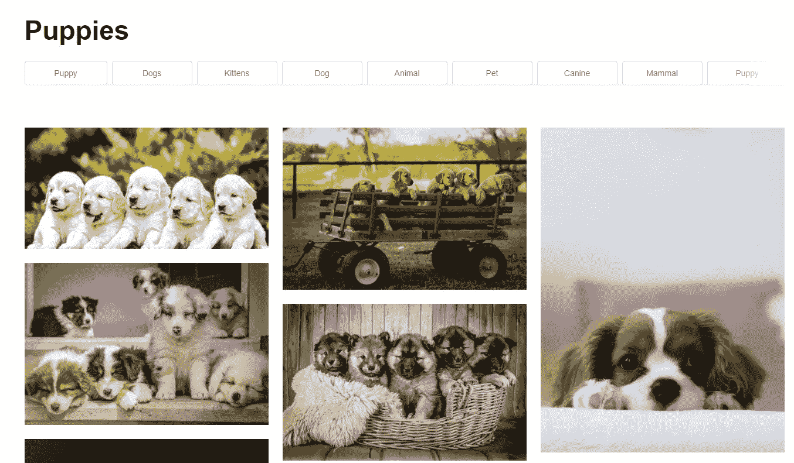
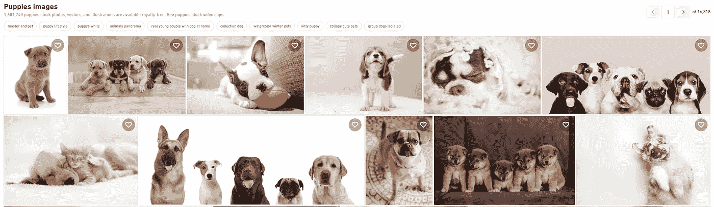

# 让你的机器学习模型进入现实世界

> 原文：<https://towardsdatascience.com/getting-your-machine-learning-model-out-to-the-real-world-30c550876174?source=collection_archive---------31----------------------->

## 机器学习系统

## 从业者来之不易的教训

丹·史沫特莱在 [Unsplash](https://unsplash.com/s/photos/girl-with-phone?utm_source=unsplash&utm_medium=referral&utm_content=creditCopyText) 上的照片

过去几年中一个令人兴奋的发展是机器学习在产品中的扩散。我们现在看到最先进的计算机视觉模型被部署在手机上。最先进的自然语言处理模型正被用于[改进](https://blog.google/products/search/search-language-understanding-bert/) [搜索](https://www.itnews.com.au/news/abc-uses-machine-learning-to-improve-results-in-revamped-search-530277)。

虽然有许多关于新的、令人兴奋的机器学习算法的文章，但关于产品化机器学习模型的文章却不多。人们对这些系统的工程设计越来越感兴趣，例如 [ScaledML 会议](http://scaledml.org/2020/)，以及 [MLOps](https://cloud.google.com/solutions/machine-learning/mlops-continuous-delivery-and-automation-pipelines-in-machine-learning) 的诞生。然而，生产机器学习模型是一项仍然短缺的技能。

在我迄今为止的职业生涯中，我在生产机器学习模型方面得到了一些来之不易的教训。以下是其中的一些。

# 建还是买？

推特最近一直在热议 GPT-3。在正确的*种子*的引导下，事实证明 GPT-3 可以做很多令人惊讶的事情，比如[在网页上生成按钮](https://twitter.com/sharifshameem/status/1282676454690451457)和[反应代码](https://twitter.com/sharifshameem/status/1284095222939451393)。在这些令人兴奋的发展的刺激下，你的利益相关者有了一个想法:如果你建立一个 GPT-3 的等价物来帮助加速你工作的公司使用 GPT-3 的前端开发会怎么样？

GPT-3 从语句中生成布局代码(来源:[此处为](https://twitter.com/sharifshameem/status/1282676454690451457))

你应该训练你自己的 GPT-3 模型吗？

哦，不！GPT-3 是一个 1750 亿参数的模型，需要谷歌和微软之外的大多数公司难以开发的资源。由于 OpenAI 正在测试其 GPT-3 API，因此更谨慎的做法是尝试一下，看看该模型是否能解决您的用例，以及该 API 是否能扩展到您的用例。

那么，买(更像是租)还是建？看情况。

这看起来像是一个逃避的答案，但它是软件行业中一个古老的问题。这也是一个如此庞大和复杂的主题，它应该有一个自己的帖子。

然而，在这里我可以提供一些指导方针，帮助你与利益相关者讨论购买与建造的问题。第一个是

> 这个用例不是核心能力吗？对于现有/潜在的 AWS 产品，它是否足够通用？

这个问题的基本原则是问你自己**你将要从事的工作是否是公司核心竞争力**的一部分。如果您的利益相关者能够负担得起，购买现成的解决方案可能是值得的。

> 数据之外的资源是否可用？例如人才和基础设施？

在其核心，建立和部署一个可靠的机器学习系统是**仍然主要是软件工程，增加了一个转折:*数据管理*** 。如果团队没有将模型构建为服务 API 的经验，没有收集、清理、标记和存储数据的经验，那么所需的时间可能会非常长，比如 1 到 2 年(甚至更长)。相反，部署第三方解决方案可能需要 3 到 6 个月，因为这主要是关于将解决方案集成到产品中。企业主会发现这种时间和成本的节省极具吸引力。

另一方面，如果这与公司的核心竞争力有关，那么投资建立一个能够基于公司专有数据设计和部署模型的团队是更好的方式。它允许对过程进行更多的控制和理解，尽管它会带来很高的初始投资开销。

只要记住

> 对企业主来说，最重要的是:你的模型的输出在企业环境中如何有用？

广义地说，机器学习是自动化的下一步。所以以这种方式思考，你的模式有助于增加收入，或者通过降低成本来提高业务效率。

例如，集成一个更好的推荐系统应该会带来更高的用户满意度和参与度。更高的满意度导致更多的订阅和有机推广，从而带来更高的收入和更低的流失率。

作为一名数据科学家，你必须帮助企业主做出是构建还是购买的最佳决策，这意味着要在业务环境中评估这两种方法的具体利弊。

这篇[文章](https://lethain.com/build-vs-buy/)中的观点在处理“构建与购买”问题时非常有用，它也适用于机器学习产品。正如这里的所说，如果这是一项核心业务能力，就有理由自己去打造。

# 这一切都从源头开始

考虑搜索小狗照片的用户的搜索结果。这里我们有一个来自 Unsplash 的例子，一个来自 Shutterstock，最后一个来自 EyeEm，这次是在移动设备上。

来源: [Unsplash](https://unsplash.com/s/photos/puppies)

来源: [Shutterstock](https://www.shutterstock.com/search/puppies)

来源:手机上的 [EyeEm](https://www.eyeem.com/)

我们可以看到，虽然每个用户界面(UI)显示的图像范围很广。假设我们想要使用图像上的点击来训练一个给出更好搜索结果的模型。

如果你是用户，你会首先被哪张图片吸引？

在 Shutterstock 示例中，您可能首先被窗口最右侧的 puppy 吸引，但在 EyeEm 示例中，它可能是中间的图像。

很明显，每个 UI 之间的差异导致了所收集的数据分布的差异。

信息检索文献表明，显示结果时存在*位置偏差*和*呈现偏差*。用户完全有可能点击排名第一的结果，即使它与他们的搜索查询无关，仅仅因为这是他们看到的第一个东西，他们可能对结果很好奇！

我们可以看到，用于训练搜索排名模型的点击数据会有这些偏差，这是由 UI 的设计方式决定的。所以，

> 了解模型最终将在产品中的何处以及如何使用

数据科学家和机器学习工程师**不能孤立地构建模型，因为模型最终会被使用**。这样做的结果是，数据科学家必须与产品中涉及的所有专业人员合作:产品经理、设计师、工程师(前端和后端)和质量保证工程师。

跨职能团队工作提供了好处，包括向所有团队成员简要介绍模型的局限性，以及它如何影响 UI 设计，反之亦然。另一个是找到简单、可靠的方法来解决问题，例如，不要使用机器学习来解决固有的 UI(和用户体验)问题。设计者还可以想出一些方法来使模型结果的呈现看起来令人惊叹，以及约束 UI 中的用户操作来限制进入模型的输入空间。

数据科学家必须建立关于产品的领域知识，包括为什么做出某些 UI 决策，以及如果产品发生变化，它们如何影响您的下游数据。后一点尤其重要，因为这可能意味着当产品变更推出时，您的模型很快就会过时。

此外，如何呈现模型的结果是很重要的，以便在未来的训练数据中最小化偏差，正如我们将在接下来看到的。

# 数据收集仍然具有挑战性

分析收集通常依赖于工程师在他们负责的服务中为产品的各个部分设置分析事件。有时，分析没有被收集，或者收集的数据中带有噪音和偏见。分析事件可能会被丢弃，从而导致数据丢失。点击一个按钮没有去抖，导致多个重复事件。

不幸的是，机器学习模型通常是这些分析数据的下游消费者，这意味着测量和数据收集的问题会对模型产生巨大影响。

如果关于数据有一件事需要记住，那就是

> 数据是测量的副产品

这意味着**了解数据来自哪里，以及如何收集数据是很重要的**。正确地进行测量也是至关重要的，定期对测量系统进行测试以确保良好的数据质量。与工程师和数据分析师一起工作以直接了解问题也是谨慎的，因为在收集的数据中通常有一个“陷阱”。

存储的数据需要进行**编码，以适应业务领域**。让我们以图像存储为例。在大多数领域，有损 JPEG 图像可能可以很好地编码您存储的图像，但在一些需要非常高分辨率的领域，例如使用机器学习来检测 MRI 扫描中的异常，就不适合。将这些问题提前传达给帮助您收集数据的工程师非常重要。

研究中的机器学习不同于产品中的机器学习，因为**通常你最大的胜利来自更好的数据，而不是更好的算法**。然而，也有例外，例如深度学习在许多领域提高了性能指标。即使这样，这些算法仍然对训练数据敏感，你需要更多的数据。

**说服你的利益相关方继续投资改善数据收集基础设施** *总是值得的。*有时，即使是构建新功能的新数据源也能提升模型性能指标。它不仅有助于更好的模型，还有助于更好地跟踪公司的关键指标和整体产品特性。和你一起工作的数据分析师会为此而非常感激。

一位前 Dropbox 数据科学家最近告诉我

> 您最大的改进通常来自与工程师坐下来改进分析

# 检查你对数据的假设

这是我在战壕中亲身经历的一个故事。

在 [Canva](https://www.canva.com/) 整合从学习到排名模型以改善图像搜索的早期，我们计划使用一套来自 Mechanical Turk 的相关性判断。Canva 有一个图形设计编辑器工具，允许用户搜索超过 5000 万张图片，并将其纳入设计中。

基本上，我们收集了几组成对的判断:对于每个搜索词，给评分者一对图片，其中一张他们竖起大拇指。术语*萤火虫*的成对判断评级示例如下所示。虽然两者都是相关的，但是评价者更喜欢左边的图像而不是右边的图像。

对搜索词“萤火虫”的成对判断:评价者更喜欢左边的图像而不是右边的图像(来源:作者)

然后，我们使用这些成对的判断训练了一个模型，另一个模型只依赖于搜索日志的点击。后者有更多的数据，但由于位置偏差和错误的点击，质量较低。这两个模型在离线排名指标上看起来都很棒，并且对结果进行了视觉检查(*即*手动，用我们的眼睛)。

然而，在在线实验中，依赖于这些来源的相关性判断的模型与控制和其他模型相比，具有非常差的性能，降低了业务指标。

发生了什么事？

事实证明，我们的判断来源于*而不是*用户搜索符合其设计的图片的背景，而不仅仅是纯粹的搜索相关性。这种缺失的上下文导致数据集的分布不同于产品中的数据分布。

不用说，我们的假设是错误的。

*数据分布不对称*是一个非常现实的问题:即使是在谷歌的 Google Drive 中实现快速访问功能的团队也面临着 it⁴.在这种情况下，为开发环境收集的数据分布与最终部署环境的数据分布不匹配，因为培训数据不是从生产服务中收集的。

> 用于训练模型的数据应该与部署模型的最终环境相匹配

要检查的其他假设示例有

1.  出现了**概念漂移**，数据分布发生了重大变化([最近的一个例子是新冠肺炎疫情扰乱了预测模型](https://www.technologyreview.com/2020/05/11/1001563/covid-pandemic-broken-ai-machine-learning-amazon-retail-fraud-humans-in-the-loop/))，
2.  特征 的**预测能力进入模型，因为一些特征的预测能力随着时间而衰减，并且**
3.  **产品弃用**，导致功能消失。

通过设置监控系统来检查数据质量和模型性能指标，以及标记异常，这些问题可以得到部分解决。谷歌在这里提供了一份很好的清单，对你当前的生产机器学习系统[进行评分，包括要注意的数据问题。](https://research.google/pubs/pub46555/)

记住，如果谷歌的一个团队在部署机器学习系统方面的成熟度是世界上最好的团队之一，有数据假设问题，你当然应该仔细检查你对训练数据的假设。

# 把一切都包起来

机器学习系统是非常强大的系统。它们为公司提供了创建新产品功能、改进现有产品功能和提高自动化程度的新选择。

然而，这些系统仍然很脆弱，因为有更多关于它如何设计的考虑，以及如何收集数据并用于训练模型。

关于这个话题，我还有更多要说的，但现在这些就够了。

[1]替换为您最喜欢的云提供商。

[2] Thorsten Joachims，Laura Granka，Bing Pan，Helene Hembrooke 和 Geri Gay，[准确地将点击链接数据解释为隐式反馈](https://www.cs.cornell.edu/people/tj/publications/joachims_etal_05a.pdf)，在 Proc .第 28 届 ACM SIGIR 国际信息检索研究与发展年会(SIGIR)，第 154–161 页(2005)。

[3]宋轶·岳、拉詹·帕特尔和海因·罗里格，[超越位置偏差:检验结果吸引力作为点击链接数据中呈现偏差的来源](https://static.googleusercontent.com/media/research.google.com/en//pubs/archive/36363.pdf)，在 Proc .万维网(WWW)第 19 届国际会议，第 1011–1018 页(2010)。

[4] Sandeep Tata，Alexandrin Popescul，Marc Najork，Mike Colagrosso，Julian Gibbons，Alan Green，Alexandre Mah，Michael Smith，Divanshu Garg，Cayden Meyer，Reuben Kan，[快速访问:为 Google Drive 构建智能体验](https://dl.acm.org/doi/10.1145/3097983.3098048)，KDD 2017:第 23 届 ACM SIGKDD 知识发现和数据挖掘国际会议论文集，第 1643–1651 页(2017)