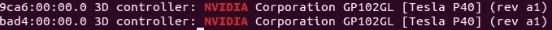

# 在 Ubuntu 18.04 上准备好使用 Yolov3 对象检测器

> 原文：<https://towardsdatascience.com/getting-your-machine-ready-to-use-yolov3-object-detector-on-ubuntu-18-04-185799ebc18d?source=collection_archive---------13----------------------->

## 这篇文章展示了如何使用 yolov3，更具体地说是 AlexeyAB 的 yolov3 Github repo，让您的机器为对象检测做好准备。


在安讯，我们的目标是站在计算机视觉开发的前沿。因此，我们喜欢与发生在更广阔的计算机视觉领域的最佳作品保持同步。其中包括跟踪部署的最佳系统，比如 darknet。

这篇文章展示了如何使用 yolov3，更具体地说是 AlexeyAB 的 yolov3 Github repo，让您的机器为对象检测做好准备。这是一篇关于启动虚拟机、安装必要的软件包和初步测试以确保您准备好开始对象检测所需的步骤的高级帖子。这篇文章使用了几个教程，我发现它们在安装这些依赖项的过程中很有用。主要步骤如下:

1.  启动本地机器或虚拟机，确保你的 GPU 支持 Cuda。
2.  克隆必要的 GitHub repos
3.  安装 OpenCV 并用 OpenCV 测试 darknet
4.  安装 Cuda、Cudnn 和其他必要的软件包，以加快 GPU 中的训练过程。

## 1.云计算资源


如果你有一台支持 GPU 的机器，你可以跳到第 2 步。否则，获得一个带有 GPU 的虚拟机对于对象检测任务来说将是非常重要的，这样可以大大加快速度。在这次演练中，我们将使用 Microsoft Azure 机器，但任何带有 GPU 或任何其他云计算服务的本地机器显然也可以工作。

*   一旦你在 Azure 中设置了你的帐户，你就可以导航到你的家，然后检查虚拟机服务。
*   单击“添加+”按钮，这将打开“创建虚拟机页面”。确保您已经设置了一个资源组，否则您必须在开始设置实例时创建它。
*   这里的关键部分是为您的虚拟机选择大小。在 Azure 中启动新虚拟机时，在配置的第一页上，您会发现“更改大小”选项。点击它，选择一个“系列”栏显示 GPU 的大小。


在 Azure 中更改虚拟机的大小

*   一旦创建了机器，您仍然可以在以后进行配置，因此，例如，如果您想要添加磁盘空间或更改到另一个机器系列，这是可能的。一旦你启动它，你可以 ssh 进入它，你可以确保你的机器有一个 CUDA 支持的 GPU 与`lspci | grep -i nvidia`

虽然 GPU 的细节可能有所不同，但输出应该与下面的截图有些相似。



显示支持 CUDA 的 GPU 详细信息的输出

如果你是 Azure 新手，[这本](https://docs.microsoft.com/en-us/azure/virtual-machines/windows/quick-create-portal)入门指南可能会非常有用:

## 2.克隆 Github repos

*   如果您的 github 帐户启用了 ssh，只需

```
git clone [git@github.com](mailto:git@github.com):AlexeyAB/darknet.git
```

*   如果这是一个新的虚拟机，您可能需要先安装 git:

```
sudo apt install git-all
```

完成后，确保它正常工作，您的工作目录看起来应该类似于以下内容:


克隆 AlexeyAB darknet repo 后的工作目录

*   您还需要几个其他的依赖项:

```
sudo apt install make
```

*   如果你还没有，你将需要 C 编译器`gcc`和`g++`。你可以和`which gcc`和`which g++`核实一下。如果没有安装，您可以使用以下命令进行安装。

```
sudo apt install gcc
sudo apt install g++
```

*   现在我们已经准备好测试 darknet repo(没有 OpenCV，也没有使用 GPU 进行训练或预测。去暗网目录试试`$make`。您应该会在控制台上看到大量警告消息和打印输出，如果没有错误，那么从技术上讲，您已经准备好开始对象检测了。尝试`$ ./darknet`命令，您应该会在控制台上看到以下输出:

```
usage: ./darknet <function
```

**3。在 Ubuntu 18.04 上安装 OpenCV 3 . 4 . 4**


按照这些步骤，您将安装 OpenCV3.4.4，但是对象检测 repo 应该也可以与版本 4+一起工作。

[这个](https://www.pyimagesearch.com/2018/05/28/ubuntu-18-04-how-to-install-opencv/)是我发现的最容易跟随的教程之一。Adrian Rosebrock 很好地解释了你复制和粘贴的步骤，这样你就能理解这些依赖项的作用了。他也有很好的替代方法来应对步骤可能会向您抛出错误的情况。

所以去看看吧，希望一切顺利。

您可以通过在命令行中打开 python 进程并输入以下命令来检查安装是否成功

```
import cv2
print(cv2.__version__)
```

现在检查一下 darknet 现在是否能与 opencv 一起工作:

更改/darknet/目录中的 Makefile 以显示`OPENCV=1`，然后重新`make`。正如官方文档中所述，您可以使用`./darknet imtest data/eagle.jpg`对此进行测试，尽管请记住，如果您在虚拟机上工作，您会遇到“无法打开显示”错误，但此时一切都应该正常工作，并且您应该可以在测试图像上看到检测概率。

**4。在 Ubuntu 18.04 上安装 CUDA 和 cud nn**

你可能想在 GPU 上运行 darknet，所以你需要安装 CUDA 和 CUDNN。" CPU 上的 Darknet 速度很快，但在 GPU 上要快 500 倍！"—约瑟夫·雷德蒙

这是由[马赫迪-61](https://gist.github.com/Mahedi-61) 发布的的一个非常[有用的帖子，其中的脚本执行了安装的大部分。继续完成这些步骤。](https://gist.github.com/Mahedi-61/2a2f1579d4271717d421065168ce6a73)

这篇文章还强调了如何删除以前的 CUDA 安装:

```
sudo apt-get purge nvidia*
sudo apt remove nvidia-*
sudo rm /etc/apt/sources.list.d/cuda*
sudo apt-get autoremove && sudo apt-get autoclean
sudo rm -rf /usr/local/cuda*
```

如果您想要不同的 Cuda 或 CUDNN 版本，只需在上面的脚本中将下载文件更改为所需的版本。

要确保安装成功，请尝试

```
nvidia-smi
```


成功安装 cuda 的预期产出

最后，尝试

```
nvcc -V
```

希望你能得到


显示 nvcc -V 结果的输出

最后，重要的是要确保所有这些都与 darknet 一起工作，然后我们可以开始测试对象检测器。

将 darknet 目录中的 Makefile 更改为:


Makefile 的头

如果`make`命令成功，那么你就可以开始测试了。

如果你想用真实的重量来测试

```
wget [https://pjreddie.com/media/files/yolov3.weights](https://pjreddie.com/media/files/yolov3.weights)./darknet detect cfg/yolov3.cfg yolov3.weights data/dog.jpg -dont_show
```

希望这份高水平的食谱能让你的机器为 AlexeyAB repo 的 yolov3 物体探测器做好准备。