# ggplot:使用 Plotnine 的 Python 中的图形语法

> 原文：<https://towardsdatascience.com/ggplot-grammar-of-graphics-in-python-with-plotnine-2e97edd4dacf?source=collection_archive---------12----------------------->

## 数据可视化

## **强大的图形库，提供出色的可视化效果**

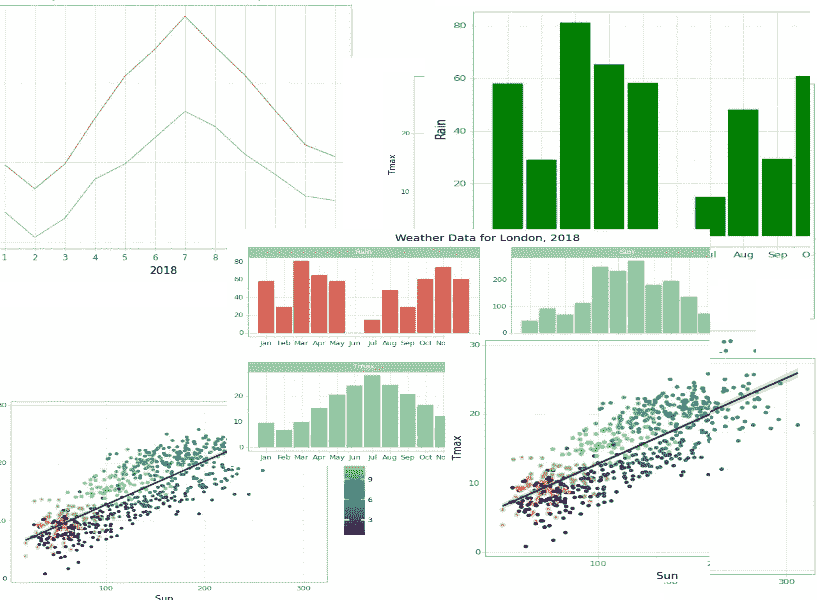

你希望 Python 能模仿 R 语言中 *ggplot* 给你的出色可视化效果吗？嗯，可以的。

我们将探索 *Plotnine* 的功能，这是一个基于 *ggplot2* 的 Python 可视化库。

能够可视化您的数据使您能够更好地理解它。它让您有机会深入了解数据元素之间的关系，并发现相关性和依赖性。R 中的 ggplot 和 Python 中的 Plotnine 为您提供了以逻辑方式实现这一点的能力。

要做到这一点，你不需要成为 Python 专家，尽管接触一些 Python 编程会很有用，对 Pandas 中的数据帧有基本的了解也会很有用。

如果你也熟悉 Jupyter 笔记本，那将会很有帮助。

# ggplot

ggplot2 是一个强大的 R 图形库，在 Hadley Wickham ( *附属链接)*的书“ [ggplot2:优雅的数据分析图形](https://www.amazon.com/ggplot2-Elegant-Graphics-Data-Analysis/dp/0387981403?&_encoding=UTF8&tag=alanjones01-20&linkCode=ur2&linkId=255e09d67cde177ff56683aa49b0229b&camp=1789&creative=9325)”中有所描述。韦翰，反过来，他的工作基于“图形的语法”，由利兰威尔金森的一本书。Wilkinson 的书给出了图形语法的理论基础，Wickham 的书展示了如何实现这种语法(在 ggplot2 中)。

ggplot2 实现了一种构建图形的分层方法，并允许使用标准例程来构建流行的图形和图表，或者构建自定义图形来满足您自己的目的。

Plotnine 基于 ggplot2，用 Python 实现。

根据您的 Python 安装，您可以使用 *pip* 来安装它:

```
pip install plotnine
```

或者*康达*:

```
conda install -c conda-forge plotnine
```

本文将重点介绍如何构建和定制标准图形——线条、条形图等——使用图层来修改这些图，并希望对您如何制作自己的定制图有所启发。

然后，在你的程序中，你的第一行应该是

```
from plotnine import *
```

# 层

ggplot 命令有三个基本要素:数据、美学和图层。数据的作用是明确的，我们应该以熊猫数据框架的形式提供它。*美观*是数据中的变量被映射到视觉属性上的地方，而*层*描述了如何呈现数据，例如，作为一个条形图。可以有几个层来定义不同的图表或图表的一部分，例如轴上的标签。

在 R 中，ggplot2 中的命令类似于:

```
ggplot(data, aesthetics) 
 + layer1()
 + layer2()
```

Plotnine 使用了相同的模式，但这并不十分符合 Python 语法。你可以写:

```
ggplot(data,aesthetics) + layer1() + layer2()
```

但是你可能会排很长的队。不过，解决方法很简单。把整个事情用大括号括起来。所以我们最后得到了:

```
(ggplot(data,aesthetics)
 + layer1()
 + layer2()
)
```

因此，这是我将在本文中使用的风格。

# 获取数据

如果你已经了解了我对熊猫图和 T2 图的可视化介绍，你会对我使用的天气数据很熟悉。这是来自英国气象局的公开数据，并绘制了伦敦过去几十年的天气数据。

这些数据记录了每个月的最高和最低温度、日照时间和降雨量。有两个表，一个是 1957 年的完整数据，一个较短的表只记录了 2018 年的数据。

我们先拿 2018 年的数据。

```
import pandas as pd
weather=pd.read_csv(‘[https://raw.githubusercontent.com/alanjones2/dataviz/master/london2018.csv](https://raw.githubusercontent.com/alanjones2/dataviz/master/london2018.csv)')
weather
```

这是它看起来的样子:

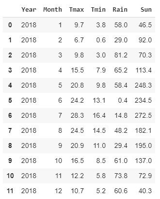

Year 列是相当多余的，但是与更大的数据文件是一致的。其他列不言自明。月份从 1 到 12，温度以摄氏度为单位，降雨量以毫米为单位，日照以小时为单位。

所以，从 ggplot 开始，我们要画一个每个月最高温度的线图。然后，我们将添加一些层来增强图表。

# 线形图

对 ggplot 调用的剖析如上所述。第一个参数是我们将要绘制的数据，*天气*，下一个参数是对 *aes* 的调用。aes 将数据映射到不同的“美学”上——这里我们只有两个。默认情况下，前两个参数是 x 轴和 y 轴。所以这里的月在 x 轴上，Tmax 在 y 轴上。

这本身是对 ggplot 的合法调用，但它不会绘制任何东西。为此，我们需要添加一个层来告诉 ggplot 我们想要什么样的图形。图形类型称为 *geoms* ，我们这里使用的是 *geom_line* ，这当然是一个线图。

```
(ggplot(weather,aes('Month', 'Tmax'))
  + geom_line()
)
```

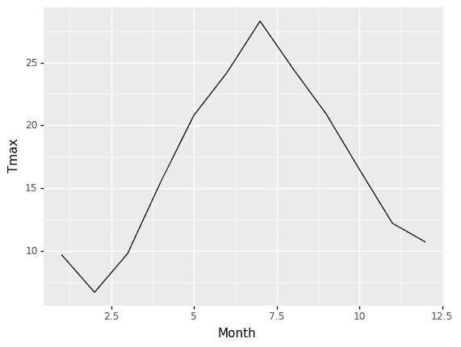

这是一个好的开始，但是我们可以做得更好。例如，您会注意到月份是数值而不是实际日期，所以折线图将它们解释为实数。这意味着我们最终的月份从 2.5 到 12.5 不等——这并不理想。

我们可以通过在 graph 函数中添加另一层来轻松解决这个问题。ggplot 允许我们指定每个轴的刻度，所以我们将添加一个层来完成这项工作。我们希望刻度是数字 1 到 12，这正是月份列中的数字。因此，我们将使用该数据来告诉 ggplot 分笔成交点应该是什么。

为了方便起见，我将使用一个变量*月*。像这样:

```
months = weather['Month']
```

这是完整的代码

```
months=weather['Month'](ggplot(weather,aes('Month','Tmax')) 
  + geom_line()
  + scale_x_continuous(breaks=months)
)
```

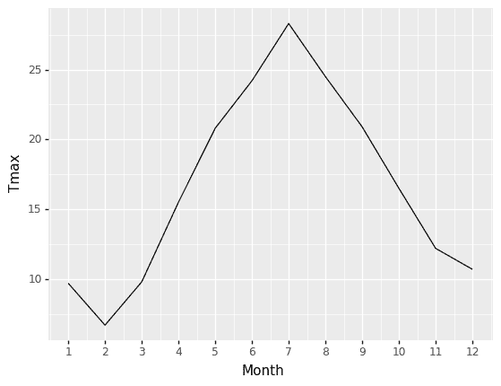

这样更好，但是如果我们想用字符串标记月份，比如“一月”、“二月”等等，那该怎么办呢？当然，我们可以改变表格中的数据，但是这篇文章是关于 ggplot 的，所以我们将使用它。

另外，我不喜欢默认的配色方案。ggplot 附带了许多我们可以使用的主题，所以我将添加另一个层来指定我要使用*光*主题，并向*几何线*添加一个参数来告诉它绘制一条红线而不是默认的黑线。

```
month_labels=("Jan","Feb","Mar","Apr","May","Jun","Jul","Aug","Sep","Oct","Nov","Dec")(ggplot(weather,aes('Month','Tmax')) 
  + geom_line(color='red') 
  + scale_x_continuous(breaks=months,labels=month_labels) 
  + theme_light()
)
```

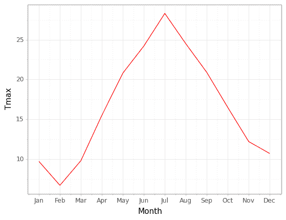

我认为这是一个进步。

让我们用柱形图做同样的图。

# 柱状图

要画柱形图，我们只需交换几何图形。我们用 *geom_col* 代替 *geom_line* 。简单。唯一需要注意的是，如果我们想改变条形的颜色，我们需要指定一个“填充”。有一个参数“颜色”,但这只改变列的轮廓。

```
(ggplot(weather,aes('Month','Tmax'))
  + geom_col(fill='red')
  + scale_x_continuous(breaks=months, labels=month_labels)
  + theme_light()
)
```

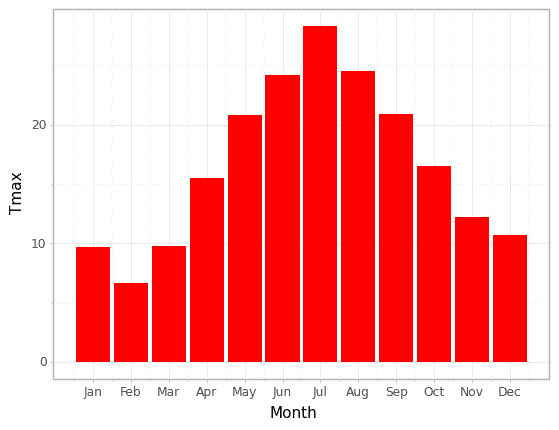

这是同样的雨的情况——适当的雨的颜色变化。

```
(ggplot(weather,aes('Month','Rain'))
  + geom_col(fill='green')
  + scale_x_continuous(breaks=months, labels=month_labels)
  + theme_light()
)
```

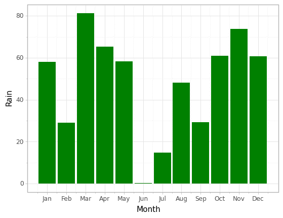

# 多重图表

我想在同一个图上画出 *Tmax* 和*Tmin*——我该怎么做？

最好的方法是转换数据，使两个温度在同一列中，并在单独的列中标记为 *Tmax* 或 *Tmin* 。这很容易用熊猫*融化*功能完成。在这里，我创建了一个新的 dataframe *temps* 和所需的列。

```
temps = pd.melt(weather, id_vars=['Month'], 
                value_vars=['Tmax','Tmin'], 
                var_name='Temp', value_name='DegC' )
temps
```

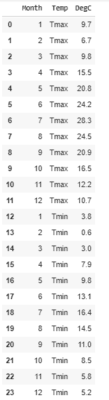

现在我用柱形图绘制它们。这里有几件事需要注意。首先，我已经将*填充*从 geom 中取出，并将其放入对 *aes* 的调用中，并将其分配给 *Temps* (它将是 *Tmax* 或 *Tmin* )。

在 geom 中指定一种颜色会固定该 geom 中的颜色，而通过将其放入 aes，我可以告诉 geom 为每个 Temp 值的列指定不同的颜色。因此，geom 列现在将为两个单独的条着色，一个表示 Tmax，另一个表示 Tmin。默认情况下，这些条是堆叠的，但这里我们希望它们是并排的。

第二件事是，在 geom 列中，我将位置指定为“dodge ”,这为我们提供了并排配置。

```
(ggplot(temps,aes('Month','DegC',fill='Temp'))
  + geom_col(position='dodge')
  + scale_x_continuous(breaks=months)
  + theme_light()
)
```

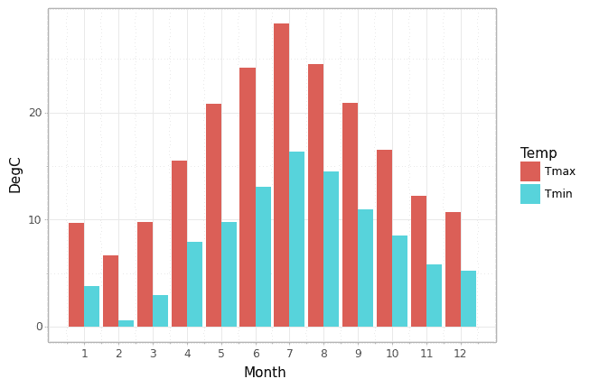

这是同样的东西，但是有线条。注意，我为线条指定了*颜色*而不是*填充*，我不需要担心位置。

```
(ggplot(temps,aes(‘Month’,’DegC’,color=’Temp’))
  + geom_line()
  + scale_x_continuous(breaks=months)
  + theme_light()
)
```

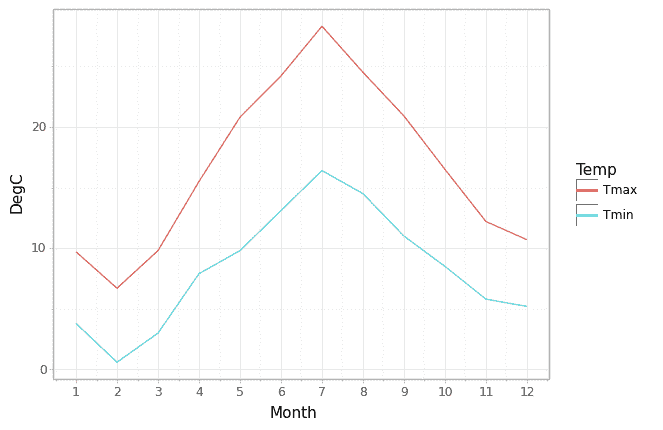

# 更多图层-标签

正如你所看到的，为了给情节添加更多的东西，我们添加了更多的层。要修改图表上的标签，我们也可以这样做。在下一段代码中，我添加了图层来指定 x 轴和 y 轴上的标题，并给整个图表添加了一个标题。

```
(ggplot(temps,aes('Month','DegC',color='Temp'))
  + geom_line()
  + scale_x_continuous(breaks=months)
  + theme_light()
  + xlab('2018')
  + ylab('Temperature in degrees C')
  + ggtitle('Monthly Maximum and Minimum Temperatures')
)
```

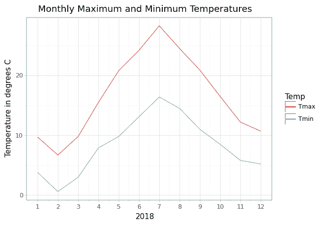

# 更多层—刻面

让我们考虑画一张图来总结整个数据表。降雨量和日照两种温度的柱形图。

首先，我们*再次熔化*数据帧，但这次我们将所有数据放在一列中。每个值将被标记为 *Tmax* 、 *Tmin* 、 *Rain* 或 *Sun* 。

```
data = pd.melt(weather, id_vars=['Month'], 
               value_vars=['Tmax','Tmin','Rain','Sun'], 
               var_name='Measure', value_name='Value' )
```

为了创建刻面图，我们添加了一个 *facet_wrap* 层，并将测量值传递给它，这意味着我们将获得 Tmax、tmin、Rain 和 Sun 中每一个的刻面。默认情况下，这些面将使用相同的比例，这对于 Tmax 和 Tmin 来说是合适的。但是雨和太阳是不同的，温度也是不同的。所以我们需要告诉 *facet_wrap* 刻度是‘自由’的，也就是说，每个刻面都有自己的刻度。

问题是这样做意味着 y 轴的标签会与图表重叠，所以我们需要用另一个图层来调整布局。最后一层是主题的修改( *theme_light* )，在小平面之间增加额外的空间，并设置图形的整体大小。注意这必须在 *theme_light* 图层之后，否则 *theme_light* 会将布局重置为默认设置。

```
(ggplot(data, aes('Month','Value', fill='Measure'))
  + geom_col(show_legend=False)
  + scale_x_continuous(breaks=months,labels=month_labels)
  + facet_wrap('Measure', scales='free')
  + xlab('')
  + ylab('')
  + ggtitle('Weather Data for London, 2018')
  + theme_light()
  + theme(panel_spacing=0.5, figure_size=(10,5))
)
```

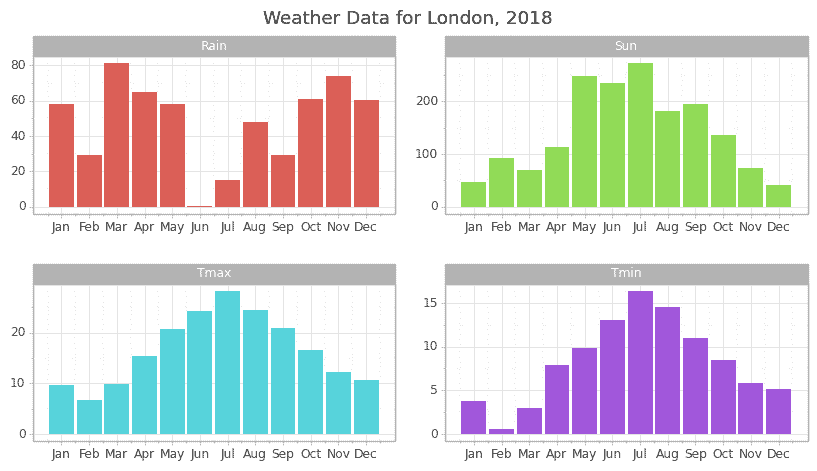

# 结论

这是 Plotnine 用 Python 实现的 ggplot 的一些方面和特性的随机演练。我希望你能看到这种方法的力量，并鼓励你去读读 [Hadley Wickham 关于 ggplot2](https://ggplot2-book.org/) 的书，看看 [Plotnine 文档](https://plotnine.readthedocs.io/en/stable/index.html)。

**如果您想了解未来的文章，请免费订阅我的** [**简讯**](https://technofile.substack.com) **。**