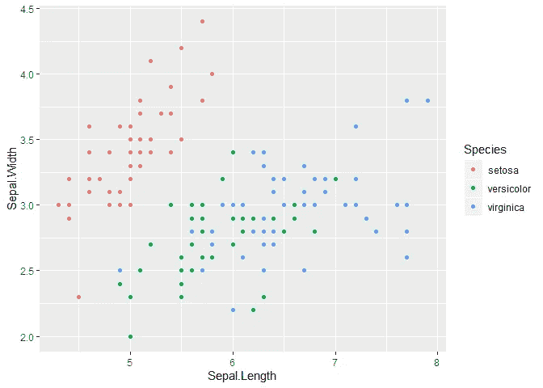
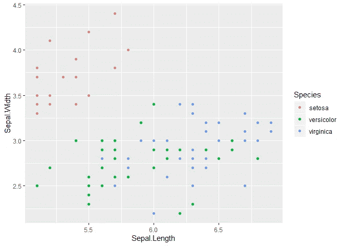
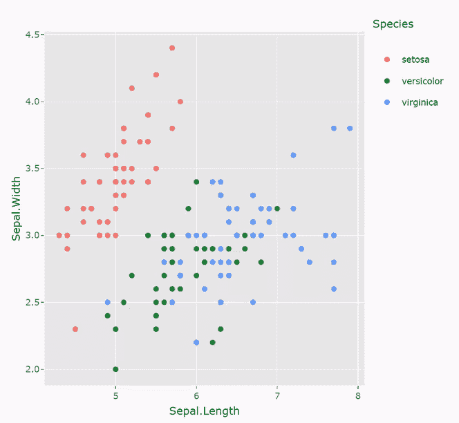

# ggplotly() —扩展 tidyverse 中最棒的降压函数

> 原文：<https://towardsdatascience.com/ggplotly-the-most-bang-for-buck-function-in-the-extended-tidyverse-62f02a69b70f?source=collection_archive---------24----------------------->

## 使您的 ggplot 图与单个函数调用交互

我是 tidyverse 和 ggplot 的忠实粉丝。tidyverse 是一个用于探索性数据分析的优秀框架，ggplot 非常棒。这些工具提供的导入数据、重塑数据和可视化数据的能力非常强大。

除了核心 tidyverse，还有许多支持包。在所有的函数中，在所有这些包中，有一个函数为单个函数调用提供了大量的值。

## ggplotly()

这是一个单一的函数调用，您可以围绕您的 ggplot()函数进行交互式可视化。

我发现它带来的主要价值是:

*   您可以缩放和平移绘图
*   您可以将鼠标悬停在点上来查看它们的值

运行起来很简单:

*   您只需要将现有代码包装在 ggplotly()中
*   安装就像 install.packages 一样简单

## 例子

例如，我使用 ggplot 创建了一个标准的散点图。这是我很多数据探索的通常起点。

```
iris %>% 
  ggplot(aes(x=Sepal.Length,y=Sepal.Width,color=Species)) +
  geom_point()
```



从这里开始，我经常想放大并进一步研究数据。为此，我的标准模式是将数据帧通过过滤器传输到 ggplot:

```
iris %>% 
  filter(Sepal.Length < 7, Sepal.Length > 5) %>% 
  ggplot(aes(x=Sepal.Length,y=Sepal.Width,color=Species)) +
  geom_point()
```



然后，我可以缩小这些过滤器的范围，隔离出我感兴趣的点，如果我想详细查看这些点，我可以将对 ggplot()的调用替换为对 View()的调用，如下所示。

```
iris %>% 
  filter(Sepal.Length < 7, Sepal.Length > 5,
         Sepal.Width < 4, Sepal.Width > 3) %>% 
  View()
```

这些技术可行，但可能有点复杂。通常，我真正想要的是能够使用 ggplot()创建一个可视化，同时还能够与它进行交互以放大。这就是 ggplotly()的用武之地。

```
ggplotly(iris %>% 
  ggplot(aes(x=Sepal.Length,y=Sepal.Width,color=Species)) +
    geom_point())
```



这里的关键价值是，我可以像往常一样使用 tidyverse 创建我的图，然后简单地将它包装在一个函数调用中，使它具有交互性。这对于探索性的数据分析非常有用。

我还发现 ggplotly()是闪亮仪表板的一个有价值的补充。我认为 ggplotly()提供的缩放和悬停信息功能在 Shiny 中更有价值。我认为这是因为仪表板经常被其他人使用，而不是构建图表的人，所以不太熟悉数据集。我还认为交互式 ggplotly()图比静态图和一个闪亮应用程序上的一组过滤器滑块更令人满意。

我已经上传了这个情节的现场版本到 RPubs，如果你想自己玩，可以通过下面的链接访问。当然，这很容易开始，你还不如自己动手。

 [## RPubs

### 基本 ggplotly()示例

rpubs.com](http://rpubs.com/OwenFlanagan/565119)