# 使用 TensorFlow 进行 Ghost 写作

> 原文：<https://towardsdatascience.com/ghost-writing-with-tensorflow-49e77e26978f?source=collection_archive---------40----------------------->


Aditya Chinchure 在 [Unsplash](https://unsplash.com/?utm_source=unsplash&utm_medium=referral&utm_content=creditCopyText) 上拍摄的照片

## 人工抒情生成的 RNN 建筑比较

音乐一直被认为是最有影响力和最强大的艺术形式之一。因此，它被用来表达艺术家的原始情感，并将其传递给听众。

作为一名音乐爱好者，很自然地会想知道使用递归神经网络(RNNs)生成歌词会有多困难。我真的很喜欢说唱和嘻哈音乐，所以我选择了这些流派的艺术家。这也是一个很好的配合，因为有关于说唱歌词生成的现有研究。

递归神经网络可以用于许多语言建模任务，例如:聊天机器人、预测键盘和语言翻译。当涉及到文本生成时，递归神经网络工作良好，因为它们能够处理顺序数据。这是有益的，因为我们需要保留一个句子的上下文，或者在这种情况下，一首诗的上下文。

对 RNN 如何工作的一种解释是，它查看序列中以前的数据来预测序列中的下一个元素。比方说，我们有一个训练有素的 RNN 在你的手机键盘上进行文本预测(你知道，当你打字时弹出的单词预测)。根据我之前输入的信息，我可以输入类似“Wezley 是超级……”的内容，神经网络将接受这一序列，并给出一组预测词，如:“酷”、“聪明”和“有趣”。

## 架构概述

为了增加这个实验，我想训练不同的递归神经网络架构来执行 rap 歌词生成。我选择了简单神经网络、门控循环单元、长短期记忆和基于卷积神经网络+长短期记忆的架构。我选择这些是为了确保我们能够相互测试每个架构，以确定哪个架构在给定的任务中表现最好。除非我们尝试，否则我们不知道一个模型是否会优于另一个，对吗？

SimpleRNN 体系结构更适合作为基线，看看其他体系结构的性能如何。由于消失梯度问题，简单的 RNN 体系结构不太适合这个特定的任务。这意味着 SimpleRNN 在记忆整个小节/诗的上下文时不是很有用，因为它会丢失序列中的早期信息。这导致了不连贯的诗句，你会在文章的后面看到。如果你很好奇，想要一个 TL；博士的模型如何表现:我们得到的诗句，如“我是什么石头私人卧室现在”或“如何改变了低最后气吉他的事情。”这两个诗句都是从德雷克歌词的数据集生成的。这两个都没什么意义。然而，我认为他们仍然是火吧。

门控循环单元架构是我测试的下一个架构。门控循环单位不同于 SimpleRNN，它能够记住序列中稍靠下的部分。它通过利用两个门来实现这一点，一个复位门和一个更新门。这些门控制先前的序列信息是否继续通过网络，或者是否更新到最近的步骤。我将在本文中对此进行更深入的探讨。

这个项目测试的另一个架构是长短期记忆架构。LSTM 与简单神经网络的不同之处在于，它能够记住序列中更靠后的部分。LSTM 比 GRU 更有优势，因为它稍微复杂一些，能够记住更长的序列。LSTM 有三个门，而不是两个，控制它遗忘的信息，按顺序进行，并从最新的一步更新。同样，LSTM 将在本文的稍后部分进行更深入的讨论。

我测试的最终架构是一个卷积神经网络和长短期记忆 RNN 的混合体。我把这个作为一个思想实验，基于我读过的一篇使用 C-LSTM 架构进行文本分类的论文(参考 Colab 笔记本)。我想知道 CNN 是否会允许 LSTM 概括一个酒吧，更好地理解艺术家的风格要素。虽然在文本生成问题上看到 CNN 很有趣，但我并没有注意到这和 LSTM 模型之间有什么不同。

## 获取数据集

创建了一组定义好的架构后，我开始寻找我想用于解决这个问题的数据集。

数据集对我来说并不重要，只要它包含著名艺术家的歌词。我想根据我经常听的艺术家创作歌词。这是为了让我能够识别模型是否能够生成类似的歌词。不过不要担心！我不会仅仅根据我认为好听的东西来决定一个模特的表现。我还使用了一组在最近的相关文献中描述过的指标。

我在 Kaggle 上找到的数据集是由 Paul Mooney 提供的。

这个数据集很棒，因为它包含了我听的许多说唱/嘻哈艺术家的歌词。它也没有任何奇怪的字符，并照顾到一些明确的歌词审查。

## 准备数据

有了数据集，我开始加载和准备用于训练的数据。

我做的第一件事是载入数据并完成审查。我使用一个预先存在的 Python 库来执行审查，这样我就不必手动创建一个“不良词汇”列表。不幸的是，图书馆没有审查每一个词，所以如果你在这篇文章的出版笔记本中偶然发现一些明确的东西，我道歉。

歌词被读入并审查后，我继续将它们分成一系列小节。我没有对这些条进行任何其他处理，但是将来我可能会再次尝试，给每个条添加<start>和<end>标签。通过这种方式，模型可能知道何时结束序列。现在，我让它生成随机长度的条，结果对于最初的实验来说已经足够好了。</end></start>

完成数据分割后，我利用 markovify Python 库创建了一个 Markov 模型。马尔可夫模型将被用于生成每个条形的开始序列。这将有助于我们确保在将序列传递给训练好的模型之前，序列的开始是有点连贯的。然后，模型将获取序列，并完成为酒吧生成歌词。

下一步是将歌词符号化，以便它们是模型可以理解的格式。标记化实际上是一个非常酷的过程，因为它基本上是将单词拆分成一个单词字典，并与 id 相关联，然后将每个条形改变成一个相应单词 id 的数组。在发布的笔记本中有一个这样的例子，但这里有另一个这样的例子:

举个例子，假设我们要标记以下句子:

*   **《威兹利很酷》**
*   **《你很酷》**
*   **“tensor flow 很酷”**

将产生以下序列:

*   **【1，2，3】**
*   **【4，5，3】**
*   **【6，2，7，3】**

其中单词字典是:

**['Wezley' : 1，' is' : 2，' cool' : 3，' You' : 4，' are' : 5，' TensorFlow' : 6，' very' : 7]**

照这样，这些序列不能被输入到模型中，因为它们的长度不同。为了解决这个问题，我们在数组的前面添加了填充。

使用填充，我们得到:

*   **【0，1，2，3】**
*   **【0，4，5，3】**
*   **【6，2，7，3】**

将条形标记化后，我终于能够创建用于训练的 X 和 y 数据了。train_X 数据由整个条形组成，减去最后一个字。train_y 数据是栏中的最后一个字。

展望未来，就像在条形上添加<start>和<end>标签一样。我想尝试改变我分割训练数据的方式。也许下一个版本可以基于之前的条形图预测整个条形图。不过，这将是另一天的项目。</end></start>

## 定义模型

数据被导入并分成 train_X 和 train_y 集合。是时候定义模型架构并开始培训了。

首先是 SimpleRNN 架构！SimpleRNN 将提供与 GRU、LSTM 和 CNN+LSTM 架构的良好基线。

SimpleRNN 单位可以用算术方法表示为:

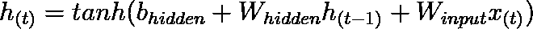

其中 *h(t)* 表示为给定时间点的隐藏状态 *t* 。正如您在等式中看到的，SimpleRNN 依赖于先前的隐藏状态 *h(t-1)* 和当前的输入 *x(t)* 来给出当前的隐藏状态。

SimpleRNN 很棒，因为它能够处理序列数据。不足之处在于它的简单性。SimpleRNN 不能记住序列中更靠后的数据，因此受到消失梯度问题的困扰。当我们开始进一步深入序列时，消失梯度问题就出现了。这是早期状态难以表达的时候。SimpleRNN 中没有机制来帮助跟踪以前的状态。

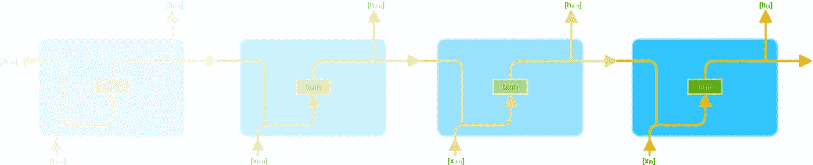

消失梯度可视化

在代码中，SimpleRNN 网络看起来像:

简单网络架构

送入网络的数据仅表示为一个 N*T 向量，而 SimpleRNN 需要一个 N*T*D 向量。我们通过添加一个嵌入层来修正这个问题，给向量一个 D 维。嵌入层允许将输入转换成密集向量，该向量可以被馈送到 SimpleRNN 单元。有关嵌入层的更多信息，请参见 TensorFlow 文档[此处](https://www.tensorflow.org/tutorials/text/word_embeddings)。

我正在使用 Adam 优化器，学习率为 0.001。我用分类交叉熵作为损失函数。使用分类交叉熵是因为我们试图根据前面的步骤对序列中的下一个单词进行分类。

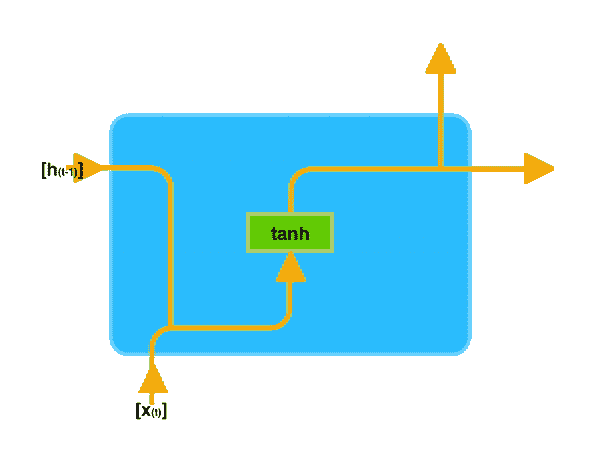

简单细胞

接下来是利用门控循环单元的网络。

GRU 通过引入复位和更新门来改进 SimpleRNN 单元。在高层次上，这些门用于决定我们想要保留/丢失先前状态的信息。

GRU 表示为:

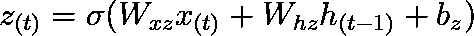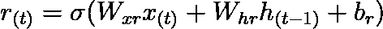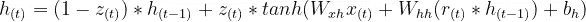

其中 *z(t)* 为更新门， *r(t)* 为复位门， *h(t)* 为隐藏单元状态。

以下是 GRU 的实际效果:

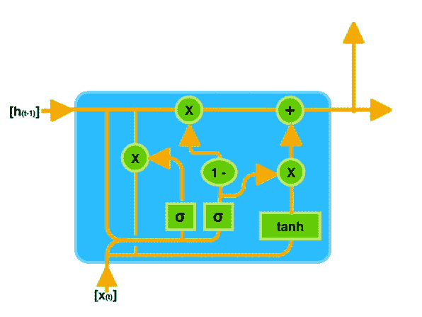

GRU 细胞

以下是 GRU 网络在 TensorFlow 中的构建方式:

同样，我将 Adam 用于优化器，将分类交叉熵用作损失函数。

长短期记忆结构是下一个被利用的。

长短期记忆单元优于简单神经元和 GRU 单元，因为它能够在序列的更下游保留更多的信息。LSTM 使用三个不同的门，而不是 GRU 的两个，并在整个网络中保留一个单元状态。众所周知，GRU 比 LSTM 具有速度优势，因为它能够更快地进行概化并使用更少的参数。然而，当涉及到在整个序列中保留更多的上下文数据时，LSTM 倾向于拿走蛋糕。

LSTM 单元可以表示为:

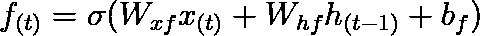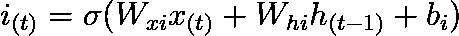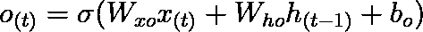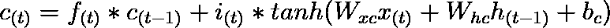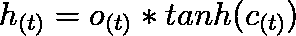

其中 *f(t)* 代表遗忘门，并确定要遗忘多少先前状态。那么 *i(t)* 代表输入门，它决定了我们将向单元状态添加多少新信息。 *o(t)* 是输出门，它决定哪些信息将前进到下一个隐藏状态。单元格状态用 *c(t)* 表示，隐藏状态为 *h(t)。*

这是数据通过 LSTM 池的可视化效果:

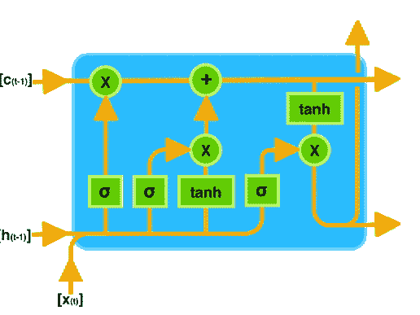

LSTM 细胞

请参见下面的代码实现:

我想测试的最终架构是卷积神经网络和 LSTM 的结合。

这个网络是一个思想实验，看看结果会如何不同于 LSTM、GRU 和 SimpleRNN。实际上，我对它将要发表的一些诗句感到惊讶。

这是架构的代码:

## 用模型生火

为这个项目创建模型仅仅是工作的一半。另一半利用训练好的模型生成歌词。

在我看来，这就是这个项目变得真正有趣的地方。我能够将我训练的模型用于一项重要的任务。

这个项目很大程度上受到彼得·卡塔什、阿列克谢·罗马诺夫和安娜·拉姆斯斯基的《[评估创造性语言生成:说唱歌词代写案例》的启发。因此，我将利用他们论文中概述的一些方法，对照艺术家的原始歌词来评估模型的输出。](https://arxiv.org/pdf/1612.03205.pdf)

我用来评估小节和生成 rap 的方法有:理解分数、韵律指数和抒情独特性。我将很快讨论我是如何计算这些的。

对我如何创作歌曲的高度概括可以描述为:

*   利用马尔可夫模型生成小节前四个单词
*   将马尔可夫模型的输出输入到 RNN 中
*   对照原始歌词评估 RNN 的输出的独特性、相似的押韵索引和相似的理解分数
*   要么把酒吧扔了(如果是垃圾)，要么把它加到歌里(如果是火)

相当简单，对吧？

让我们来看看这是如何实现的代码。

首先，我有一个名为 *generate_rap 的函数。*该函数处理生成说唱歌曲的主要功能。 *generate_rap* 接受我想要用来生成 rap 的模型(SimpleRNN、GRU、LSTM 或 CNN+LSTM)、最大小节长度、我们想要在 rap 中包含多少小节、分数阈值以及我们想要生成 fire bar 的尝试次数。分数阈值定义了该条在被认为是火之前的分数，在这种情况下，该条越接近 0，它就越火。下面是该函数在代码中的样子:

如你所见，我们生成了一个随机条，根据艺术家的平均押韵指数、平均理解能力和条的独特性来评分。然后，如果小节达到分数阈值，它就进入最后的歌曲。如果算法无法在定义的最大尝试次数内生成火条，它会将得分最高的火条放在歌曲中并继续前进。

在 *generate_rap* 中，我使用了另一个名为 *generate_bar* 的函数。这个函数接受一个种子短语、我们用来生成序列的模型以及序列的长度。然后, *generate_bar* 将对种子短语进行标记，并将其输入到提供的模型中，直到序列达到期望的长度，然后返回输出。代码如下:

为了给棒线打分，我使用了一个名为 *score_bar* 的函数。这个函数接受我们想要评分的小节、艺术家的原始歌词、艺术家的平均理解分数和艺术家的平均押韵指数。 *score_bar* 计算输入条的理解分数、押韵指数和独特性指数，然后对输入条进行评分。

该条的分数可以是正的，也可以是负的，0 是该条可以达到的最高分数。分数为 0 意味着该小节具有相同的押韵指数和理解分数，同时保持与原始艺术家的歌词完全不同。完美的 0 分是不可能达到的，这就是我们定义最小和最大阈值的原因。

*score_bar* 函数如下所示:

为了计算一个小节的韵律指数，我使用了“评估创造性语言生成:说唱歌词代笔的案例”中描述的方法押韵指数的计算方法是将押韵音节的数量除以小节或歌曲中的音节总数。下面是代码实现:

为了比较生成的条形的唯一性，我正在计算生成的条形和所有艺术家的条形之间的余弦距离。然后我得到平均距离来计算总的独特性分数。这是它的样子:

## 结果呢

有了这一切，我终于能够利用我训练的四个模型生成一个完整的 rap。生成 rap 后，我取生成的歌曲，计算押韵指数和理解分数。令人惊讶的是，整首歌仍然相当接近原艺术家的押韵指数和理解分数。

以下是训练德雷克歌词时的一些输出。

最简单的:

```
Generated rap with avg rhyme density: 0.5030674846625767 and avg readability of: 2.0599999999999996 Rap Generated with SimpleRNN: Now you’re throwing me baby know it know 
Look I gotta started with you hook drake 
I swear it happened no tellin’ yeah yeah
....
```

GRU:

```
Generated rap with avg rhyme density:  0.5176470588235295 and avg readability of:  1.9449999999999998 Rap Generated with GRU: That's why I died everything big crazy on me 
Who keepin' score up yeah yeah yeah yeah 
I've loved and you everything big crazy on me on
....
```

LSTM:

```
Generated rap with avg rhyme density:  0.3684210526315789 and avg readability of:  1.9749999999999996 Rap Generated with LSTM: Get the **** lick alone same that wait now 
up ****, see what uh huh heart thing up yeah 
Despite the things though up up up up yeah yeah
....
```

LSTM+CSNN:

```
Generated rap with avg rhyme density:  0.33519553072625696 and avg readability of:  2.2599999999999993 Rap Generated with CNN+LSTM: They still out know play through now out out 
I got it dedicate dedicate you yeah 
I've been waiting much much aye aye days aye aye 
....
```

关于完整的歌词和参考文献列表，[看看谷歌 Colab 笔记本](https://github.com/wezleysherman/RNN-Rap-Lyric-Generator/blob/master/RNN_Rap_Generator.ipynb)。也可以随意自己尝试，为你想要模仿的风格更换艺术家。

就简单的 CNN vs GRU vs LSTM vs CNN+LSTM 的实验而言，我会说 LSTM 往往有最好的结果。CNN+LSTM 在一个栏里有太多重复的词，我认为这与 CNN 将整个序列一般化有关。《简单的人》和《GRU》创作出了相当不连贯的小节，它们的韵律密度与原作相去甚远。

就是这样！请在评论中告诉我你的想法。我希望将来能在这个项目上有所建树。如果你对我需要改变的事情有任何建议，让我知道！感谢您的阅读。

查看我的 GitHub，了解这个项目和其他很酷的项目的代码！

[](https://github.com/wezleysherman) [## wezleysherman -概述

### 在 GitHub 上注册你自己的个人资料，这是托管代码、管理项目和构建软件的最佳地方…

github.com](https://github.com/wezleysherman)