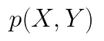

# 吉布斯采样

> 原文：<https://towardsdatascience.com/gibbs-sampling-8e4844560ae5?source=collection_archive---------6----------------------->


在 [Unsplash](https://unsplash.com?utm_source=medium&utm_medium=referral) 上由 [Carlos Muza](https://unsplash.com/@kmuza?utm_source=medium&utm_medium=referral) 拍摄的照片

## 又一种 MCMC 方法

与其他 MCMC 方法一样，Gibbs 抽样器构建了一个马尔可夫链，其值向目标分布收敛。Gibbs 抽样实际上是 [Metropolis-Hastings](/monte-carlo-markov-chain-89cb7e844c75) 算法的一个特例，其中建议总是被接受。

具体来说，假设您想要对一个多元概率分布进行采样。



***注:*** *一个* **多元**概率分布是多个变量的函数(即二维正态分布)。


[https://commons . wikimedia . org/wiki/File:multivariatenormal . png](https://commons.wikimedia.org/wiki/File:MultivariateNormal.png)

我们不知道如何直接从后者取样。然而，由于一些数学上的便利，或者仅仅是运气，我们碰巧知道条件概率。


这就是吉布斯采样的用武之地。吉布斯抽样适用于联合分布未知或难以直接抽样的情况，但每个变量的条件分布已知且易于抽样。

# 吉布斯采样算法

我们从选择随机变量 X*&***Y***的初始值开始。然后，我们从 x 给定 Y = Y⁰的条件概率分布中取样，表示为 p(X|Y⁰).在下一步中，我们采样一个以 X 为条件的 Y 的新值，这是我们刚刚计算的。我们重复该过程进行额外的 ***n - 1*** 次迭代，在给定另一个随机变量的当前值的情况下，在从 X 的条件概率分布和 Y 的条件概率分布中抽取新样本之间交替进行。*

**

*让我们看一个例子。假设我们有下面的后验和条件概率分布。*

******

*其中g(y)包含不包含 x 的项，g(x)包含不依赖于 y 的项。*

*我们不知道 C(归一化常数)的值。然而，我们知道条件概率分布。因此，我们可以用吉布斯抽样来近似后验分布。*

****注:*** 条件概率实际上是正态分布，可以改写如下。*

**

*给定前面的等式，我们继续用 Python 实现 Gibbs 采样算法。首先，我们导入以下库。*

```
*import numpy as np
import scipy as sp
import matplotlib.pyplot as plt
import pandas as pd
import seaborn as sns
sns.set()*
```

*我们定义后验分布的函数(假设 C=1)。*

```
*f = lambda x, y: np.exp(-(x*x*y*y+x*x+y*y-8*x-8*y)/2.)*
```

*然后，我们画出概率分布。*

```
*xx = np.linspace(-1, 8, 100)
yy = np.linspace(-1, 8, 100)
xg,yg = np.meshgrid(xx, yy)
z = f(xg.ravel(), yg.ravel())
z2 = z.reshape(xg.shape)
plt.contourf(xg, yg, z2, cmap='BrBG')*
```

**

*现在，我们将尝试使用吉布斯抽样来估计概率分布。正如我们之前提到的，条件概率是正态分布。因此，我们可以用 mu 和 sigma 来表示它们。*

*在下面的代码块中，我们为 mu 和 sigma 定义函数，初始化我们的随机变量 *X* & *Y* ，并设置 *N* (迭代次数)。*

```
*N = 50000
x = np.zeros(N+1)
y = np.zeros(N+1)
x[0] = 1.
y[0] = 6.
sig = lambda z, i: np.sqrt(1./(1.+z[i]*z[i]))
mu = lambda z, i: 4./(1.+z[i]*z[i])*
```

*我们逐步执行吉布斯采样算法。*

```
*for i in range(1, N, 2):
    sig_x = sig(y, i-1)
    mu_x = mu(y, i-1)
    x[i] = np.random.normal(mu_x, sig_x)
    y[i] = y[i-1]

    sig_y = sig(x, i)
    mu_y = mu(x, i)
    y[i+1] = np.random.normal(mu_y, sig_y)
    x[i+1] = x[i]*
```

*最后，我们绘制结果。*

```
*plt.hist(x, bins=50);
plt.hist(y, bins=50);*
```

****

```
*plt.contourf(xg, yg, z2, alpha=0.8, cmap='BrBG')
plt.plot(x[::10],y[::10], '.', alpha=0.1)
plt.plot(x[:300],y[:300], c='r', alpha=0.3, lw=1)*
```

**

*正如我们所看到的，使用 Gibbs 抽样算法获得的概率分布很好地逼近了目标分布。*

# *结论*

*Gibbs 抽样是一种蒙特卡罗马尔可夫链方法，它根据其他变量的当前值从每个变量的分布中迭代地抽取一个实例，以便估计复杂的联合分布。与 Metropolis-Hastings 算法相反，我们总是接受建议。因此，吉布斯采样可以更有效。*