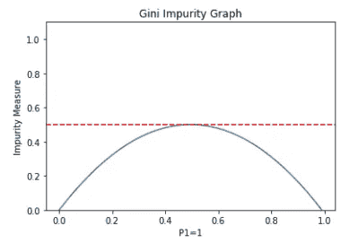
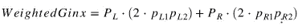

# 基尼不纯度测量——使用 python 的简单解释

> 原文：<https://towardsdatascience.com/gini-impurity-measure-dbd3878ead33?source=collection_archive---------3----------------------->

## 使用 python 的直观解释

# 介绍

Gini 杂质度量是决策树算法中使用的方法之一，用于决定从根节点开始的最佳分裂以及后续分裂。

(在继续之前，您可能想回顾一下[用树做决策](https://medium.com/@StevenLoaiza/making-decisions-with-trees-559c8db5af59)

将它放入上下文中，决策树试图创建连续的问题，以便将数据划分为更小的组。一旦划分完成，就在该终端节点做出预测决策(基于频率)。

假设我们有一个观察列表，表明一个人是否决定呆在家里不工作。我们还有两个特征，即他们是否生病和他们的体温。

我们需要选择哪个特征，情绪还是温度，来分割数据。基尼系数将帮助我们做出这个决定。

**Def:** 基尼系数告诉我们一个观察值被错误分类的概率是多少。

请注意，基尼系数越低，分割越好。换句话说，错误分类的可能性越低。

# 形式定义

下图是两类问题。我们将在后面将其概括为两个以上的组。

让 **Ginx** 代表基尼指数。

其中 p1、p2 分别是 1、2 类概率。

**注** : p1 + p2 =1

这还没有完成。上面的等式将给出子分割的基尼系数，但是我们想知道整个分割的基尼系数(因为数据将被分割为左右两部分)。因此，我们需要相应地权衡它们。

其中，P_L 是向左分流的比例，p_L1 类似于左分流的 P1(P _ R 也是如此)。

我们有一个零的下限和一个半的上限。杂质测量值越低，分离越好。

如果你看一下图表，你会注意到杂质测量值越低越好。当观察值为 1 类的概率为零(一直到图表的左侧)时，这意味着它将始终为 2 类，杂质测量值为零。当观察值为 1 类的概率为 100%时，在另一端也会发生同样的事情。

# 例子

让我们回到上面的例子，在两个特性上分开。

## 情绪

病态基尼杂质= 2 * (2/3) * (1/3) = 0.444

NotSick 基尼杂质= 2 * (3/5) * (2/5) = 0.48

加权基尼系数= (3/8) * *西基尼+ (5/8)非西基尼= 0.4665*

## 温度

我们将温度的阈值硬编码为 Temp ≥ 100。

杂质温度= 2 * (3/4) * (1/4) = 0.375

杂质下温度= 2 * (3/4) * (1/4) = 0.375

加权基尼系数=(4/8)**TempOverGini*+(4/8)**TempUnderGini*= 0.375

我们可以看到，温度的基尼系数较低。因此，我们会选择在温度上进行分割，因为它对观察结果进行错误分类的可能性最低。

我们将验证我们的函数确实返回了上面的值。

# 结论

我们已经完成了基尼系数的引入。我希望这个简短的解释能让你了解决策树是如何决定分割数据的。

请记住，这不是唯一使用的方法，它将取决于您使用的软件包。

感谢您的阅读！

# 附录

**基尼不纯的概括**

假设我们有( *n)* 个不同的类。那么基尼公式将是:

