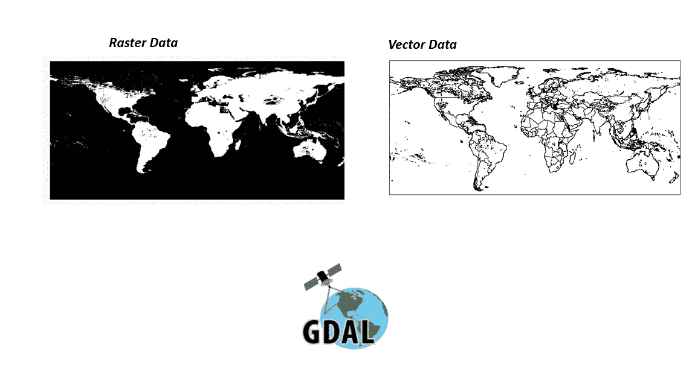
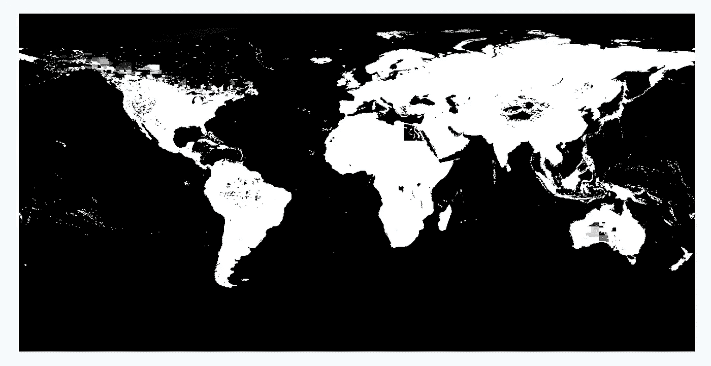
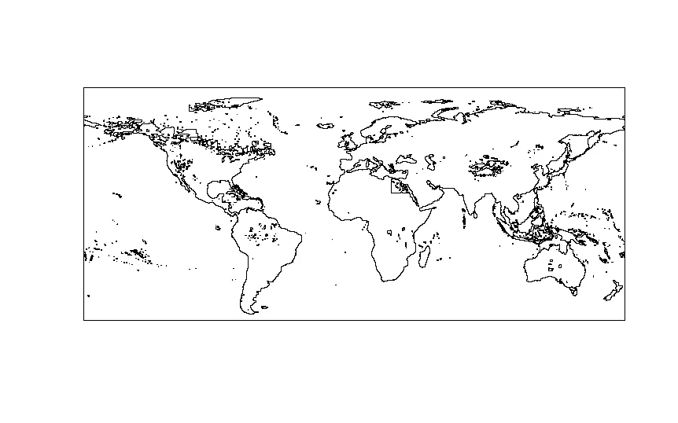
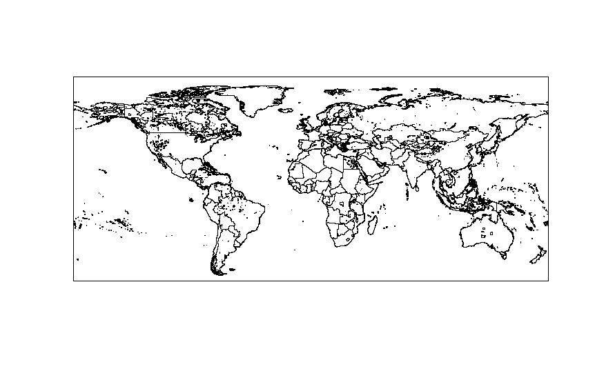

# GIS 数据处理备忘单:有效使用命令行 GDAL

> 原文：<https://towardsdatascience.com/gis-data-processing-cheat-sheet-effectively-using-command-line-gdal-b280823a7389?source=collection_archive---------34----------------------->



## 在本文中，我提供了一个使用简单的命令行 GDAL 来处理、转换和操作大量复杂的 GIS 数据集的演练

地理信息系统(GIS)信息量大，并提供数据的粒度表示。不用说，这些数据集对研究人员、数据分析师和数据科学家非常有吸引力。但是这些数据带来了一个大问题。从处理和计算时间的角度来看，它们很重，操作起来很痛苦。鉴于这些数据集的大小和结构，除非使用 ArcGis 或 QGIS 等软件，否则很难对其进行有意义的分析。在本文中，我提供了一些简单的命令行代码，可以用来极大地减少处理时间，并且可以有效地用于从这些数据中提取有意义的信息。这段代码使用了 GDAL 程序，这里的[是可用的](https://gdal.org/)。所以，让我们直接开始吧。

**对于那些不熟悉 GIS 数据类型的人来说**——我想简单总结一下你可能会遇到的不同类型的 GIS 数据。有两大类需要考虑。第一个是 ***栅格数据*** ，它是基于格网/像元的数据，包含一些关于像元内容的信息(像元中包含的人口这样的离散数据)或它所代表的内容(像特定像元属于什么类别这样的连续数据)。光栅格式的一个例子是. tif。bsq 或者。bil 文件。第二个是 ***矢量数据*** ，是表示为国家、州等地图形状的数据。矢量格式的一个例子是. shp 或 shapefile。现在，我们知道了将要处理的数据，让我们直接进入代码。

**要使用这个代码，你需要在你的机器上安装 GDAL**。如果你在 windows 机器上，我会推荐通过 cygwin 终端安装 GDAL。

1.**获取信息/元数据-** 我在本文中使用了一个示例栅格，名为 gpw _ v4 _ population _ count _ rev 11 _ 2000 _ 30 _ sec . TIF。这是一个从 NASA 维护的数据库中下载的文件，可以在这里访问[。这是一个简单的栅格，包含世界上每个国家的每个格网像元的人口。要查看该栅格实际包含的内容，让我们使用下面的 gdalinfo 函数。](https://sedac.ciesin.columbia.edu/data/set/gpw-v4-population-count-rev11/data-download)

```
#First go the directory containing the filecd 'file path here'#Now let's run gdalinfogdalinfo gpw_v4_population_count_rev11_2000_30_sec.tif#This is the output we get
Driver: GTiff/GeoTIFFFiles: gpw_v4_population_count_rev11_2015_30_sec.tifSize is 43200, 21600Origin = (-180.000000000000000,89.999999999999915)Pixel Size = (0.008333333333333,-0.008333333333333)Metadata:AREA_OR_POINT=AreaDataType=GenericImage Structure Metadata:COMPRESSION=LZWINTERLEAVE=BANDCorner Coordinates:Upper Left  (-180.0000000,  90.0000000)Lower Left  (-180.0000000, -90.0000000)Upper Right ( 180.0000000,  90.0000000)Lower Right ( 180.0000000, -90.0000000)Center      (  -0.0000000,  -0.0000000)Band 1 Block=43200x1 Type=Float32, ColorInterp=GrayNoData Value=-3.40282306073709653e+38
```

因此，我们得到的信息告诉我们**驱动:**这是文件的类型(在本例中是 tif 文件)，**大小:**这是网格的大小(组成网格的行数和列数，在本例中是 43200，21600)。**像素大小:**这是像素内投影的大小(在本例中为 0.00833333 度，即 5 弧分)，**角坐标:**这是投影的范围(这将告诉我们某些区域是否从投影中缺失)。例如，一些地图将有一些区域被切断等)，最后我们得到 **NoData 值:**，这是没有数据计算的值，或者基本上是数据集中的空值。所有这些数据都很有用，我们将在本文的其余部分看到。但是***gdalinfo****确实很有用，因为它提供了一个文件中可用数据的快速摘要，并且不消耗任何处理能力。*

*2.**在栅格中填充 Nodata 值-** 对于不同的项目，我们可能不需要 NoData 值，或者可能希望用不同于默认值的值替换 NoData 值。使用 gdal，我们可以遵循 3 个步骤来完成这个任务。首先，我们需要将 NoData 值替换为我们自己的默认值(假设为 0)，将所有 NoData 值替换为零(这是一个健全性检查，以确保我们捕获的 Nodata 值不是由元数据指定的)，然后我们需要去掉 NoData 标签，因为 NoData 本质上是一个定性标签。我们在这里可以使用两个命令，第一个是用 ***gdalwarp*** 来替换值，第二个是用***gdal _ translate***来移除标签。请注意，这两个命令像大多数其他 gdal 命令一样，会要求您指定一个单独的输出对象。*

```
*#Fill NoData values with zerogdalwarp -srcnodata -3.40282306073709653e+38 dstnodata 0 gpw_v4_population_count_rev11_2015_30_sec.tif population_nodatafilled.tif# Now replace all no_data values with a 0.gdal_translate -b 1 -a_nodata 0 population_nodatafilled.tif population_only_data.tif#Note that the -b indicates the band within the raster where you want to the operation. This would change for multiband rasters.# Now take off the no_data tag itselfgdal_translate -a_nodata none population_only_data.tif population_clean.tif*
```

*3.**重新投影栅格-** 在比较两个栅格文件时，我们需要确保我们是在比较同类文件，因为网格大小、投影类型或投影大小甚至范围可能存在差异。 ***gdalwarp*** 允许我们进行方便的重新投影来标准化光栅文件。因此，继续我们当前的例子，如果我们想用不同的投影类型将数据重新投影到一个更小的网格上，我们将使用下面的 gdalwarp 命令。代码中的注释还提供了我们提供给这个命令的参数的描述。*

```
*#Let's reproject gdalwarp -ts 1440 600 -r average -ot Float32 -t_srs "+proj=longlat +ellps=WGS84" -te -180 -60 180 90 population_clean.tif population_reprojected.tif#Note the following:# -ts is the size of the grid that we want in rows and columns
# -r is specifying the method used to aggregate/dis-aggregate. There #are a number of options available, but the one that makes the most #sense is average since this is basically the sum of the cell values #being aggregated divided by the number of cells.
# -ot is the output type which is set to a Float since this us a #mathematical operation.
# -t_srs is the reprojection type. The one I am specifying here is a #longlat projection using a WGS84 datum.
# -te is the extent itself, which is the extent of the projection. #If you standardize the grid size and the reprojection type, you will automatically standradize the pixel size.* 
```

*现在，你可能已经注意到，你甚至不能打开原来的 tif。不过，在重新投影后，我们实际上可以绘制出光栅，因为尺寸要小得多。*

**

*这是带有按格网单元划分的人口的变形 tif。*

*4.**转换栅格数据类型-** 用户通常会想要转换数据类型。这样做的一个常见原因是空间。例如，地理 IFF 在内存方面很贵，但是。bil 或者。bsq 文件便宜很多。因此，我们可以使用 gdal_translate 轻松地转换它。最棒的是，gdal 会在需要的地方自动创建头文件。*

```
*#Convert tif to bilgdal_translate -of ENVI population_reprojected.tif population_final.bil#The -of specifies the file type we want to convert to.*
```

*5.**根据标准替换特定像素值-** 现在，用户可能还想用自己的值替换栅格中的特定值。假设我们希望在所讨论的栅格中，具有任意人口值的格网像元的值为 1，而没有人口值的格网像元的值为 0。我们可以使用 ***gdal_calc.py*** 来实现这一点。我们只需使用下面的代码来完成这个。请注意，这是一个 python 命令。*

```
*#Replace pixel values based on criteriagdal_calc.py -A population_final.bil --calc='((A>0))*1+((A<=0)*A)' --outfile=population_final_reclass.bil#This will basically replace all values within pixels with 1 and those without values to 0.*
```

*6.**光栅到矢量转换(多边形化)——**假设我们想要一个根据人口分布的全球地图。也就是说，一张地图向我们展示了人们在世界上实际生活的地方。我们已经有了一个光栅，可以精确地跟踪每个像素。如果我们能结合像素得到一个有意义的地图，那将非常有帮助。这在 gdal 中使用***gdal _ polygonize . py***很容易实现。这将需要一个栅格，将像素转换为多边形，合并具有相同值(在本例中为 1)的相邻像素，并输出一个全局地图。*

```
*#Convert raster to vector (shape file)gdal_polygonize.py population_final_reclass.bil population_map.shp pop#Note that the pop is the destination column name within the shape file.* 
```

*在这之后，如果我们要绘制出人们居住的世界地图，我们会得到下面的地图。最重要的是，它将对应于我们的光栅的尺寸。*

**

*全球人口分布图。洞表明那里没有人口居住。*

*7.**合并矢量文件-** 现在，假设在上面的地图中，我们也想要在上面的地图中表示世界上不同的国家。使用 ***ogr2ogr*** 命令，还可以合并两个矢量文件。假设我们有一个名为 countries.shp 的 shapefile，其中包含国家的实际边界。我们可以将它与现有的形状文件合并，得到一个地图文件，向您显示国家地图，以及国家中没有人居住的地方的洞。*

```
*#First create a file to merge againstogr2ogr -f 'ESRI Shapefile' population_boundaries_merged.shp population_map.shp#Now merge the boundaries shapefile into this oneogr2ogr -f -update -append population_boundaries_merged.shp ccountries.shp -nln merge#This command is updating the population_boundaries_merged.shp by appending a new boundaries file from countries.shp.* 
```

*这是我们从新的人口边界合并中得到的输出*

**

*我们的合并矢量的输出(形状文件)*

*这就是了。当必须处理大量 GIS 数据并从中提取有意义的信息时，这些命令是非常有用的备忘单。它们显然可以被修改以适应许多操作。我还在开发一个存储库，将这些命令作为一组正式的 bash 脚本来存放。当前形式的存储库在这里是。一如既往，欢迎任何与此相关的反馈！*