# Git:完整的指南

> 原文：<https://towardsdatascience.com/git-a-complete-guide-d49675d02a5d?source=collection_archive---------42----------------------->

## 涵盖了通过 Git 实现完整工作流的基本命令。


米哈伊尔·瓦西里耶夫在 [Unsplash](https://unsplash.com?utm_source=medium&utm_medium=referral) 上的照片

在有多个协作者的项目中，在构建项目时可能会有冲突。 **Git** & **GitHub** 为我们提供了这类问题的终极解决方案。Git 简化了与其他人合作的过程，使项目协作变得容易。在本帖中，我们将介绍工作流环境所需的所有主要命令。

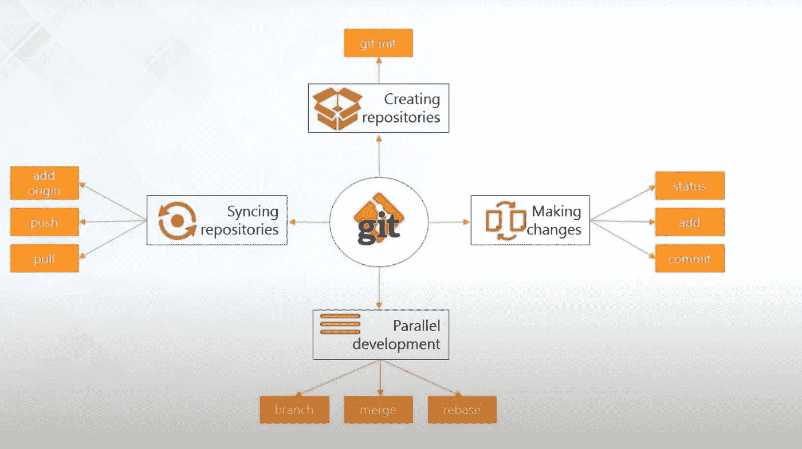

来源:YouTube， [Edureka](https://www.youtube.com/watch?v=xuB1Id2Wxak&t=2679s)

在这里，我们将涵盖工作流中使用的所有基本命令

*   **创建存储库**
*   **同步存储库**
*   **进行更改**
*   **并行开发**

最初，我们从创建一个存储库开始

```
git init
```

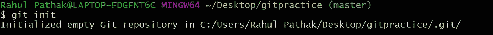

下一步是将文件从中央或远程存储库拉到本地机器上。

```
git add origin master "link from your github account"git pull origin master
```

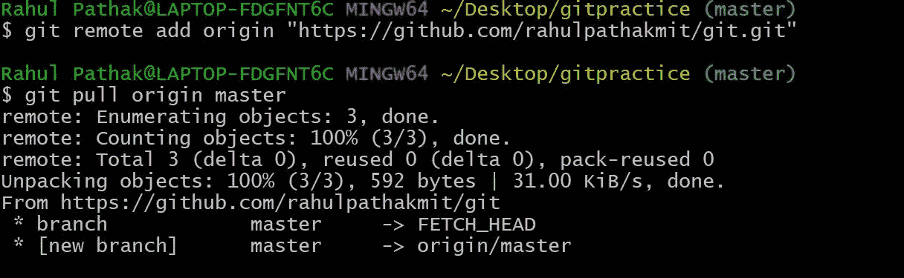

下一步是将创建的文件或开发的代码添加到索引中。这就是所谓的**分期。**文件被添加到索引**中。**

> **索引**是一个准备新提交的暂存区。
> 
> 我们还可以检查状态。 **git status** 命令显示工作目录和暂存区的状态。

```
git add "file name"git add -A // to add all files in the foldergit status 
```

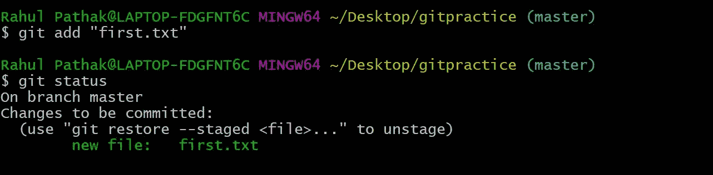

随着文件被添加到索引中，Git 的核心( **Commit** )开始就位。

> “**提交**”命令用于将您的更改保存到本地存储库。我们需要显式调用它来查看变化。

```
git commit -m "your message"git commit -a -m "your message" // to commit all the files
```

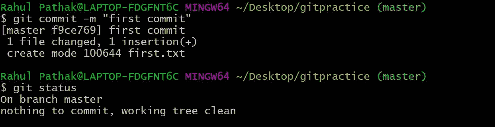

到目前为止，我们已经**创建了一个库**，**同步库**，&，**在本地库**做了修改。现在下一步是执行并行开发。

要检查所有提交的日志，使用命令 **git log**

```
git log
```

**平行开发**包括:-

*   **分支**
*   **合并**
*   **重置基础**

让我们继续前进，执行**分支**

> 在 **Git** ，**分支**是你日常开发过程的一部分。 **Git 分支**实际上是指向您的更改快照的指针。

```
git branch branchname
```


这里它创建了一个名为**“first branch”**的分支。在这个分支中，来自**主**分支的所有文件被复制，并且这些更改可以在创建的分支中使用，而不会影响**主**分支。

要访问分支，我们使用命令

```
git checkout branchname ls // lists the file in the branchcat filename //view the contents of file
```

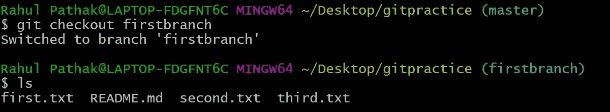

一旦创建了新的分支，将该分支与主分支合并以生成产品质量代码是非常重要的。

> **git merge** 命令可以让你获得由 **git** 分支创建的独立开发线，并将它们集成到一个分支中。

```
git merge firstbranch
```

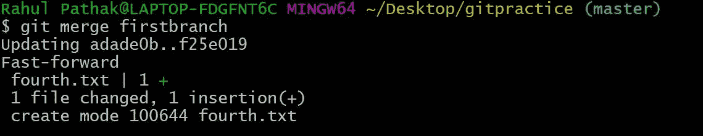

还有一种方法可以将分支合并到主分支。叫做 **Rebase。**这样效率更高，因为它用于制作一个线性提交序列。用于**清理项目历史** & **减少分支数量。**

```
git rebase branchname
```

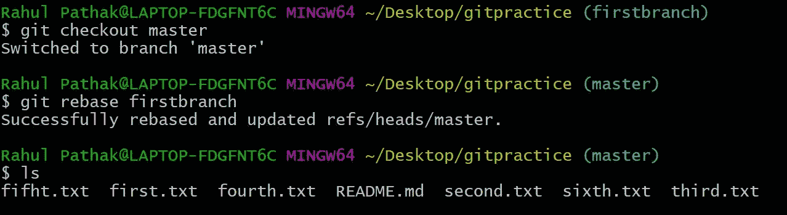

请确保创建文件，添加并提交它们，以使更改生效，并保持您的代码无错误运行。

要将代码从本地存储库推送到远程存储库，我们需要首先进行身份验证。为此，我们需要 SSH 密钥。GitHub 使用 SHA-1 算法进行安全哈希运算，生成 40 位十六进制代码。

```
ssh-keygen
```

要生成 **ssh 密钥**,请键入以下命令

```
cat 'path' // usually id_rsa.pub where the public key is saved
```

检查您是否已成功验证了命令中的类型

```
ssh -T git@github.com
```

会弹出一条消息，提示您已成功通过身份验证。一旦 ssh 密钥生成，您就可以将代码从本地存储库推送到远程存储库。要将文件从本地推送到远程，请在命令中键入

```
git push origin branchname // to push any respective branchgit push origin master // to push master branch 
```

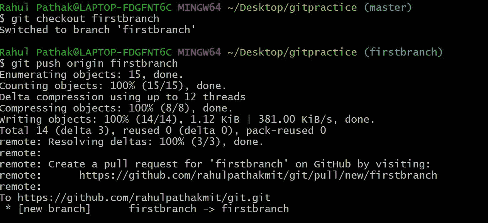

检查您的 GitHub 库，查看您的 **Git** 所做的更改

这涵盖了 **Git 的**基本命令**。**

## Git 基本上由三个主要阶段组成

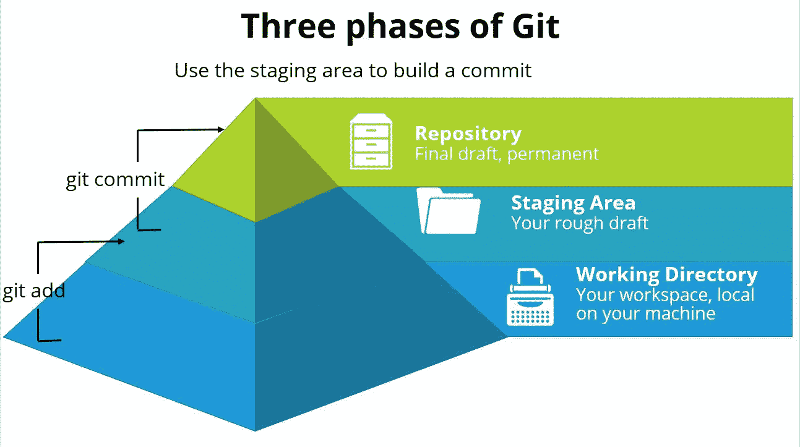

拉胡尔·帕塔克

## 用通俗的话来理解工作流，Git 有一个工作/开发环境一个登台环境&生产质量代码或中央存储库。让我们用一张办公桌来理解这些阶段。

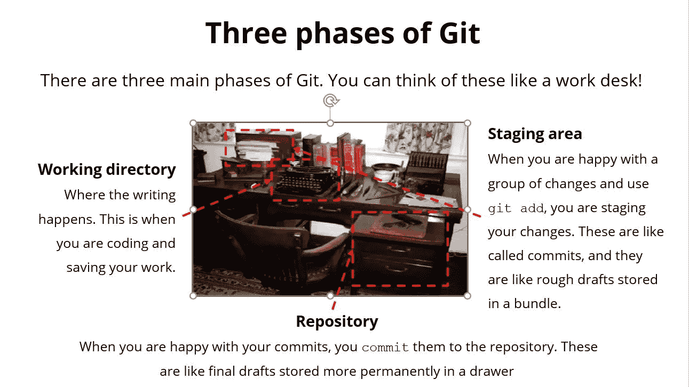

拉胡尔·帕塔克

**我希望你们都喜欢这个帖子，并且已经理解了 Git 的基本命令和 Git 的工作流环境。非常感谢:)**


在 [Unsplash](https://unsplash.com?utm_source=medium&utm_medium=referral) 上由[Courtney hedge](https://unsplash.com/@cmhedger?utm_source=medium&utm_medium=referral)拍摄的照片