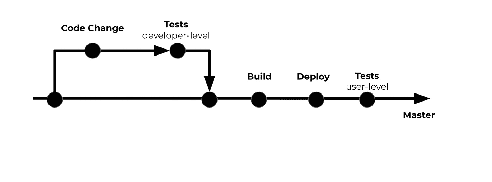
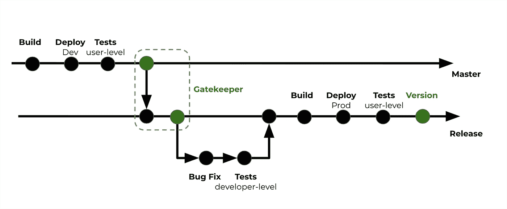

# Git-Flow 是生产力的源泉，而不是混乱

> 原文：<https://towardsdatascience.com/git-flow-is-the-source-of-productivity-not-confusion-8abda7c5fb30?source=collection_archive---------37----------------------->

## 行业笔记

## 初创公司两个最基本的 git 流程的具体细节

Denys Nevozhai 在 [Unsplash](https://unsplash.com?utm_source=medium&utm_medium=referral) 上拍摄的照片

开发工作流的架构是基于发布的质量和数量来设计的。这里的质量**T5 指的是每个版本中无 bug 或特性集的状态。数量是指开发过程中发布的次数。这种架构通常没有那么复杂；然而，这可能会引起混乱。**

基于 git 的开发工作流，也称为 git 流，是构建和发布软件的一系列开发步骤。Git 是一种流行且强大的版本控制技术，被许多公司使用，同时还有其他技术，如 Perforce 或 Mercurial。在本文中，我使用 git-flow 而不是基于 git 的开发工作流，不失一般性。这与这篇[帖子](https://nvie.com/posts/a-successful-git-branching-model/)中介绍的 GitFlow 不同。

在这里，我解释了两个对创业公司至关重要的 git-flow 架构。了解这些架构的细节可能会解决开发、产品和管理团队之间不必要的冲突。最后，我解释了 git 流的具体细节，这有助于更好地理解它。

请注意，与本文中的内容相比，git-flow 架构可能会变得更加复杂。然而，如果你学习了两个最基本的 git 流的细节，你将很容易理解任何复杂的 git 流。

# 最常见的两种 git 流是什么？

软件行业中使用了各种各样的 git 流。不过有两个是创业公司常用的。下面，我首先描述两个场景，然后解释适用于这些场景的两个 git 流。

*   **场景 1。**你需要一个频繁发布的快速开发过程。您不希望让把关者签署发布。您接受意外引入主分支的小错误，而不会导致主要功能停止。另外，您不需要控制每个版本中的特性列表。在这种情况下，你必须使用高频率和低质量的架构。
*   **场景二。**你的用户数量相对较多。您必须在每次发布之前广泛验证产品的质量。您希望有一个不断审查产品的团队，以及一个签署发布的把关人。在这种情况下，你必须使用低频和高质量的架构。

> 把关者是一个定期检查产品质量并决定产品何时发布的人。在大多数创业公司，产品经理都是把关人。

## —高频率和低质量

在这个 git-flow 中，只有一个主要的源分支，在那里开发被合并，发布被提取。

在创业的早期阶段，开发工作流程不能因为任何原因而延迟。没有付费客户，主要精力放在开发上。因此，开发团队的目标是只通过自动化测试来检测 bug，并接受在新版本中有一些 bug。由于这个 git-flow 没有签署发布的看门人，bug 只是通过自动化测试溜到发布中。一旦发现这些错误，必须立即修复。

没有看门人的 git 流

## —低频和高质量

在这个 git 流中，有两个主要的源分支:主和发布。开发团队在主分支上工作以构建产品，在发布分支上工作以准备发布产品。

发布分支为产品经理创建了一个独立的环境，以便对特性开发和发布质量有更多的控制。在产品团队中，QA 工程师在发布分支上运行手动测试，以发现并报告必须修复并合并到发布分支中的 bug。最后，产品经理作为把关人负责签署发布。

> 高质量的软件伴随着低频发布的成本。

无论如何，100%的测试覆盖率是不可能的。因此，bug 也可能在这个 git 流的测试过程中溜走。然而，这种架构中的发布质量比我们从前一种架构中得到的更可靠。

具有看门人的 git 流

# 二。git 流的主要步骤是什么？

## —开发

git 流程的第一步是代码变更，即功能开发或缺陷修复。当您想要在代码库中进行更改时，您必须始终创建一个隔离分支，以防止在源分支中进行不必要的更改。

在您完成开发之后，您必须通过一个标准的过程将最近的变更合并到源分支中。 [Github](https://github.com/) 称这个流程为 pull-request， [GitLab](https://about.gitlab.com/) 称之为 merge-request，两者指的是同一个流程。

在这个过程中，代码更改等待开发人员级别的测试(例如单元、集成和回归测试)和代码审查。有一些应用程序如 [Hound](https://houndci.com/) 也使代码审查过程部分自动化。如果代码更改可以通过测试并获得所需的批准，它们将被合并到源分支中。而且，发展还在继续！

## —测试

质量软件是关于测试和开发之间的平衡。在运行测试的 git 流中有两个关键点。首先，在将代码变更合并到源分支(例如，主版本或发布版本)之前，其次，在将产品交付给客户之前。

知道了软件测试的重要性，问题是我们有多少类型的测试。测试可以是自动的，也可以是手动的。**自动化测试**由 DevOps 解决方案如 [CircleCI](https://circleci.com/) 和测试框架如 [PyTest](https://docs.pytest.org/en/latest/) 以完全自动化的方式执行。**手动测试**由产品团队执行，旨在覆盖自动化测试未测试的零件。

在这里，我根据软件测试为开发工作流提供的高层次价值对软件测试进行分类。有两种不同类型的测试:开发者级和用户级。

*   **开发人员级别的测试**比如单元、集成和回归测试评估代码的健全性。它们在 git 流的每次提交之后、构建过程之前执行。这些测试是完全自动化的。其目标是确保**代码的健全性**并**加快开发的步伐**。开发人员是工作流中这些测试的所有者。
*   **用户级测试**如验收和性能测试评估整体解决方案。它们在部署后执行。这些测试是手动和自动的。它的目标是**模拟用户体验**和**从整体上衡量服务质量**。在大多数创业公司中，产品经理是工作流中这些测试的所有者，因为这些测试大多是面向用户的。

> 在大多数情况下，您必须非常依赖自动化测试来检查健全性和质量。然而，这并不意味着在这个过程中不能使用手工测试。

通过运行自动化过程在每次提交时集成和验证代码库的实践被称为**持续集成**。

## —构建

构建指的是编译和打包源代码及其工件的过程。构建步骤的输出是一个二进制文件，可以部署到云上。

**举例。**当您使用 Docker 构建二进制文件时，构建过程的输出被称为 Docker 映像，它是构建它的虚拟机环境的快照。

这些二进制文件必须存储在二进制库管理器上，例如 [JFrog](https://jfrog.com/artifactory/) 或 [DockerHub](https://hub.docker.com/) 。当您将它们存储在存储库管理器中时，您必须对它们进行标记，以便可以轻松地搜索和检索它们，尤其是当您想要自动部署它们时。例如，您可以使用 git 创建的 commit ID 来标记二进制文件，因为它确切地显示了解决方案是在哪里构建的，并且它作为惟一的标识符工作。

从每次提交构建和存储二进制解决方案的实践被称为**连续交付**。

## —部署

部署是指所有构建工件在云或服务器上收集、执行和编排的过程，使用的编排器有 [Mesos](http://mesos.apache.org/) 、 [Kubernetes](https://kubernetes.io/) 或 [Docker Swarm](https://docs.docker.com/get-started/swarm-deploy/) 。

**举例。**当您使用 Docker 部署解决方案时，会创建一个 Docker 容器，它可以在您的本地机器上运行，也可以在云基础架构(如 Amazon EC2)的计算节点上运行。

**最佳实践**是为每个主和发布分支指定一个云环境。主分支和发布分支的云环境分别被称为开发(dev)和生产(prod)。在更复杂的工作流中，有一个登台环境超出了本文的范围。

如果使用**微服务架构**，可以独立部署前端、后端、数据库等每个微服务。微服务的集合被编排来构建主服务。微服务架构允许您独立、高效地测试、维护和部署松散耦合的服务。没有必要说您需要正确地配置这个编排，这也超出了本文的范围。

在没有任何干预的情况下持续部署解决方案的实践被称为**持续部署**。

# 临终遗言

您可以基于行业需求、公司阶段或客户期望使用不同的 git-flow 架构。在这篇文章中，我描述了每个人都必须知道的拥有一个高效团队和减少不必要冲突的要点。因此，您应该基于您的需求采用 git-flow，并使用它，直到它在您的团队中变得自然。

# 感谢阅读！

如果你喜欢这个帖子，想支持我…

*   *跟我上* [*中*](https://medium.com/@pedram-ataee) *！*
*   *在* [*亚马逊*](https://www.amazon.com/Pedram-Ataee/e/B08D6J3WNW) *上查看我的书！*
*   *成为* [*中的一员*](https://pedram-ataee.medium.com/membership) *！*
*   *连接上*[*Linkedin*](https://www.linkedin.com/in/pedrama/)*！*
*   *关注我* [*推特*](https://twitter.com/pedram_ataee) *！*

 [## 通过我的推荐链接加入 Medium—Pedram Ataee 博士

### 作为一个媒体会员，你的会员费的一部分会给你阅读的作家，你可以完全接触到每一个故事…

pedram-ataee.medium.com](https://pedram-ataee.medium.com/membership)