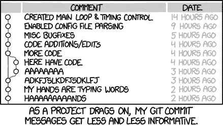

# Git 在不到 8 分钟的时间里解释了——不仅仅是命令！

> 原文：<https://towardsdatascience.com/git-help-all-2d0bb0c31483?source=collection_archive---------24----------------------->

## 一本你不知道自己需要的 git 指南


资料来源:XKCD

虽然花时间学习 git(或写一篇关于它的文章)可能会感觉愚蠢和浪费，但让我告诉你，从长远来看，这是值得的。一旦你明白了它是如何运作的，并且感觉它不像是只会让你的生活变得痛苦的黑魔法，你可能就会开始有点欣赏它了。

抛开所有的承诺，在我们决定像一个没有版本支持的工具一样浏览命令之前，让我们了解一下这里到底发生了什么。

# Git 基础设施

git 命令做的事情之一是移动/复制数据。在使用 git 时，有 4 个区域可以存放我们的数据。

1.  **工作空间**，在这里您可以对文件进行修改。
2.  该索引，又名**暂存区**，包含已暂存的文件，即准备提交的文件。如果您在 10 个文件中进行了更改，但只有 5 个与您的工作相关，则您只能添加这 5 个文件。
3.  **本地存储库**包含提交的文件。该区域中的文件将被推送到原点。一旦添加了这 5 个文件，就可以通过一次提交将这些更改复制到这里。
4.  **stash** ，一个存储尚未准备好上传但你也不想丢失的文件的地方。


带有基本命令的 git 中的数据流。

此外，git 命令还可以将指针从一个提交移动到另一个提交。它还能够一气呵成地移动数据和指针。等等，我这里说的是什么指针？！

嗯，为了更清楚，我上面画的图是一个过于简单的图。本地存储库不仅仅是您实际项目的单一副本。而是一个提交树——其中每个提交都是您的项目在不同阶段的快照。

让我们看一个例子，其中我们有一个新的 git 项目，有两个文件——*ReadMe*。 *txt* 和 *BubbleSort* 。 *cpp* 。
然后我们创建一个文件 *MergeSort* 。 *cpp* 并修改了 *ReadMe.txt* 以反映新的状态。现在我们添加这些文件并创建一个新的提交 C2。


提交#2 后的状态。

每当你创建一个新的提交，它将把它附加到最近的提交(一个头在那个时刻指向)。在此过程中，分支指针不会移动。

现在我们对 git 有了一些了解，让我们来看看命令。

# git 状态

它显示了你工作空间的当前状态。它将告诉您已暂存、未暂存或未跟踪的更改(新创建的文件，即在您的工作空间中但不在索引和存储库中的文件)。

# git 添加

它将工作目录中的更改添加到临时区域。它告诉 Git，您希望在下一次提交中包含对特定文件的更新，用简单的英语来说，这意味着将您的更改从您的工作空间复制到您的索引/暂存区域。

```
git add <fileName> // To stage[add] individual files.git add -A // To stage[add] all the modified files.git rm --cached <fileName> // To undo an add i.e. remove from [2] but not from [1].Remember to add --cached otherwise the file will be removed from both [1] and [2].git rm <fileName> // Remove from both [1] and [2]
```



为什么信息很重要。来源:XKCD。

# git 提交

它捕获项目当前阶段变更的快照。只有在您暂存了您的更改后，您才能提交它们。这会将索引中的更改复制到存储库中，并创建一个新的提交。除此之外，它所做的是将分支指针移动到最近的提交。由于头部之前指向分支指针，现在它也将指向新的提交。以下选项很有用:

*   修改:它允许你修改最近的提交。如果临时区域中没有文件，它将只让您编辑前面的提交消息。如果一些文件被转移，它将创建一个新的提交来替换最近的提交。如果您必须提交 3 个文件，F1、F2 和 F3。您准备了 F1 和 F2，然后是 git commit -m“添加了 3 个文件”。现在，您意识到您忘记转移 F3，因此它不在“添加的 3 个文件”提交中。要将 F3 添加到之前的提交中，请运行以下命令

```
git add F3
git commit --amend --no-edit
```

这将创建一个具有相同消息“添加了 3 个文件”的新提交，包含这两个提交中的暂存文件，并替换原始的“添加了 3 个文件”提交。

```
git commit -m "<YourCommitMessageGoesHere>"git commit --amend <NewCommitMesg> // Running this command when there is nothing staged lets you edit the previous commit’s message without altering its snapshot.git commit --amend --no-edit // Let's say you accidentally did a premature commit i.e. forget to stage a few files. Once you stage the missing files and run this command, it will replace the latest commit with the newly created one.
```

# git 日志

它显示了提交的历史。查看您已经提交的更改(提交散列和提交消息)，或者其他人提交到该分支的更改。
这就是为什么在提交变更时给出有意义和相关的消息很重要，以便了解每次提交中可能发生了什么变更。

```
git log // Displays a history of commits, with commit hash and commit message.
```

# git 贮藏

它暂时搁置(或*隐藏*)变更，这样你就可以做别的事情，然后回来重新应用它们。

这一个获取你所有的改变(不包括未跟踪的文件)并且*将它们从工作空间移动到你的存储空间。这些更改将不再出现在您的工作空间中。*

```
git stash save "<StashName>" // To move your changes to stash
git stash save -u "<stashName>" // To stash un-tracked files as wellgit stash list // Displays a list of all the "stashes" one has on various branches.git stash apply stash@{x} // Copies all the changes in stash@{x} from [4] to [1]. The changes are now in both [1] and [4].git stash pop // ***Moves*** the changes in stash@{0} from [4] to [1]. The changes will only be present in [1] now.git stash drop stash@{x} // Deletes the stash at position x.
```

# git 差异

它显示了两个文件、git 上两个不同区域甚至两个不同提交之间的区别。

```
git diff // Shows diff in files between your work-space and index.git diff --cached // Shows diff in files between index and local repository, i.e. your staged changes.
```

# git 分支

git 存储一个分支作为提交的引用。从这个意义上说，一个分支代表一系列提交的顶端

```
git branch //lists all the branches in your repository.git branch -d <branchName> // Deletes a branch. Safe option, as it won't let you delete a branch with unmerged changes.
```

# git 检验

在更高的层次上，它用于从一个分支转移到另一个分支，或者创建一个新的分支。在非常基础的层面上，它用于从一个提交转移到另一个提交。它只移动头部指针。

```
git checkout <branchName> // Move to <branchName>git checkout -b <newBranchName> // Create a new branch.git checkout <commitId> // move to a specific commit id.
```

# git 重置

它允许我们将头指针和分支指针都移动到指定的提交。使用该命令时应非常小心，因为它可能会造成不可逆的变化。根据所使用的选项，它还会修改暂存区和工作区中的指针。
复位命令有以下 3 个选项:

1.  **—硬**:这是最危险也是最强大的选项。它将修改指向存储库中指定提交的指针。指针也将在其他两个区域中更新—临时区域和工作区。这两个区域中的任何文件都将永远丢失。
2.  **—混合**:这是默认选项，在没有明确给出选项时使用。储存库中的指针将被更新为指定的提交。分段索引被重置为指定提交的状态。从临时索引中撤消的任何更改都被移动到工作空间中。
3.  **—软**:这只会更新存储库中的指针。临时区域和工作空间中的文件将保持原样。

```
git reset <commitHash> //Default is --mixed. 
```

**注意**:

1.  当 *< commitHash >* 之后的任何快照被推送到公共存储库时，您永远不应该使用 git reset*<commit hash>*。发布提交后，您必须假设其他开发人员依赖于它。删除其他团队成员继续开发的提交会给协作带来严重的问题。
    例如，如果您有 5 个提交， *c1、c2、..，c5* 。然后进行 git 推送，将所有代码推送到公共存储库。你开始在 *c5* 上开发，并意识到 *c5* 中的变化是不需要的，并决定做一个`git reset c4`。这是一个**坏**主意，不应该做。因为一旦你删除了 *c5* ，你的本地历史将会与公共存储库中有 *c5* 的历史不同。您的更改和任何其他成员的更改都将从 *c4* 分叉，并且需要显式的合并提交来同步您的提交。
2.  不要**而不是**因为与上述类似的原因修改公共提交。

# 多方面的

*   ***git show*** :显示提交文件的变化。
*   ***git fetch*** :从资源库中获取所有的分支。这还会从另一个存储库中下载所有必需的提交和文件。要真正看到工作空间的变化，您需要做一个 git check out*<branch name>。*
*   ***git push*** :将本地存储库中的提交上传到远程存储库(origin)。
*   ***git pull***= git fetch(分支特定)+ git merge。它将获取头当前指向的分支中的所有提交。一旦所有本地更改都在本地存储库中(HEAD 仍然在我们的原始位置)，现在 git merge 将创建一个新的提交，它将包含来自 HEAD 指针提交和我们刚刚获取的最新提交的更改。


git pull 如何工作，[来源](https://www.atlassian.com/git/tutorials/syncing/git-pull)。

在 git 获取之后，您将会注意到带有远程源/主指针(绿色)的提交链。git 合并将创建一个新的提交 H，将合并来自 G 和 c 的更改。它还将更新本地指针以指向 HEAD 和本地 origin/master 都将指向 H

# 结论

1.  它不仅仅是命令。
2.  它由 3 个区域组成——工作区、暂存区和本地存储库。
3.  命令将数据从一个空间移动到另一个空间。
4.  不同 git 命令的数据移动的简要总结:


git 从一个区域到另一个区域的基本移动的简要总结。

# 参考

 [## Git 教程和培训|亚特兰大 Git 教程

### 通过这个全面的 Git 培训学习 Git 的基础知识。涵盖了分支、拉请求、合并等更多内容…

www.atlassian.com](https://www.atlassian.com/git/tutorials) [](https://git-scm.com/about) [## 关于

### Git 的特性真正使它从几乎所有的 SCM 中脱颖而出的是它的分支模型。Git…

git-scm.com](https://git-scm.com/about) 

> 我很高兴你坚持到了这篇文章的结尾。*🎉我希望你的阅读体验和我写这篇文章时一样丰富。*💖**
> 
> 请点击这里查看我的其他文章[。](https://medium.com/@ria.kulshrestha16)
> 
> 如果你想联系我，我会选择推特。