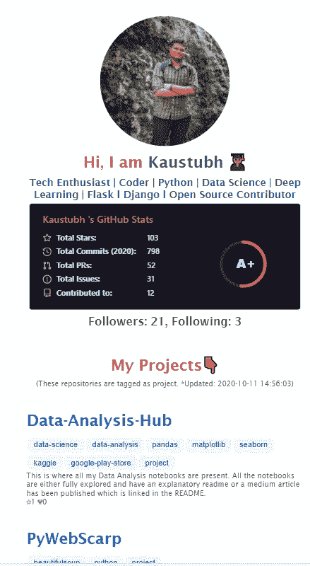

# 自动化项目组合生成的 GitHub 动作

> 原文：<https://towardsdatascience.com/github-action-that-automates-portfolio-generation-bc15835862dc?source=collection_archive---------38----------------------->

## 使用 Python 和基本前端的 Dockerized GitHub 动作。

作为任何开发人员，我们都会生成大量代码，并将其推送到 Github 进行备份、管理软件版本、托管项目和其他许多任务。如果我们谈论有多少库是实际的项目，我们在简历/社交媒体中托管和展示，与创建的库的总数相比，这实在是太少了。这些包括分叉的存储库、一些上传的实践代码或一些参考的附加内容。


照片由 [Richy Great](https://unsplash.com/@richygreat?utm_source=medium&utm_medium=referral) 在 [Unsplash](https://unsplash.com?utm_source=medium&utm_medium=referral) 上拍摄

我已经创建了很多，现在当我必须展示我的项目时，我会对应该包括哪一个或我已经做了什么感到困惑！为了解决这一困境，我想出了一个解决方案，开发一个 Github 动作来自动添加项目，参加黑客马拉松，显示一些 Github 个人资料统计，并可选地显示在[媒体](https://medium.com/@kaustubhgupta1828)和我的[网站](https://www.kaustubhgupta.xyz/)上写的最新博客，并将其提升到下一个级别，我将该动作分类并免费托管网页！让我们看看我是怎么做到的。

如果你想看看现在的行动，前往这个市场链接！

[](https://github.com/marketplace/actions/portfoliofy) [## PortfolioFy - GitHub 市场

### 开发人员创建了数百个存储库，其中几乎没有几个是像样的，并在社交网站上展示…

github.com](https://github.com/marketplace/actions/portfoliofy) 

# 什么是 GitHub Action？

**Github action 使您能够自动化和定制软件开发周期**，测试和部署集成到您的存储库中的应用程序。这些操作称为作业，可以通过 Cron 作业(基于时间的作业调度程序)根据您的需要安排运行。如果你访问 GitHub action [文档](https://docs.github.com/en/free-pro-team@latest/actions)，你可能会混淆两个术语，动作和工作流。这些都是令人困惑的事情，需要在继续之前澄清:

1.  动作和工作流之间的主要区别是一个是另一个的一部分。**动作是执行特定工作流时触发的事件。**
2.  动作是在代码环境中执行的任务，而**工作流管理这些任务将如何执行**，它们的顺序是什么，在运行它们之前要完成的任何依赖/设置，输入，要传递的参数，或定义不同作业之间的依赖关系。
3.  根据分配的配置，一个工作流可能有多个按顺序或并行运行的操作。

现在你已经对 Github 的动作有了基本的了解，让我们来编码实际的脚本，它将是这个动作的一部分。

# 脚本时间！

对于这个项目，我使用 Python，因为它对我来说很容易编码，而且使用 Python 构建的动作更少。该项目需要访问 Github 配置文件数据，尽管 Github API 提供了大部分数据，但对于未经身份验证的用户，它仍被限制为每小时 60 次请求。因此，你需要一个**个人访问令牌**(设置>开发者设置>个人访问令牌)来认证 Github 的用户，并允许每小时 5000 个请求！

首先，安装 PyGithub 库，解决所有令人头疼的连接、结果分页以及最终获取数据的问题。接下来，我们需要存储 API 返回的数据。我选择字典格式，因为它易于管理和访问属性。初始代码如下所示:

接下来关于存储库，我需要区分项目、黑客马拉松和其他额外的存储库。为了做到这一点，我设置了一个条件，即**在设置这个动作之前，你需要手动分配存储库主题“项目”或“黑客马拉松”**在投资组合中被考虑。如果一个存储库没有被标记，那么它将不会反映在输出中。这种情况将存储库分成不同的两个部分，现在它们被分开存储。

# 网页建设

Python 脚本提取了所有的信息，但是现在对于这个项目的主要目标，需要一个网页。最初，我想到使用 markdown 文件来做到这一点，但由于 Github 的限制，您**不能在 markdown** 中使用 CSS(以避免钓鱼攻击)。这是一个主要问题，因为我不想让用户在看到一个简单的纯文本组合后感到无聊或沮丧。因此，我扩展了当前的脚本，以使用之前收集的信息，并将值注入到 HTML 模板中，该模板存储为字符串，并使用 f 字符串进行更改。HTML 模板进行了大量的尝试，以获得一个简单的视图，该视图需要为移动视图进行不同的设置。Github 的所有基本信息都已获得，但还缺少一样东西，一个统计显示。为了显示统计数据，我使用了由 [Anurag Hazra](https://github.com/anuraghazra/github-readme-stats) 开发的开源 Vercel 应用程序，它可以动态更新统计数据。对于博客更新，我使用了[高塔姆克里希纳 R](https://github.com/marketplace/actions/blog-post-workflow) 行动，这是不同的安排，我将在接下来的段落中解释它。动作生成的最终网页是这样的:



图片作者，网页链接:[https://kaustubhgupta.github.io/](https://kaustubhgupta.github.io/)

在所有的混乱之后，这个动作可以生成一个 HTML 文件，在 **Github 页面的帮助下可以部署**，并且你有了你的**免费托管的自我更新文件夹**！现在，为了自动化添加新条目的整个过程，我想到了 Github action。

# 归档和创建行动

我为这个动作选择 docker 图像，因为当我尝试用 Python 创建一个动作的不同方法时，我没有得到任何好的结果。Dockers 帮助隔离环境并运行代码，因为它应该在本地运行。这个动作的 docker 文件看起来非常简单:

我已经从 docker hub 中提取了一个 Python 映像，安装了依赖项，并运行了脚本。

现在是创建动作的时候了。根据 Github docs，您需要在公共存储库的根目录中有一个名为 **action.yml** 的文件来使动作工作。动作文件包含以下内容:唯一的动作名称、描述、作者姓名、需要从用户处获取的输入，以及要执行哪个文件。在 YAML 格式中，它非常容易配置，因为它遵循分层系统。对于输入，我采用 Github token，对于文件，我提供 docker 文件。现在您的操作已经可以使用了，您也可以在市场上发布您的操作，但这不是强制性的。

# 使用的最终工作流程

现在是测试这个动作的时候了。正如我前面提到的，动作只是工作流中触发的事件。**工作流定义了动作的顺序、运行**的系统/环境规范，以及在触发之前或之后需要执行的其他活动。这些文件存储在

```
.github/workflows folder.
```

使用此操作的工作流程如下:

你可以根据自己的需求定制工作流程，但是工作中提到的**步骤不能改变。**这个工作流程运行良好，生成了 Github pages 正在使用的 index.html 文件，但是又少了一些东西。问题是博客更新动作还没有集成。我把这一步设为可选，因为不是每个人都写博客。要集成博客操作，在同一个工作流文件夹中，创建一个 YAML 文件，并放入相同的代码:(只需用您的链接更新提要列表)

你可以检查博客文章工作流动作来定制其他因素，只是**确保不要过多调整模板参数**，因为它可能不会给出好的结果。此操作在每次将内容推送到存储库时运行，由于索引文件将被推送到存储库，此操作将在索引文件生成后立即更新博客部分。

# 结论

在本文中，我向您介绍了 Github 动作的基本概念、工作流、它们之间的区别、动作的一些脚本、动作所需的文件以及最终在工作流中使用它们。我还讨论了我在这个项目中面临的挑战，以及如何在您的存储库中使用我的操作。如需更详细的说明和完整的源代码，请点击此处的资源库链接:

[](https://github.com/kaustubhgupta/PortfolioFy) [## kaustubhgupta/PortfolioFy

### 作为一名开发人员，我们创建了数百个存储库，但其中只有不到 15-20 个能够完成我们部署的最终项目…

github.com](https://github.com/kaustubhgupta/PortfolioFy) 

支持这一行动，因为它为我提供了制作更多项目的动力，在 medium 上关注我以获得关于我最新文章的更新，如果你喜欢这一篇，请点击鼓掌按钮！说完了，合十礼！

Linkedin:

[](https://www.linkedin.com/in/kaustubh-gupta-612767ab/) [## Kaustubh Gupta -机器学习导师-MAIT 开发者学生俱乐部| LinkedIn

### 嗨，我是一名 Python 开发人员，能够进行 Web 抓取、Selenium 自动化、数据科学、后端 Web 开发…

www.linkedin.com](https://www.linkedin.com/in/kaustubh-gupta-612767ab/)