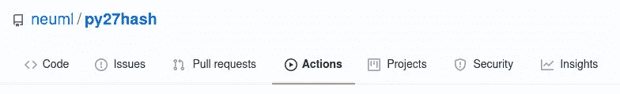
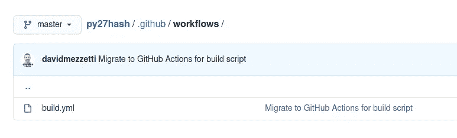
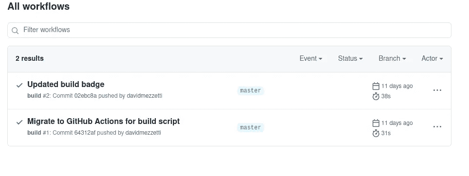
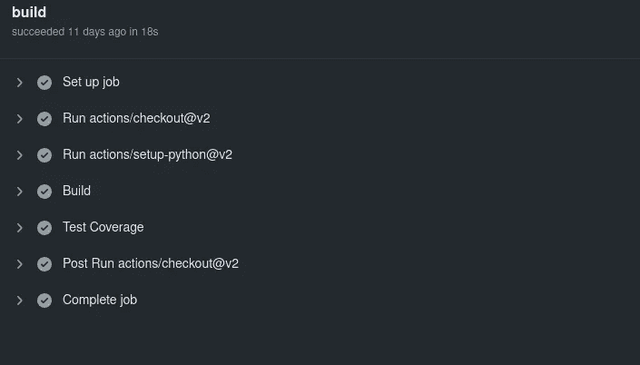
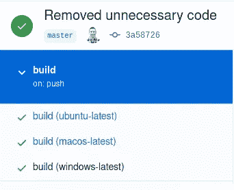

# GitHub 为胜利而行动

> 原文：<https://towardsdatascience.com/github-actions-for-the-win-8a215d390c1b?source=collection_archive---------30----------------------->

## 使用 GitHub Actions 进行持续集成轻而易举


威廉·冈克尔在 [Unsplash](https://unsplash.com?utm_source=medium&utm_medium=referral) 上拍摄的照片

你用 GitHub 做版本控制吗？你喜欢测试你的代码吗？对许多人来说，问题 1 的答案是肯定的，每个人都应该对问题 2 做出肯定的回答。很好，现在我们在同一页上，让我们来谈谈 GitHub 的行动。

GitHub Actions 是一个自动化工作流的框架。工作流在 YAML 创建，并在 GitHub 存储库上自动运行。下面的链接很好地概述了 GitHub 的动作。

[](https://docs.github.com/en/free-pro-team@latest/actions) [## GitHub 操作

### 使用 GitHub Actions 在您的存储库中自动化、定制和执行您的软件开发工作流。你…

docs.github.com](https://docs.github.com/en/free-pro-team@latest/actions) 

上面的文档很好地介绍了 GitHub 动作和工作流文件语法。本文介绍了几个基本的工作流，用于在 GitHub 项目上添加持续集成。

# **入门**

第一个例子涵盖了 py27hash 存储库中的一个工作流。

[](https://github.com/neuml/py27hash) [## neuml/py27hash

### 对于依赖于旧的散列/迭代顺序的应用程序，这个包有助于简化从 Python 2 到 3 的迁移…

github.com](https://github.com/neuml/py27hash) 

所有的 GitHub 库都准备好了 GitHub 动作。下面的截图显示了 GitHub Actions 工作流的位置。



GitHub 操作选项卡

GitHub 将自动运行存储在*中的任何工作流文件。github/workflows* 目录。例如，py27hash 存储库有一个名为 *build.yml* 的工作流文件。



下的 build.yml 文件。github/工作流文件夹

# 工作流文件

下面的代码片段显示了存储在 py27hash 存储库中的 build.yml 工作流文件。

这个构建文件运行在推和拉请求上。该工作流在 Ubuntu Linux 虚拟机上运行，检查代码并运行一系列 Python 单元测试。如果这些都成功了，那么测试覆盖率就被发送到了。

让我们回顾一下下面的语法(记得查看[https://docs.github.com/en/free-pro-team@latest/actions](https://docs.github.com/en/free-pro-team@latest/actions)以获得更详细的工作流文档)。

设置工作流名称。

```
name**:** build
```

设置触发工作流的操作。

```
on: ["push", "pull_request"]
```

设置虚拟环境。

```
jobs:
  build:
    runs-on: ubuntu-latest
```

准备构建环境。下面的步骤从 GitHub 中签出代码，并为测试设置 Python 3.6 运行时环境。

```
steps:                             
  - uses: actions/checkout@v2                             
  - uses: actions/setup-python@v2                              
    with: 
      python-version: 3.6
```

安装依赖项并运行测试。

```
- name: Build                               
  run: |                                 
    pip install -U pip wheel coverage coveralls           
    python --version                                 
    ./scripts/tests.sh skipslow
```

如果测试成功，发送测试覆盖报告给工作服。注意最后一行，*秘密。GITHUB_TOKEN* ，这是一个内置的，当提交到工作服时验证当前用户。

```
- name: Test Coverage                               
  run: coveralls                               
    env:
      GITHUB_TOKEN: ${{ secrets.GITHUB_TOKEN }}
```

这是 GitHub 的另一个优势，我们不需要授权外部服务访问我们的 GitHub 库。

# 查看工作流状态

下面显示了“操作”标签中的工作流状态。



py27hash 的 GitHub 操作选项卡

正如我们所看到的，对 py27hash 存储库的两次提交触发了 build.yml 工作流。每次运行的详细信息可以通过单击运行找到。下面是一个例子。



GitHub 操作工作流运行详细信息

# **多种环境**

如果我们的项目支持多个平台或版本会怎样？没问题，GitHub Actions 已经处理好了。接下来，我们将回顾作为 txtai 存储库一部分的工作流文件。

[](https://github.com/neuml/txtai) [## neuml/txtai

### txtai 在文本部分建立了一个人工智能索引。txtai 支持构建文本索引来执行相似性…

github.com](https://github.com/neuml/txtai) 

构建工作流文件如下:

让我们再次回顾一下工作流语法，只包括这个文件中的新项目。

设置多个环境是通过构建矩阵建立的。下面的配置为 Ubuntu、macOS 和 Windows 建立了构建环境。同样的方法也可以用来测试 Python 的多个版本。

```
jobs:                         
  build:                           
    runs-on: ${{ matrix.os }}                           
    strategy:                             
      matrix:                               
        os: [ubuntu-latest, macos-latest, windows-latest]
```

默认情况下，每个环境都会运行工作流中的所有步骤。但是条件步骤也可以在每个环境中执行。以下步骤分别为 macOS 和 Windows 安装依赖项。

```
- name: Install dependencies - MacOS                                 
  run: brew install libomp                               
  if: matrix.os == 'macos-latest' - name: Install dependencies - Windows                                
  run: python -m pip install torch==1.6.0+cpu torchvision==0.7.0+cpu -f https://download.pytorch.org/whl/torch_stable.html                               
  if: matrix.os == 'windows-latest'
```

其余步骤同上。唯一的例外是测试覆盖只针对单一环境(Ubuntu)。

完成后，将为每个环境创建一个单独的工作流状态部分。只有在所有环境中都成功的情况下，构建才是成功的。



多个构建环境

# 结论

本文给出了 GitHub 动作的一个非常简短的概述，涵盖了自动化测试的几个基本工作流程。有大量的附加功能可以自动执行部署、标记和其他操作。

与外部构建系统相比，它的性能非常好，并且是一种更简单、更安全的运行持续集成的方式。试一试吧，它一定不会让人失望的！