# GitHub Actions —使 ML CI/CD 管道的“一键部署”变得可行

> 原文：<https://towardsdatascience.com/github-actions-makes-one-click-to-deploy-feasible-for-ml-ci-cd-pipeline-61470ed3edbc?source=collection_archive---------7----------------------->

## 如何用 GitHub 动作为机器学习应用创建 CICD 管道

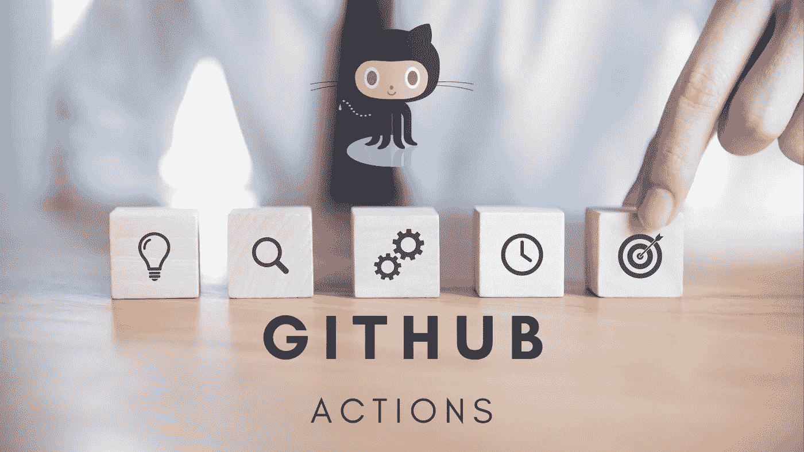

使用 Canva 设计

> 如果我告诉你“你可以将构建、测试、交付或部署你的机器学习模型到生产中的过程自动化”会怎么样？

世界上最受欢迎的托管存储库服务， **GitHub** 通过 **GitHub 操作自动化任务，提供了一种设计和开发我们工作流的集成方式。**通过动作，GitHub 库中发生的事件，如推送、拉取请求、发布等。用作启动工作流的触发器。这些工作流程以 YAML 格式编码。

工作流只不过是我们在将应用程序投入生产时遵循的步骤，包括单元测试、集成测试、构建工件、健全性检查和部署。在本文中，我将向您介绍 **GitHub Actions** ，并向您展示如何构建您的工作流来部署机器学习应用程序。

*让我们开始吧！！*

## 背景


GitHub 知识库(作者提供图片)

在 GitHub 上创建一个资源库，如果你没有帐户，我建议你创建一个。GitHub 上的每个存储库现在都支持 GitHub Actions 特性。

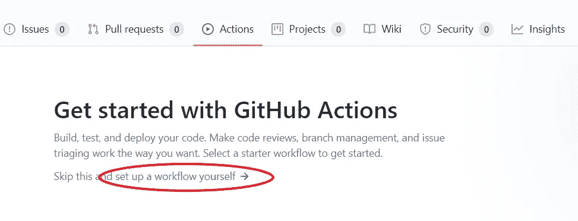

GitHub Actions(作者照片)

点击“操作”。如果我们的库中已经有任何文件，GitHub 会推荐一些预定义的工作流。在这里，我们将创建我们的工作流。点击“自己设置工作流程”。

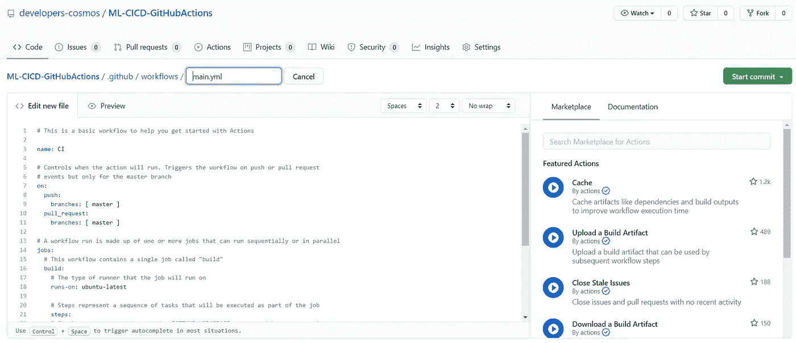

我们的第一次行动(作者照片)

正如我前面提到的，GitHub 工作流是以 YAML 格式编码的，这里我们定义了作业、步骤和管道。在开始之前，让我们看一下 YAML 文件中使用的属性。下面是一个简单的模板来打印“你好，世界！!"

示例工作流程

我们在任何工作流程中使用的基本属性是:

*   **名称—** 您的工作流程的名称(可选)
*   **on —** 触发流的 GitHub 事件。它可以是存储库事件(push、pull 请求、release)或 webhooks、分支创建、问题或成员加入存储库。
*   **作业—** 工作流必须至少有一个作业。每个工作都必须有一个标识符，就像我们执行的任务的名称，比如“构建”、“测试”等等。
*   **连续运行—** 运行作业所需的机器类型。这些环境被称为跑步者。其中有 windows server 2019，ubuntu 18.04，macOS Catalina 10.15 等。
*   **步骤—****所有命令或动作的列表。每一步都有自己的过程。**
*   ****用途—** 标识要使用的动作，定义该动作的位置。一个动作可以是上传和下载工件或结帐或配置任何云帐户。你可以在 GitHub[**market place**](https://github.com/marketplace?type=actions)**找到各种各样的动作，类别包括持续集成、部署、项目管理、测试、安全等。我真的建议你探索各种行动，我们也可以在市场上发布我们的自定义行动。****
*   ******运行—** 在虚拟环境 shell 中运行命令。****
*   ******名称—** 步骤的可选名称标识符。****

****按照您的意愿用步骤和作业配置工作流后，提交管道-YAML 文件。工作流现在将开始运行。现在我们知道了 GitHub 动作的术语，让我们开始构建机器学习应用程序的工作流。****

****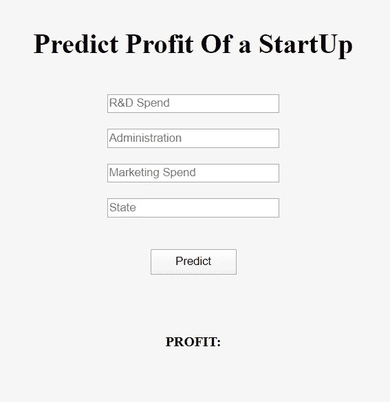****

****ML 应用示例(作者提供照片)****

****我开发了一个机器学习应用程序，它将通过从用户那里获取一些输入来预测初创公司的利润。****

****首先，我用所需的数据集训练模型，测试并验证它。然后我创建了一个 Flask 服务器来服务来自用户的请求。我把项目目录推送到 GitHub。GitHub 存储库应该是这样的:****

********

****GitHub 知识库(作者提供图片)****

****我想创建一个具有以下四个阶段的工作流程。您也可以相应地定义您的工作流程。****

1.  ****林挺****
2.  ****构建一个 Docker 映像并推送到 Google 的容器注册表。****
3.  ****测试—从 Container Registry 下载 Docker 映像并测试它。****
4.  ****在云上部署 Docker 映像。****

********

****管道(作者照片)****

## ****林挺阶段****

****为了减少错误和提高代码的整体质量，林挺是必要的。如果 lint 工具被有效地使用，它可以通过降低发现错误的成本来帮助加快您的开发。在这个阶段，我们进行单元测试，检查代码风格。****

****现在我们将创建工作流，如上所示，我们将一步一步地做。****

****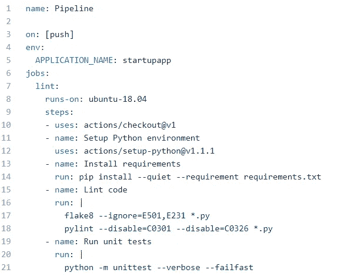****

****林特舞台(作者供图)****

****在这个阶段，我们需要定义环境(在我的例子中是 Ubuntu)，在那个环境中签出存储库，并安装模型运行所需的所有依赖项或需求。此外，我使用了 *Pylint* 和 *flake8* 来检查代码库的编码风格(PEP8)、编程错误，并检查圈复杂度。****

## ****构建 Docker 映像****

****既然我们已经针对某些编码风格测试了我们的代码，让我们构建一个 Docker 映像。如下所示创建一个 Dockerfile 文件****

****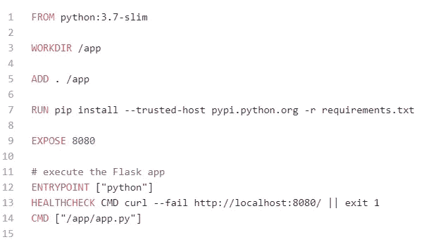****

****Dockerfile(作者照片)****

****我们使用一个*docker 文件*为应用程序构建一个 docker 映像。这个工件(docker 映像)需要存储在某个地方，在那里我们的应用程序的所有不同版本都存在。这将确保您在连续的版本中交付您的软件。我们有各种工具来存储工件，其中很少是 JFrog Artifactory、Amazon ECR、DockerHub、Google 的容器注册表。****

****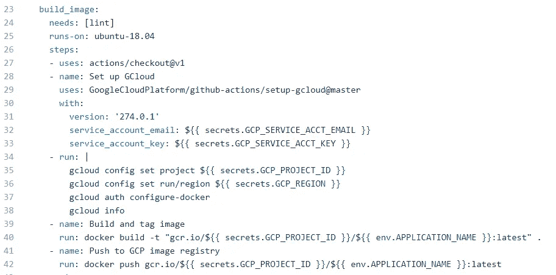****

****建立一个码头工人形象(作者提供照片)****

****现在，我将把 docker 图像推送到 Google 的容器注册表中。因此，我们需要设置 GCP 环境，该环境需要密码和 API 密钥等敏感信息。GitHub 允许我们存储秘密，我们可以以变量的形式访问这些秘密。****

```
**${{ secrets.GCP_SERVICE_ACCT_KEY }}**
```

****要创建一个秘密，进入*设置*并选择*秘密。*****

********

****设置部分(作者提供照片)****

****您将被重定向到机密部分。点击“新秘密”。给秘密起个名字，增加价值。点击“添加密码”****

****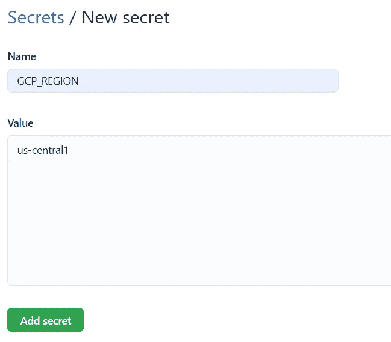****

****创造一个秘密(作者照片)****

****我已经更新了所有需要的秘密。****

****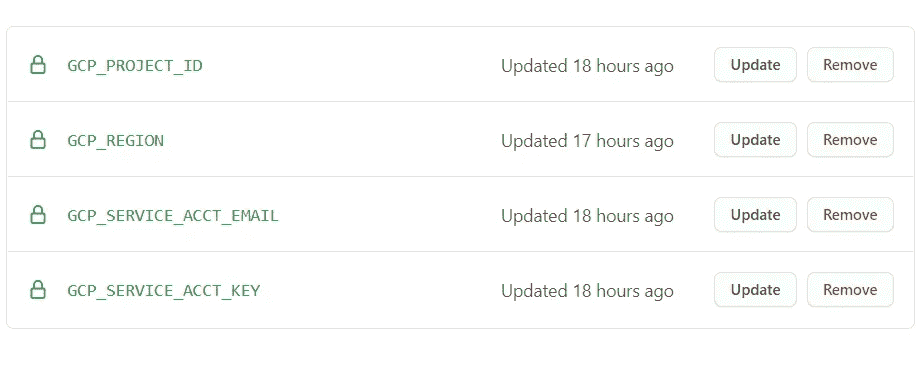****

****秘密(作者照片)****

****一旦设置好环境，我们的工作将开始构建 docker 映像，并将其上传到 Google 的容器注册表(确保您在 Google 云平台上启用了容器注册表的 API)。****

## ****检验阶段****

****在执行上述阶段之后，我们将在我们的服务中将一个 docker 映像存储在容器注册表中。在这个阶段，我们将下载图像，并针对各种测试用例运行它。在真实的场景中，我们可能会使用不同版本的 docker 映像，并且我们会指定想要发布的版本。因此，我们从注册表中下载图像，而不是使用从上一阶段构建的图像。****

********

****测试阶段(作者照片)****

****软件应用程序或产品的有效性能需要测试。在这里，我们可以通过检查是否返回 200 状态代码(即成功运行的证明)来测试我们的 Flask 服务器。此外，因为我们可以测试和验证我们的机器学习模型，所以计算准确度并给出准确度的阈值水平，并且仅当准确度大于 95%(或任何其他阈值)时，才允许作业继续部署模型。****

## ****在云上部署 Docker 映像****

****一旦测试阶段结束，所有测试用例都通过，我们的下一步就是部署工件或 docker 映像。为了部署 docker 映像，我使用了 Cloud Run。****

********

****部署阶段(作者提供照片)****

****仅此而已！执行此阶段后，应用程序将很快投入生产。****

## ****结果****

****现在我们已经看到了整个工作流，让我们开始创建我们的行动。您可以在此处从[复制工作流文件。](https://github.com/developers-cosmos/ML-CICD-GitHubActions/blob/master/.github/workflows/pipeline.yml)****

********

****创建工作流程(作者照片)****

****点击*开始提交*并给出提交消息。提交文件。转到*动作*部分。您可以看到工作流已经开始执行。****

********

****动作部分(作者照片)****

****成功运行所有作业后，您将看到以下输出。我们可以检查每个阶段的控制台输出，也可以检查调试日志。****

****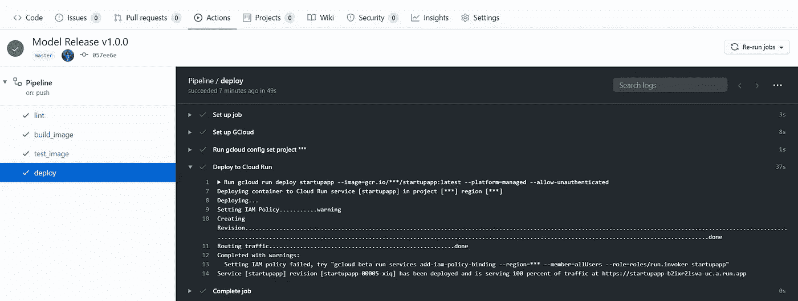****

****工作流程输出(作者照片)****

****现在，如果我们转到容器注册表，我们可以查看被推送的工件。****

********

****集装箱登记处的码头工人图片(作者提供图片)****

****转到 GCP 导航菜单上计算部分下的云运行。创建具有给定名称的服务。机器学习模型已经投入生产。您现在可以通过端点访问服务了！****

********

****云运行控制台上的端点(照片 b 作者)****

****最终的应用程序(在我的例子中)看起来像这样:****

****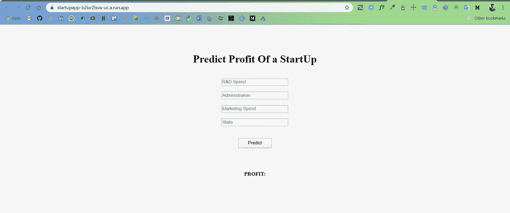****

****最终启动应用程序(作者提供照片)****

****每次您将更改推送到代码时，都会触发此工作流。这是一个基本的管道。您可以构建具有不同阶段的管道——通过 API 调用获取数据、执行功能工程、模型训练、构建或存储模型(工件)、测试，以及部署到生产环境。****

****完整的代码可以在 GitHub [这里找到。](https://github.com/developers-cosmos/ML-CICD-GitHubActions)****

## ****结论****

****我们已经看到了建立一个工作流的过程，该工作流使用 GitHub 操作来自动部署机器学习应用程序。它使我们能够创建我们的动作，并组合它们来为任何软件应用程序创建工作流。****

****如果你有什么建议，我很乐意听听。我很快会带着另一个有趣的话题回来。在那之前，呆在家里，保持安全，继续探索！****

****如果想联系，**在**[**LinkedIn**](https://www.linkedin.com/in/ritheesh-baradwaj-yellenki-8a6988173/)**上联系我。******