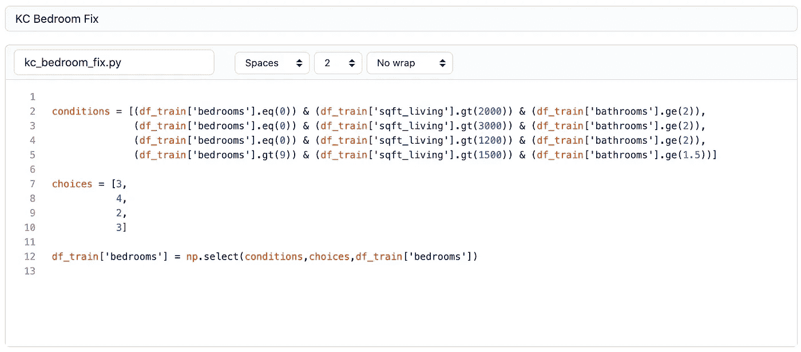
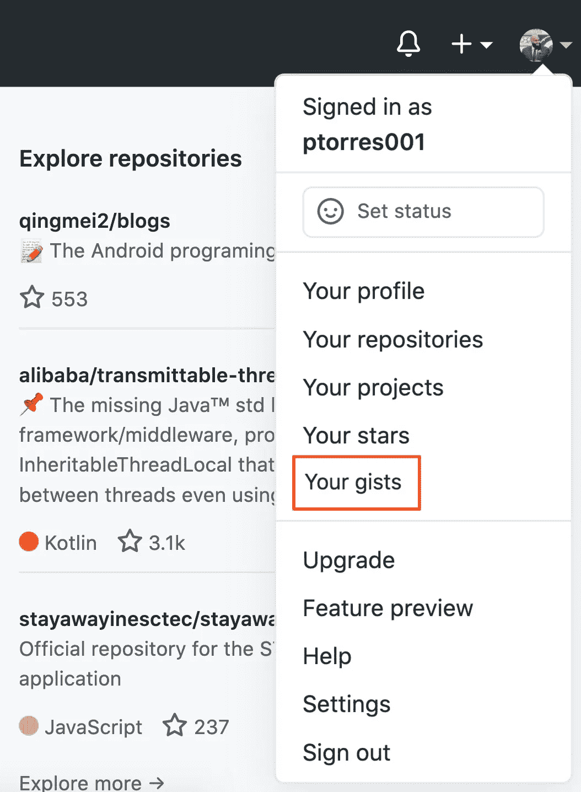

# Github Gists 101:让代码共享变得美好

> 原文：<https://towardsdatascience.com/github-gists-101-making-code-sharing-pretty-163d9321a0af?source=collection_archive---------9----------------------->

## 简单代码展示的 5 个步骤

克里斯里德在 [Unsplash](https://unsplash.com/s/photos/code?utm_source=unsplash&utm_medium=referral&utm_content=creditCopyText) 上的照片

如果你一直在浏览 Medium，查看技术文章，你肯定见过类似**的小窗口，如下图**:

具有基本功能的要点

这些被称为 Github Gists。gist 是一种简单的方法，以一种简洁和读者友好的方式与他人分享代码或数据的摘录。在本文中，您将看到显示您创建的函数、对表的查询或一些其他小数据片段的方法(就像对 dataframe 的一瞥)。这些信息由 GitHub 作为存储库托管。使用 gist 具有利用 GitHub 存储库的所有好处，具有轻量级和易于共享的嵌入特性。

它们不仅更干净，而且允许有视觉问题的编码人员有机会使用可访问性选项通读您的代码。

现在，让我们回顾一下基础知识:

## 1.Github Gists 入门

有两种方法可以到达 Github.com 的 gists 部分。第一种方式是你去***Gist.Github.com***，它会带你去新的要点创造。或者你可以浏览你的 Github 主页。

Github 主页让你有两种方式到达那里

底部的红色箭头指向我的个人资料图片，是你如何到达你的知识库或 gists。我们暂时忽略这一点，留待讨论编辑旧 gists 时再说。顶部的箭头指向加号，指向创建 repos、gists 或项目——这是我们首先要看的。点击加号后，你会看到一个下拉菜单。

新要点链接允许你创建一个全新的要点

这将把你带到下面的页面。请注意您有几个要填写的字段。

新要点的空白模板

1.  **描述框** —这将是要点的标题和非正式名称
2.  **文件名+扩展名** —这将是您命名文件的地方，以防下载。它也是你为你所使用的编程语言声明一个扩展的地方。
3.  **代码框** —这是您输入/粘贴想要显示的代码/数据的地方。

## 2.创建代码片段

从这里开始，一切都是即插即用。让我们试着用我们想要展示的一段代码创建一个要点——我正好有一个。

下面我写了一段代码，用来估算我最近完成的一个线性回归项目的数据。它是用来估算一所房子可能拥有的使用浴室的卧室数量和给定房子的居住面积。

我通过 gists.github.com 创建的代码片段

延伸是非常重要的。可以放**之类的东西。txt** ，**。py** 或者**。html** 。这将通知读者它是用什么语言编写的——如果还不清楚的话，并允许下载带有适当扩展名的文件。不管你是否延期，要点都会起作用——但是最好的“实践创造更好的工作机会”——保罗·托雷斯 2020。

简单地将代码复制并粘贴到窗口中，然后填写描述和文件名。

我把设置设为公开，这样在网站上搜索就能找到要点。然而，你可以选择制作一个不能被搜索的秘密要点——这些要点仍然可以通过你可以分发的链接来分享。

## 3.创建 CSV 表格

我们要看的下一个特性是使用 gists 创建表。Gists 不仅用于显示代码片段。您还可以在其中显示数据的小图片。我之所以说小，是因为在本文发表时，除了复制粘贴或手工输入之外，我还没有找到输入数据的方法。

第一步是开始一个新的要点并编辑文件名，使其以**结束。csv** 。这告诉网站，您将为列索引和单元格输入值，用逗号分隔。确保每个列名由逗号分隔，并且每个后续行的顺序与列名的顺序相同。

确保按照您希望的方式书写单词

看上面的图片，我们可以看到第一行条目是列名。第二行是数据中的第一个观察值。所有条目必须用逗号分隔，并且必须按照第一行中列名的顺序排列。整个表格都是如此。

不要担心单元格的分段或列名的字体——网站会帮你完成。

现在，让我们来看看完成的表。

每个观察值被分割到不同的行中，每个特征被分割到其自己的单元中。正如我们之前所说的，当列名被加粗并放在列的顶部时，字体的格式是自动完成的。

一个非常有用的功能是表格顶部的*搜索框*。嵌入时无法访问，但它在网站上。您可以搜索该表，它只返回您指定的值。

## 4.在介质上部署 Gists

现在我们可以谈论向世界展示这些要点了。

就在这里的 Medium 上，只需点击下一段药水上的 **+** ，点击 **< >** 选项即可。粘贴要点的网址后，按回车键。

看看这张 gif。

媒体嵌入过程的快速视频

## 5.查找或编辑以前制作的列表

如果你回到你的 Github 主页，在创建按钮的右边是你的照片。下拉菜单会给你链接到你的个人资料和设置，但更重要的是你的回购，项目和要点。

点击*你的要点*的链接。

这是您寻找已经创建的回购和 gists 的地方

在这一点上，你将被带到一个列出你所有清单的页面。

我最近更新的三个要点

点击一个，你就可以编辑了。你编辑的任何要点都会更新你在其他地方的嵌入。这是一个非常方便的特性，如果您发现了一个错误或者想要以一种更令人愉快的方式格式化代码。你不需要访问每个嵌入，你只需要更新要点，它就会为你工作。

感谢阅读。我希望这有助于您分发我知道您将编写的漂亮代码。

在 **LinkedIn** [这里](https://www.linkedin.com/in/pntorres/)跟我连线。

关于这些 gists 来自的项目的更多信息，请查看我的**Github**这里。你可以从下面的文章中找到这些要点:

 [## 使用 GeoPandas 进行空间可视化

### 将您的数据带入现实世界

towardsdatascience.com](/using-geopandas-for-spatial-visualization-21e78984dc37)  [## 线性回归建模过程

### 预测金县房地产市场

towardsdatascience.com](/linear-regression-modeling-process-d0a92d2d14b)