# GitHub 是你需要的最好的汽车

> 原文：<https://towardsdatascience.com/github-is-the-best-automl-you-will-ever-need-5331f671f105?source=collection_archive---------9----------------------->

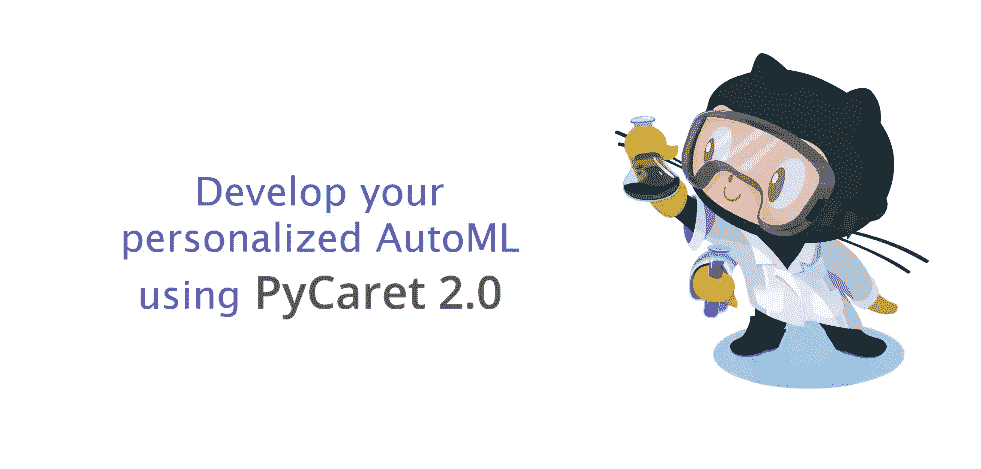

py caret——Python 中的开源、低代码机器学习库！

你可能想知道 GitHub 从什么时候开始涉足自动机器学习的业务。嗯，它没有，但你可以用它来测试你的个性化 AutoML 软件。在本教程中，我们将向您展示如何构建和容器化您自己的自动化机器学习软件，并使用 Docker 容器在 GitHub 上进行测试。

我们将使用 py caret 2.0(Python 中的开源低代码机器学习库)来开发一个简单的 AutoML 解决方案，并使用 GitHub actions 将其部署为 Docker 容器。如果你以前没有听说过 PyCaret，你可以在这里阅读 PyCaret 2.0 [的官方公告，或者在这里](/announcing-pycaret-2-0-39c11014540e)查看详细的发行说明[。](https://github.com/pycaret/pycaret/releases/tag/2.0)

# 👉本教程的学习目标

*   了解什么是自动化机器学习，以及如何使用 PyCaret 2.0 构建一个简单的 AutoML 软件。
*   了解什么是容器，以及如何将 AutoML 解决方案部署为 Docker 容器。
*   什么是 GitHub 动作，如何使用它们来测试你的 AutoML。

# 什么是自动机器学习？

自动机器学习(AutoML)是将机器学习的耗时、迭代任务自动化的过程。它允许数据科学家和分析师高效地构建机器学习模型，同时保持模型质量。任何 AutoML 软件的最终目标都是基于一些性能标准最终确定最佳模型。

传统的机器学习模型开发过程是资源密集型的，需要大量的领域知识和时间来产生和比较几十个模型。借助自动化机器学习，您可以轻松高效地加快开发生产就绪型 ML 模型的速度。

有很多 AutoML 软件，有付费的，也有开源的。几乎所有这些都使用相同的转换和基本算法集合。因此，在这种软件下训练的模型的质量和性能大致相同。

如果你的口袋里没有几十个用例，付费的 AutoML 软件即服务是非常昂贵的，在经济上是不可行的。托管机器学习即服务平台相对较便宜，但它们通常难以使用，并且需要特定平台的知识。

在许多其他开源 AutoML 库中，PyCaret 相对来说是一个新的库，具有独特的低代码机器学习方法。PyCaret 的设计和功能简单、人性化、直观。在很短的时间内，PyCaret 被全球超过 100，000 名数据科学家采用，我们是一个不断增长的开发人员社区。

# PyCaret 是如何工作的？

PyCaret 是一个用于监督和非监督机器学习的工作流自动化工具。它被组织成六个模块，每个模块都有一组可用于执行某些特定操作的功能。每个函数接受一个输入并返回一个输出，在大多数情况下，这是一个经过训练的机器学习模型。第二版中可用的模块有:

*   [分类](https://www.pycaret.org/classification)
*   [回归](https://www.pycaret.org/regression)
*   [聚类](https://www.pycaret.org/clustering)
*   [异常检测](https://www.pycaret.org/anomaly-detection)
*   [自然语言处理](https://www.pycaret.org/nlp)
*   [关联规则挖掘](https://www.pycaret.org/association-rules)

PyCaret 中的所有模块都支持数据准备(超过 25 种基本预处理技术，附带大量未经训练的模型&支持定制模型、自动超参数调整、模型分析和可解释性、自动模型选择、实验日志记录和简单的云部署选项。

[https://www.pycaret.org/guide](https://www.pycaret.org/guide)

要了解更多关于 PyCaret 的信息，[点击这里](/announcing-pycaret-2-0-39c11014540e)阅读我们的官方发布公告。

如果你想开始使用 Python，[点击此处](https://github.com/pycaret/pycaret/tree/master/examples)查看入门笔记本示例库。

# 👉开始之前

在开始构建 AutoML 软件之前，让我们理解以下术语。在这一点上，你需要的是一些我们在本教程中使用的工具/术语的基本理论知识。如果你想了解更多的细节，在本教程的末尾有一些链接供你以后探索。

# **集装箱**

**容器**提供了一个可移植且一致的环境，可以在不同的环境中快速部署，以最大化**机器学习**应用的准确性、性能和效率。环境包含运行时语言(例如 Python)、所有库以及应用程序的依赖项。

# **码头工人**

Docker 是一家提供允许用户构建、运行和管理容器的软件(也称为 Docker)的公司。虽然 Docker 的集装箱是最常见的，但也有其他不太出名的替代品，如 T2、LXD、T4、LXC 和 T5，它们也提供集装箱解决方案。

# 开源代码库

GitHub 是一个基于云的服务，用于托管、管理和控制代码。假设您在一个大型团队中工作，其中多人(有时数百人)正在对同一个代码库进行更改。PyCaret 本身就是一个开源项目的例子，在这个项目中，数百名社区开发人员不断地贡献源代码。如果你之前没有用过 GitHub，你可以[注册](https://github.com/join)免费账号。

# **GitHub 动作**

GitHub 动作帮助您在存储代码和协作处理拉取请求和问题的同一位置自动化您的软件开发工作流程。您可以编写称为操作的单个任务，并将它们组合起来创建自定义工作流。工作流是定制的自动化过程，您可以在存储库中设置它，以便在 GitHub 上构建、测试、打包、发布或部署任何代码项目。

# 👉我们开始吧

# 目标

根据数据集中的其他变量，如年龄、性别、体重指数、儿童、吸烟者和地区，训练和选择预测患者费用的最佳回归模型。

# 👉**第一步——开发 app.py**

这是 AutoML 的主文件，也是 Dockerfile 的入口点(参见下面的步骤 2)。如果您以前使用过 PyCaret，那么这段代码对您来说是不言自明的。

[https://github . com/py caret/py caret-git-actions/blob/master/app . py](https://github.com/pycaret/pycaret-git-actions/blob/master/app.py)

前五行是关于从环境中导入库和变量。接下来的三行用于读取数据作为*熊猫*数据帧。第 12 行到第 15 行是导入基于环境变量的相关模块，第 17 行以后是 PyCaret 的函数，用于初始化环境、比较基本模型以及在设备上保存性能最佳的模型。最后一行以 csv 文件的形式下载实验日志。

# 👉步骤 2—创建 Dockerfile 文件

Dockerfile 只是一个包含几行指令的文件，保存在您的项目文件夹中，名称为“Dockerfile”(区分大小写，没有扩展名)。

另一种看待 Docker 文件的方式是，它就像是你在自己的厨房里发明的食谱。当你与他人分享这样的食谱时，如果他们按照食谱中完全相同的说明去做，他们将能够复制出同样质量的菜肴。类似地，您可以与他人共享您的 docker 文件，然后他人可以基于该 docker 文件创建图像并运行容器。

这个项目的 Docker 文件很简单，只有 6 行。见下文:

[https://github . com/py caret/py caret-git-actions/blob/master/docker file](https://github.com/pycaret/pycaret-git-actions/blob/master/Dockerfile)

Dockerfile 文件中的第一行导入 python:3.7-slim 图像。接下来的四行创建一个 app 文件夹，更新 **libgomp1** 库，并安装来自 **requirements.txt** 文件的所有需求，在本例中只需要 pycaret。最后，最后两行定义了应用程序的入口点；这意味着当容器启动时，它将执行我们之前在步骤 1 中看到的 **app.py** 文件。

# 👉步骤 3 —创建 action.yml

Docker 操作需要元数据文件。元数据文件名必须是`action.yml`或`action.yaml`。元数据文件中的数据定义了操作的输入、输出和主入口点。动作文件使用 YAML 语法。

[https://github . com/py caret/py caret-git-actions/blob/master/action . yml](https://github.com/pycaret/pycaret-git-actions/blob/master/action.yml)

环境变量 dataset、target 和 usecase 分别在第 6、9 和 14 行声明。参见 app.py 的第 4–6 行，了解我们如何在 app.py 文件中使用这些环境变量。

# 👉步骤 4 —在 GitHub 上发布操作

此时，您的项目文件夹应该如下所示:

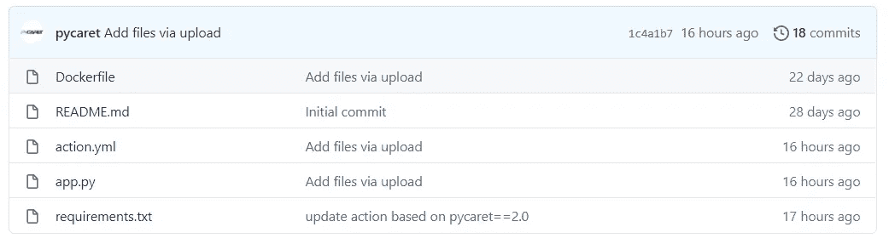

[https://github.com/pycaret/pycaret-git-actions](https://github.com/pycaret/pycaret-git-actions)

点击**‘发布’**:

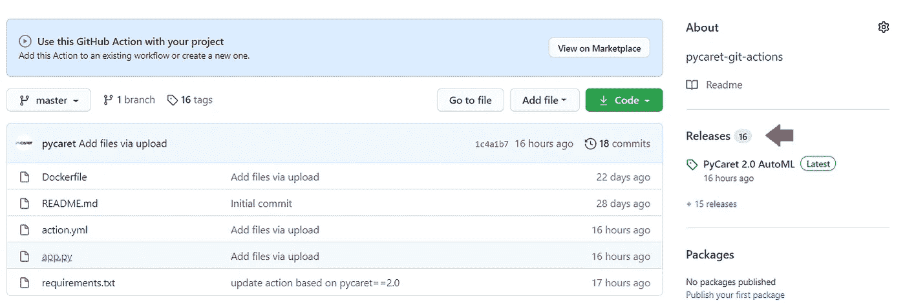

GitHub 操作—点击发布

起草新版本:

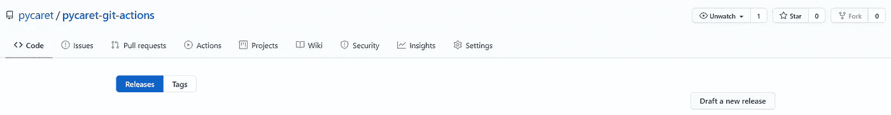

GitHub 行动——起草新版本

填写详细信息(标签、发布标题和描述)并点击**‘发布发布’**:

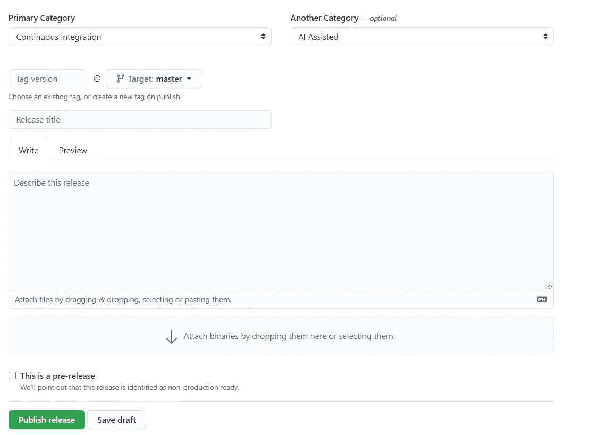

GitHub 操作—发布发布

发布后，点击发布，然后点击**“市场”**:

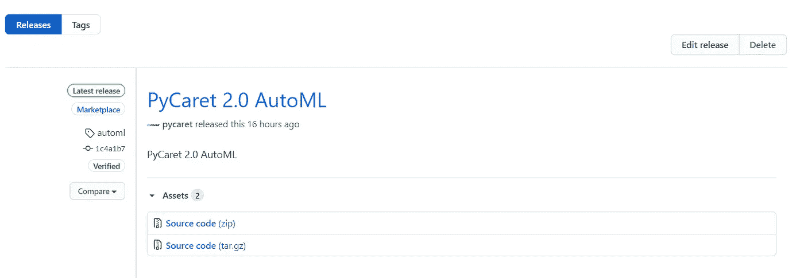

GitHub 行动—市场

点击**‘使用最新版本’**:

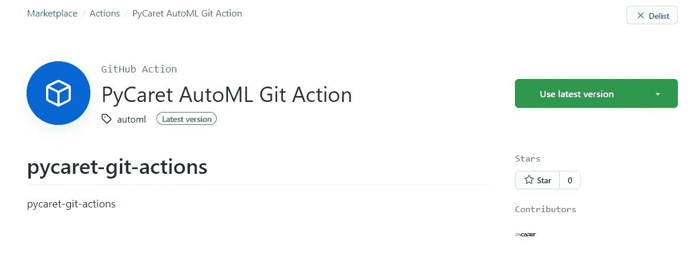

GitHub 操作—使用最新版本

保存这些信息，这是您的软件的安装详细信息。这是您在任何公共 GitHub 库上安装该软件所需的内容:

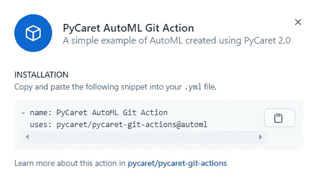

GitHub 操作—安装

# 👉步骤 5—在 GitHub 存储库上安装软件

为了安装和测试我们刚刚创建的软件，我们创建了一个新的存储库[**py caret-automl-test**](https://github.com/pycaret/pycaret-automl-test)**，并上传了一些用于分类和回归的样本数据集。**

**要安装我们在上一步中发布的软件，请单击“**操作**”:**

**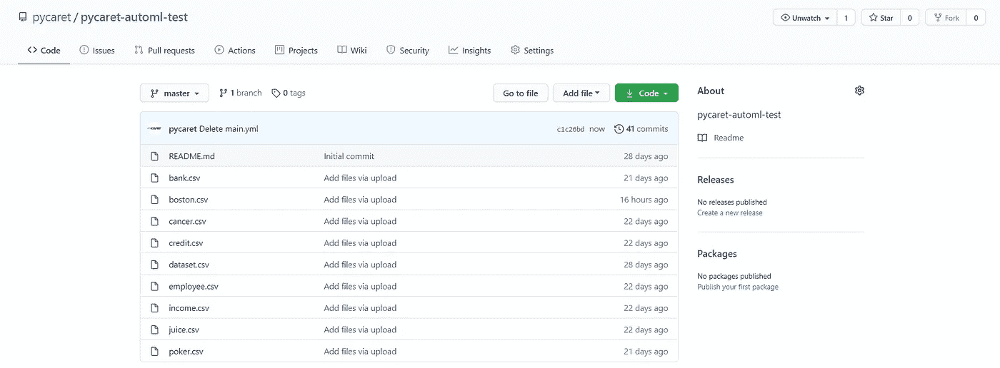**

**[https://github.com/pycaret/pycaret-automl-test/tree/master](https://github.com/pycaret/pycaret-automl-test/tree/master)**

**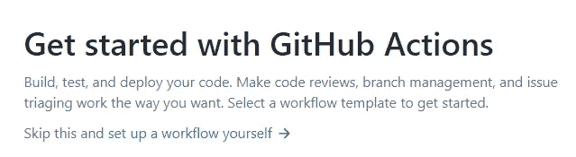**

**GitHub 操作入门**

**点击**自行设置工作流**，将该脚本复制到编辑器中，然后点击**开始提交**。**

**这是 GitHub 要执行的指令文件。第一个动作从第 9 行开始。第 9 到 15 行是安装和执行我们之前开发的软件的操作。第 11 行是我们引用软件名称的地方(参见上面第 4 步的最后一部分)。第 13 到 15 行是定义环境变量的操作，比如数据集的名称(csv 文件必须上传到存储库)、目标变量的名称和用例类型。从第 16 行开始是从[这个存储库](https://github.com/actions/upload-artifact)上传三个文件 model.pkl，实验日志作为 csv 文件，系统日志作为. log 文件。**

**开始提交后，点击**“操作”**:**

**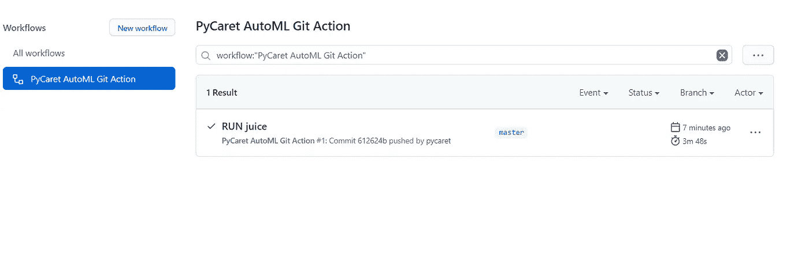**

**GitHub 操作—工作流程**

**这是您可以监视构建日志的地方，一旦工作流完成，您也可以从这个位置收集文件。**

**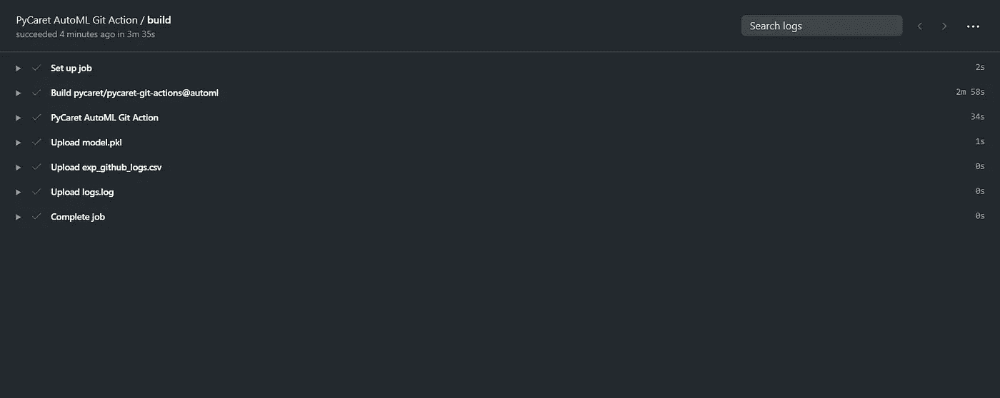**

**GitHub 操作—工作流构建日志**

**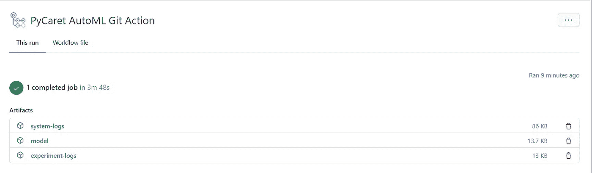**

**GitHub 操作—运行详细信息**

**你可以下载文件并在你的设备上解压。**

# ****文件:型号****

**这是最终模型的. pkl 文件，以及整个转换管道。您可以使用此文件通过 predict_model 函数对新数据集生成预测。要了解更多，点击这里。**

# **文件:实验日志**

**这是一个. csv 文件，其中包含了模型所需的所有细节。它包含在 app.py 脚本中训练的所有模型、它们的性能指标、超参数和其他重要的元数据。**

**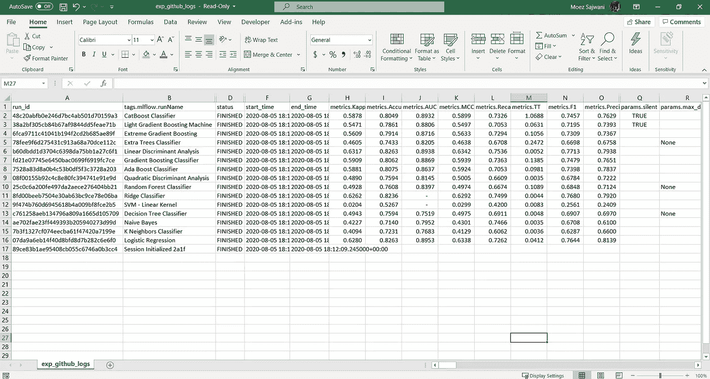**

**实验日志文件**

# **文件:系统日志**

**这是 PyCaret 生成的系统日志文件。这可以用于审计过程。它包含重要的元数据信息，对于排除软件中的错误非常有用。**

**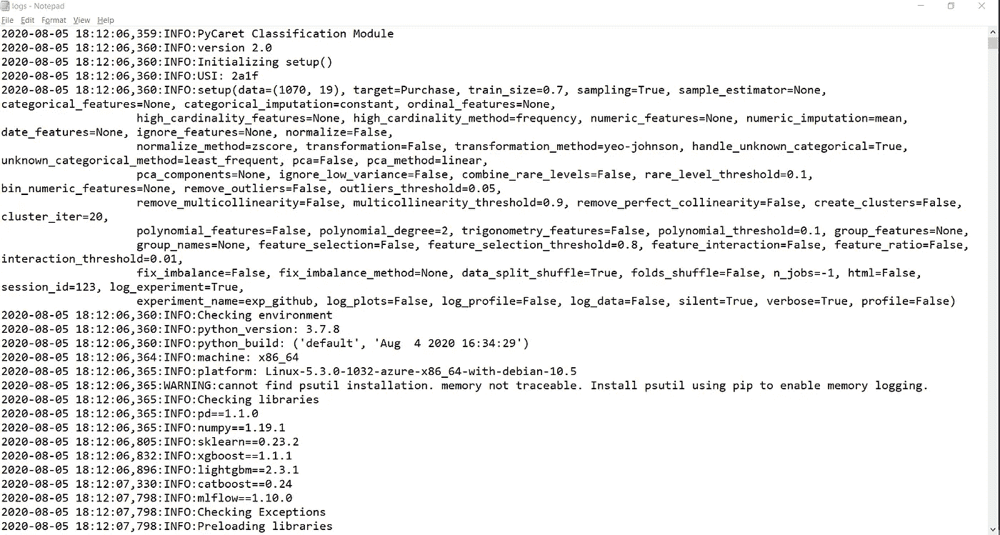**

**PyCaret 生成的系统日志文件**

# ****披露****

**GitHub Actions 使您能够直接在 GitHub 存储库中创建定制的软件开发生命周期工作流。根据您的客户计划，每个帐户都附带了与操作一起使用的计算和存储数量，您可以在[操作文档](https://docs.github.com/en/github/automating-your-workflow-with-github-actions/about-github-actions#about-github-actions)中找到。**

**不得违反本协议、[可接受使用政策](https://docs.github.com/en/github/site-policy/github-acceptable-use-policies)或 GitHub Actions [服务限制](https://docs.github.com/en/github/automating-your-workflow-with-github-actions/about-github-actions#usage-limits)使用 Actions 和 Actions 服务的任何元素。此外，操作不应用于:**

*   **秘密采矿；**
*   **无服务器计算；**
*   **使用我们的服务器来破坏、获取或试图获取对任何服务、设备、数据、账户或网络的未经授权的访问(未经 [GitHub Bug Bounty 计划](https://bounty.github.com/)授权的访问除外)**
*   **为商业目的提供独立或集成的应用程序或服务，提供动作或任何动作元素；或者，**
*   **与使用 GitHub 动作的存储库相关的软件项目的生产、测试、部署或发布无关的任何其他活动。**

**为了防止违反这些限制和滥用 GitHub 操作，GitHub 可能会监控您对 GitHub 操作的使用。误用 GitHub 操作可能会导致作业终止，或者限制您使用 GitHub 操作的能力。**

# ****本教程中使用的存储库:****

** [## py caret/py caret-git-操作

### py caret-git-动作。在 GitHub 上创建一个帐户，为 pycaret/pycaret-git-actions 开发做贡献。

github.com](https://github.com/pycaret/pycaret-git-actions)  [## py caret/py caret-自动测试

### 自动测试。在 GitHub 上创建一个帐户，为 pycaret/pycaret-automl-test 开发做贡献。

github.com](https://github.com/pycaret/pycaret-automl-test) 

使用 Python 中的这个轻量级工作流自动化库，您可以实现的目标是无限的。如果你觉得这有用，请不要忘记给我们 github 回购⭐️。

要了解更多关于 PyCaret 的信息，请关注我们的 LinkedIn 和 Youtube。

如果你想了解更多关于 PyCaret 2.0 的信息，请阅读这个[公告](/announcing-pycaret-2-0-39c11014540e)。如果你以前用过 PyCaret，你可能会对当前版本的[发行说明](https://github.com/pycaret/pycaret/releases/tag/2.0)感兴趣。

# 你可能也会对它感兴趣:

[使用 PyCaret 2.0](/build-your-own-automl-in-power-bi-using-pycaret-8291b64181d)
[在 Power BI 中构建您自己的 AutoML 使用 Docker](/deploy-machine-learning-pipeline-on-cloud-using-docker-container-bec64458dc01)
[在 Azure 上部署机器学习管道在 Google Kubernetes 引擎上部署机器学习管道](/deploy-machine-learning-model-on-google-kubernetes-engine-94daac85108b)
[在 AWS Fargate 上部署机器学习管道](/deploy-machine-learning-pipeline-on-aws-fargate-eb6e1c50507)
[构建并部署您的第一个机器学习 web 应用](/build-and-deploy-your-first-machine-learning-web-app-e020db344a99)
[使用 AWS Fargate server less](/deploy-pycaret-and-streamlit-app-using-aws-fargate-serverless-infrastructure-8b7d7c0584c2)
[构建](/build-and-deploy-machine-learning-web-app-using-pycaret-and-streamlit-28883a569104)

# 重要链接

[博客](https://medium.com/@moez_62905)
[py caret 2.0 发行说明](https://github.com/pycaret/pycaret/releases/tag/2.0)
[用户指南/文档](https://www.pycaret.org/guide)  [Github](http://www.github.com/pycaret/pycaret)
[stack overflow](https://stackoverflow.com/questions/tagged/pycaret)
[安装 PyCaret](https://www.pycaret.org/install)
[笔记本教程](https://www.pycaret.org/tutorial)
[贡献于 PyCaret](https://www.pycaret.org/contribute)

# 想了解某个特定模块？

单击下面的链接查看文档和工作示例。

[分类](https://www.pycaret.org/classification)
[回归](https://www.pycaret.org/regression) [聚类](https://www.pycaret.org/clustering)
[异常检测](https://www.pycaret.org/anomaly-detection) 自然语言处理
[关联规则挖掘](https://www.pycaret.org/association-rules)**