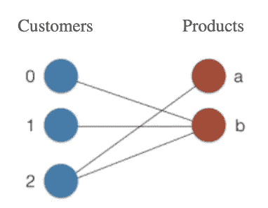

# 基于 Python 的 Github 推荐系统

> 原文：<https://towardsdatascience.com/github-recommender-system-python-c8ff64dc83f4?source=collection_archive---------34----------------------->

## 让我们分析用户相似性，并使用二分图的概念向用户推荐存储库。


使用 Canva 设计。

一个**网络**或者一个**图**是节点和边的组合。我们经常把图画成由边组合而成的节点，其中节点代表一些现实生活中的实体，比如脸书的用户，而边代表实体之间的关系，比如脸书的朋友。在我之前的[文章](/applied-network-analysis-using-python-25021633a702?source=your_stories_page---------------------------)中阅读更多关于图表的内容。我们将在本文中使用**二分图**和 **NetworkX** 包的概念。

# 二部图

定义二分图有两个条件。首先，它是一个节点被分成两组的图。第二，一组中的节点不能相互连接；它们只能连接到另一组中的节点。让我们举个例子来更具体地说明这一点。

以亚马逊购物网站为例。客户使用亚马逊网站/应用程序购买产品。假设我们正在为这个模型创建一个图表。让我们将节点分成两组，客户分区和产品分区。边缘表示客户已经购买了特定的产品。在这种情况下，产品不能连接到产品是完全合理的，因为一个产品不能购买另一个产品。顾客也一样。



让我们使用 NetworkX 包创建一个二分图。

如果我们在传入参数`data=True`时检查图的节点，我们将看到存储的分区信息。


## 过滤

NetworkX 没有提供显式的**二分图**类，我们需要显式地编写代码来过滤掉不同的节点集。这可以使用列表理解来完成。现在，让我们试着从上图中只检索“客户”集。


# 推荐系统

让我们尝试并理解如何将二分图应用于推荐系统问题。

> 二分图是协同过滤方法中使用的底层数据结构，这种方法在许多推荐系统如网飞和亚马逊中被广泛使用。

在 Github 上，用户在存储库上互相开发代码。正如文章标题所示，我们将向用户推荐在一个集合中使用高度相似节点概念的存储库。假设我们有一个二分图，如下所示。


用户 1 连接到 repo2，我们想推荐用户 1 可能有兴趣使用的存储库。现在，我们可以尝试分析连接到 repo2 而不是 User1 的所有其他用户。在这种情况下，用户 2 和用户 3 连接到 repo2。此外，请注意 User3 还连接到另一个存储库 repo1。因此，我们可能希望向用户 1 推荐 repo1 进行贡献。像亚马逊、YouTube 和网飞这样的大多数网站使用协同过滤作为推荐系统的一部分，根据相似用户的好恶向用户提供建议。

## 资料组

我们有一个存储库和用户的邻接表。我们有用户和存储库的编号，而不是名称。根据 NetworkX 文档，邻接表格式由带有节点标签的行组成。一行中的第一个标签是源节点。线中的其他标签被视为目标节点，并与源节点和目标节点之间的边一起添加到图中。例子—

a b c ( 'a '是源节点，' b '，' c '是目标节点)

表示在 a-b 和 a-c 之间有一条边的图。


“u”代表用户,“p”代表存储库。

如您所见，一个用户可以连接到许多存储库，反之亦然。带有单个标签的线表示没有边的节点。我们可以使用下面的命令从上面的文件创建一个图表。

```
G=nx.read_adjlist("/content/Github.txt")
```


我们可以注意到有 22，000 个节点(用户+存储库)和 20，000 条边。现在让我们将节点分成 2 组，即**用户**组和**项目**组。

现在让我们找出用户节点的数量和项目节点的数量。我们可以通过遍历节点列表、检查二分属性并查找生成的列表长度来完成这项任务，就像我们对上面的 customers 和 product 节点所做的那样。

在执行上述代码时，找到了 10721 个用户节点和 11632 个项目节点。

## 使用集合交点重叠

我们假设 2 个人，A 和 B，A 连接到 repo2，B 连接到 repo2 和 repo3。如何才能找到 A 和 B 的共享存储库(repo2)？

```
A_n = G.neighbors(A) will return ['repo2']
B_n = G.neighbors(B) will return ['repo2', 'repo3']overlap = set(A_n).intersection(B_n) will return ['repo2'] 
```

交集方法将返回 2 个或更多集合中的公共元素。借助上述逻辑，我们可以找到 2 个用户的相似度得分。

## 寻找相似的用户

**2 个用户的相似性度量=共享项目数/项目总数。**

使用上述逻辑，对于给定的用户 A，我们可以通过计算 A 与所有其他用户的相似性度量，并提取得分最高的用户，来找到最相似的用户。

## 推荐存储库

在上述用户“u4560”的代码中，最相似的用户是“u5453”和“u17446”。现在，如果我们发现“u5453”和“u17446”组合在一起与“u4560”的存储库不同，我们可以将它们推荐给“u4560”。

示例—假设有两个人，A 和 B。A 连接到 repo2，B 连接到 repo2 和 repo3。我们如何才能发现 A 和 B 的存储库之间的区别呢？

`B.difference(A)`将返回回购 3。`difference()`方法将返回出现在第一组中而不出现在第二组中的节点。

数据集和完整代码可以在 Github [这里](https://github.com/kurasaiteja/Github-Recommender-System)获得。

# 一个脑筋急转弯！


上面哪个是二分图？也试着回答一下节点集！期待您的回复。请务必检查答案，找出正确答案。

# 结论

在本文中，我们了解了二分图的概念及其在推荐系统中的使用。我们还使用 NetworkX 包创建了一个 Github 存储库推荐系统。推荐系统中使用了更多的指标和方法，这些将在以后的文章中讨论。我希望你今天学到了新东西！

欢迎分享反馈。