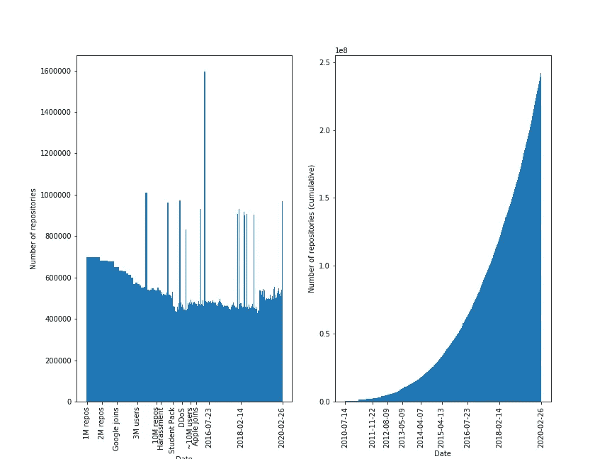

# GitHub 通向 1.28 亿公共知识库的道路

> 原文：<https://towardsdatascience.com/githubs-path-to-128m-public-repositories-f6f656ab56b1?source=collection_archive---------42----------------------->

## 用硬数字

在 Simiotics，我们写了很多分析代码的代码。GitHub 是世界上最大的源代码主机。这意味着我们要花大量时间分析来自 GitHub 的数据。 [*镜像*](https://github.com/simiotics/mirror) 是一个开源项目，有我们的一些代码爬虫。

GitHub 的[时间表记录了 GitHub 作为一家企业的崛起。我们将使用由*镜像*收集的数据，用存储库统计数据来补充这个时间线。我们使用的数据是从](https://en.wikipedia.org/wiki/Timeline_of_GitHub) [GitHub 的 */repositories* API 端点](https://developer.github.com/v3/repos/#list-all-public-repositories)抓取的。您可以使用*镜像*存储库中的[GitHub Jupyter 笔记本运行用于分析的代码。](https://github.com/simiotics/mirror/blob/master/notebooks/rise-of-github.ipynb)

由 [Markus Spiske](https://unsplash.com/@markusspiske?utm_source=unsplash&utm_medium=referral&utm_content=creditCopyText) 在 [Unsplash](https://unsplash.com/?utm_source=unsplash&utm_medium=referral&utm_content=creditCopyText) 上拍摄的照片

我们的目标是使用 GitHub 提供给我们的关于*公共*库的信息来可视化 GitHub 上的*库总数*是如何随着时间的推移而增长的。

制作这篇博文的大部分工作都是使用 [*镜像*](https://github.com/simiotics/mirror) 来抓取 GitHub。使用一个自由层合格的 t2.micro [EC2 实例](https://aws.amazon.com/ec2/)和用一个 GitHub 帐户认证的请求， *mirror* 花费了大约 10 天来检索关于所有公共 GitHub 存储库的基本元数据。

抓取不需要监督，我们选择等到一个完整的*抓取完成后再发布这个分析。为了这篇博文的目的，我们也可以更快地抓取更稀疏的公共存储库集合，但是我们也出于其他原因想要元数据。*

这是我们从爬行中构建的可视化。我们用 GitHub 的[时间线中有趣的事件来标记图表。](https://en.wikipedia.org/wiki/Timeline_of_GitHub)

*/repositories* 端点不返回每个存储库的创建日期。为了获得存储库的创建日期，我们必须[查询其特定的 API URL](https://developer.github.com/v3/repos/#get) 并读取 *created_at* 字段。

GitHub 上有超过 1.28 亿个公共存储库。一个 GitHub 帐户每小时只能发出 5000 个所需类型的 API 请求。这意味着检索每个公共存储库的创建日期需要 25600 个小时，差不多 3 年。与此同时，GitHub 用户将继续创建更多的公共库。

相反，我们满足于检索均匀分布的存储库样本的创建时间，并通过它们的 GitHub *id* 字段的差异来估计样本之间的存储库数量。GitHub 的 */repositories* 端点返回的存储库列表为每个存储库提供了一个 *id* 字段。这是一个整数 ID，似乎由公共和私有存储库共享。虽然还不清楚这些 id 是否按顺序递增，但我们的分析表明它们是递增的。

在爬行 */repositories* 端点时，理解这些响应反映了在您做出每个响应时存储库的公共和私有状态是很重要的。旧的存储库更有可能被私有或删除。我们的图表反映了与较晚日期相比，较早日期直方图的块状性。

图片来自[模拟/镜像](https://github.com/simiotics/mirror/blob/master/notebooks/rise-of-github.ipynb)

**其他一些有趣的统计:**

1.  截至 2020 年 2 月 26 日，GitHub 上的公共知识库数量约为 128，411，417
2.  截至 2020 年 2 月 26 日，GitHub 上公共存储库的所有者数量大约为 23，298，697

如果你有兴趣复制这个分析，或者如果你想扩展它，GitHub Jupyter 笔记本的[崛起是一个很好的起点。](https://github.com/simiotics/mirror/blob/master/notebooks/rise-of-github.ipynb)[我们已经托管了样本存储库的数据集，为此我们收集了完整的存储库元数据作为依据。](https://gist.github.com/nkashy1/c4ca78c5d6c2c2da2b03b4a730f6e194)数据为 [JSON 行](http://jsonlines.org/)格式。

在我的 GitHub 系列的下一篇文章中，我将分析编程语言在公共 GitHub 库中的分布。

*联系我上* [*LinkedIn*](https://www.linkedin.com/in/neeraj-kashyap-784035b8/) *如有问题，关注我上*[*Twitter*](https://twitter.com/zomglings)*。*