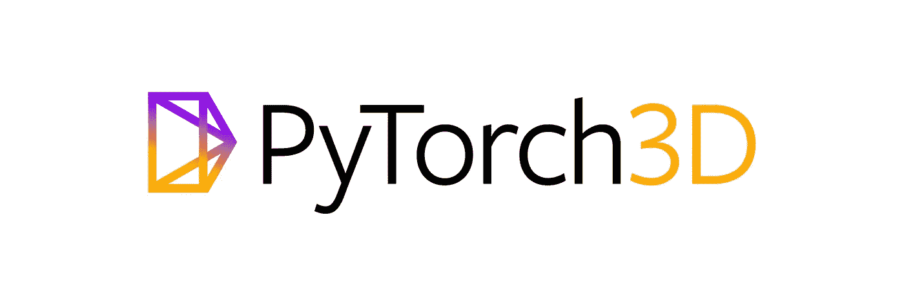

# PyTorch3D 一瞥:一个开源的 3D 深度学习库

> 原文：<https://towardsdatascience.com/glimpse-into-pytorch3d-an-open-source-3d-deep-learning-library-291a4beba30f?source=collection_archive---------21----------------------->



在深度学习环境中采取下一步措施脸书人工智能研究所推出了 [PyTorch3D](https://github.com/facebookresearch/pytorch3d) 一个为 3D 计算机视觉研究提供深度学习和组件的库。


GIF Src: [将一个球体网格变形为海豚](https://raw.githubusercontent.com/facebookresearch/pytorch3d/master/.github/dolphin_deform.gif)

随着 PyTorch3D 的发布，脸书正在开源 [Mesh-RCNN](https://arxiv.org/abs/1906.02739) ，它可以检测现实世界图像中的物体，并预测每个检测到的物体的完整 3D 形状。PyTorch3D 将在许多工业深度学习应用中有用，如机器人取放任务或帮助自动驾驶汽车理解周围物体的位置。

PyTorch3D 附带了一个模块化的可区分渲染 API，它提供了许多经常使用的 3D 操作符和损失函数，用于快速和可区分的 3D 数据。这使得开发人员和研究人员可以将这些功能导入到现有的最先进的深度学习项目中。

# PyTorch3D 的主要特性

*   PyTorch3D [网格](https://github.com/facebookresearch/pytorch3d/blob/master/docs/notes/meshes_io.md)用于存储和操作 3D 对象的数据结构
*   它附带了一些对三角形[网格](https://github.com/facebookresearch/pytorch3d/blob/master/docs/notes/meshes_io.md)的有效操作，如投影变换、图形卷积等。使用可区分网格渲染器
*   PyTorch3d 中的所有运算符都是使用 PyTorch 张量实现的
*   与任何现有的 3D 库相比，PyTorch3D 具有处理小批量异构数据的能力
*   它支持 CUDA，因此可以利用 GPU 进行加速

# 装置

为了安装 PyTorch3D，您需要安装 PyTorch，因为 PyTorch3D 在 PyTorch 之上工作。请参见下面的命令来安装 PyTorch

```
conda create -n pytorch3d python=3.6
conda activate pytorch3d
conda install -c pytorch pytorch torchvision cudatoolkit=10.0
conda install -c conda-forge -c fvcore fvcore
```

安装 PyTorch 后，您可以使用下面的任何一个命令来安装 PyTorch3D。

*   来自蟒蛇云
    `conda install pytorch3d -c pytorch3d`

运筹学

*   来自 GitHub
    `pip install 'git+https://github.com/facebookresearch/pytorch3d.git'
    # (add --user if you don't have permission)`

# 教程

脸书人工智能研究所提供了一些笔记本教程，让你开始使用 PyTorch3D。看看下面这 4 款笔记本吧。

1.  [将球体网格变形为海豚](https://github.com/facebookresearch/pytorch3d/blob/master/docs/tutorials/deform_source_mesh_to_target_mesh.ipynb)
2.  [光束调整](https://github.com/facebookresearch/pytorch3d/blob/master/docs/tutorials/bundle_adjustment.ipynb)
3.  [渲染纹理网格](https://github.com/facebookresearch/pytorch3d/blob/master/docs/tutorials/render_textured_meshes.ipynb)
4.  [摄像机位置优化](https://github.com/facebookresearch/pytorch3d/blob/master/docs/tutorials/camera_position_optimization_with_differentiable_rendering.ipynb)

# 有用的链接

1.  [文档](https://pytorch3d.readthedocs.org/)
2.  [测试/林挺和演示](https://github.com/facebookresearch/pytorch3d/blob/master/INSTALL.md#testslinting-and-demos)
3.  [Github 库— PyTorch3D](https://github.com/facebookresearch/pytorch3d)

[图沙尔·卡普尔](https://www.tusharck.com/):([https://www.tusharck.com/](https://www.tusharck.com/)

**免责声明:**

1.  PyTorch3D、PyTorch3D 徽标以及与 PyTorch3D 或网站相关的所有其他商标、服务标志、图形和徽标是 PyTorch3D 或 PyTorch3D 许可方的商标或注册商标。
2.  PyTorch3d 是在 [BSD-3 条款许可](https://github.com/facebookresearch/pytorch3d/blob/master/LICENSE)下发布的。